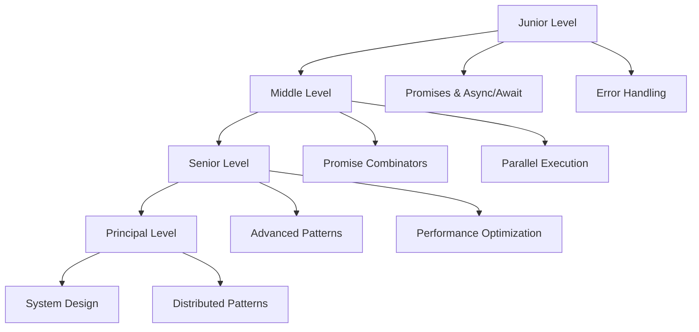

# Tài Liệu Lập Trình Bất Đồng Bộ trong TypeScript

## 📚 Giới Thiệu

Đây là bộ tài liệu toàn diện về **Asynchronous Programming trong TypeScript**, được thiết kế cho developers ở mọi cấp độ từ Junior đến Principal.

## 🎯 Mục Tiêu

- Hiểu sâu về async programming trong TypeScript
- Nắm vững Promises, async/await và các patterns nâng cao
- Áp dụng best practices trong production
- Thiết kế hệ thống phân tán với async operations

## 📖 Cấu Trúc Tài Liệu

### 1. **Async-Programming-TypeScript.md** (Junior & Middle Levels)

**Dành cho:** Junior và Middle Developers

**Nội dung:**

#### Junior Level - Cơ Bản
- ✅ Synchronous vs Asynchronous programming
- ✅ Callbacks và callback hell
- ✅ Promises cơ bản (then, catch, finally)
- ✅ Async/await syntax
- ✅ Error handling với try-catch
- ✅ Common pitfalls và cách tránh
- 📝 **15+ code examples** với giải thích chi tiết

#### Middle Level - Trung Cấp
- ✅ Promise chaining và composition
- ✅ Promise combinators (all, race, allSettled, any)
- ✅ Async/await với loops (for, map, reduce)
- ✅ Parallel vs Sequential execution
- ✅ Error handling nâng cao
- ✅ Timeout và cancellation patterns
- 📝 **20+ code examples** với best practices

**Thời gian học:** 4-6 giờ

---

### 2. **Advanced-Async-Patterns.md** (Senior Level)

**Dành cho:** Senior Developers

**Nội dung:**
- ✅ Advanced async patterns (retry, exponential backoff, circuit breaker)
- ✅ Custom Promise implementations (Deferred, Promise Pool, Lazy Promise)
- ✅ Async iterators và generators
- ✅ Concurrent execution control (throttling, debouncing, rate limiting)
- ✅ Memory leaks và performance optimization
- ✅ Integration với RxJS và async libraries
- ✅ Testing async code (Jest, Vitest, MSW)
- 📝 **25+ advanced code examples**

**Thời gian học:** 6-8 giờ

---

### 3. **Principal-Async-Patterns.md** (Principal Level)

**Dành cho:** Principal/Staff Engineers

**Nội dung:**
- ✅ System design với async operations ở quy mô lớn
- ✅ Event loop deep dive (microtasks vs macrotasks)
- ✅ Worker threads và parallel processing
- ✅ Streaming và backpressure handling
- ✅ Distributed async patterns (message queues, saga, outbox)
- ✅ Production monitoring và distributed tracing
- ✅ Migration strategies và performance tuning
- 📝 **20+ enterprise-level examples**

**Thời gian học:** 8-10 giờ

---

## 🚀 Hướng Dẫn Sử Dụng

### Cho Junior Developers

1. **Bắt đầu với:** `Async-Programming-TypeScript.md` - Junior Level
2. **Focus vào:**
   - Hiểu sự khác biệt giữa sync và async
   - Thực hành với Promises và async/await
   - Học cách handle errors đúng cách
3. **Thực hành:**
   - Viết code examples trong file
   - Chạy và debug từng example
   - Làm bài tập ở cuối mỗi section

### Cho Middle Developers

1. **Bắt đầu với:** `Async-Programming-TypeScript.md` - Middle Level
2. **Focus vào:**
   - Promise combinators và khi nào dùng
   - Parallel vs Sequential execution
   - Advanced error handling patterns
3. **Thực hành:**
   - Refactor existing code để optimize performance
   - Implement timeout và cancellation
   - Viết tests cho async code

### Cho Senior Developers

1. **Bắt đầu với:** `Advanced-Async-Patterns.md`
2. **Focus vào:**
   - Advanced patterns (circuit breaker, retry logic)
   - Custom Promise implementations
   - Performance optimization
3. **Thực hành:**
   - Implement các patterns trong production code
   - Optimize existing async operations
   - Mentor junior/middle developers

### Cho Principal Engineers

1. **Bắt đầu với:** `Principal-Async-Patterns.md`
2. **Focus vào:**
   - System design với async operations
   - Distributed patterns
   - Production monitoring
3. **Thực hành:**
   - Design scalable async architectures
   - Implement distributed tracing
   - Lead technical decisions

---

## 📊 Learning Path

---

## 💡 Tips Học Tập

### 1. Học Theo Thứ Tự
- Đừng skip levels - mỗi level build trên kiến thức của level trước
- Đảm bảo hiểu rõ concepts trước khi chuyển sang level tiếp theo

### 2. Thực Hành Nhiều
- Gõ lại tất cả code examples
- Modify examples để hiểu sâu hơn
- Tạo projects nhỏ để áp dụng kiến thức

### 3. Debug và Experiment
- Sử dụng debugger để xem execution flow
- Thử break code để hiểu error cases
- Measure performance của các approaches khác nhau

### 4. Đọc Official Documentation
- TypeScript Handbook
- MDN Web Docs
- Node.js Documentation

---

## 🔗 Tài Liệu Tham Khảo

### Official Documentation
- [TypeScript Handbook](https://www.typescriptlang.org/docs/handbook/)
- [MDN - Promises](https://developer.mozilla.org/en-US/docs/Web/JavaScript/Reference/Global_Objects/Promise)
- [MDN - Async Functions](https://developer.mozilla.org/en-US/docs/Web/JavaScript/Reference/Statements/async_function)
- [Node.js Async Hooks](https://nodejs.org/api/async_hooks.html)

### Libraries
- [RxJS](https://rxjs.dev/) - Reactive programming
- [p-queue](https://github.com/sindresorhus/p-queue) - Promise queue
- [p-limit](https://github.com/sindresorhus/p-limit) - Concurrency control

### Testing
- [Jest](https://jestjs.io/) - Testing framework
- [Vitest](https://vitest.dev/) - Fast unit test framework
- [MSW](https://mswjs.io/) - API mocking

---

## ✨ Highlights

- 📝 **60+ code examples** với TypeScript
- 🎯 **4 skill levels** từ Junior đến Principal
- 💻 **100% runnable code** với detailed explanations
- ⚡ **Performance tips** và optimization strategies
- 🧪 **Testing strategies** với Jest và Vitest
- 🏢 **Enterprise patterns** cho production systems
- 🔍 **Common pitfalls** và cách tránh
- 📊 **Comparison tables** cho các approaches

---

## 🤝 Đóng Góp

Nếu bạn tìm thấy lỗi hoặc muốn đóng góp:
1. Tạo issue để báo lỗi
2. Submit pull request với improvements
3. Share feedback và suggestions

---

## 📝 License

Tài liệu này được tạo cho mục đích học tập và chia sẻ kiến thức.

---

**Happy Learning! 🚀**

Bắt đầu với file phù hợp với level của bạn và enjoy the journey of mastering async programming in TypeScript!

