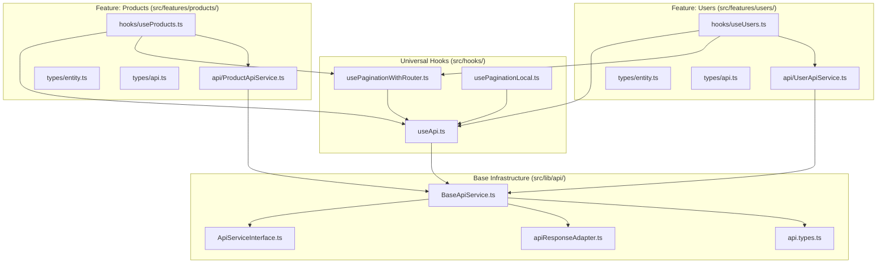
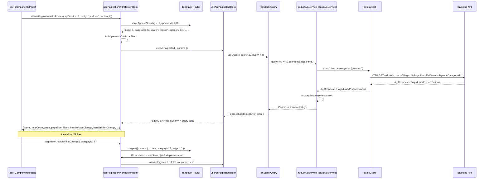
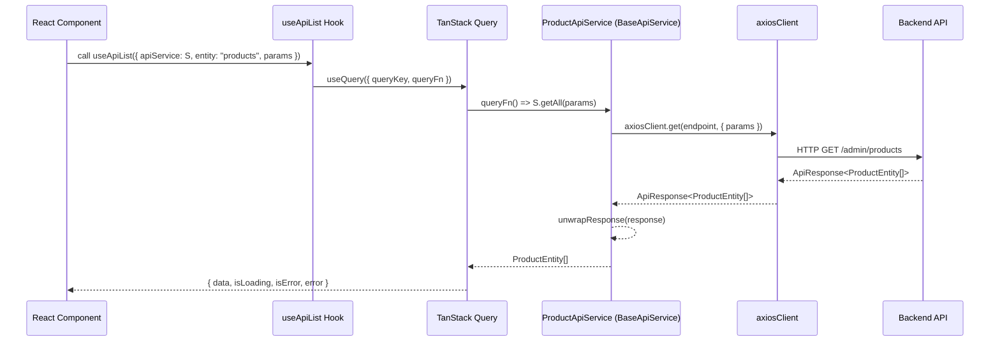
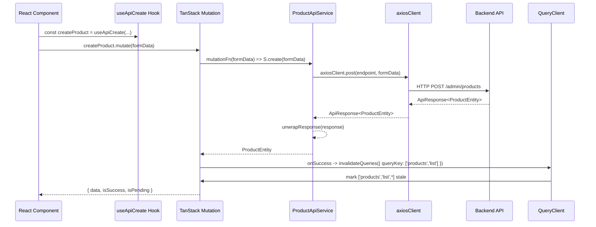
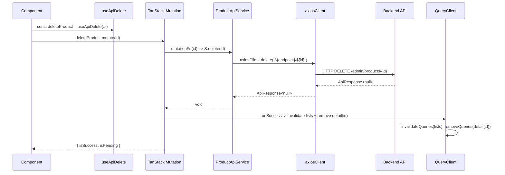
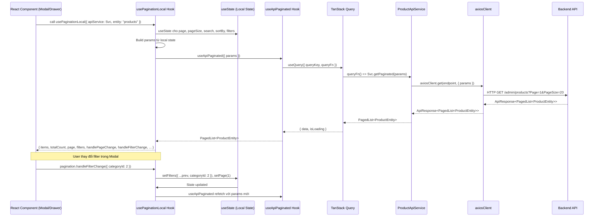
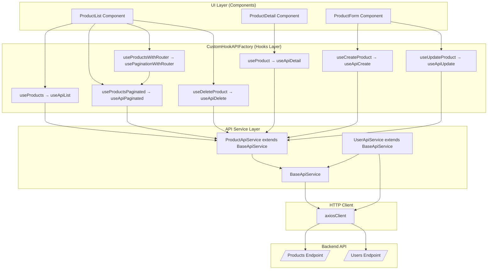

## CustomHookAPIFactory-Architectured (arc42)

### 1. Giới thiệu và Mục tiêu

**Mục đích hệ thống**

- Cung cấp một **lớp trừu tượng thống nhất** cho việc gọi API trong frontend, dựa trên **Axios** và **TanStack Query**, với:
  - `BaseApiService` xử lý CRUD, `ApiResponse<T>`, `PagedList<T>`
  - Bộ **custom hooks** generic:  
    `useApiList`, `useApiDetail`, `useApiCreate`, `useApiUpdate`, `useApiPatch`, `useApiDelete`, `useApiCustomQuery`, `useApiCustomMutation`
- Chuẩn hóa cách tương tác với backend, giảm lặp code, tăng type-safety và maintainability.

**Mục tiêu chính**

- **DRY & Reusability**: Viết một lần cho CRUD + hooks, dùng cho mọi entity.
- **Type-safe**: Dùng TypeScript generics từ tầng service đến hooks.
- **Tách biệt concern**: Component UI không biết về `ApiResponse<T>`, chỉ làm việc với domain `T`.
- **Tích hợp caching & state**: Tận dụng đầy đủ khả năng của TanStack Query (cache, retry, staleTime, optimistic updates).
- **Mở rộng dễ dàng**: Mỗi feature có thể extend `BaseApiService` và tạo hooks wrapper riêng.

**Đối tượng tài liệu**

- Frontend engineers, tech lead, kiến trúc sư.
- QA (hiểu luồng data & error handling).
- Backend engineers (đồng bộ contract `ApiResponse<T>`, `PagedList<T>`, `PagedRequest`).

**Stakeholder & kỳ vọng**

- **Frontend dev**: Dễ dùng, ít code lặp, API rõ ràng.
- **Tech lead/Architect**: Cấu trúc có thể mở rộng, kiểm soát error handling, caching, conventions.
- **Backend dev**: Contract rõ ràng cho `ApiResponse<T>`, `PagedList<T>`, `PagedRequest`.

**Tiêu chí thành công**

- Thêm entity mới chỉ cần:
  - Định nghĩa types.
  - Tạo `[Entity]ApiService` extend `BaseApiService`.
  - (Tuỳ chọn) Tạo hooks wrapper feature-level.
- Giảm đáng kể số lượng axios call "thủ công" trong components.
- Error handling và pagination được tập trung, không lặp lại.
- Pagination hooks hỗ trợ đầy đủ:
  - Page components: URL sync với `usePaginationWithRouter`.
  - Modal/Drawer: Local state với `usePaginationLocal`.
  - Advanced filters: categoryId, supplierId, minPrice, maxPrice, etc.

---

### 2. Ràng buộc Kiến trúc

**Ràng buộc kỹ thuật**

- **Ngôn ngữ**: TypeScript.
- **HTTP client**: Axios, instance chuẩn `axiosClient`.
- **Data fetching & state**: `@tanstack/react-query`.
- **Contract backend**:
  - `ApiResponse<T> { isError, message, data, timestamp }`.
  - `PagedList<T>`, `PagedRequest` từ `src/lib/axios.ts`.
  - **Query Parameters**: Backend sử dụng **PascalCase** (`Page`, `PageSize`, `Search`, `SortBy`, etc.) - cần convert từ camelCase khi gọi API.
  - **Request Validation**: Tất cả schemas có `additionalProperties: false` - không được gửi thêm properties không được định nghĩa.
  - **Kiến trúc frontend**: tuân theo **Feature-Sliced Design (FSD)**.
  
**Xem thêm**: [BACKEND_API_REFERENCE.md - Section 1.7-1.9](../../api/BACKEND_API_REFERENCE.md#17-query-parameters-naming-convention) về Query Parameters Naming, Request Validation Rules, và Nullable vs Optional Fields.

**Ràng buộc tổ chức**

- Team frontend tổ chức theo feature; mỗi feature tự quản lý `*ApiService` + hooks wrapper riêng.
- Chuẩn coding style & linting thống nhất.

**Ràng buộc chi phí/thời gian**

- Không viết lại toàn bộ calls cho từng feature.
- Cần giải pháp có thể rollout dần, tương thích với code cũ.

**Quality attributes bắt buộc**

- **Maintainability**, **Reusability**, **Testability**.
- **Performance** đủ tốt (tận dụng caching, tránh over-fetching).
- **Consistency** về error handling & query key.

---

### 3. Phạm vi và Ngữ cảnh Hệ thống

**Phạm vi nghiệp vụ**

- Hoạt động trong frontend admin/shop app, phục vụ:
  - Quản lý sản phẩm, người dùng, đơn hàng, danh mục, nhà cung cấp, v.v.
- CustomHookAPIFactory chỉ phụ trách **client-side API access & state management**.

**Phạm vi kỹ thuật**

- **Trong scope**:
  - `ApiServiceInterface`, `BaseApiService`, `apiResponseAdapter`.
  - API types (`ApiResponse`, `PagedList`, `PagedRequest`, `ApiConfig`, `QueryParams`).
  - Universal hooks (`useApiList`, `useApiDetail`, `useApiCreate`, `useApiUpdate`, `useApiPatch`, `useApiDelete`, `useApiCustomQuery`, `useApiCustomMutation`).
  - Feature-specific extensions (`ProductApiService`, `UserApiService`, …).
- **Ngoài scope**:
  - Logic UI chi tiết, routing, form validation, business rules bên trong component.
  - Implementation backend.

**Input/Output & Interfaces**

- **Input từ component**:
  - Config hooks: `apiService`, `entity`, `params`, `options`, `invalidateQueries`, …
  - Variables cho mutation: `{ id, data }`, DTOs, primitive ids.
- **Output cho component**:
  - Data domain: `TData`, `TData[]`, `PagedList<TData>`.
  - Query/mutation state: `isLoading`, `isError`, `error`, `mutate`, `mutateAsync`, `isPending`, `isSuccess`, …
- **Giao tiếp với backend**:
  - HTTP REST qua Axios dựa trên `API_CONFIG.ENDPOINTS.*`.
  - Query params/payload mapping từ `QueryParams`/DTOs.

**Loại người dùng & tương tác**

- **UI layer (components/hooks feature-level)**: gọi các hooks universal/feature wrapper để nhận data và mutation state.
- **Dev**: mở rộng `BaseApiService` cho entity mới, thêm custom methods, viết hooks wrapper reuse.

---

### 4. Chiến lược Giải pháp

**Pattern & chiến lược chính**

- **Hybrid Approach**:
  - Core generic: `BaseApiService`, `ApiServiceInterface`, `useApi*` hooks.
  - Feature-level extension: `[Entity]ApiService` extends `BaseApiService` + custom methods.
- **Query Key Factory pattern**:
  - Chuẩn hóa query keys (`all`, `lists`, `list(params)`, `details`, `detail(id)`).
- **Response Adapter**:
  - `unwrapResponse<T>` xử lý `ApiResponse<T>` tại một chỗ duy nhất.
  - `handleApiError` chuẩn hóa error cho UI.

**Lựa chọn công nghệ & lý do**

- **TanStack Query**:
  - Quản lý caching, background refetch, retry, invalidation, optimistic updates.
- **Axios**:
  - Instance chung (`axiosClient`), có thể cấu hình interceptors, baseURL, auth.
- **TypeScript**:
  - Hỗ trợ generics sâu từ service đến hooks, tăng type-safety.

**Phong cách kiến trúc**

- **Layered within frontend**:
  - Data access layer (ApiService).
  - Hook layer (CustomHookAPIFactory).
  - UI layer (components).
- **Feature-Sliced**:
  - Mỗi feature giữ logic API trong `src/features/[entity]/api`, `src/features/[entity]/hooks`.

**Đáp ứng yêu cầu chất lượng**

- Maintainability: shared Base + hooks giảm duplication.
- Extensibility: thêm entity = thêm class extend + types + (option) hooks wrapper.
- Testability: có thể mock `BaseApiService` hoặc Axios để test hooks.

---

### 5. Building Block View

**5.1. Level 1 – Các khối chính**

- **`src/lib/axios.ts`**
  - Định nghĩa:
    - `axiosClient`.
- **`src/lib/api/types/api.types.ts`**
  - Định nghĩa:
    - `ApiResponse<T>`, `PagedList<T>`, `PagedRequest`
 .
- **`src/lib/api/base/ApiServiceInterface.ts`**
  - Contract CRUD + `custom` cho mọi service.
- **`src/lib/api/base/apiResponseAdapter.ts`**
  - `unwrapResponse<T>(response: ApiResponse<T>): T`.
  - `handleApiError(error: unknown): never`.
- **`src/lib/api/base/BaseApiService.ts`**
  - Class generic cung cấp CRUD + `custom`, bọc Axios.
- **`src/hooks/useApi.ts`**
  - `createQueryKeys(entity: string)`.
  - Universal hooks:
    - `useApiList`, `useApiPaginated`, `useApiDetail`, `useApiCreate`, `useApiUpdate`, `useApiPatch`, `useApiDelete`, `useApiCustomQuery`, `useApiCustomMutation`.
- **`src/hooks/usePaginationWithRouter.ts`**
  - Hook quản lý pagination với URL sync cho Page components.
  - Hỗ trợ advanced filters (categoryId, supplierId, minPrice, maxPrice, etc.).
  - Tự động sync pagination state với URL query params.
- **`src/hooks/usePaginationLocal.ts`**
  - Hook quản lý pagination với local state cho Modal/Drawer.
  - Hỗ trợ advanced filters tương tự `usePaginationWithRouter`.
  - Không cần router context.
- **Feature services**
  - `ProductApiService`, `UserApiService`, … extend `BaseApiService`.
- **Feature hooks wrapper**
  - `useProducts`, `useProduct`, `useCreateProduct`,  
    `useUsers`, `useStaffUsers`, … wrap `useApi*`.

**5.2. Level 2 – Chi tiết block quan trọng**

- **`BaseApiService<TData, TCreate, TUpdate>`**
  - Thuộc tính:
    - `endpoint: string`.
    - `axios: AxiosInstance`.
  - Phương thức chính:
    - `getAll(params?: QueryParams): Promise<TData[]>`.
    - `getPaginated(params?: PagedRequest): Promise<PagedList<TData>>`.
    - `getById(id: string | number): Promise<TData>`.
    - `create(data: TCreate): Promise<TData>`.
    - `update(id: string | number, data: TUpdate): Promise<TData>`.
    - `patch(id: string | number, data: Partial<TUpdate>): Promise<TData>`.
    - `delete(id: string | number): Promise<void>`.
    - `custom<TResponse>(method, path, data?, params?): Promise<TResponse>`.
  - Tất cả method (trừ `delete`) dùng `unwrapResponse` để xử lý `ApiResponse<T>`.

- **Universal hooks (`useApi.ts`)**
  - `createQueryKeys(entity)` tạo cấu trúc keys:
    - `all`, `lists`, `list(params)`, `details`, `detail(id)`.
  - `useApiList`:
    - Gọi `useQuery` → `apiService.getAll(params)`.
    - Trả về `TData[]` (không phân trang).
  - `useApiPaginated`:
    - Gọi `useQuery` → `apiService.getPaginated(params)`.
    - Trả về `PagedList<TData>` với pagination metadata.
    - Sử dụng `placeholderData` để giữ data cũ khi đang fetch trang mới.
    - Query key: `[...queryKeys.lists(), 'paginated', params]`.
    - **Core hook** cho pagination, không quản lý state.
  - `useApiDetail`:
    - Gọi `useQuery` → `apiService.getById(id)`.
    - Tự động disable khi `id` là falsy.
  - `useApiCreate`, `useApiUpdate`, `useApiPatch`, `useApiDelete`:
    - Gọi `useMutation` → wrap tương ứng `create`, `update`, `patch`, `delete`.
    - Tự động invalidate hoặc remove cache sau mutate.
    - Hỗ trợ `invalidateQueries` để invalidate thêm các queries liên quan.
  - `useApiCustomQuery`, `useApiCustomMutation`:
    - Cho phép logic query/mutation tùy chỉnh, vẫn tận dụng query keys & cache.

- **Pagination Management Hooks**
  - `usePaginationWithRouter`:
    - Wrapper cho `useApiPaginated` với URL sync.
    - Quản lý pagination state qua TanStack Router (URL query params).
    - Hỗ trợ advanced filters (categoryId, supplierId, minPrice, maxPrice, etc.).
    - Cung cấp handlers: `handlePageChange`, `handleSearch`, `handleSort`, `handleFilterChange`, `clearFilters`.
    - Expose `filters` và `activeFiltersCount` để UI hiển thị.
    - **Dùng cho Page components** (có router context).
  - `usePaginationLocal`:
    - Wrapper cho `useApiPaginated` với local state (`useState`).
    - Quản lý pagination state trong component memory.
    - Hỗ trợ advanced filters tương tự `usePaginationWithRouter`.
    - Cung cấp handlers tương tự.
    - **Dùng cho Modal/Drawer** (không có router context).

- **Feature ApiServices**
  - Ví dụ: `ProductApiService`:
    - Kế thừa CRUD từ `BaseApiService<ProductEntity, CreateProductRequest, UpdateProductRequest>`.
    - Thêm:
      - `searchByBarcode(barcode: string): Promise<ProductEntity[]>`.
      - `getProductsByCategory(categoryId: number, params?: Omit<PagedRequest, 'categoryId'>)`.
      - `getProductsBySupplier(supplierId: number, params?: Omit<PagedRequest, 'supplierId'>)`.

- **Feature hooks**
  - Ví dụ: `useProducts`, `useProductsPaginated`, `useProduct`, `useCreateProduct`:
    - Đặt `ENTITY = 'products'`.
    - Gọi universal hooks với `apiService = productApiService`, `entity = ENTITY`.
    - Bổ sung `options` (staleTime, onSuccess, onError, …) để phù hợp nghiệp vụ.
  - Ví dụ: `useProductsWithRouter` (Page components):
    - Wrapper cho `usePaginationWithRouter` với `productApiService` và `routeApi`.
    - Tự động quản lý URL sync và filters.
  - Ví dụ: `useProductsLocal` (Modal/Drawer):
    - Wrapper cho `usePaginationLocal` với `productApiService`.
    - Quản lý local state cho pagination và filters.

**5.3. Cấu trúc thư mục và Hướng dẫn Implementation**

#### 5.3.1. Cấu trúc thư mục tổng quan

Hệ thống CustomHookAPIFactory tuân theo **Feature-Sliced Design (FSD)**, với cấu trúc thư mục như sau:

```
src/
├── lib/                          # Shared libraries (cross-feature)
│   ├── api/                      # Base API infrastructure
│   │   ├── base/                 # Core base classes và utilities
│   │   │   ├── ApiServiceInterface.ts
│   │   │   ├── BaseApiService.ts
│   │   │   ├── apiResponseAdapter.ts
│   │   │   └── index.ts
│   │   └── types/                # Shared API types
│   │       └── api.types.ts      # ApiResponse, PagedList, PagedRequest
│   └── axios.ts                  # Axios client instance
│
├── hooks/                        # Universal hooks (cross-feature)
│   ├── useApi.ts                 # useApiList, useApiPaginated, useApiDetail, useApiCreate, etc.
│   ├── usePaginationWithRouter.ts # URL-based pagination cho Page components
│   └── usePaginationLocal.ts     # Local state pagination cho Modal/Drawer
│
└── features/                     # Feature modules (FSD structure)
    ├── products/                 # Product feature
    │   ├── api/                  # Product-specific API services
    │   │   ├── ProductApiService.ts
    │   │   └── index.ts
    │   ├── hooks/                # Product-specific hooks (optional)
    │   │   ├── useProducts.ts
    │   │   └── index.ts
    │   ├── types/                # Product types
    │   │   ├── entity.ts         # ProductEntity
    │   │   └── api.ts            # CreateProductRequest, UpdateProductRequest
    │   ├── components/           # Product UI components
    │   └── pages/                # Product pages
    │
    ├── users/                    # User feature
    │   ├── api/
    │   │   ├── UserApiService.ts
    │   │   └── index.ts
    │   ├── hooks/
    │   │   ├── useUsers.ts
    │   │   └── index.ts
    │   ├── types/
    │   │   ├── entity.ts
    │   │   └── api.ts
    │   └── ...
    │
    ├── orders/                   # Order feature
    ├── categories/               # Category feature
    └── ...                       # Other features
```

#### 5.3.2. Chi tiết cấu trúc từng layer

##### A. Base API Infrastructure (`src/lib/api/`)

**Mục đích**: Chứa các thành phần cơ bản, tái sử dụng cho tất cả features.

```
src/lib/api/
├── base/
│   ├── ApiServiceInterface.ts    # Interface contract cho mọi ApiService
│   ├── BaseApiService.ts         # Base class với CRUD methods
│   ├── apiResponseAdapter.ts     # unwrapResponse, handleApiError
│   └── index.ts                  # Export tất cả base utilities
│
└── types/
    └── api.types.ts              # ApiResponse<T>, PagedList<T>, PagedRequest
```

**Quy tắc**:
- ✅ **KHÔNG** chứa logic nghiệp vụ cụ thể.
- ✅ **CHỈ** chứa generic utilities và base classes.
- ✅ Tất cả exports phải được re-export qua `index.ts` để dễ import.

**Ví dụ import**:
```typescript
// ✅ Đúng - Import từ index
import { BaseApiService } from '@/lib/api/base';
import type { ApiResponse, PagedList } from '@/lib/api/types';

// ❌ Sai - Import trực tiếp từ file
import { BaseApiService } from '@/lib/api/base/BaseApiService';
```

##### B. Universal Hooks (`src/hooks/`)

**Mục đích**: Chứa các hooks generic có thể dùng cho mọi entity.

```
src/hooks/
├── useApi.ts                     # useApiList, useApiPaginated, useApiDetail, useApiCreate, etc.
├── usePaginationWithRouter.ts   # URL-based pagination cho Page components
└── usePaginationLocal.ts        # Local state pagination cho Modal/Drawer
```

**Quy tắc**:
- ✅ Hooks **generic**, không hard-code entity nào.
- ✅ Nhận `apiService` và `entity` làm parameters.
- ✅ Có thể được wrap lại ở feature-level hooks nếu cần customization.
- ✅ Pagination hooks hỗ trợ advanced filters (categoryId, supplierId, minPrice, maxPrice, etc.).

##### C. Feature Structure (`src/features/[entity]/`)

**Mục đích**: Mỗi feature tự quản lý API services, hooks, types riêng.

**Cấu trúc chuẩn cho mỗi feature**:

```
src/features/[entity]/
├── api/                          # API Service layer
│   ├── [Entity]ApiService.ts     # Extends BaseApiService
│   └── index.ts                  # Export service instance
│
├── hooks/                        # Feature-specific hooks (OPTIONAL)
│   ├── use[Entity]s.ts           # Wrapper hooks cho universal hooks
│   └── index.ts
│
├── types/                        # Feature types
│   ├── entity.ts                 # [Entity]Entity interface
│   └── api.ts                    # Create[Entity]Request, Update[Entity]Request
│
├── components/                   # UI components (nằm ngoài scope API layer)
└── pages/                        # Pages (nằm ngoài scope API layer)
```

#### 5.3.3. Sơ đồ cấu trúc thư mục (Mermaid)



#### 5.3.4. Ví dụ Implementation hoàn chỉnh

Xem ví dụ implementation đầy đủ trong tài liệu `CustomHookAPIFactory.md`:
- Section 3: Example Usage - Product
- Section 4: Example Usage - User

---

### 6. Runtime View

#### 6.1. Scenario: Fetch danh sách có phân trang qua `usePaginationWithRouter`



**Diễn giải**

1. Component (Page) gọi `usePaginationWithRouter` với `productApiService` và `routeApi`.
2. Hook lấy pagination params và filters từ URL qua `routeApi.useSearch()`.
3. Hook gọi `useApiPaginated` với params đã build từ URL.
4. `useApiPaginated` đăng ký `useQuery` với `queryKey` và `queryFn` gọi `apiService.getPaginated`.
5. `ProductApiService` dùng Axios gọi backend với params đã convert sang PascalCase.
6. Backend trả về `ApiResponse<PagedList<ProductEntity>>`.
7. `unwrapResponse` xử lý `isError`, trả về `PagedList<ProductEntity>`.
8. Hook expose `items`, `totalCount`, `filters`, `handlePageChange`, `handleFilterChange`, etc.
9. Khi user thay đổi filter, hook update URL → trigger refetch tự động.

#### 6.2. Scenario: Fetch danh sách (GET all) qua `useApiList`



**Diễn giải**

1. Component gọi `useApiList` với `productApiService`.
2. `useApiList` đăng ký `useQuery` với `queryKey` chuẩn và `queryFn` gọi `apiService.getAll`.
3. `ProductApiService` dùng Axios gọi backend, nhận `ApiResponse<ProductEntity[]>`.
4. `unwrapResponse` xử lý `isError`, trả về `ProductEntity[]` hoặc throw.
5. TanStack Query cập nhật cache & state, trả về data/status cho component.

#### 6.3. Scenario: CREATE (POST) qua `useApiCreate`



**Diễn giải**

- Sau khi mutate thành công:
  - `onSuccess` trong `useApiCreate` tự động:
    - Invalidate **tất cả list queries** của entity.
    - Gọi `options?.onSuccess` tuỳ biến (toast, navigate…).

#### 6.4. Scenario: DELETE + cache management qua `useApiDelete`



#### 6.5. Scenario: Pagination với Local State qua `usePaginationLocal`



**Diễn giải**

1. Component (Modal/Drawer) gọi `usePaginationLocal` với `productApiService`.
2. Hook quản lý pagination state bằng `useState` (không dùng URL).
3. Hook gọi `useApiPaginated` với params từ local state.
4. Khi user thay đổi filter, hook update local state → trigger refetch.
5. **Khác biệt với `usePaginationWithRouter`**: State không sync với URL, phù hợp cho Modal/Drawer.

#### 6.6. Concurrency & Error handling

- Concurrency (song song nhiều query/mutation) được TanStack Query quản lý.
- `unwrapResponse` chuyển mọi lỗi API (`isError = true` hoặc `data = null`) thành `Error`.
- `handleApiError` cho phép chuẩn hóa error ở UI (ví dụ trong `onError` của hook wrapper: show toast, log lỗi, …).

---

### 7. Deployment View

**Hạ tầng**

- CustomHookAPIFactory là **module frontend thuần**, build cùng React app:
  - Bundler: Vite/Webpack (theo project).
  - Deploy: CDN / static hosting / container, tuỳ kiến trúc tổng thể.

**Phân bố thành phần**

- Không có process/server riêng cho module này.
- Các thành phần:
  - `BaseApiService`, `apiResponseAdapter`, hooks `useApi*` → nằm trong bundle JS.
  - Axios giao tiếp với backend API qua HTTPS.

**Network & bảo mật**

- Giao tiếp backend:
  - `axiosClient` sử dụng `baseURL`, headers, auth token (qua interceptors).
  - Bảo mật phụ thuộc vào cấu hình Axios + backend (HTTPS, JWT, refresh token, …).
- Module không trực tiếp xử lý auth, chỉ dùng `axiosInstance`.

**Hiệu năng & mở rộng**

- TanStack Query caching giúp:
  - Giảm số lượng request lặp lại.
  - Cải thiện UX (data đã cache hiển thị ngay).
- Pagination (`getPaginated`, `useApiPaginated`) tránh tải quá nhiều data trong một request.

---

### 8. Các Khái niệm Cross-cutting

**Domain models & abstractions**

- `TData`, `TCreate`, `TUpdate`:
  - Domain models / DTO cho từng entity (Product, User, …).
- `ApiResponse<T>`:
  - Chuẩn response cho mọi API call; module dùng `unwrapResponse` để ẩn chi tiết này khỏi UI.
- `PagedList<T>`, `PagedRequest`:
  - Chuẩn hóa pagination cross-feature.

**Architecture & design patterns**

- **Repository-like pattern**:
  - `BaseApiService` như repository cho từng entity, quản lý CRUD & custom endpoints.
- **Query Key Factory pattern**:
  - `createQueryKeys(entity)` tạo cấu trúc key phân cấp:
    - `all` → `lists` → `list(params)`; `details` → `detail(id)`.
- **Adapter pattern**:
  - `apiResponseAdapter` chuyển `ApiResponse<T>` → `T`.

**Security & safety concepts**

- Auth, CSRF, CORS được xử lý ở:
  - Cấu hình Axios.
  - Backend.
- CustomHookAPIFactory đảm bảo không expose token trong API surface.

**Persistence & data management**

- Persistence lâu dài ở backend DB.
- Trên client:
  - TanStack Query cache là **in-memory cache**.
  - Cấu hình `staleTime`, `gcTime` để cân bằng giữa freshness & memory usage.

**Integration concepts**

- Tích hợp với:
  - Backend REST API.
  - React component hierarchy.
  - TanStack Router (cho `usePaginationWithRouter`).
- Hỗ trợ integration nâng cao:
  - Custom endpoints qua `custom()` và `useApiCustomQuery/useApiCustomMutation`.
  - Bulk operations, upload file, thống kê, … nằm trong tầng feature-specific.
- **Decision Tree cho Pagination Hooks**:
  ```
  Có router context?
  ├─ YES → Page component?
  │   ├─ YES → usePaginationWithRouter ✅ (URL sync, filters support)
  │   └─ NO → useApiPaginated (custom logic)
  │
  └─ NO → Modal/Drawer?
      ├─ YES → usePaginationLocal ✅ (local state, filters support)
      └─ NO → Nhận params từ props?
          ├─ YES → useApiPaginated ✅
          └─ NO → usePaginationLocal ✅
  ```

**Development concepts**

- **Testing**:
  - Unit test cho `BaseApiService` (mock Axios).
  - Hook test với `QueryClientProvider` + React Testing Library.
- **Build & CI/CD**:
  - Build TypeScript → JS.
  - Lint & test chạy trong pipeline CI.

**Operational concepts (monitoring/logging)**

- Logging chủ yếu thực hiện qua:
  - `onError` trong các hook wrapper (log, gửi error reporting).
  - Global error boundary.
- Monitoring:
  - Có thể tích hợp thêm instrumentation xung quanh axios hoặc hooks (không nằm trong core module).

---

### 9. Các Quyết định Kiến trúc (ADR – Architecture Decision Records)

**AD-1: Sử dụng `BaseApiService` + Hybrid Approach**

- **Thay thế cho**:
  - Viết service per feature với Axios “raw”.
- **Lý do**:
  - Giảm duplication, chuẩn hóa error handling & pagination.
  - Dễ expand, test, review.
- **Hệ quả**:
  - Cần training dev tuân thủ pattern.
  - Cần migrate dần code cũ sang pattern mới.

**AD-2: Dùng TanStack Query cho caching & state**

- **Thay thế cho**:
  - Sử dụng `useState` + `useEffect` để fetch và lưu state thủ công.
- **Lý do**:
  - Cung cấp caching, retry, background refetch, deduplication, optimistic updates.
- **Hệ quả**:
  - Học curve cho dev, nhưng code business ngắn hơn, rõ ràng hơn.

**AD-3: Ẩn `ApiResponse<T>` khỏi UI layer**

- **Thay thế cho**:
  - Trả `ApiResponse<T>` lên tới component và xử lý ở đó.
- **Lý do**:
  - UI chỉ cần `T`/`PagedList<T>`, không cần biết wrapper.
  - Tập trung error handling, dễ refactor.
- **Hệ quả**:
  - Thay đổi schema backend cần cập nhật `unwrapResponse`, nhưng UI hầu như không đổi.

**AD-4: Query keys có cấu trúc thông qua factory**

- **Thay thế cho**:
  - Query key kiểu string "tự phát": `'products-list'`, `'products-detail-123'`.
- **Lý do**:
  - Invalidate theo nhóm dễ dàng, type-safe, hạn chế typo.
- **Hệ quả**:
  - Cần tuân thủ strict convention khi thêm hooks/query mới.

**AD-5: Tách biệt Pagination Hooks theo Use Case**

- **Thay thế cho**:
  - Một hook pagination duy nhất cho tất cả use cases.
  - Quản lý state thủ công trong component.
- **Lý do**:
  - **Page components** cần URL sync (deep linking, shareable URLs, browser back/forward).
  - **Modal/Drawer** không có router context, cần local state.
  - **Nested components** nhận params từ props, không quản lý state.
- **Giải pháp**:
  - `useApiPaginated`: Core hook (data fetching only), dùng cho nested components.
  - `usePaginationWithRouter`: URL-based pagination cho Page components (hỗ trợ advanced filters).
  - `usePaginationLocal`: Local state pagination cho Modal/Drawer (hỗ trợ advanced filters).
- **Hệ quả**:
  - Dev cần hiểu khi nào dùng hook nào.
  - Cần training về decision tree: có router context? → Page? → Modal/Drawer? → Nested?

---

### 10. Yêu cầu Chất lượng

**Performance**

- **Yêu cầu**:
  - Không over-fetch.
  - List lớn phải phân trang.
- **Đáp ứng**:
  - Caching với TanStack Query.
  - `useApiPaginated` với `placeholderData` để chuyển trang mượt (giữ data cũ khi fetch trang mới).
  - `usePaginationWithRouter` và `usePaginationLocal` tận dụng `useApiPaginated` để tối ưu performance.

**Security**

- **Yêu cầu**:
  - Không làm lộ thông tin nhạy cảm từ client.
- **Đáp ứng**:
  - Tất cả auth logic nằm trong Axios & backend.
  - Hooks chỉ lấy data domain đã được xử lý.

**Reliability & Availability**

- **Yêu cầu**:
  - Khi backend lỗi, UI phản hồi hợp lý.
- **Đáp ứng**:
  - `unwrapResponse` + `handleApiError` chuyển đổi sang `Error`.
  - Hooks cung cấp `isError`, `error` cho UI xử lý fallback.

**Maintainability & Extensibility**

- **Yêu cầu**:
  - Dễ thêm entity, dễ sửa đổi behavior chung.
- **Đáp ứng**:
  - BaseApiService + universal hooks.
  - Thay đổi logic error/pagination chỉ cần chỉnh một nơi.

**Testability**

- **Yêu cầu**:
  - Dễ viết test unit/integration cho API layer & hooks.
- **Đáp ứng**:
  - Service tách biệt, có thể mock Axios hoặc `BaseApiService`.
  - Hooks có thể test với `QueryClientProvider` test setup.

---

### 11. Rủi ro và Nợ Kỹ thuật

**Rủi ro**

- **Sai lệch contract backend**:
  - Backend đổi cấu trúc `ApiResponse<T>/PagedList<T>` mà không thông báo.
  - Hệ quả: `unwrapResponse` hoạt động sai.
  - Giảm thiểu: dùng hợp đồng shared (OpenAPI, types chung), review API change.
- **Lạm dụng `custom()`**:
  - Dev tạo quá nhiều endpoint ad-hoc, khó tổ chức.
  - Giảm thiểu: quy ước naming & documentation rõ ràng, wrap custom bằng methods có ý nghĩa.

**Nợ kỹ thuật**

- Chưa có:
  - Bộ test tự động đầy đủ cho tất cả hooks universal.
  - Cơ chế check compile-time giữa backend schema & frontend types.
- Một số code cũ vẫn dùng Axios trực tiếp trong component:
  - Cần kế hoạch migrate dần về Hybrid Approach.
- Tài liệu cần được cập nhật khi thêm hooks/feature mới:
  - Phụ thuộc discipline của team.

---

### 12. Thuật ngữ (Glossary)

- **ApiResponse<T>**: Wrapper response chuẩn từ backend, gồm `isError`, `message`, `data`, `timestamp`.
- **PagedList<T>**: Kết quả phân trang, gồm `page`, `pageSize`, `totalCount`, `totalPages`, `hasPrevious`, `hasNext`, `items`.
- **PagedRequest**: Mô tả request phân trang (page, pageSize, search, sortBy, sortDesc, …).
- **Query Parameters Naming**: Backend API sử dụng **PascalCase** (`Page`, `PageSize`, `Search`, `SortBy`, etc.), frontend TypeScript interfaces sử dụng **camelCase** (`page`, `pageSize`, `search`, `sortBy`, etc.). Cần convert camelCase → PascalCase khi gọi API.
- **additionalProperties: false**: Tất cả request schemas không cho phép thêm properties không được định nghĩa. Backend sẽ reject request nếu có thêm properties.
- **Nullable vs Optional**: Optional (`?`) = có thể không gửi; Nullable (`| null`) = có thể gửi giá trị `null`. Một số fields vừa optional vừa nullable.
- **BaseApiService**: Class cơ bản cung cấp CRUD + custom endpoints cho mọi entity.
- **ApiServiceInterface**: Interface mô tả các method chuẩn mà mọi ApiService phải tuân theo.
- **Hybrid Approach**: Kết hợp lớp base generic với các extension đặc thù feature.
- **Universal hooks (`useApi*`)**: Bộ hooks generic dùng cho mọi entity thông qua `BaseApiService`.
  - `useApiList`: GET danh sách không phân trang.
  - `useApiPaginated`: GET danh sách có phân trang (core hook).
  - `useApiDetail`: GET chi tiết theo ID.
  - `useApiCreate`, `useApiUpdate`, `useApiPatch`, `useApiDelete`: Mutations.
  - `useApiCustomQuery`, `useApiCustomMutation`: Custom queries/mutations.
- **Pagination Management Hooks**:
  - `usePaginationWithRouter`: URL-based pagination cho Page components (hỗ trợ advanced filters).
  - `usePaginationLocal`: Local state pagination cho Modal/Drawer (hỗ trợ advanced filters).
- **Query Key Factory**: Pattern tạo query keys có cấu trúc cho TanStack Query.
- **Optimistic Update**: Chiến lược cập nhật UI trước khi server trả kết quả; rollback nếu lỗi.
- **Advanced Filters**: Hỗ trợ filters phức tạp (categoryId, supplierId, minPrice, maxPrice, etc.) trong pagination hooks.

---

### Phụ lục: Sơ đồ luồng gọi hàm tổng quan

