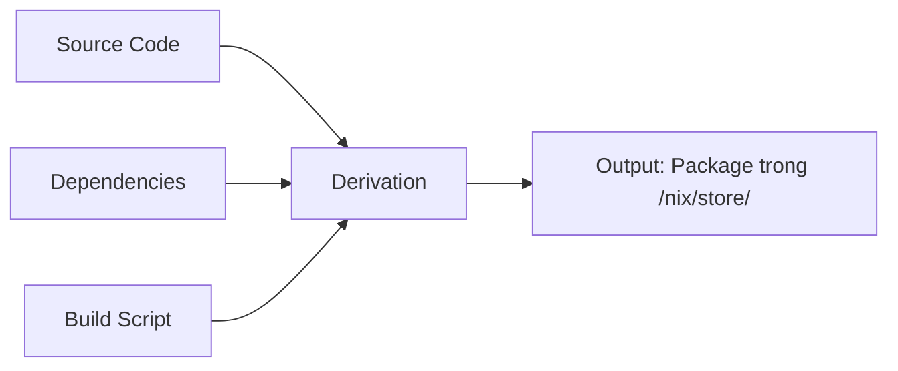
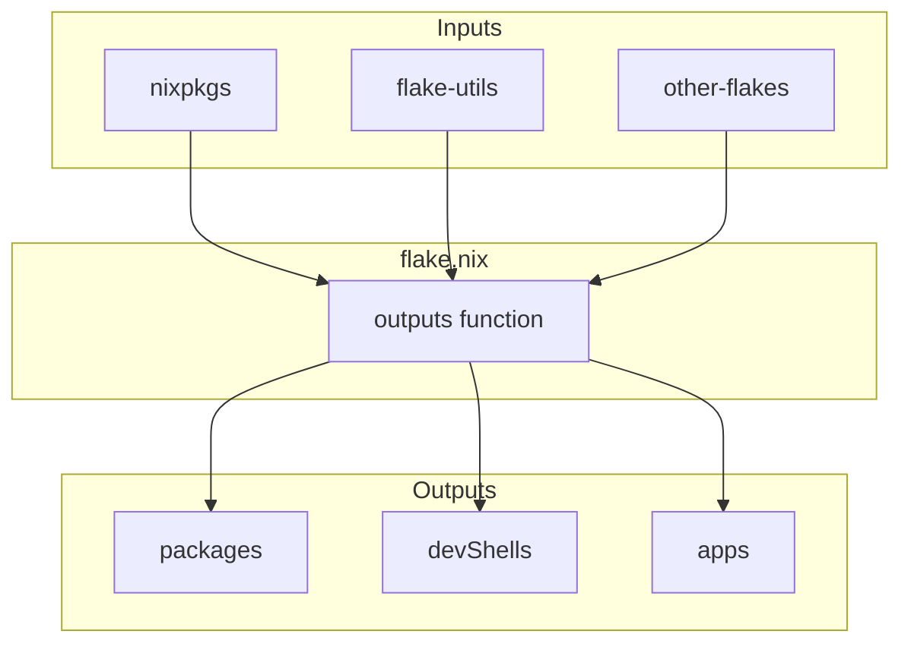

# Nix Fundamentals - Các Khái Niệm Cơ Bản

## Mục đích

Tài liệu này giải thích các khái niệm cơ bản cần hiểu **trước khi** sử dụng `flake.nix`. Đây là nền tảng kiến thức để làm việc hiệu quả với Nix Flakes.

---

## 1. Nix là gì?

**Nix** là một package manager với các đặc điểm:

| Đặc điểm | Mô tả |
|----------|-------|
| **Declarative** | Mô tả **cái gì** cần cài, không phải **cách** cài |
| **Reproducible** | Cùng cấu hình = cùng kết quả trên mọi máy |
| **Atomic** | Cài đặt/gỡ bỏ không bao giờ để lại trạng thái hỏng |
| **Rollback** | Có thể quay lại phiên bản trước bất kỳ lúc nào |

### So sánh với Package Managers khác

| Tính năng | apt/yum | npm/yarn | Nix |
|-----------|---------|----------|-----|
| Reproducible | ❌ | ❌ | ✅ |
| Isolated | ❌ | ✅ (node_modules) | ✅ |
| Rollback | ❌ | ❌ | ✅ |
| Nhiều phiên bản | ❌ | ✅ | ✅ |
| Cross-language | ❌ | ❌ | ✅ |

---

## 2. Nix Store

### 2.1 Nix Store là gì?

**Nix Store** (`/nix/store/`) là thư mục chứa TẤT CẢ packages, dependencies, và build outputs của Nix.

```
/nix/store/
├── sv2srrjddrp2isghmrla8s6lazbzmikd-nix-2.11.0/
│   ├── bin/
│   │   └── nix
│   └── lib/
├── s6rn4jz1sin56rf4qj5b5v8jxjm32hlk-hello-2.10/
│   └── bin/
│       └── hello
└── ...
```

### 2.2 Đặc điểm của Nix Store

| Đặc điểm | Mô tả |
|----------|-------|
| **Immutable** | Sau khi tạo, không thể thay đổi |
| **Content-addressed** | Tên thư mục chứa hash của nội dung |
| **Isolated** | Mỗi package có thư mục riêng biệt |
| **Shared** | Packages được chia sẻ giữa các users/projects |

### 2.3 Store Path

**Store Path** là đường dẫn đầy đủ đến một package trong Nix Store:

```
/nix/store/sv2srrjddrp2isghmrla8s6lazbzmikd-nix-2.11.0
          └──────────────────────────────┘ └────────┘
                    hash (32 ký tự)         tên package
```

**Hash** được tính từ:
- Source code
- Build script
- Dependencies
- Build environment

→ Nếu bất kỳ thứ gì thay đổi, hash sẽ khác → package mới

### 2.4 Lệnh quản lý Store

```bash
# Xem thông tin store
nix store info

# Liệt kê nội dung
nix store ls /nix/store/...

# Garbage collection (xóa packages không dùng)
nix store gc

# Tối ưu hóa store (hardlink các files giống nhau)
nix store optimise
```

---

## 3. Derivation

### 3.1 Derivation là gì?

**Derivation** là "công thức" (recipe) để build một package. Nó mô tả:



### 3.2 Cấu trúc Derivation

Một derivation chứa:

| Thành phần | Mô tả |
|------------|-------|
| `name` | Tên package |
| `system` | Architecture (x86_64-linux, aarch64-darwin...) |
| `builder` | Script để build |
| `src` | Source code |
| `buildInputs` | Dependencies cần thiết |
| `outputs` | Các outputs (thường là `out`) |

### 3.3 Ví dụ Derivation

```nix
# Derivation đơn giản
pkgs.stdenv.mkDerivation {
  name = "my-app";
  src = ./src;
  
  buildInputs = [ pkgs.nodejs ];
  
  buildPhase = ''
    npm install
    npm run build
  '';
  
  installPhase = ''
    mkdir -p $out/bin
    cp -r dist/* $out/
  '';
}
```

### 3.4 Interpolation: Derivation → Store Path

Khi bạn interpolate một derivation trong Nix, nó trả về store path:

```nix
let
  pkgs = import <nixpkgs> {};
in
"${pkgs.hello}"
# → "/nix/store/s6rn4jz1sin56rf4qj5b5v8jxjm32hlk-hello-2.10"
```

---

## 4. Nixpkgs

### 4.1 Nixpkgs là gì?

**Nixpkgs** là repository chính chứa:
- **80,000+** packages
- NixOS modules
- Helper functions (mkShell, mkDerivation, ...)

GitHub: https://github.com/NixOS/nixpkgs

### 4.2 Channels

| Channel | Mô tả | Sử dụng |
|---------|-------|---------|
| `nixos-unstable` | Rolling release, mới nhất | Development |
| `nixos-24.05` | Stable release | Production |
| `nixpkgs-unstable` | Giống unstable, không có NixOS modules | Non-NixOS |

### 4.3 Tìm packages

```bash
# Tìm trên website
# https://search.nixos.org/packages

# Tìm bằng lệnh
nix search nixpkgs nodejs
nix search nixpkgs dotnet

# Xem thông tin package
nix flake show nixpkgs#nodejs_20
```

### 4.4 Sử dụng Nixpkgs trong Flake

```nix
{
  inputs.nixpkgs.url = "github:NixOS/nixpkgs/nixos-unstable";
  
  outputs = { nixpkgs, ... }:
    let
      pkgs = nixpkgs.legacyPackages.x86_64-linux;
    in {
      # Sử dụng packages từ nixpkgs
      packages.default = pkgs.hello;
    };
}
```

---

## 5. Cấu trúc flake.nix

### 5.1 Schema cơ bản

```nix
{
  description = "Mô tả flake";           # 1. Description (tùy chọn)

  inputs = { ... };                       # 2. Inputs (dependencies)

  outputs = { self, ... }: { ... };       # 3. Outputs (kết quả)
}
```

### 5.2 Inputs

**Inputs** là các dependencies mà flake cần:

```nix
inputs = {
  # Repository chính
  nixpkgs.url = "github:NixOS/nixpkgs/nixos-unstable";
  
  # Helper library
  flake-utils.url = "github:numtide/flake-utils";
  
  # Từ GitHub (private repo)
  my-app.url = "github:username/repo";
  my-app.inputs.nixpkgs.follows = "nixpkgs";  # Dùng chung nixpkgs
  
  # Từ local path
  local-lib.url = "../my-lib";
  
  # Không phải flake (raw source)
  my-src.url = "github:username/repo";
  my-src.flake = false;
};
```

#### Input URL Formats

| Format | Ví dụ |
|--------|-------|
| GitHub | `github:owner/repo` |
| GitHub với branch | `github:owner/repo/branch` |
| GitHub với ref | `github:owner/repo?ref=v1.0.0` |
| GitLab | `gitlab:owner/repo` |
| Local path | `path:../other-flake` |
| HTTP | `https://example.com/flake.tar.gz` |

### 5.3 Outputs

**Outputs** là những gì flake cung cấp:

```nix
outputs = { self, nixpkgs, ... }: {
  # Packages có thể cài đặt
  packages.x86_64-linux.default = ...;
  packages.x86_64-linux.my-app = ...;
  
  # Development shells
  devShells.x86_64-linux.default = ...;
  
  # Apps có thể chạy
  apps.x86_64-linux.default = ...;
  
  # NixOS modules
  nixosModules.default = ...;
  
  # Overlays
  overlays.default = ...;
  
  # Templates
  templates.default = ...;
  
  # Formatter
  formatter.x86_64-linux = ...;
};
```

### 5.4 Sơ đồ luồng dữ liệu



---

## 6. flake-utils

### 6.1 Tại sao cần flake-utils?

Không có flake-utils, bạn phải viết output cho từng system:

```nix
# Không có flake-utils (lặp code)
outputs = { self, nixpkgs }:
{
  devShells.x86_64-linux.default = ...;
  devShells.aarch64-linux.default = ...;
  devShells.x86_64-darwin.default = ...;
  devShells.aarch64-darwin.default = ...;
};
```

### 6.2 Sử dụng flake-utils

```nix
# Với flake-utils (gọn gàng)
outputs = { self, nixpkgs, flake-utils }:
  flake-utils.lib.eachDefaultSystem (system:
    let
      pkgs = nixpkgs.legacyPackages.${system};
    in {
      devShells.default = pkgs.mkShell { ... };
    }
  );
```

### 6.3 Các helper phổ biến

| Helper | Mô tả |
|--------|-------|
| `eachDefaultSystem` | Tạo outputs cho các systems phổ biến |
| `eachSystem` | Tạo outputs cho systems chỉ định |
| `flattenTree` | Flatten nested attribute sets |
| `mkApp` | Tạo app từ package |

---

## 7. mkShell

### 7.1 mkShell là gì?

**mkShell** là function để tạo development shell với các packages và environment variables.

### 7.2 Cấu trúc mkShell

```nix
pkgs.mkShell {
  # Packages có trong shell
  buildInputs = [
    pkgs.nodejs_20
    pkgs.dotnet-sdk_9
    pkgs.git
  ];
  
  # Alias: nativeBuildInputs (cho build-time deps)
  nativeBuildInputs = [
    pkgs.pkg-config
  ];
  
  # Biến môi trường
  MY_VAR = "value";
  DATABASE_URL = "postgresql://localhost:5432/mydb";
  
  # Script chạy khi vào shell
  shellHook = ''
    echo "🚀 Development environment ready!"
    echo "Node: $(node --version)"
    echo ".NET: $(dotnet --version)"
  '';
}
```

### 7.3 buildInputs vs nativeBuildInputs

| Attribute | Mô tả | Ví dụ |
|-----------|-------|-------|
| `buildInputs` | Runtime dependencies | nodejs, dotnet-sdk |
| `nativeBuildInputs` | Build-time dependencies | pkg-config, cmake |

---

## 8. flake.lock

### 8.1 flake.lock là gì?

**flake.lock** là file JSON khóa (pin) các phiên bản của inputs:

```json
{
  "nodes": {
    "nixpkgs": {
      "locked": {
        "lastModified": 1765779637,
        "narHash": "sha256-KJ2wa/BLSrTqDjbfyNx70ov/HdgNBCBBSQP3BIzKnv4=",
        "owner": "NixOS",
        "repo": "nixpkgs",
        "rev": "1306659b587dc277866c7b69eb97e5f07864d8c4",
        "type": "github"
      }
    }
  },
  "version": 7
}
```

### 8.2 Tại sao cần lock file?

| Vấn đề | Giải pháp với lock file |
|--------|------------------------|
| nixpkgs thay đổi hàng ngày | Pin đến commit cụ thể |
| Team members có kết quả khác nhau | Lock file đảm bảo nhất quán |
| Build ngày mai khác build hôm nay | Reproducible builds |

### 8.3 Quản lý lock file

```bash
# Cập nhật tất cả inputs
nix flake update

# Cập nhật input cụ thể
nix flake update nixpkgs

# Tạo lock file mà không build
nix flake lock

# Xem thông tin locked inputs
nix flake info
```

### 8.4 Commit lock file?

**✅ Nên commit `flake.lock` vào git** để:
- Đảm bảo reproducibility
- Team members có cùng phiên bản
- CI/CD build consistent

---

## 9. System Architectures

### 9.1 Các systems phổ biến

| System | Mô tả |
|--------|-------|
| `x86_64-linux` | Linux 64-bit (Intel/AMD) |
| `aarch64-linux` | Linux ARM 64-bit (Raspberry Pi 4, servers) |
| `x86_64-darwin` | macOS Intel |
| `aarch64-darwin` | macOS Apple Silicon (M1, M2, M3) |

### 9.2 Xác định system hiện tại

```bash
# Xem system architecture
nix eval --impure --expr 'builtins.currentSystem'
# → "x86_64-linux"
```

### 9.3 Multi-system support

```nix
# Với flake-utils
outputs = { self, nixpkgs, flake-utils }:
  flake-utils.lib.eachDefaultSystem (system:
    let
      pkgs = nixpkgs.legacyPackages.${system};
    in {
      devShells.default = pkgs.mkShell {
        buildInputs = [ pkgs.hello ];
      };
    }
  );
```

---

## 10. Các lệnh Nix cơ bản

### 10.1 Flake commands

```bash
# Vào development shell
nix develop

# Vào shell khác (không phải default)
nix develop .#my-shell

# Build package
nix build

# Build package khác
nix build .#my-package

# Chạy app
nix run

# Chạy app khác
nix run .#my-app
```

### 10.2 Flake management

```bash
# Xem outputs của flake
nix flake show

# Xem thông tin flake
nix flake info

# Kiểm tra flake hợp lệ
nix flake check

# Cập nhật inputs
nix flake update

# Khởi tạo flake mới
nix flake init

# Khởi tạo từ template
nix flake init -t templates#simple
```

### 10.3 Search & query

```bash
# Tìm packages trong nixpkgs
nix search nixpkgs nodejs

# Xem derivation
nix derivation show nixpkgs#hello

# Xem store path
nix eval --raw nixpkgs#hello

# Xem dependencies
nix path-info --derivation nixpkgs#hello
```

---

## 11. Ví dụ hoàn chỉnh

### 11.1 Minimal flake.nix

```nix
{
  description = "Minimal Nix Flake";

  inputs.nixpkgs.url = "github:NixOS/nixpkgs/nixos-unstable";

  outputs = { self, nixpkgs }:
    let
      system = "x86_64-linux";
      pkgs = nixpkgs.legacyPackages.${system};
    in {
      devShells.${system}.default = pkgs.mkShell {
        buildInputs = [ pkgs.hello ];
      };
    };
}
```

### 11.2 Fullstack development flake

```nix
{
  description = "Fullstack Development Environment";

  inputs = {
    nixpkgs.url = "github:NixOS/nixpkgs/nixos-unstable";
    flake-utils.url = "github:numtide/flake-utils";
  };

  outputs = { self, nixpkgs, flake-utils }:
    flake-utils.lib.eachDefaultSystem (system:
      let
        pkgs = import nixpkgs { inherit system; };
        
        # Định nghĩa các packages
        nodejs = pkgs.nodejs_20;
        dotnet = pkgs.dotnet-sdk_9;
        postgresql = pkgs.postgresql_16;
        
        # Danh sách dev tools
        devTools = [
          nodejs
          dotnet
          postgresql
          pkgs.git
          pkgs.curl
          pkgs.jq
          pkgs.yarn-berry
        ];
      in {
        # Development shell
        devShells.default = pkgs.mkShell {
          buildInputs = devTools;
          
          DOTNET_ROOT = "${dotnet}";
          
          shellHook = ''
            echo "🚀 Development Environment Ready!"
            echo "  Node.js: $(node --version)"
            echo "  .NET: $(dotnet --version)"
            echo "  PostgreSQL: $(psql --version | head -1)"
          '';
        };
        
        # Formatter
        formatter = pkgs.nixfmt-rfc-style;
      });
}
```

---

## 12. Tổng kết

### Checklist trước khi dùng flake.nix

- [ ] Hiểu **Nix Store** là nơi lưu packages
- [ ] Hiểu **Derivation** là công thức build
- [ ] Biết **Nixpkgs** là repository packages
- [ ] Nắm cấu trúc **inputs** và **outputs**
- [ ] Hiểu vai trò của **flake-utils**
- [ ] Biết cách dùng **mkShell**
- [ ] Hiểu tại sao cần **flake.lock**
- [ ] Biết các **lệnh cơ bản**

### Tài liệu tham khảo

- [Nix Manual](https://nixos.org/manual/nix/)
- [Nixpkgs Manual](https://nixos.org/manual/nixpkgs/)
- [NixOS Wiki - Flakes](https://nixos.wiki/wiki/Flakes)
- [Nix.dev](https://nix.dev/)
- [Zero to Nix](https://zero-to-nix.com/)

---

**Ngày tạo:** 2026-01-03  
**Dự án:** TapHoaNho - Retail Store Management System
