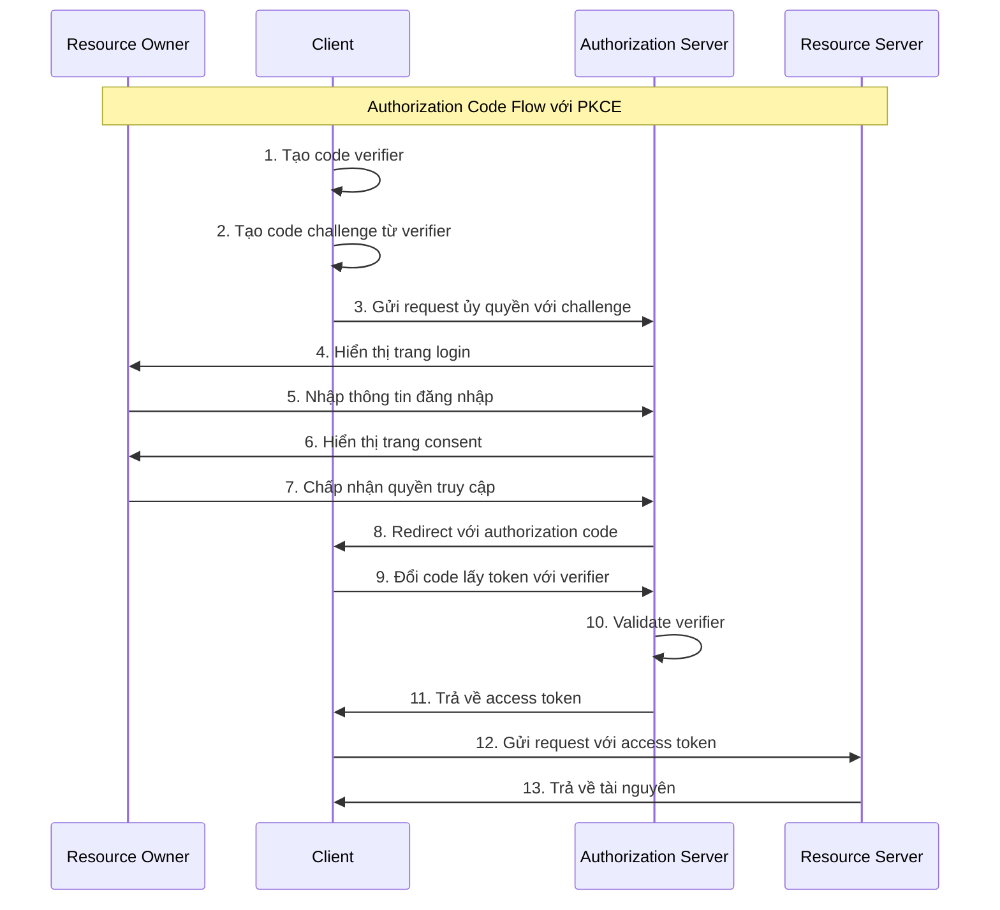
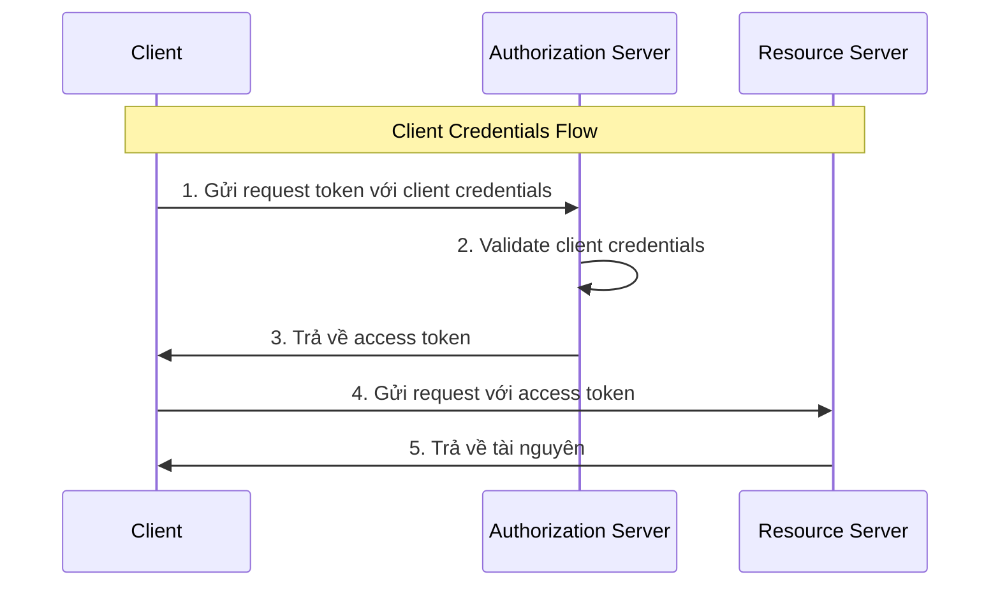

# Phần 3: Các luồng ủy quyền phổ biến

## 3.1 Authorization Code Flow

### 3.1.1 Mô tả chi tiết các bước

Authorization Code Flow là luồng ủy quyền an toàn nhất và được khuyến nghị sử dụng cho hầu hết các trường hợp. Luồng này sử dụng một authorization code tạm thời để đổi lấy access token, giúp bảo vệ token khỏi việc bị lộ trong URL hoặc browser history.

#### Tổng quan

Authorization Code Flow phù hợp cho:
- Confidential clients (web applications server-side)
- Public clients (mobile apps, SPAs) khi sử dụng PKCE
- Khi cần refresh token
- Khi cần bảo mật cao

#### Các bước chi tiết

##### Bước 1: Client gửi request ủy quyền

Client khởi tạo luồng ủy quyền bằng cách redirect Resource Owner đến Authorization Endpoint của Authorization Server.

**Request:**
```
GET /connect/authorize?
    client_id=web-client&
    redirect_uri=https://localhost:5001/signin-oidc&
    response_type=code&
    scope=openid profile api1.read api1.write&
    state=xyz123&
    code_challenge=E9Melhoa2OwvFrEMTJguCHaoeK1t8KWEeRv21o-
    code_challenge_method=S256
```

**Parameters:**
- `client_id`: ID duy nhất của client (bắt buộc)
- `redirect_uri`: URI để redirect sau khi ủy quyền (bắt buộc)
- `response_type`: Phải là `code` (bắt buộc)
- `scope`: Các scopes được yêu cầu, phân cách bằng space (tùy chọn)
- `state`: Giá trị ngẫu nhiên để prevent CSRF (khuyến nghị)
- `code_challenge`: PKCE challenge (khuyến nghị cho public clients)
- `code_challenge_method`: PKCE method, thường là `S256` (khuyến nghị cho public clients)

**Validation:**
- Client ID phải tồn tại trong Client Store
- Redirect URI phải khớp với một trong các URIs được phép
- Response type phải được phép cho client
- Scopes phải được phép cho client

##### Bước 2: Resource Owner đăng nhập

Authorization Server hiển thị trang login để Resource Owner xác thực danh tính.

**Điểm quan trọng:**
- Sử dụng HTTPS
- Validate input
- Rate limiting để prevent brute force attacks
- Hỗ trợ MFA
- Validate password strength

**Ví dụ login form:**
```html
<form method="post" action="/connect/authorize/login">
    <input type="hidden" name="client_id" value="web-client" />
    <input type="hidden" name="redirect_uri" value="https://localhost:5001/signin-oidc" />
    <input type="hidden" name="response_type" value="code" />
    <input type="hidden" name="scope" value="openid profile api1.read api1.write" />
    <input type="hidden" name="state" value="xyz123" />
    <input type="hidden" name="code_challenge" value="E9Melhoa2OwvFrEMTJguCHaoeK1t8KWEeRv21o-" />
    <input type="hidden" name="code_challenge_method" value="S256" />
    
    <label for="username">Username:</label>
    <input type="text" id="username" name="username" required />
    
    <label for="password">Password:</label>
    <input type="password" id="password" name="password" required />
    
    <button type="submit">Login</button>
</form>
```

##### Bước 3: Resource Owner chấp nhận quyền truy cập

Sau khi đăng nhập thành công, Authorization Server hiển thị trang consent để Resource Owner chấp nhận hoặc từ chối quyền truy cập.

**Điểm quan trọng:**
- Hiển thị rõ ràng các scopes được yêu cầu
- Cho phép Resource Owner chọn scopes cụ thể
- Lưu consent để không cần hỏi lại lần sau
- Hiển thị thông tin về client (name, logo, website)

**Ví dụ consent form:**
```html
<form method="post" action="/connect/authorize/consent">
    <input type="hidden" name="client_id" value="web-client" />
    <input type="hidden" name="redirect_uri" value="https://localhost:5001/signin-oidc" />
    <input type="hidden" name="response_type" value="code" />
    <input type="hidden" name="scope" value="openid profile api1.read api1.write" />
    <input type="hidden" name="state" value="xyz123" />
    <input type="hidden" name="code_challenge" value="E9Melhoa2OwvFrEMTJguCHaoeK1t8KWEeRv21o-" />
    <input type="hidden" name="code_challenge_method" value="S256" />
    <input type="hidden" name="user_id" value="123" />
    
    <h2>Web Application muốn truy cập:</h2>
    
    <h3>Thông tin cá nhân của bạn</h3>
    <p>Web Application muốn truy cập tên và email của bạn.</p>
    <input type="checkbox" name="granted_scopes" value="openid" checked disabled />
    <input type="checkbox" name="granted_scopes" value="profile" checked disabled />
    
    <h3>API của bạn</h3>
    <p>Web Application muốn đọc và ghi dữ liệu trên API của bạn.</p>
    <input type="checkbox" name="granted_scopes" value="api1.read" checked />
    <input type="checkbox" name="granted_scopes" value="api1.write" checked />
    
    <label>
        <input type="checkbox" name="remember_consent" value="true" />
        Nhớ quyết định của tôi
    </label>
    
    <button type="submit" name="consent" value="grant">Chấp nhận</button>
    <button type="submit" name="consent" value="deny">Từ chối</button>
</form>
```

##### Bước 4: Authorization Server redirect với authorization code

Sau khi Resource Owner chấp nhận, Authorization Server redirect Client về redirect URI với authorization code.

**Response:**
```
HTTP/1.1 302 Found
Location: https://localhost:5001/signin-oidc?
    code=Grz7wW7g7G7g7g7g7g7g7g7g7g7g7g7g7g7g7g&
    state=xyz123
```

**Điểm quan trọng:**
- Authorization code chỉ có hiệu lực một lần
- Code hết hạn nhanh (thường 5-10 phút)
- State phải khớp với request ban đầu
- Code được liên kết với Client ID và Resource Owner
- PKCE code verifier được lưu trữ để validate sau này

**Cấu trúc authorization code:**
```csharp
public class AuthorizationCode
{
    public string Code { get; set; }
    public string ClientId { get; set; }
    public string UserId { get; set; }
    public List<string> Scopes { get; set; }
    public DateTime CreationTime { get; set; }
    public DateTime ExpirationTime { get; set; }
    public string CodeChallenge { get; set; }
    public string CodeChallengeMethod { get; set; }
    public string RedirectUri { get; set; }
    public string State { get; set; }
    public bool IsConsumed { get; set; }
}
```

##### Bước 5: Client đổi authorization code lấy access token

Client gửi authorization code đến Token Endpoint để đổi lấy access token.

**Request:**
```
POST /connect/token
Content-Type: application/x-www-form-urlencoded

grant_type=authorization_code&
code=Grz7wW7g7G7g7g7g7g7g7g7g7g7g7g7g7g7g&
redirect_uri=https://localhost:5001/signin-oidc&
client_id=web-client&
client_secret=secret&
code_verifier=dBjftJeZ4Cv-mft92mrhf2sWFp27JbNytTYMv-
```

**Parameters:**
- `grant_type`: Phải là `authorization_code`
- `code`: Authorization code nhận được ở bước 4
- `redirect_uri`: Phải khớp với request ban đầu
- `client_id`: ID của client
- `client_secret`: Secret của client (cho confidential clients)
- `code_verifier`: PKCE verifier (cho public clients)

**Validation:**
- Authorization code phải tồn tại và chưa được sử dụng
- Code chưa hết hạn
- Client ID phải khớp
- Redirect URI phải khớp
- Client Secret phải đúng (cho confidential clients)
- Code verifier phải khớp với code challenge (cho public clients)

##### Bước 6: Authorization Server trả về access token

Sau khi validation thành công, Authorization Server trả về access token và (tùy chọn) refresh token.

**Response:**
```json
{
  "access_token": "eyJhbGciOiJIUzI1NiIsInR5cCI6IkpXVCJ9.eyJzdWIiOiIxMjM0NTY3ODkwIiwibmFtZSI6IkpvaG4gRG9lIiwiZW1haWwiOiJqb2huLmRvZUBleGFtcGxlLmNvbSIsicGljdHVyZSI6Imh0dHBzOi8vZXhhbXBsZS5jb20vYXZhdGFyLmpwZyIsImF1ZCI6IndlYi1jbGllbnQiLCJzY29wZSI6Im9wZW5pZCBwcm9maWxlIGFwaTEucmVhZCBhcGkxLndyaXRlIiwiZXhwIjoxNTE2MjM5MDIyLCJpYXQiOjE1MTYyMzU0MjJ9.signature",
  "token_type": "Bearer",
  "expires_in": 3600,
  "refresh_token": "rt_xxxxxxxxxxxxxx",
  "scope": "openid profile api1.read api1.write",
  "id_token": "eyJhbGciOiJIUzI1NiIsInR5cCI6IkpXVCJ9.eyJzdWIiOiIxMjM0NTY3ODkwIiwibmFtZSI6IkpvaG4gRG9lIiwiZW1haWwiOiJqb2huLmRvZUBleGFtcGxlLmNvbSIsicGljdHVyZSI6Imh0dHBzOi8vZXhhbXBsZS5jb20vYXZhdGFyLmpwZyIsImF1ZCI6IndlYi1jbGllbnQiLCJhdXRoX3RpbWUiOjE1MTYyMzU0MjIsImV4cCI6MTUxNjIzOTAyMiwiaWF0IjoxNTE2MjM1NDIyfQ.signature"
}
```

**Điểm quan trọng:**
- Access token có thời gian sống ngắn (thường 5-60 phút)
- Refresh token có thời gian sống dài hơn (thường vài ngày đến vài tuần)
- ID token chỉ có trong OpenID Connect
- Scopes được trả về là scopes thực tế được cấp phát
- Authorization code được đánh dấu là đã sử dụng

### 3.1.2 Sử dụng PKCE

#### PKCE là gì?

PKCE (Proof Key for Code Exchange) là một extension của OAuth 2.0 để bảo vệ authorization code flow khỏi việc bị intercept, đặc biệt cho public clients như mobile apps và SPAs.

#### Tại sao cần PKCE?

**Vấn đề với authorization code flow:**
- Public clients không thể bảo mật Client Secret
- Authorization code có thể bị intercept trong redirect
- Attacker có thể sử dụng code để lấy token

**Giải pháp PKCE:**
- Client tạo một code verifier ngẫu nhiên
- Client tạo code challenge từ verifier bằng cách hash
- Client gửi challenge trong request ủy quyền
- Client gửi verifier khi đổi code lấy token
- Authorization Server chỉ chấp nhận code nếu verifier khớp với challenge

#### Cách PKCE hoạt động

##### Bước 1: Client tạo code verifier

Client tạo một chuỗi ngẫu nhiên dài 43-128 ký tự.

**Ví dụ:**
```csharp
public static string GenerateCodeVerifier()
{
    var randomBytes = new byte[32];
    using (var rng = RandomNumberGenerator.Create())
    {
        rng.GetBytes(randomBytes);
    }
    return Base64UrlEncode(randomBytes);
}

public static string Base64UrlEncode(byte[] input)
{
    return Convert.ToBase64String(input)
        .Replace('+', '-')
        .Replace('/', '_')
        .TrimEnd('=');
}

// Ví dụ output: dBjftJeZ4Cv-mft92mrhf2sWFp27JbNytTYMv-
```

##### Bước 2: Client tạo code challenge

Client hash code verifier và base64url encode kết quả.

**Ví dụ:**
```csharp
public static string GenerateCodeChallenge(string codeVerifier)
{
    using (var sha256 = SHA256.Create())
    {
        var hash = sha256.ComputeHash(Encoding.UTF8.GetBytes(codeVerifier));
        return Base64UrlEncode(hash);
    }
}

// Ví dụ output: E9Melhoa2OwvFrEMTJguCHaoeK1t8KWEeRv21o-
```

##### Bước 3: Client gửi challenge trong request ủy quyền

```
GET /connect/authorize?
    client_id=mobile-app&
    redirect_uri=myapp://callback&
    response_type=code&
    scope=openid profile api1&
    state=xyz123&
    code_challenge=E9Melhoa2OwvFrEMTJguCHaoeK1t8KWEeRv21o-
    code_challenge_method=S256
```

##### Bước 4: Authorization Server lưu trữ challenge

Authorization Server lưu trữ code challenge và method để validate sau này.

##### Bước 5: Client gửi verifier khi đổi code lấy token

```
POST /connect/token
Content-Type: application/x-www-form-urlencoded

grant_type=authorization_code&
code=Grz7wW7g7G7g7g7g7g7g7g7g7g7g7g7g7g7g&
redirect_uri=myapp://callback&
client_id=mobile-app&
code_verifier=dBjftJeZ4Cv-mft92mrhf2sWFp27JbNytTYMv-
```

##### Bước 6: Authorization Server validate verifier

Authorization Server hash verifier và so sánh với challenge.

```csharp
public bool ValidateCodeVerifier(string codeVerifier, string storedChallenge, string method)
{
    if (method == "S256")
    {
        var computedChallenge = GenerateCodeChallenge(codeVerifier);
        return computedChallenge == storedChallenge;
    }
    else if (method == "plain")
    {
        return codeVerifier == storedChallenge;
    }
    
    return false;
}
```

#### PKCE methods

##### S256 (SHA-256)

**Đặc điểm:**
- An toàn hơn
- Hash verifier với SHA-256
- Được khuyến nghị sử dụng

**Ví dụ:**
```
code_verifier: dBjftJeZ4Cv-mft92mrhf2sWFp27JbNytTYMv-
code_challenge: E9Melhoa2OwvFrEMTJguCHaoeK1t8KWEeRv21o-
code_challenge_method: S256
```

##### Plain

**Đặc điểm:**
- Đơn giản hơn
- Không hash verifier
- Ít an toàn hơn S256
- Chỉ nên sử dụng khi SHA-256 không khả thi

**Ví dụ:**
```
code_verifier: dBjftJeZ4Cv-mft92mrhf2sWFp27JbNytTYMv-
code_challenge: dBjftJeZ4Cv-mft92mrhf2sWFp27JbNytTYMv-
code_challenge_method: plain
```

### 3.1.3 Diagram luồng



### 3.1.4 Ví dụ code .NET

#### Client-side (ASP.NET Core)

##### 1. Cấu hình OpenID Connect

```csharp
public void ConfigureServices(IServiceCollection services)
{
    services.AddAuthentication(options =>
    {
        options.DefaultScheme = "Cookies";
        options.DefaultChallengeScheme = "oidc";
    })
    .AddCookie("Cookies")
    .AddOpenIdConnect("oidc", options =>
    {
        options.Authority = "https://auth.example.com";
        options.ClientId = "web-client";
        options.ClientSecret = "secret";
        options.ResponseType = "code";
        options.SaveTokens = true;
        options.GetClaimsFromUserInfoEndpoint = true;
        options.Scope.Add("openid");
        options.Scope.Add("profile");
        options.Scope.Add("api1.read");
        options.Scope.Add("api1.write");
        options.CallbackPath = "/signin-oidc";
        options.SignedOutCallbackPath = "/signout-callback-oidc";
        
        // PKCE configuration
        options.UsePkce = true;
    });
}

public void Configure(IApplicationBuilder app, IWebHostEnvironment env)
{
    if (env.IsDevelopment())
    {
        app.UseDeveloperExceptionPage();
    }
    
    app.UseHttpsRedirection();
    app.UseStaticFiles();
    app.UseRouting();
    
    app.UseAuthentication();
    app.UseAuthorization();
    
    app.UseEndpoints(endpoints =>
    {
        endpoints.MapControllers();
        endpoints.MapRazorPages();
    });
}
```

##### 2. Tạo PKCE code verifier và challenge

```csharp
public class PkceHelper
{
    public static (string verifier, string challenge) GeneratePkceCodes()
    {
        var verifier = GenerateCodeVerifier();
        var challenge = GenerateCodeChallenge(verifier);
        return (verifier, challenge);
    }
    
    private static string GenerateCodeVerifier()
    {
        var randomBytes = new byte[32];
        using (var rng = RandomNumberGenerator.Create())
        {
            rng.GetBytes(randomBytes);
        }
        return Base64UrlEncode(randomBytes);
    }
    
    private static string GenerateCodeChallenge(string codeVerifier)
    {
        using (var sha256 = SHA256.Create())
        {
            var hash = sha256.ComputeHash(Encoding.UTF8.GetBytes(codeVerifier));
            return Base64UrlEncode(hash);
        }
    }
    
    private static string Base64UrlEncode(byte[] input)
    {
        return Convert.ToBase64String(input)
            .Replace('+', '-')
            .Replace('/', '_')
            .TrimEnd('=');
    }
}
```

##### 3. Gửi request ủy quyền

```csharp
public class AuthorizationController : Controller
{
    [HttpGet]
    public IActionResult Login()
    {
        var (verifier, challenge) = PkceHelper.GeneratePkceCodes();
        
        // Lưu verifier vào session để sử dụng sau này
        HttpContext.Session.SetString("code_verifier", verifier);
        
        var properties = new AuthenticationProperties
        {
            RedirectUri = Url.Action(nameof(Callback))
        };
        
        properties.Items["code_challenge"] = challenge;
        properties.Items["code_challenge_method"] = "S256";
        
        return Challenge(properties, "oidc");
    }
    
    [HttpGet]
    public async Task<IActionResult> Callback()
    {
        var result = await HttpContext.AuthenticateAsync("oidc");
        
        if (!result.Succeeded)
        {
            return RedirectToAction("Login");
        }
        
        var tokens = result.Properties.GetTokens();
        var accessToken = tokens.FirstOrDefault(t => t.Name == "access_token")?.Value;
        var refreshToken = tokens.FirstOrDefault(t => t.Name == "refresh_token")?.Value;
        
        // Lưu tokens vào session hoặc database
        HttpContext.Session.SetString("access_token", accessToken);
        HttpContext.Session.SetString("refresh_token", refreshToken);
        
        return RedirectToAction("Index", "Home");
    }
}
```

##### 4. Sử dụng access token để truy cập API

```csharp
public class ProductsController : Controller
{
    private readonly IHttpClientFactory _httpClientFactory;
    
    public ProductsController(IHttpClientFactory httpClientFactory)
    {
        _httpClientFactory = httpClientFactory;
    }
    
    [HttpGet]
    public async Task<IActionResult> Index()
    {
        var accessToken = HttpContext.Session.GetString("access_token");
        
        if (string.IsNullOrEmpty(accessToken))
        {
            return RedirectToAction("Login", "Authorization");
        }
        
        var client = _httpClientFactory.CreateClient();
        client.DefaultRequestHeaders.Authorization = 
            new AuthenticationHeaderValue("Bearer", accessToken);
        
        var response = await client.GetAsync("https://api.example.com/api/products");
        
        if (response.StatusCode == HttpStatusCode.Unauthorized)
        {
            // Try refresh token
            var newAccessToken = await RefreshAccessToken();
            if (!string.IsNullOrEmpty(newAccessToken))
            {
                client.DefaultRequestHeaders.Authorization = 
                    new AuthenticationHeaderValue("Bearer", newAccessToken);
                response = await client.GetAsync("https://api.example.com/api/products");
            }
        }
        
        if (response.IsSuccessStatusCode)
        {
            var products = await response.Content.ReadFromJsonAsync<List<Product>>();
            return View(products);
        }
        
        return StatusCode((int)response.StatusCode);
    }
    
    private async Task<string> RefreshAccessToken()
    {
        var refreshToken = HttpContext.Session.GetString("refresh_token");
        
        if (string.IsNullOrEmpty(refreshToken))
        {
            return null;
        }
        
        var client = _httpClientFactory.CreateClient();
        var parameters = new Dictionary<string, string>
        {
            { "grant_type", "refresh_token" },
            { "refresh_token", refreshToken },
            { "client_id", "web-client" },
            { "client_secret", "secret" }
        };
        
        var content = new FormUrlEncodedContent(parameters);
        var response = await client.PostAsync("https://auth.example.com/connect/token", content);
        
        if (response.IsSuccessStatusCode)
        {
            var tokenResponse = await response.Content.ReadFromJsonAsync<TokenResponse>();
            HttpContext.Session.SetString("access_token", tokenResponse.AccessToken);
            HttpContext.Session.SetString("refresh_token", tokenResponse.RefreshToken);
            return tokenResponse.AccessToken;
        }
        
        return null;
    }
}

public class TokenResponse
{
    [JsonPropertyName("access_token")]
    public string AccessToken { get; set; }
    
    [JsonPropertyName("token_type")]
    public string TokenType { get; set; }
    
    [JsonPropertyName("expires_in")]
    public int ExpiresIn { get; set; }
    
    [JsonPropertyName("refresh_token")]
    public string RefreshToken { get; set; }
    
    [JsonPropertyName("scope")]
    public string Scope { get; set; }
}
```

#### Authorization Server-side (Duende IdentityServer)

##### 1. Cấu hình Duende IdentityServer

```csharp
public void ConfigureServices(IServiceCollection services)
{
    var builder = services.AddIdentityServer(options =>
    {
        options.Events.RaiseErrorEvents = true;
        options.Events.RaiseInformationEvents = true;
        options.Events.RaiseFailureEvents = true;
        options.Events.RaiseSuccessEvents = true;
        
        // Xem strict redirect URI validation
        options.StrictRedirectUriValidation = true;
        
        // Yêu cầu PKCE cho public clients
        options.RequirePkceForPublicClients = true;
    })
    .AddInMemoryClients(Clients.Get())
    .AddInMemoryIdentityResources(Resources.GetIdentityResources())
    .AddInMemoryApiResources(Resources.GetApiResources())
    .AddTestUsers(TestUsers.Users)
    .AddDeveloperSigningCredential();
}
```

##### 2. Định nghĩa Clients

```csharp
public static class Clients
{
    public static IEnumerable<Client> Get()
    {
        return new List<Client>
        {
            new Client
            {
                ClientId = "web-client",
                ClientName = "Web Application",
                ClientUri = "https://localhost:5001",
                AllowedGrantTypes = GrantTypes.CodeAndClientCredentials,
                RequireClientSecret = true,
                ClientSecrets = { new Secret("secret".Sha256()) },
                RedirectUris = { "https://localhost:5001/signin-oidc" },
                PostLogoutRedirectUris = { "https://localhost:5001/signout-callback-oidc" },
                AllowedScopes = { "openid", "profile", "api1.read", "api1.write" },
                AllowOfflineAccess = true,
                AccessTokenLifetime = 3600,
                RefreshTokenUsage = TokenUsage.ReUse,
                RefreshTokenExpiration = TimeSpan.FromDays(30),
                AlwaysSendClientClaims = true,
                AlwaysIncludeUserClaimsInIdToken = true
            },
            new Client
            {
                ClientId = "mobile-app",
                ClientName = "Mobile Application",
                ClientUri = "myapp://callback",
                AllowedGrantTypes = GrantTypes.Code,
                RequireClientSecret = false,
                RedirectUris = { "myapp://callback" },
                PostLogoutRedirectUris = { "myapp://callback" },
                AllowedScopes = { "openid", "profile", "api1.read", "api1.write" },
                AllowOfflineAccess = true,
                AccessTokenLifetime = 3600,
                RefreshTokenUsage = TokenUsage.ReUse,
                RefreshTokenExpiration = TimeSpan.FromDays(30),
                RequirePkce = true,
                AlwaysSendClientClaims = true,
                AlwaysIncludeUserClaimsInIdToken = true
            }
        };
    }
}
```

##### 3. Định nghĩa Resources

```csharp
public static class Resources
{
    public static IEnumerable<IdentityResource> GetIdentityResources()
    {
        return new List<IdentityResource>
        {
            new IdentityResources.OpenId(),
            new IdentityResources.Profile(),
            new IdentityResources.Email(),
            new IdentityResources.Phone(),
            new IdentityResources.Address()
        };
    }
    
    public static IEnumerable<ApiResource> GetApiResources()
    {
        return new List<ApiResource>
        {
            new ApiResource("api1")
            {
                DisplayName = "API 1",
                Description = "API for accessing application resources",
                Scopes = { new Scope("api1.read"), new Scope("api1.write") },
                UserClaims = { "name", "email", "role" }
            }
        };
    }
}
```

##### 4. Custom Authorization Request Validator

```csharp
public class CustomAuthorizeRequestValidator : ICustomAuthorizeRequestValidator
{
    private readonly ILogger<CustomAuthorizeRequestValidator> _logger;
    
    public CustomAuthorizeRequestValidator(ILogger<CustomAuthorizeRequestValidator> logger)
    {
        _logger = logger;
    }
    
    public async Task ValidateAsync(CustomAuthorizeRequestValidationContext context)
    {
        // Validate PKCE
        if (context.ValidatedRequest.Client.RequirePkce)
        {
            if (string.IsNullOrEmpty(context.ValidatedRequest.CodeChallenge) ||
                string.IsNullOrEmpty(context.ValidatedRequest.CodeChallengeMethod))
            {
                _logger.LogWarning("PKCE parameters missing for client {ClientId}", 
                    context.ValidatedRequest.Client.ClientId);
                context.Result = new ValidationResult(
                    new AuthorizationError
                    {
                        Error = OAuth2Constants.AuthorizeErrors.InvalidRequest,
                        ErrorDescription = "PKCE parameters are required"
                    });
                return;
            }
            
            if (context.ValidatedRequest.CodeChallengeMethod != "S256" &&
                context.ValidatedRequest.CodeChallengeMethod != "plain")
            {
                _logger.LogWarning("Invalid PKCE method {Method} for client {ClientId}", 
                    context.ValidatedRequest.CodeChallengeMethod,
                    context.ValidatedRequest.Client.ClientId);
                context.Result = new ValidationResult(
                    new AuthorizationError
                    {
                        Error = OAuth2Constants.AuthorizeErrors.InvalidRequest,
                        ErrorDescription = "Invalid PKCE method"
                    });
                return;
            }
        }
        
        // Validate state parameter
        if (string.IsNullOrEmpty(context.ValidatedRequest.State))
        {
            _logger.LogWarning("State parameter missing for client {ClientId}", 
                context.ValidatedRequest.Client.ClientId);
            context.Result = new ValidationResult(
                new AuthorizationError
                {
                    Error = OAuth2Constants.AuthorizeErrors.InvalidRequest,
                    ErrorDescription = "State parameter is required"
                });
            return;
        }
        
        await Task.CompletedTask;
    }
}
```

## 3.2 Client Credentials Flow

### 3.2.1 Mô tả chi tiết các bước

Client Credentials Flow là luồng ủy quyền cho phép client truy cập tài nguyên bằng chính thông tin đăng nhập của client, không cần sự tham gia của Resource Owner. Luồng này phù hợp cho machine-to-machine communication.

#### Tổng quan

Client Credentials Flow phù hợp cho:
- Service-to-service communication
- Batch jobs
- Background processes
- Khi không có Resource Owner

#### Các bước chi tiết

##### Bước 1: Client gửi request token

Client gửi request trực tiếp đến Token Endpoint với thông tin đăng nhập của chính mình.

**Request:**
```
POST /connect/token
Content-Type: application/x-www-form-urlencoded

grant_type=client_credentials&
client_id=service-client&
client_secret=service-secret&
scope=api1.read api1.write
```

**Parameters:**
- `grant_type`: Phải là `client_credentials`
- `client_id`: ID của client
- `client_secret`: Secret của client
- `scope`: Các scopes được yêu cầu (tùy chọn)

**Validation:**
- Client ID phải tồn tại trong Client Store
- Client Secret phải đúng
- Scopes phải được phép cho client
- Client phải được phép sử dụng client_credentials grant type

##### Bước 2: Authorization Server validate client

Authorization Server validate thông tin đăng nhập của client.

**Điểm quan trọng:**
- Validate Client ID và Secret
- Kiểm tra xem client có được phép sử dụng client_credentials grant type không
- Validate scopes được yêu cầu

##### Bước 3: Authorization Server phát hành access token

Sau khi validation thành công, Authorization Server phát hành access token.

**Response:**
```json
{
  "access_token": "eyJhbGciOiJIUzI1NiIsInR5cCI6IkpXVCJ9.eyJzdWIiOiJzZXJ2aWNlLWNsaWVudCIsImNsaWVudF9pZCI6InNlcnZpY2UtY2xpZW50Iiwic2NvcGUiOiJhcGkxLnJlYWQgYXBpMS53cml0ZSIsImF1ZCI6ImFwaTEiLCJpc3MiOiJodHRwczovL2F1dGguZXhhbXBsZS5jb20iLCJleHAiOjE1MTYyMzkwMjIsImlhdCI6MTUxNjIzNTQyMn0.signature",
  "token_type": "Bearer",
  "expires_in": 3600,
  "scope": "api1.read api1.write"
}
```

**Điểm quan trọng:**
- Access token đại diện cho client, không phải user
- Không có refresh token (không cần thiết vì client có secret)
- Subject của token là Client ID, không phải User ID
- Token chỉ có scopes được cấp phát cho client

### 3.2.2 Diagram luồng



### 3.2.3 Ví dụ code .NET

#### Client-side

##### 1. Gửi request token

```csharp
public class TokenService
{
    private readonly IHttpClientFactory _httpClientFactory;
    private readonly IConfiguration _configuration;
    
    public TokenService(IHttpClientFactory httpClientFactory, IConfiguration configuration)
    {
        _httpClientFactory = httpClientFactory;
        _configuration = configuration;
    }
    
    public async Task<string> GetAccessTokenAsync()
    {
        var clientId = _configuration["OAuth:ClientId"];
        var clientSecret = _configuration["OAuth:ClientSecret"];
        var tokenEndpoint = _configuration["OAuth:TokenEndpoint"];
        var scopes = _configuration["OAuth:Scopes"];
        
        var client = _httpClientFactory.CreateClient();
        var parameters = new Dictionary<string, string>
        {
            { "grant_type", "client_credentials" },
            { "client_id", clientId },
            { "client_secret", clientSecret },
            { "scope", scopes }
        };
        
        var content = new FormUrlEncodedContent(parameters);
        var response = await client.PostAsync(tokenEndpoint, content);
        
        if (!response.IsSuccessStatusCode)
        {
            var error = await response.Content.ReadAsStringAsync();
            throw new Exception($"Failed to get access token: {error}");
        }
        
        var tokenResponse = await response.Content.ReadFromJsonAsync<TokenResponse>();
        return tokenResponse.AccessToken;
    }
}

public class TokenResponse
{
    [JsonPropertyName("access_token")]
    public string AccessToken { get; set; }
    
    [JsonPropertyName("token_type")]
    public string TokenType { get; set; }
    
    [JsonPropertyName("expires_in")]
    public int ExpiresIn { get; set; }
    
    [JsonPropertyName("scope")]
    public string Scope { get; set; }
}
```

##### 2. Sử dụng access token để truy cập API

```csharp
public class ProductsService
{
    private readonly IHttpClientFactory _httpClientFactory;
    private readonly TokenService _tokenService;
    
    public ProductsService(IHttpClientFactory httpClientFactory, TokenService tokenService)
    {
        _httpClientFactory = httpClientFactory;
        _tokenService = tokenService;
    }
    
    public async Task<List<Product>> GetProductsAsync()
    {
        var accessToken = await _tokenService.GetAccessTokenAsync();
        
        var client = _httpClientFactory.CreateClient();
        client.DefaultRequestHeaders.Authorization = 
            new AuthenticationHeaderValue("Bearer", accessToken);
        
        var response = await client.GetAsync("https://api.example.com/api/products");
        
        if (!response.IsSuccessStatusCode)
        {
            throw new Exception($"Failed to get products: {response.StatusCode}");
        }
        
        var products = await response.Content.ReadFromJsonAsync<List<Product>>();
        return products;
    }
}
```

#### Authorization Server-side (Duende IdentityServer)

##### 1. Định nghĩa Client

```csharp
public static class Clients
{
    public static IEnumerable<Client> Get()
    {
        return new List<Client>
        {
            new Client
            {
                ClientId = "service-client",
                ClientName = "Service Client",
                AllowedGrantTypes = GrantTypes.ClientCredentials,
                ClientSecrets = { new Secret("service-secret".Sha256()) },
                AllowedScopes = { "api1.read", "api1.write" },
                AccessTokenLifetime = 3600,
                Claims = new List<Claim>
                {
                    new Claim(JwtClaimTypes.Jti, Guid.NewGuid().ToString()),
                    new Claim(JwtClaimTypes.Role, "service")
                }
            }
        };
    }
}
```

##### 2. Custom Token Request Validator

```csharp
public class CustomTokenRequestValidator : ICustomTokenRequestValidator
{
    private readonly ILogger<CustomTokenRequestValidator> _logger;
    
    public CustomTokenRequestValidator(ILogger<CustomTokenRequestValidator> logger)
    {
        _logger = logger;
    }
    
    public async Task ValidateAsync(CustomTokenRequestValidationContext context)
    {
        // Validate client credentials grant type
        if (context.ValidatedRequest.GrantType == "client_credentials")
        {
            // Validate scopes
            if (context.ValidatedRequest.RequestedScopes.Any())
            {
                var allowedScopes = context.ValidatedRequest.Client.AllowedScopes;
                var requestedScopes = context.ValidatedRequest.RequestedScopes;
                
                foreach (var scope in requestedScopes)
                {
                    if (!allowedScopes.Contains(scope))
                    {
                        _logger.LogWarning("Client {ClientId} requested scope {Scope} that is not allowed", 
                            context.ValidatedRequest.Client.ClientId, scope);
                        context.Result = new ValidationResult(
                            new TokenRequestValidationError
                            {
                                Error = OAuth2Constants.TokenErrors.InvalidScope,
                                ErrorDescription = $"Scope '{scope}' is not allowed for this client"
                            });
                        return;
                    }
                }
            }
        }
        
        await Task.CompletedTask;
    }
}
```

## 3.3 Các luồng khác

### 3.3.1 Implicit Grant

#### Định nghĩa

Implicit Grant là luồng ủy quyền mà access token được trả về trực tiếp trong URL redirect, không cần đổi authorization code.

#### Đặc điểm

**Ưu điểm:**
- Đơn giản hơn authorization code flow
- Ít request (chỉ một redirect)

**Nhược điểm:**
- Access token hiển thị trong URL (không an toàn)
- Không hỗ trợ refresh token
- **Được khuyến nghị không sử dụng** (được thay thế bởi PKCE)

#### Khi nào sử dụng

- Không nên sử dụng trong các triển khai mới
- Chỉ nên sử dụng khi PKCE không khả thi
- Chỉ nên sử dụng cho các clients không thể lưu trữ verifier

### 3.3.2 Resource Owner Password Credentials Grant

#### Định nghĩa

Resource Owner Password Credentials Grant cho phép client sử dụng username/password của Resource Owner để lấy access token.

#### Đặc điểm

**Ưu điểm:**
- Đơn giản để triển khai
- Không cần redirect

**Nhược điểm:**
- Client nhận được thông tin đăng nhập
- Chỉ nên sử dụng cho trusted clients
- **Được khuyến nghị không sử dụng** trừ khi cần thiết

#### Khi nào sử dụng

- Legacy applications
- First-party mobile apps
- Khi không thể sử dụng các grant types khác

### 3.3.3 Refresh Token Grant

#### Định nghĩa

Refresh Token Grant cho phép client sử dụng refresh token để lấy access token mới khi access token hết hạn.

#### Đặc điểm

**Ưu điểm:**
- Giảm số lần Resource Owner cần đăng nhập
- Có thể thu hồi refresh token
- Hỗ trợ long-lived sessions

**Nhược điểm:**
- Cần quản lý refresh token an toàn
- Có thể bị sử dụng nếu bị lộ

#### Khi nào sử dụng

- Khi cần long-lived sessions
- Khi muốn giảm friction cho người dùng
- Khi sử dụng authorization code flow hoặc resource owner password credentials grant

## Tóm tắt

Phần này đã mô tả chi tiết các luồng ủy quyền phổ biến:

1. **Authorization Code Flow:** Luồng an toàn nhất, sử dụng authorization code để đổi lấy access token, hỗ trợ PKCE cho public clients
2. **Client Credentials Flow:** Luồng cho machine-to-machine communication, client sử dụng thông tin đăng nhập của chính mình
3. **Các luồng khác:** Implicit Grant (không khuyến nghị), Resource Owner Password Credentials Grant (không khuyến nghị), Refresh Token Grant

Phần tiếp theo sẽ đi sâu vào quản lý token, bao gồm access token, refresh token, và token storage.
