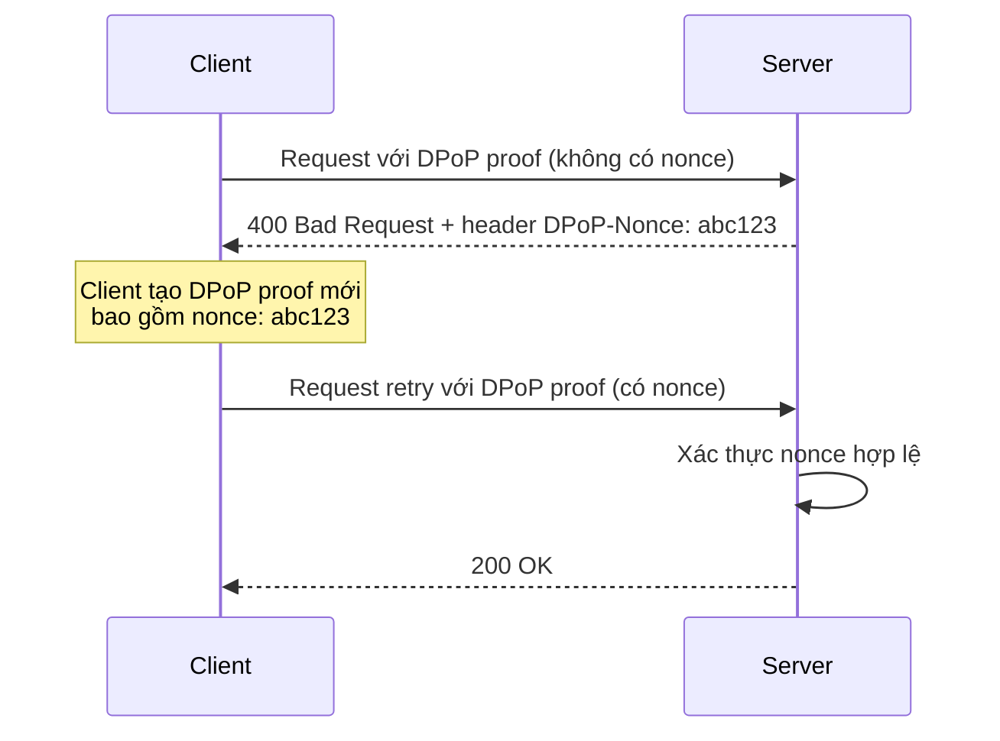
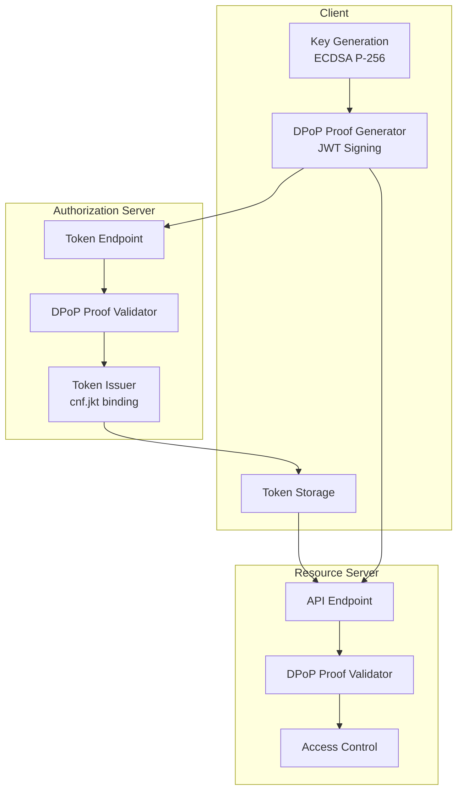
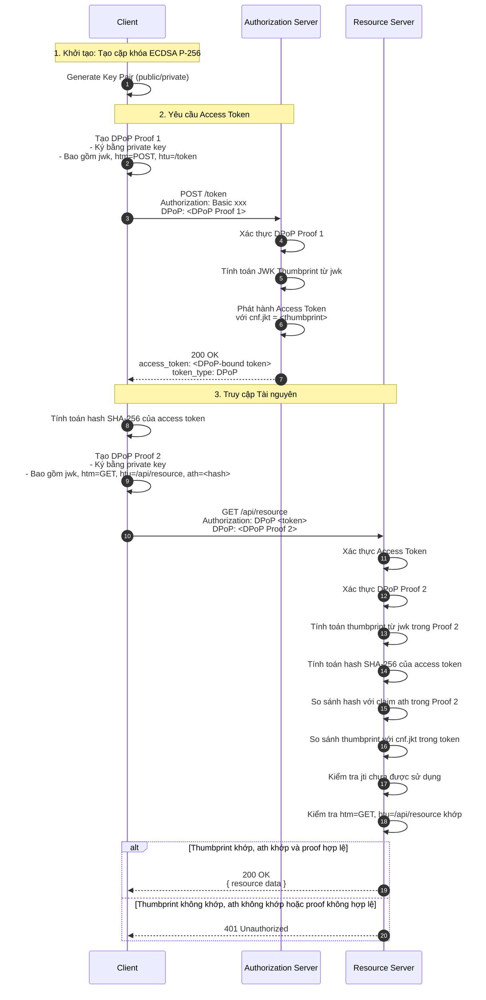
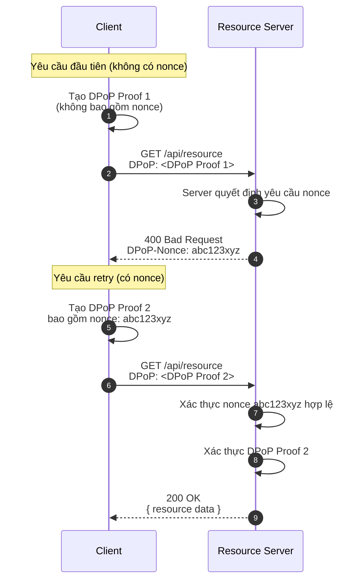
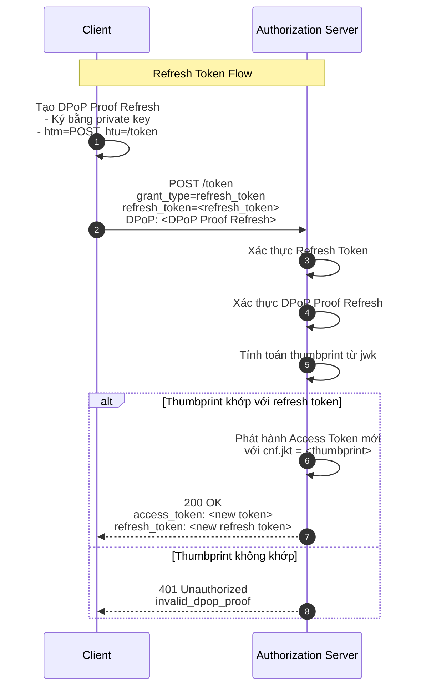

# DPoP (Demonstrating Proof-of-Possession) - RFC 9449

## Tóm tắt

Tài liệu này phân tích chi tiết giao thức DPoP (Demonstrating Proof-of-Possession) được định nghĩa trong RFC 9449. DPoP là một cơ chế bảo mật mở rộng cho OAuth 2.0, cho phép ràng buộc (sender-constrain) access token với một cặp khóa bất đối xứng của client, từ đó ngăn chặn việc sử dụng trái phép token bị đánh cắp hoặc bị lộ.

**Tham khảo chính thức:** RFC 9449 - OAuth 2.0 Demonstrating Proof of Possession (DPoP)

---

## 1. Nguyên lý Cốt lõi và Toán học

### 1.1. Khái niệm Proof-of-Possession

Proof-of-Possession (PoP) là một cơ chế xác thực yêu cầu người gửi chứng minh rằng họ sở hữu một khóa bí mật cụ thể (private key) tương ứng với khóa công khai (public key) đã được đăng ký hoặc ràng buộc với token.

Trong DPoP, cơ chế này hoạt động theo các nguyên tắc sau:

1. **Client tạo cặp khóa bất đối xứng:** Client sinh ra một cặp khóa public/private (thường sử dụng ECDSA P-256 hoặc RSA).

2. **Public key được gửi kèm DPoP proof:** Khi yêu cầu access token, client gửi một JWT gọi là DPoP proof, được ký bằng private key và chứa public key trong header.

3. **Access token được ràng buộc với public key:** Authorization Server (AS) tính toán JWK Thumbprint của public key và lưu nó trong access token dưới dạng claim `cnf.jkt`.

4. **Client phải chứng minh sở hữu private key:** Khi sử dụng access token, client phải gửi một DPoP proof mới được ký bằng cùng private key đó.

### 1.2. Cấu trúc DPoP Proof JWT

DPoP proof là một JWT (JSON Web Token) tuân theo cấu trúc JWS (JSON Web Signature) với các đặc điểm sau:

#### 1.2.1. JWT Header

Header của DPoP proof JWT bắt buộc chứa các tham số sau:

```json
{
  "typ": "dpop+jwt",
  "alg": "ES256",
  "jwk": {
    "kty": "EC",
    "crv": "P-256",
    "x": "WKn-ZIGevcwGIyyrzFoZNBdaq9_TsqzGl96oc0CWuis",
    "y": "y77t-RvAHRKTsSGdIYUfweuOvwrvDD-Q3Hv5J0fSKbE"
  }
}
```

**Giải thích các trường:**

| Trường | Giá trị | Mô tả |
|--------|---------|--------|
| `typ` | `"dpop+jwt"` | Xác định loại JWT là DPoP proof |
| `alg` | `"ES256"` (hoặc `RS256`, `PS256`) | Thuật toán ký số được sử dụng |
| `jwk` | JWK object | Public key tương ứng với private key dùng để ký |

**Lưu ý:** Header KHÔNG được phép chứa trường `kid` (Key ID) vì public key đã được nhúng trực tiếp trong trường `jwk`.

#### 1.2.2. JWT Payload

Payload của DPoP proof bắt buộc chứa các claims sau:

```json
{
  "jti": "k4hG7g8p9q0r1s2t3u4v5w6x7y8z9A0B1C2D3E4",
  "htm": "POST",
  "htu": "https://auth.example.com/token",
  "iat": 1704067200,
  "nonce": "a1b2c3d4e5f6g7h8i9j0k1l2m3n4o5p6"
}
```

**Giải thích các trường:**

| Trường | Giá trị | Mô tả |
|--------|---------|--------|
| `jti` | UUID string | JWT ID - định danh duy nhất cho proof |
| `htm` | HTTP method (GET, POST, PUT, DELETE...) | Phương thức HTTP của request |
| `htu` | URL string | URI mục tiêu của request |
| `iat` | NumericDate | Thời điểm phát hành proof (Unix timestamp) |
| `nonce` | string (tùy chọn) | Giá trị nonce do server cung cấp |
| `ath` | string (tùy chọn khi truy cập tài nguyên) | Access Token Hash - hash SHA-256 của access token |

**Lưu ý về ATH Claim:**

Khi client sử dụng DPoP-bound access token để truy cập tài nguyên được bảo vệ, DPoP proof PHẢI bao gồm claim `ath` (Access Token Hash). Claim này chứa giá trị băm SHA-256 của access token được mã hóa Base64URL.

```json
{
  "jti": "k4hG7g8p9q0r1s2t3u4v5w6x7y8z9A0B1C2D3E4",
  "htm": "GET",
  "htu": "https://api.example.com/resource",
  "iat": 1704067200,
  "ath": "aB3cD4eF5gH6iJ7kL8mN9oP0qR1sT2uV3wX4yZ5"
}
```

**Tính toán ATH Claim:**

```javascript
// Tính toán SHA-256 hash của access token
async function calculateAccessTokenHash(accessToken) {
  const encoder = new TextEncoder();
  const data = encoder.encode(accessToken);
  const hashBuffer = await crypto.subtle.digest('SHA-256', data);
  const hashArray = Array.from(new Uint8Array(hashBuffer));
  const hashBase64 = btoa(String.fromCharCode.apply(null, hashArray));
  // Chuyển đổi sang Base64URL
  return hashBase64.replace(/\+/g, '-').replace(/\//g, '_').replace(/=+$/, '');
}
```

**Mục đích của ATH Claim:**

Claim `ath` ràng buộc DPoP proof với một access token cụ thể, ngăn chặn việc sử dụng cùng một DPoP proof cho nhiều access token khác nhau. Điều này đặc biệt quan trọng trong các trường hợp:

1. **Token Injection:** Attacker không thể chèn DPoP proof của token A vào request sử dụng token B.
2. **Token Replay:** Attacker không thể tái sử dụng DPoP proof sau khi access token đã hết hạn hoặc bị thu hồi.
3. **Proof Binding:** Mỗi DPoP proof chỉ hợp lệ cho đúng một access token cụ thể.

### 1.3. JWK Thumbprint (RFC 7638)

JWK Thumbprint là một giá trị băm (hash) đại diện cho public key, được tính toán theo RFC 7638. Đây là cơ chế cốt lõi để ràng buộc access token với public key của client.

#### 1.3.1. Thuật toán tính toán

JWK Thumbprint được tính toán theo các bước sau:

1. **Tạo JWK object:** Chỉ giữ lại các trường bắt buộc của public key, loại bỏ các trường tùy chọn.

2. **Canonicalize JSON:** Sắp xếp các trường theo thứ tự bảng chữ cái và loại bỏ khoảng trắng không cần thiết.

3. **Tính toán SHA-256:** Băm chuỗi JSON đã canonicalize bằng thuật toán SHA-256.

4. **Base64URL encode:** Mã hóa kết quả băm sang Base64URL.

#### 1.3.2. Ví dụ tính toán

Giả sử public key ECDSA P-256:

```json
{
  "kty": "EC",
  "crv": "P-256",
  "x": "WKn-ZIGevcwGIyyrzFoZNBdaq9_TsqzGl96oc0CWuis",
  "y": "y77t-RvAHRKTsSGdIYUfweuOvwrvDD-Q3Hv5J0fSKbE"
}
```

Sau khi canonicalize và băm SHA-256, ta được thumbprint:

```
H3FAnEgNeDnFbLWHh3cR3B63wI2U0hm0ZTuIV_8I8EU
```

### 1.4. Ràng buộc Access Token với Public Key

Access token được ràng buộc với public key thông qua claim `cnf` (confirmation) trong payload:

```json
{
  "sub": "user123",
  "aud": "https://api.example.com",
  "iss": "https://auth.example.com",
  "exp": 1704070800,
  "iat": 1704067200,
  "cnf": {
    "jkt": "H3FAnEgNeDnFbLWHh3cR3B63wI2U0hm0ZTuIV_8I8EU"
  }
}
```

**Cơ chế ràng buộc:**

1. **Tại Authorization Server:** Khi client gửi DPoP proof kèm request token, AS trích xuất `jwk` từ header, tính toán JWK Thumbprint, và lưu vào claim `cnf.jkt` của access token.

2. **Tại Resource Server:** Khi client gửi request với access token và DPoP proof mới, RS:
   - Trích xuất `jkt` từ `cnf.jkt` trong access token
   - Tính toán thumbprint từ `jwk` trong DPoP proof
   - So sánh hai giá trị thumbprint

Nếu hai thumbprint khớp nhau, RS có thể xác nhận rằng client đang sở hữu private key tương ứng với public key mà access token đã được ràng buộc tới.

### 1.5. ATH Claim và Ràng buộc DPoP Proof với Access Token

ATH Claim (Access Token Hash) là một cơ chế bổ sung quan trọng trong DPoP, giúp ràng buộc DPoP proof với một access token cụ thể, ngăn chặn việc sử dụng cùng một proof cho nhiều token khác nhau.

#### 1.5.1. Cơ chế hoạt động

Khi client sử dụng DPoP-bound access token để truy cập tài nguyên được bảo vệ, quy trình như sau:

1. **Client tạo DPoP proof:** Client tạo DPoP proof bao gồm claim `ath` chứa hash SHA-256 của access token.

2. **Client gửi request:** Client gửi request với:
   - `Authorization: DPoP <access_token>` header
   - `DPoP: <dpop_proof>` header

3. **Resource Server xác thực:** RS thực hiện các bước:
   - Xác thực access token (signature, expiration, v.v.)
   - Xác thực DPoP proof (signature, htm, htu, iat, jti)
   - Tính toán hash SHA-256 của access token nhận được
   - So sánh hash này với claim `ath` trong DPoP proof

Nếu hash khớp nhau, RS có thể xác nhận rằng DPoP proof được tạo đặc biệt cho access token này.

#### 1.5.2. Ví dụ Payload với ATH Claim

```json
{
  "jti": "k4hG7g8p9q0r1s2t3u4v5w6x7y8z9A0B1C2D3E4",
  "htm": "GET",
  "htu": "https://api.example.com/resource",
  "iat": 1704067200,
  "ath": "aB3cD4eF5gH6iJ7kL8mN9oP0qR1sT2uV3wX4yZ5"
}
```

#### 1.5.3. Tính toán ATH Claim

**JavaScript:**

```javascript
async function calculateAccessTokenHash(accessToken) {
  const encoder = new TextEncoder();
  const data = encoder.encode(accessToken);
  const hashBuffer = await crypto.subtle.digest('SHA-256', data);
  const hashArray = Array.from(new Uint8Array(hashBuffer));
  const hashBase64 = btoa(String.fromCharCode.apply(null, hashArray));
  // Chuyển đổi sang Base64URL
  return hashBase64.replace(/\+/g, '-').replace(/\//g, '_').replace(/=+$/, '');
}

// Sử dụng trong DPoP proof
const accessToken = "eyJhbGciOiJIUzI1NiIsInR5cCI6IkpXVCJ9...";
const ath = await calculateAccessTokenHash(accessToken);

const payload = {
  jti: crypto.randomUUID(),
  htm: "GET",
  htu: "https://api.example.com/resource",
  iat: Math.floor(Date.now() / 1000),
  ath: ath
};
```

**C#:**

```csharp
public static string CalculateAccessTokenHash(string accessToken)
{
    using var sha256 = SHA256.Create())
    {
        var bytes = Encoding.UTF8.GetBytes(accessToken);
        var hash = sha256.ComputeHash(bytes);
        return Base64UrlEncode(hash);
    }
}

private static string Base64UrlEncode(byte[] input)
{
    return Convert.ToBase64String(input)
        .Replace('+', '-')
        .Replace('/', '_')
        .TrimEnd('=');
}
```

#### 1.5.4. Xác thực ATH Claim tại Resource Server

**C#:**

```csharp
public class DPoPProofValidator
{
    public async Task<DPoPValidationResult> ValidateAsync(
        string dpopProof,
        string accessToken,
        string httpMethod,
        string requestUri)
    {
        // Parse JWT
        var jwt = new JwtSecurityTokenHandler().ReadJwtToken(dpopProof);
        
        // Validate signature
        var jwk = jwt.Header["jwk"] as JObject;
        var publicKey = ExtractPublicKeyFromJwk(jwk);
        var isValidSignature = await ValidateSignatureAsync(dpopProof, publicKey);
        
        if (!isValidSignature)
        {
            return DPoPValidationResult.Invalid("Invalid signature");
        }
        
        // Validate claims
        var htm = jwt.Payload["htm"]?.ToString();
        var htu = jwt.Payload["htu"]?.ToString();
        var iat = long.Parse(jwt.Payload["iat"]?.ToString());
        var ath = jwt.Payload["ath"]?.ToString();
        
        if (htm != httpMethod || htu != requestUri)
        {
            return DPoPValidationResult.Invalid("htm or htu mismatch");
        }
        
        var now = DateTimeOffset.UtcNow.ToUnixTimeSeconds();
        if (Math.Abs(now - iat) > 30)
        {
            return DPoPValidationResult.Invalid("iat too old");
        }
        
        // Validate ATH claim
        if (!string.IsNullOrEmpty(ath))
        {
            var expectedAth = CalculateAccessTokenHash(accessToken);
            if (ath != expectedAth)
            {
                return DPoPValidationResult.Invalid("ath mismatch");
            }
        }
        
        // Calculate JWK thumbprint
        var thumbprint = CalculateJwkThumbprint(jwk);
        
        return DPoPValidationResult.Valid(thumbprint);
    }
}
```

#### 1.5.5. Tầm quan trọng của ATH Claim

ATH Claim cung cấp một lớp bảo mật bổ sung quan trọng:

1. **Ngăn chặn Token Injection:** Attacker không thể chèn DPoP proof của token A vào request sử dụng token B vì `ath` sẽ không khớp.

2. **Ngăn chặn Proof Reuse:** Attacker không thể tái sử dụng DPoP proof sau khi access token đã hết hạn hoặc bị thu hồi.

3. **Ràng buộc chặt chẽ hơn:** Mỗi DPoP proof chỉ hợp lệ cho đúng một access token cụ thể, không thể sử dụng cho bất kỳ token nào khác.

4. **Phát hiện tấn công sớm:** Nếu attacker cố gắng sử dụng proof cho token khác, RS sẽ phát hiện ngay lập tức thông qua `ath` mismatch.

```json
{
  "sub": "user123",
  "aud": "https://api.example.com",
  "iss": "https://auth.example.com",
  "exp": 1704070800,
  "iat": 1704067200,
  "cnf": {
    "jkt": "H3FAnEgNeDnFbLWHh3cR3B63wI2U0hm0ZTuIV_8I8EU"
  }
}
```

**Cơ chế ràng buộc:**

1. **Tại Authorization Server:** Khi client gửi DPoP proof kèm request token, AS trích xuất `jwk` từ header, tính toán JWK Thumbprint, và lưu vào claim `cnf.jkt` của access token.

2. **Tại Resource Server:** Khi client gửi request với access token và DPoP proof mới, RS:
   - Trích xuất `jkt` từ `cnf.jkt` trong access token
   - Tính toán thumbprint từ `jwk` trong DPoP proof
   - So sánh hai giá trị thumbprint

Nếu hai thumbprint khớp nhau, RS có thể xác nhận rằng client đang sở hữu private key tương ứng với public key mà access token đã được ràng buộc tới.

---

## 2. Phân tích Bảo mật

### 2.1. So sánh DPoP và Bearer Token Truyền thống

| Đặc điểm | Bearer Token | DPoP + DPoP Proof |
|----------|--------------|-------------------|
| **Ràng buộc với Client** | KHÔNG | CÓ |
| **Ngăn chặn Replay Attack** | KHÔNG | CÓ (qua jti, htm, htu, nonce) |
| **Yêu cầu TLS Client Cert** | KHÔNG | KHÔNG |
| **Hoạt động với SPA/Mobile** | CÓ (nhưng kém bảo mật) | CÓ |
| **Phức tạp triển khai** | Thấp | Trung bình |
| **Hiệu năng** | Cao | Trung bình (do tính toán ký số) |

### 2.2. Các Tấn công được Ngăn chặn

#### 2.2.1. Token Theft (Đánh cắp Token)

**Vấn đề với Bearer Token:**

Trong mô hình Bearer Token truyền thống, bất kỳ ai sở hữu token đều có thể sử dụng nó để truy cập tài nguyên. Nếu token bị lộ thông qua:

- Log server
- Công cụ giám sát
- Thành phần mạng trung gian
- XSS trong browser

Attacker có thể sử dụng token đó để giả danh client.

**Cách DPoP ngăn chặn:**

Với DPoP, attacker chỉ có token là KHÔNG ĐỦ. Để sử dụng token, attacker cần:

1. **Private key tương ứng:** Token được ràng buộc với một public key cụ thể thông qua `cnf.jkt`. Attacker cần private key tương ứng để tạo DPoP proof hợp lệ.

2. **DPoP proof hợp lệ:** Mỗi request yêu cầu một DPoP proof mới được ký bằng private key đó, với các claims `htm`, `htu`, `jti` khớp với request hiện tại.

Do đó, ngay cả khi token bị lộ, attacker không thể sử dụng nó nếu không có private key.

#### 2.2.2. Replay Attack

**Vấn đề với Bearer Token:**

Attacker có thể chặn và "replay" (phát lại) request hợp lệ, bao gồm cả token và các header khác.

**Cách DPoP ngăn chặn:**

DPoP ngăn chặn replay attack qua nhiều lớp:

1. **JTI (JWT ID):** Mỗi DPoP proof có một `jti` duy nhất. Server có thể lưu trữ các `jti` đã sử dụng và từ chối các request trùng lặp.

2. **HTM + HTU Binding:** DPoP proof được ràng buộc với HTTP method (`htm`) và URI (`htu`) cụ thể. Attacker không thể sử dụng proof của request GET cho request POST, hoặc proof của `/api/users` cho `/api/admin`.

3. **IAT (Issued At):** Server chỉ chấp nhận DPoP proof được phát hành gần đây (thường trong vòng 30-60 giây), giới hạn thời gian attacker có thể replay.

4. **Server Nonce (tùy chọn):** Server có thể yêu cầu client bao gồm một `nonce` do server tạo ra trong DPoP proof. Nonce này chỉ hợp lệ trong một khoảng thời gian ngắn và không thể dự đoán trước.

#### 2.2.3. Token Injection

**Vấn đề với Bearer Token:**

Attacker có thể chèn token của user A vào request của user B (hoặc ngược lại) nếu có quyền truy cập token.

**Cách DPoP ngăn chặn:**

DPoP proof được ràng buộc với cả access token VÀ request cụ thể:

- **HTM + HTU binding:** Proof chỉ hợp lệ cho request có method và URI khớp.
- **JTI uniqueness:** Mỗi proof chỉ được sử dụng một lần.
- **ATH claim binding:** Proof được ràng buộc với access token cụ thể thông qua claim `ath`.

Do đó, attacker không thể chèn proof của request này vào request khác.

#### 2.2.4. ATH Claim và Ngăn chặn Token Injection

**Vấn đề với DPoP không có ATH:**

Trong phiên bản đầu tiên của DPoP (không có claim `ath`), một lỗ hổng tiềm năng tồn tại:

1. Attacker có thể chặn DPoP proof của user A
2. Attacker có thể sử dụng proof này với access token của user B
3. Nếu `cnf.jkt` của cả token khớp nhau (cùng public key), attacker có thể giả danh thành công

**Cách ATH Claim ngăn chặn:**

Claim `ath` (Access Token Hash) giải quyết vấn đề này bằng cách:

1. **Ràng buộc proof với token cụ thể:** Mỗi DPoP proof bao gồm hash SHA-256 của access token cụ thể.
2. **Xác thực hash khớp:** Resource Server tính toán hash của access token nhận được và so sánh với claim `ath`.
3. **Ngăn chặn cross-token reuse:** Attacker không thể sử dụng proof của token A cho token B vì hash sẽ không khớp.

**Ví dụ tấn công:**

Giả sử attacker có:
- Access token của user A: `token_A = "eyJhbGciOiJIUzI1NiIsInR5cCI6IkpXVCJ9..."`
- Access token của user B: `token_B = "eyJhbGciOiJSUzI1NiIsInR5cCI6IkpXVCJ9..."`
- Cả hai token đều ràng buộc với cùng public key (cùng `cnf.jkt`)

**Không có ATH:**
```
Attacker chặn DPoP proof của user A:
proof_A = { jwk: <public_key>, htm: "GET", htu: "/api/resource", jti: "uuid-1" }

Attacker sử dụng proof_A với token_B:
GET /api/resource
Authorization: DPoP token_B
DPoP: proof_A

Resource Server:
- Xác thực cnf.jkt khớp (cùng public key)
- Xác thực proof hợp lệ
- Cho phép truy cập (LỖ HỖNG!)
```

**Có ATH:**
```
Client A tạo DPoP proof:
proof_A = {
  jwk: <public_key>,
  htm: "GET",
  htu: "/api/resource",
  jti: "uuid-1",
  ath: SHA256(token_A) = "hash_A"
}

Client B tạo DPoP proof:
proof_B = {
  jwk: <public_key>,
  htm: "GET",
  htu: "/api/resource",
  jti: "uuid-2",
  ath: SHA256(token_B) = "hash_B"
}

Attacker cố gắng sử dụng proof_A với token_B:
GET /api/resource
Authorization: DPoP token_B
DPoP: proof_A

Resource Server:
- Xác thực cnf.jkt khớp (cùng public key)
- Tính toán SHA256(token_B) = "hash_B"
- So sánh với proof_A.ath = "hash_A"
- hash_B != hash_A
- Từ chối request (BẢO MẬT!)
```

**Tầm quan trọng của ATH Claim:**

ATH Claim đặc biệt quan trọng trong các trường hợp:

1. **Multi-tenant applications:** Nhiều client có thể có token khác nhau nhưng cùng public key.
2. **Token rotation:** Khi token được làm mới, proof cũ không thể tái sử dụng.
3. **Token revocation:** Khi token bị thu hồi, proof tương ứng cũng không còn hợp lệ.
4. **Cross-user attacks:** Ngăn chặn việc sử dụng proof của user này cho token của user khác.

### 2.3. Cơ chế dpop_nonce và Sự Quan trọng Sống còn

#### 2.3.1. Vấn đề với XSS và Future Proofs

Trong môi trường browser (SPA), attacker có thể thực thi mã độc hại thông qua XSS. Attacker này có thể:

1. Tạo DPoP proofs với `iat` (issued at) trong tương lai
2. Xuất khẩu (exfiltrate) proofs này kèm access token
3. Sử dụng chúng sau khi session chính thức đã kết thúc

#### 2.3.2. Cơ chế dpop_nonce

Để ngăn chặn vấn đề trên, RFC 9449 định nghĩa cơ chế `dpop_nonce`:

1. **Server tạo nonce:** Khi nhận request, server có thể trả về header `DPoP-Nonce` với một giá trị nonce ngẫu nhiên.

2. **Client bao gồm nonce:** Client phải bao gồm nonce này trong DPoP proof của request tiếp theo.

3. **Nonce có thời hạn:** Server chỉ chấp nhận nonce trong một khoảng thời gian ngắn (ví dụ: 30 giây).

4. **Nonce không thể dự đoán:** Nonce được tạo ngẫu nhiên và không thể dự đoán trước bởi attacker.

#### 2.3.3. Luồng xử lý với Nonce



**Các bước xác thực nonce:**

1. Server kiểm tra xem nonce có nằm trong danh sách nonce hợp lệ không
2. Server kiểm tra xem nonce đã được sử dụng chưa (để ngăn replay)
3. Server kiểm tra xem nonce có còn thời hạn không

### 2.4. Các Lỗ hổng Tiềm năng và Giải pháp

#### 2.4.1. Lỗ hổng: Private Key Storage

**Vấn đề:** Nếu private key bị lộ, attacker có thể tạo DPoP proof hợp lệ.

**Giải pháp:**
- Sử dụng secure storage (Keychain, Keystore, Secure Enclave)
- Không lưu private key trong localStorage/sessionStorage của browser
- Sử dụng Web Crypto API với non-extractable keys

#### 2.4.2. Lỗ hổng: Clock Skew

**Vấn đề:** Đồng hồ của client và server không đồng bộ, khiến `iat` bị từ chối.

**Giải pháp:**
- Server chấp nhận DPoP proof với `iat` trong khoảng thời gian chấp nhận được (ví dụ: +/- 30 giây)
- Sử dụng NTP để đồng bộ đồng hồ

#### 2.4.3. Lỗ hổng: JTI Replay Detection

**Vấn đề:** Server cần lưu trữ các `jti` đã sử dụng để phát hiện replay, nhưng điều này có thể gây vấn đề về bộ nhớ.

**Giải pháp:**
- Sử dụng Redis hoặc cache phân tán với TTL (Time To Live)
- Chỉ lưu trữ `jti` trong khoảng thời gian ngắn (ví dụ: 60 giây)
- Sử dụng Bloom filter để phát hiện replay nhanh (nhưng có thể có false positive)

---

## 3. Kiến trúc Thành phần

### 3.1. Tổng quan Kiến trúc



### 3.2. Client

#### 3.2.1. Vai trò và Trách nhiệm

| Nhiệm vụ | Mô tả |
|----------|---------|
| **Tạo cặp khóa** | Sinh ra cặp khóa public/private bất đối xứng (ECDSA P-256 khuyến nghị) |
| **Lưu trữ private key** | Lưu trữ private key an toàn trong secure storage |
| **Tạo DPoP proof** | Tạo JWT DPoP proof cho mỗi request |
| **Ký DPoP proof** | Ký proof bằng private key |
| **Gửi request** | Gửi access token và DPoP proof trong header |

#### 3.2.2. Thay đổi cần thiết

1. **Tích hợp thư viện DPoP:** Sử dụng thư viện hỗ trợ DPoP hoặc tự triển khai logic tạo và ký JWT.

2. **Secure Key Storage:**
   - Mobile: Keychain (iOS), Keystore (Android)
   - Browser: Web Crypto API với `extractable: false`
   - Desktop: Secure storage của hệ điều hành

3. **Error Handling:** Xử lý các lỗi DPoP như:
   - `use_dpop_nonce`: Server yêu cầu nonce
   - `invalid_dpop_proof`: Proof không hợp lệ

#### 3.2.3. Ví dụ Code (JavaScript)

```javascript
// Tạo cặp khóa ECDSA P-256
const keyPair = await window.crypto.subtle.generateKey(
  {
    name: "ECDSA",
    namedCurve: "P-256"
  },
  true,
  ["sign"]
);

// Lưu private key (non-extractable)
const privateKey = keyPair.privateKey;

// Tạo DPoP proof
async function createDPoPProof(htm, htu, nonce = null) {
  const jwk = await window.crypto.subtle.exportKey("jwk", keyPair.publicKey);
  
  const header = {
    typ: "dpop+jwt",
    alg: "ES256",
    jwk: jwk
  };
  
  const payload = {
    jti: crypto.randomUUID(),
    htm: htm,
    htu: htu,
    iat: Math.floor(Date.now() / 1000),
    ...(nonce && { nonce: nonce })
  };
  
  // Ký JWT
  const signature = await window.crypto.subtle.sign(
    {
      name: "ECDSA",
      hash: { name: "SHA-256" }
    },
    privateKey,
    encodeJWT(`${base64url(JSON.stringify(header))}.${base64url(JSON.stringify(payload))}`)
  );
  
  return `${base64url(JSON.stringify(header))}.${base64url(JSON.stringify(payload))}.${base64url(signature)}`;
}
```

### 3.3. Authorization Server (AS)

#### 3.3.1. Vai trò và Trách nhiệm

| Nhiệm vụ | Mô tả |
|----------|---------|
| **Nhận token request** | Nhận request đến `/token` endpoint |
| **Xác thực DPoP proof** | Xác thực signature và các claims của DPoP proof |
| **Tính toán JWK Thumbprint** | Tính toán thumbprint từ `jwk` trong DPoP proof |
| **Phát hành access token** | Phát hành access token với claim `cnf.jkt` |
| **Quản lý nonce** | (Tùy chọn) Tạo và quản lý nonce cho DPoP |

#### 3.3.2. Thay đổi cần thiết

1. **Xác thực DPoP proof:**
   - Xác thực signature bằng public key từ `jwk`
   - Kiểm tra `htm`, `htu` khớp với request
   - Kiểm tra `iat` trong khoảng thời gian chấp nhận
   - (Tùy chọn) Kiểm tra `nonce` nếu có

2. **Tính toán JWK Thumbprint:**
   - Trích xuất `jwk` từ DPoP proof header
   - Canonicalize JWK object
   - Tính toán SHA-256 hash
   - Base64URL encode

3. **Phát hành token:**
   - Thêm claim `cnf.jkt` vào access token
   - Đặt `token_type` thành `DPoP`

#### 3.3.3. Ví dụ Code (C#)

```csharp
public class DPoPProofValidator
{
    public async Task<DPoPValidationResult> ValidateAsync(
        string dpopProof, 
        string httpMethod, 
        string requestUri)
    {
        // Parse JWT
        var jwt = new JwtSecurityTokenHandler().ReadJwtToken(dpopProof);
        
        // Validate signature
        var jwk = jwt.Header["jwk"] as JObject;
        var publicKey = ExtractPublicKeyFromJwk(jwk);
        var isValidSignature = await ValidateSignatureAsync(dpopProof, publicKey);
        
        if (!isValidSignature)
        {
            return DPoPValidationResult.Invalid("Invalid signature");
        }
        
        // Validate claims
        var htm = jwt.Payload["htm"]?.ToString();
        var htu = jwt.Payload["htu"]?.ToString();
        var iat = long.Parse(jwt.Payload["iat"]?.ToString());
        
        if (htm != httpMethod || htu != requestUri)
        {
            return DPoPValidationResult.Invalid("htm or htu mismatch");
        }
        
        var now = DateTimeOffset.UtcNow.ToUnixTimeSeconds();
        if (Math.Abs(now - iat) > 30)
        {
            return DPoPValidationResult.Invalid("iat too old");
        }
        
        // Calculate JWK thumbprint
        var thumbprint = CalculateJwkThumbprint(jwk);
        
        return DPoPValidationResult.Valid(thumbprint);
    }
    
    private string CalculateJwkThumbprint(JObject jwk)
    {
        // Canonicalize JWK
        var canonical = new JObject
        {
            ["kty"] = jwk["kty"],
            ["crv"] = jwk["crv"],
            ["x"] = jwk["x"],
            ["y"] = jwk["y"]
        };
        
        var canonicalJson = canonical.ToString(Formatting.None);
        var hash = SHA256.HashData(Encoding.UTF8.GetBytes(canonicalJson));
        return Base64UrlEncode(hash);
    }
}
```

### 3.4. Resource Server (RS)

#### 3.4.1. Vai trò và Trách nhiệm

| Nhiệm vụ | Mô tả |
|----------|---------|
| **Nhận API request** | Nhận request với Authorization header |
| **Xác thực access token** | Xác thực access token (signature, expiration, v.v.) |
| **Xác thực DPoP proof** | Xác thực DPoP proof đi kèm |
| **So sánh thumbprint** | So sánh `jkt` trong token với thumbprint từ proof |
| **Kiểm tra replay** | Kiểm tra `jti`, `htm`, `htu` để phát hiện replay |
| **Quản lý nonce** | (Tùy chọn) Tạo và quản lý nonce cho DPoP |

#### 3.4.2. Thay đổi cần thiết

1. **Xác thực request:**
   - Trích xuất access token từ `Authorization: DPoP <token>` header
   - Trích xuất DPoP proof từ `DPoP` header
   - Xác thực cả token và proof

2. **So sánh thumbprint:**
   - Trích xuất `cnf.jkt` từ access token
   - Tính toán thumbprint từ `jwk` trong DPoP proof
   - So sánh hai giá trị

3. **Kiểm tra replay:**
   - Kiểm tra `jti` chưa được sử dụng
   - Kiểm tra `htm`, `htu` khớp với request
   - (Tùy chọn) Kiểm tra `nonce` nếu có

#### 3.4.3. Ví dụ Code (C#)

```csharp
public class DPoPAuthorizationMiddleware
{
    private readonly ITokenValidator _tokenValidator;
    private readonly IDPoPProofValidator _dpopValidator;
    private readonly IReplayCache _replayCache;
    
    public async Task InvokeAsync(HttpContext context)
    {
        // Extract headers
        var authHeader = context.Request.Headers["Authorization"].FirstOrDefault();
        var dpopHeader = context.Request.Headers["DPoP"].FirstOrDefault();
        
        if (authHeader == null || dpopHeader == null)
        {
            context.Response.StatusCode = 401;
            return;
        }
        
        // Parse Authorization header
        if (!authHeader.StartsWith("DPoP "))
        {
            context.Response.StatusCode = 401;
            return;
        }
        
        var accessToken = authHeader.Substring(5);
        
        // Validate access token
        var tokenValidation = await _tokenValidator.ValidateAsync(accessToken);
        if (!tokenValidation.IsValid)
        {
            context.Response.StatusCode = 401;
            return;
        }
        
        // Check for cnf.jkt claim
        if (!tokenValidation.Claims.ContainsKey("cnf"))
        {
            context.Response.StatusCode = 401;
            return;
        }
        
        var cnf = tokenValidation.Claims["cnf"] as JObject;
        var expectedJkt = cnf["jkt"]?.ToString();
        
        if (string.IsNullOrEmpty(expectedJkt))
        {
            context.Response.StatusCode = 401;
            return;
        }
        
        // Validate DPoP proof
        var dpopValidation = await _dpopValidator.ValidateAsync(
            dpopHeader,
            context.Request.Method,
            context.Request.Path.ToString()
        );
        
        if (!dpopValidation.IsValid)
        {
            context.Response.StatusCode = 401;
            return;
        }
        
        // Compare thumbprints
        if (dpopValidation.Thumbprint != expectedJkt)
        {
            context.Response.StatusCode = 401;
            return;
        }
        
        // Check replay
        if (await _replayCache.IsReplayAsync(dpopValidation.Jti))
        {
            context.Response.StatusCode = 401;
            return;
        }
        
        // Store JTI in replay cache
        await _replayCache.StoreAsync(dpopValidation.Jti, TimeSpan.FromMinutes(1));
        
        // Continue to next middleware
        await _next(context);
    }
}
```

---

## 4. Trực quan hóa Luồng hoạt động

### 4.1. Biểu đồ Trình tự Hoàn chỉnh



### 4.2. Luồng với Server Nonce



### 4.3. Luồng Refresh Token với DPoP



---

## 5. Các RFC và Tiêu chuẩn Liên quan

| RFC/Tiêu chuẩn | Mô tả |
|---------------|---------|
| **RFC 9449** | OAuth 2.0 Demonstrating Proof-of-Possession (DPoP) |
| **RFC 7638** | JSON Web Key (JWK) Thumbprint |
| **RFC 7519** | JSON Web Token (JWT) |
| **RFC 7515** | JSON Web Signature (JWS) |
| **RFC 6750** | OAuth 2.0 Bearer Token Usage |
| **RFC 6749** | The OAuth 2.0 Authorization Framework |
| **RFC 8414** | OAuth 2.0 Authorization Server Metadata |
| **FAPI 2.0** | Financial-grade API Security Profile (yêu cầu DPoP) |

---

## 6. Best Practices và Khuyến nghị

### 6.1. Khuyến nghị cho Client

1. **Sử dụng ECDSA P-256:** Ưu tiên ECDSA P-256 thay vì RSA vì hiệu năng tốt hơn và key size nhỏ hơn.

2. **Secure Key Storage:** Luôn lưu private key trong secure storage, không bao giờ lưu trong localStorage/sessionStorage.

3. **Tạo proof mới cho mỗi request:** Không tái sử dụng DPoP proof giữa các request khác nhau.

4. **Xử lý nonce:** Luôn kiểm tra và xử lý header `DPoP-Nonce` khi nhận response 400 với error `use_dpop_nonce`.

5. **Clock synchronization:** Đảm bảo đồng hồ của client đồng bộ với server.

### 6.2. Khuyến nghị cho Authorization Server

1. **Xác thực chặt chẽ:** Xác thực tất cả các claims của DPoP proof trước khi phát hành token.

2. **TTL cho nonce:** Đặt TTL ngắn cho nonce (ví dụ: 30-60 giây).

3. **Rate limiting:** Áp dụng rate limiting để ngăn chặn tấn công brute force vào DPoP proof.

4. **Logging:** Ghi log các thất bại xác thực DPoP để phát hiện tấn công.

### 6.3. Khuyến nghị cho Resource Server

1. **Replay detection:** Sử dụng cache phân tán (Redis) để lưu trữ các `jti` đã sử dụng.

2. **TTL cho replay cache:** Đặt TTL cho replay cache (ví dụ: 60 giây) để giới hạn bộ nhớ.

3. **Xác thực song song:** Xác thực cả access token và DPoP proof song song để tối ưu hiệu năng.

4. **Graceful degradation:** Nếu DPoP proof không hợp lệ, trả về error rõ ràng thay vì generic 401.

---

## 7. Tài liệu Tham khảo

1. **RFC 9449:** OAuth 2.0 Demonstrating Proof of Possession (DPoP) - https://www.rfc-editor.org/rfc/rfc9449.html

2. **RFC 7638:** JSON Web Key (JWK) Thumbprint - https://www.rfc-editor.org/rfc/rfc7638.html

3. **Auth0 Blog:** Protect Your Access Tokens with DPoP - https://auth0.com/blog/protect-your-access-tokens-with-dpop/

4. **Okta Documentation:** Configure OAuth 2.0 Demonstrating Proof-of-Possession - https://developer.okta.com/docs/guides/dpop/

5. **Curity.io:** Demonstrating Proof of Possession Overview - https://curity.io/resources/learn/dpop-overview/

6. **dpop.info:** Interactive DPoP Playground - https://dpop.info/

7. **FAPI 2.0 Security Profile:** https://openid.net/specs/fapi-2_0-security-02.html

---

## Phụ lục: Các Error Code của DPoP

| Error Code | Mô tả |
|------------|---------|
| `invalid_dpop_proof` | DPoP proof không hợp lệ (signature, claims, v.v.) |
| `use_dpop_nonce` | Server yêu cầu client bao gồm nonce trong DPoP proof |
| `invalid_dpop_nonce` | Nonce trong DPoP proof không hợp lệ |

---

*Tài liệu này được biên soạn dựa trên RFC 9449 và các tài liệu tham khảo chính thức. Cập nhật lần cuối: 2024.*
