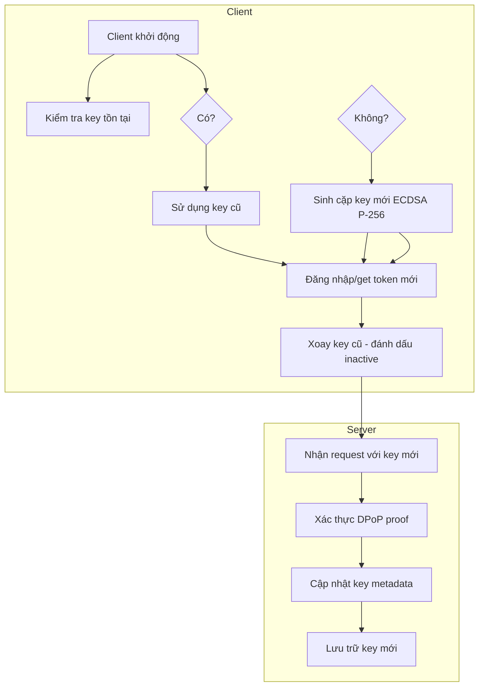
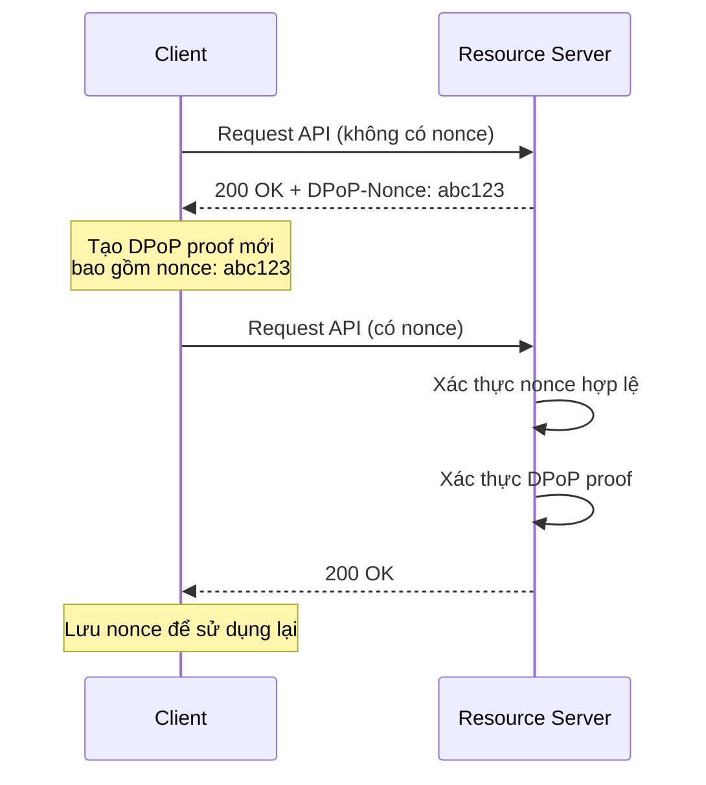
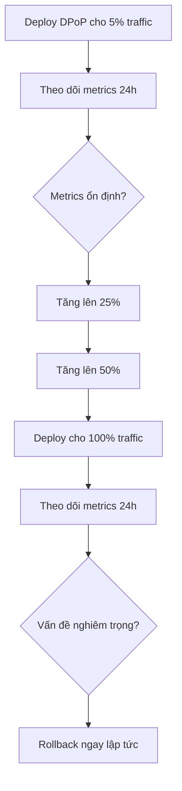
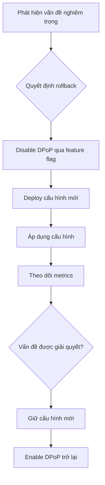

# Kế Hoạch Triển Khai DPoP (Demonstrating Proof-of-Possession)

## Tóm Tắt

Tài liệu này phác thảo kế hoạch triển khai chi tiết giao thức DPoP (RFC9449) vào hệ thống RetailStoreManagement hiện tại. Kế hoạch bao gồm đánh giá hiện trạng, chiến lược quản lý key, các giai đoạn triển khai, kế hoạch kiểm thử và chiến lược triển khai với giám sát.

---

## 1. Đánh Giá Hiện Trạng & Tiên Quyết

### 1.1. Tổng Quan Hệ Thống Hiện Tại

#### 1.1.1. Kiến Trúc Backend

Hệ thống RetailStoreManagement sử dụng kiến trúc Clean Architecture với các layer:

- **Domain Layer**: Chứa các entities và business logic
- **Application Layer**: Chứa các CQRS commands/queries và handlers
- **Infrastructure Layer**: Chứa database context và repositories
- **WebApi Layer**: ASP.NET Core Web API

#### 1.1.2. Cơ Chế Xác Thực Hiện Tại

Hệ thống hiện tại sử dụng **Custom JWT Authentication** với các đặc điểm:

- **Token Generation**: Custom token service trong `shiny-carnival/RetailStoreManagement/src/Infrastructure/Services/AuthService.cs`
- **Token Validation**: JWT Bearer authentication trong `shiny-carnival/RetailStoreManagement/src/WebApi/Controllers/AuthController.cs`
- **Token Storage**: Refresh tokens được lưu trong database qua `UserRefreshToken` entity

**Lưu ý quan trọng**: Hệ thống KHÔNG có Authorization Server riêng biệt theo chuẩn OAuth 2.0 (như Duende IdentityServer hay IdentityServer4). Thay vào đó, hệ thống sử dụng custom JWT implementation với access tokens được phát hành trực tiếp từ AuthController.

#### 1.1.3. Các API Hiện Tại

Các API endpoints hiện tại bao gồm:

- **AuthController**: Login, Logout, RefreshToken, SetupAdmin
- **Admin Controllers**: Categories, Customers, Inventory, Orders, Products, Promotions, Reports, Suppliers, Users
- **Public Controllers**: PublicCategories, PublicOrders

### 1.2. Tác Động Đến API Hiện Tại

Việc tích hợp DPoP sẽ ảnh hưởng đến:

1. **AuthController**: Cần cập nhật để phát hành DPoP-bound tokens
2. **WebApi Middleware**: Cần thêm middleware để xác thực DPoP proof
3. **Client (SPA React)**: Cần cập nhật để gửi DPoP proof với mọi request
4. **Database**: Cần lưu trữ thông tin về DPoP keys và thumbprints (tùy chọn)

### 1.3. Lựa Chọn Thư Viện/Middleware Hỗ Trợ

#### 1.3.1. Các Tùy Chọn Triển Khai

Có 3 tùy chọn chính để tích hợp DPoP:

| Tùy Chọn | Mô Tả | Ưu Điểm | Nhược Điểm |
|-----------|---------|----------|-------------|
| **Tùy chọn A** | Tự triển khai DPoP từ đầu, sử dụng thư viện .NET có sẵn (System.Security.Cryptography) | - Kiểm soát hoàn toàn về code<br>- Không phụ thuộc vào thư viện bên ngoài<br>- Tối ưu hóa cho kiến trúc hiện tại | - Cần viết nhiều code từ đầu<br>- Cần tự quản lý các vấn đề liên quan đến DPoP<br>- Tốn thời gian triển khai |
| **Tùy chọn B** | Sử dụng Duende.IdentityServer (phiên bản thương mại) hoặc IdentityServer4 | - Được hỗ trợ đầy đủ<br>- Có tài liệu chi tiết<br>- Cộng đồng hỗ trợ | - Chi phí license<br>- Có thể overkill cho nhu cầu hiện tại<br>- Phụ thuộc vào vendor |
| **Tùy chọn C** | Sử dụng thư viện mã nguồn mở (như OpenIddict) | - Miễn phí<br>- Cộng đồng hỗ trợ | - Cần tích hợp phức tạp<br>- Cần cấu hình và bảo trì thêm |

#### 1.3.2. Khuyến Nghị

Dựa trên phân tích, khuyến nghị sử dụng **Tùy chọn A (Tự triển khai)** vì:

1. Hệ thống hiện tại đã có custom JWT implementation
2. Kiến trúc Clean Architecture phù hợp để thêm các thành phần DPoP
3. Không yêu cầu tính năng phức tạp của Authorization Server đầy đủ
4. Có thể tối ưu hóa cho nhu cầu cụ thể của dự án
5. Tự kiểm soát code và không phụ thuộc vào bên ngoài

### 1.4. Yêu Cầu Về Tương Thích Ngược (Backward Compatibility)

Vì hệ thống hiện tại không có client legacy cần hỗ trợ, yêu cầu về tương thích ngược sẽ tập trung vào:

1. **Graceful Migration**: Hỗ trợ song song cả Bearer token và DPoP token trong giai đoạn chuyển đổi
2. **Feature Flag**: Sử dụng feature flag để bật/tắt DPoP cho từng client
3. **Client Detection**: Phát hiện client mới (có DPoP) và client cũ (không có DPoP)
4. **API Versioning**: Có thể sử dụng API versioning để hỗ trợ cả hai luồng

### 1.5. Cấu Trúc Database

Để hỗ trợ DPoP, cần xem xét các thay đổi database:

| Entity | Thay Đổi | Mô Tả |
|--------|-----------|---------|
| UserRefreshToken | Có thể thêm trường `DpoPKeyThumbprint` để lưu trữ JWK thumbprint của key hiện tại |
| UserEntity | Có thể thêm trường `DpoPKeyId` để lưu trữ ID của key hiện tại |
| (Tùy chọn) DPoPKeys | Thêm table mới để lưu trữ các DPoP keys đang hoạt động (để hỗ trợ key rotation) |

### 1.6. Các Tiên Quyết Kỹ Thuật

#### 1.6.1. Thuật Toán Ký Số

Khuyến nghị sử dụng:

- **ECDSA P-256**: Hiệu năng tốt hơn RSA, key size nhỏ hơn
- **ES256**: Thuật toán băm SHA-256 cho ký số

#### 1.6.2. Thuật Toán Tính Toán JWK Thumbprint

Theo RFC 7638, JWK Thumbprint được tính toán theo các bước:

1. Canonicalize JWK object (chỉ giữ các trường bắt buộc, sắp xếp alphabet)
2. Mã hóa chuỗi JSON sang UTF-8
3. Tính toán băm SHA-256
4. Mã hóa Base64URL

#### 1.6.3. Yêu Cầu Về Clock Skew

Server nên chấp nhận DPoP proof với `iat` trong khoảng thời gian chấp nhận được:

- **Khuyến nghị**: +/- 30 giây so với thời gian hiện tại
- **Cấu hình**: Có thể cấu hình linh hoạt trong appsettings

---

## 2. Chiến Lược Quản Lý Key

### 2.1. Phương Thức Sinh và Lưu Trữ Cặp Khóa JWK

#### 2.1.1. Tại Client (SPA React)

**Vị trí lưu trữ**:

| Vị trí | Ưu Điểm | Nhược Điểm |
|---------|----------|-------------|
| **Memory (RAM)** | - Không persist khi đóng tab<br>- Truy cập nhanh<br>- Không cần serialize/deserialize | - Mất key khi đóng tab<br>- Không thể chia sẻ giữa tabs<br>- Bảo mật kém hơn secure storage |
| **Session Storage** | - Persist qua session<br>- Truy cập nhanh<br>- Có thể serialize/deserialize | - Mất key khi hết session<br>- Có thể bị XSS tấn công |
| **IndexedDB** | - Persist trong browser<br>- Truy cập nhanh<br>- Async operations | - Phức tạp hơn<br>- Không hỗ trợ trên mọi browser |
| **Web Crypto API (Non-extractable)** | - Key không thể export<br>- Bảo mật cao nhất<br>- Tốt nhất cho SPA | - Phức tạp hơn<br>- Không persist khi reload page |

**Khuyến nghị**: Sử dụng **Web Crypto API với `extractable: false` cho SPA React.

**Quy trình sinh key**:

1. Khi ứng dụng khởi động, kiểm tra xem có key tồn tại trong session storage
2. Nếu không có, sinh cặp khóa mới ECDSA P-256
3. Lưu private key trong Web Crypto API (non-extractable)
4. Lưu public key (JWK format) trong memory để sử dụng cho việc tạo DPoP proof

**Quy trình rotation key**:

1. **Rotation theo thời gian**: Xoay key định kỳ (ví dụ: mỗi 24 giờ hoặc 7 ngày)
2. **Rotation theo sự kiện**: Xoay key khi có dấu hiệu bị lộ hoặc khi user đăng xuất
3. **Rotation khi refresh token**: Xoay key khi lấy access token mới

**Quy trình lưu trữ key metadata**:

```typescript
interface DPoPKeyMetadata {
  keyId: string;           // Unique ID của key
  jwkThumbprint: string;    // JWK thumbprint để match với cnf.jkt
  createdAt: number;        // Unix timestamp khi key được tạo
  expiresAt?: number;       // Unix timestamp khi key hết hạn
  lastUsedAt?: number;     // Unix timestamp lần cuối key được sử dụng
}
```

#### 2.1.2. Tại Resource Server (ASP.NET Core)

Resource Server không cần lưu trữ private key, chỉ cần:

- Xác thực DPoP proof từ header
- So sánh `jkt` trong access token với thumbprint từ DPoP proof
- Kiểm tra replay attack (qua `jti`, `htm`, `htu`, `iat`)
- Kiểm tra `ath` (access token hash) nếu có

### 2.2. Cấu Trúc Key Rotation

#### 2.2.1. Chiến Lược Rotation An Toàn



#### 2.2.2. Quy Trình Rotation Chi Tiết

1. **Client sinh key mới**:
   - Tạo cặp khóa ECDSA P-256 mới
   - Lưu private key trong Web Crypto API (non-extractable)
   - Lưu public key và metadata trong memory/session storage

2. **Client gửi request với key mới**:
   - Tạo DPoP proof với key mới cho token request
   - Tạo DPoP proof với key mới cho API requests

3. **Client đánh dấu key cũ**:
   - Đánh dấu key cũ là `inactive` trong metadata
   - Không xóa key cũ ngay lập tức (để hỗ trợ rollback nếu cần)

4. **Resource Server cập nhật metadata** (tùy chọn):
   - Nếu có lưu trữ key metadata, cập nhật `lastUsedAt` cho key mới
   - Nếu có DPoP keys table, cập nhật trạng thái key

#### 2.2.3. Xử Lý Key Compromise

Nếu phát hiện key bị lộ:

1. **Ngay lập tức thu hồi** tất cả access tokens được phát hành với key đó
2. **Xóa key** khỏi client và server (nếu có lưu trữ)
3. **Thông báo user** về sự cố và yêu cầu đăng nhập lại
4. **Log sự kiện** để phân tích và điều tra

### 2.3. Quản Lý Nonce

#### 2.3.1. Cơ Chế Nonce



#### 2.3.2. Triển Khai Nonce

**Tại Resource Server**:

1. **Tạo nonce**:
   - Sử dụng cryptographic random generator (như `RandomNumberGenerator` trong .NET)
   - Độ dài nonce: 128-bit hoặc 256-bit (16 hoặc 32 bytes)
   - Mã hóa Base64URL

2. **Lưu trữ nonce**:
   - Sử dụng distributed cache (Redis, Memory Cache) với TTL ngắn (30-60 giây)
   - Key cache: `dpop_nonce:{nonce_value}`

3. **Xác thực nonce**:
   - Kiểm tra xem nonce có trong cache
   - Kiểm tra xem nonce đã được sử dụng (để ngăn replay)
   - Kiểm tra TTL của nonce

4. **Trả nonce cho client**:
   - Trong header `DPoP-Nonce` của response 400 hoặc 401
   - Client phải bao gồm nonce trong DPoP proof tiếp theo

**Cấu hình TTL**:

```csharp
public class DPoPNonceOptions
{
    public TimeSpan NonceTtl { get; set; } = TimeSpan.FromSeconds(30);
    public int NonceLength { get; set; } = 32; // bytes
}
```

---

## 3. Giai Đoạn Triển Khai (Step-by-Step)

### 3.1. Bước 1: Cấu Hình Authorization Server

#### 3.1.1. Bật Tính Năng DPoP

Cập nhật `AuthService.cs` để hỗ trợ DPoP:

```csharp
// shiny-carnival/RetailStoreManagement/src/Infrastructure/Services/AuthService.cs

public interface IAuthService
{
    Task<string> GenerateAccessTokenAsync(ApplicationUser user, List<string> scopes, string dpopProof = null);
    Task<string> GenerateAccessTokenAsync(ApplicationUser user, List<string> scopes, string dpopProof);
    Task<string> RefreshTokenAsync(string refreshToken, string dpopProof = null);
}

public class AuthService : IAuthService
{
    private readonly UserManager<ApplicationUser> _userManager;
    private readonly IConfiguration _configuration;
    private readonly IDPoPProofValidator _dpopValidator;
    
    // ... existing code ...
    
    public async Task<string> GenerateAccessTokenAsync(
        ApplicationUser user, 
        List<string> scopes, 
        string dpopProof = null)
    {
        // Xác thực DPoP proof nếu được cung cấp
        string jwkThumbprint = null;
        
        if (!string.IsNullOrEmpty(dpopProof))
        {
            var validationResult = await _dpopValidator.ValidateAsync(dpopProof, "POST", "/connect/token");
            if (!validationResult.IsValid)
            {
                throw new BadRequestException("Invalid DPoP proof");
            }
            
            jwkThumbprint = validationResult.JwkThumbprint;
        }
        
        // Tạo claims
        var claims = new List<Claim>
        {
            new Claim(JwtRegisteredClaimNames.Sub, user.Id),
            new Claim(JwtRegisteredClaimNames.Jti, Guid.NewGuid().ToString()),
            new Claim(JwtRegisteredClaimNames.Iat, DateTimeOffset.UtcNow.ToUnixTimeSeconds().ToString()),
            new Claim("scope", string.Join(" ", scopes)),
            // ... existing claims
        };
        
        // Thêm cnf.jkt nếu có DPoP proof
        if (!string.IsNullOrEmpty(jwkThumbprint))
        {
            claims.Add(new Claim("cnf", JsonSerializer.Serialize(new { jkt = jwkThumbprint })));
        }
        
        // Generate token
        var token = GenerateJwtToken(claims);
        
        return token;
    }
}
```

#### 3.1.2. Cấu Hình Thời Gian Sống Của Proof

```csharp
public class DPoPProofOptions
{
    public TimeSpan ProofLifetime { get; set; } = TimeSpan.FromMinutes(5); // DPoP proof chỉ hợp lệ trong 5 phút
    public TimeSpan IatTolerance { get; set; } = TimeSpan.FromSeconds(30); // Chấp nhận iat trong +/- 30 giây
}
```

#### 3.1.3. Triển Khai Logic Phát Hành Nonce

```csharp
// shiny-carnival/RetailStoreManagement/src/Application/Features/Auth/Services/IDPoPNonceService.cs

public interface IDPoPNonceService
{
    Task<string> GenerateNonceAsync();
    Task<bool> ValidateNonceAsync(string nonce);
    Task<bool> MarkNonceAsUsedAsync(string nonce);
}

public class DPoPNonceService : IDPoPNonceService
{
    private readonly IDistributedCache _cache;
    private readonly DPoPNonceOptions _options;
    
    public async Task<string> GenerateNonceAsync()
    {
        var nonceBytes = new byte[_options.NonceLength];
        using var rng = RandomNumberGenerator.Create();
        rng.GetBytes(nonceBytes);
        
        var nonce = Base64UrlEncode(nonceBytes);
        
        // Lưu vào cache với TTL
        await _cache.SetStringAsync(
            $"dpop_nonce:{nonce}",
            "used",
            new DistributedCacheEntryOptions
            {
                AbsoluteExpirationRelativeToNow = _options.NonceTtl
            });
        
        return nonce;
    }
    
    public async Task<bool> ValidateNonceAsync(string nonce)
    {
        var cached = await _cache.GetStringAsync($"dpop_nonce:{nonce}");
        
        if (cached == null)
        {
            return false; // Nonce không tồn tại
        }
        
        if (cached == "used")
        {
            return false; // Nonce đã được sử dụng
        }
        
        return true; // Nonce hợp lệ
    }
    
    public async Task<bool> MarkNonceAsUsedAsync(string nonce)
    {
        await _cache.SetStringAsync(
            $"dpop_nonce:{nonce}",
            "used",
            new DistributedCacheEntryOptions
            {
                AbsoluteExpirationRelativeToNow = _options.NonceTtl
            });
        
        return true;
    }
}
```

### 3.2. Xây Dựng Middleware Resource Server

#### 3.2.1. Tạo DPoP Proof Validator

```csharp
// shiny-carnival/RetailStoreManagement/src/WebApi/Middleware/DPoPProofValidator.cs

public interface IDPoPProofValidator
{
    Task<DPoPValidationResult> ValidateAsync(
        string dpopProof, 
        string httpMethod, 
        string requestUri);
}

public class DPoPValidationResult
{
    public bool IsValid { get; set; }
    public string ErrorMessage { get; set; }
    public string JwkThumbprint { get; set; }
    public string Jti { get; set; }
    public long Iat { get; set; }
}

public class DPoPProofValidator : IDPoPProofValidator
{
    private readonly DPoPProofOptions _options;
    
    public async Task<DPoPValidationResult> ValidateAsync(
        string dpopProof, 
        string httpMethod, 
        string requestUri)
    {
        try
        {
            // Parse JWT
            var tokenHandler = new JwtSecurityTokenHandler();
            var jwt = tokenHandler.ReadJwtToken(dpopProof);
            
            // Validate header
            if (jwt.Header.Typ != "dpop+jwt")
            {
                return DPoPValidationResult.Invalid("Invalid typ header");
            }
            
            // Validate algorithm
            var alg = jwt.Header.Alg;
            if (alg != "ES256" && alg != "RS256" && alg != "PS256")
            {
                return DPoPValidationResult.Invalid("Unsupported algorithm");
            }
            
            // Extract JWK
            var jwk = jwt.Header.Jwk;
            if (jwk == null)
            {
                return DPoPValidationResult.Invalid("Missing jwk in header");
            }
            
            // Validate claims
            var payload = jwt.Payload;
            
            // Validate jti
            var jti = payload.Jti;
            if (string.IsNullOrEmpty(jti))
            {
                return DPoPValidationResult.Invalid("Missing jti claim");
            }
            
            // Validate htm
            var htm = payload.Htm;
            if (string.IsNullOrEmpty(htm) || htm != httpMethod.ToUpper())
            {
                return DPoPValidationResult.Invalid("htm mismatch");
            }
            
            // Validate htu
            var htu = payload.Htu;
            if (string.IsNullOrEmpty(htu) || htu != requestUri)
            {
                return DPoPValidationResult.Invalid("htu mismatch");
            }
            
            // Validate iat
            var iat = payload.Iat;
            var now = DateTimeOffset.UtcNow.ToUnixTimeSeconds();
            var tolerance = (long)_options.IatTolerance.TotalSeconds;
            
            if (Math.Abs(now - iat) > tolerance)
            {
                return DPoPValidationResult.Invalid("iat too old or in future");
            }
            
            // Validate nonce (nếu có)
            var nonce = payload.Nonce;
            if (!string.IsNullOrEmpty(nonce))
            {
                // Validate nonce với service
                var isValidNonce = await _nonceService.ValidateNonceAsync(nonce);
                if (!isValidNonce)
                    {
                        return DPoPValidationResult.Invalid("Invalid or expired nonce");
                    }
            }
            
            // Calculate JWK thumbprint
            var thumbprint = CalculateJwkThumbprint(jwk);
            
            return DPoPValidationResult.Valid(thumbprint, jti, iat);
        }
        catch (Exception ex)
        {
            return DPoPValidationResult.Invalid($"Validation failed: {ex.Message}");
        }
    }
    
    private string CalculateJwkThumbprint(JsonWebKey jwk)
    {
        // Canonicalize JWK
        var canonicalJwk = new JObject
        {
            ["kty"] = jwk.Kty,
            ["crv"] = jwk.Crv,
            ["x"] = jwk.X,
            ["y"] = jwk.Y
        };
        
        var canonicalJson = canonicalJwk.ToString(Formatting.None);
        var bytes = Encoding.UTF8.GetBytes(canonicalJson);
        
        // Calculate SHA-256 hash
        using var sha256 = SHA256.Create())
        {
            var hash = sha256.ComputeHash(bytes);
            return Base64UrlEncode(hash);
        }
    }
    
    private string Base64UrlEncode(byte[] input)
    {
        return Convert.ToBase64String(input)
            .Replace('+', '-')
            .Replace('/', '_')
            .TrimEnd('=');
    }
}
```

#### 3.2.2. Tạo DPoP Authorization Middleware

```csharp
// shiny-carnival/RetailStoreManagement/src/WebApi/Middleware/DPoPAuthorizationMiddleware.cs

public class DPoPAuthorizationMiddleware
{
    private readonly RequestDelegate _next;
    private readonly IDPoPProofValidator _dpopValidator;
    private readonly IDPoPNonceService _nonceService;
    private readonly IReplayCache _replayCache;
    private readonly ILogger<DPoPAuthorizationMiddleware> _logger;
    
    public async Task InvokeAsync(HttpContext context)
    {
        // Bỏ qua cho các endpoint không cần authentication
        if (IsPublicEndpoint(context))
        {
            await _next(context);
            return;
        }
        
        // Extract headers
        var authHeader = context.Request.Headers["Authorization"].FirstOrDefault();
        var dpopHeader = context.Request.Headers["DPoP"].FirstOrDefault();
        
        // Validate headers tồn tại
        if (string.IsNullOrEmpty(authHeader) || string.IsNullOrEmpty(dpopHeader))
        {
            await ReturnUnauthorized(context, "Missing Authorization or DPoP header");
            return;
        }
        
        // Parse Authorization header
        if (!authHeader.StartsWith("DPoP "))
        {
            await ReturnUnauthorized(context, "Invalid Authorization scheme");
            return;
        }
        
        var accessToken = authHeader.Substring(5); // Remove "DPoP "
        
        // Validate access token
        var tokenValidation = await ValidateAccessTokenAsync(accessToken);
        if (!tokenValidation.IsValid)
        {
            await ReturnUnauthorized(context, tokenValidation.ErrorMessage);
            return;
        }
        
        // Extract cnf.jkt từ access token
        var jkt = ExtractJktFromToken(accessToken);
        if (string.IsNullOrEmpty(jkt))
        {
            // Token không phải DPoP-bound, cho phép Bearer token
            await _next(context);
            return;
        }
        
        // Validate DPoP proof
        var dpopValidation = await _dpopValidator.ValidateAsync(
            dpopHeader,
            context.Request.Method,
            $"{context.Request.Scheme}://{context.Request.Host}{context.Request.Path}{context.Request.QueryString}");
        
        if (!dpopValidation.IsValid)
        {
            await ReturnUnauthorized(context, dpopValidation.ErrorMessage);
            return;
        }
        
        // So sánh jkt
        if (dpopValidation.JwkThumbprint != jkt)
        {
            await ReturnUnauthorized(context, "jkt mismatch");
            return;
        }
        
        // Kiểm tra replay attack
        if (await _replayCache.IsReplayAsync(dpopValidation.Jti))
        {
            await ReturnUnauthorized(context, "Replay attack detected");
            return;
        }
        
        // Lưu jti vào replay cache
        await _replayCache.StoreAsync(dpopValidation.Jti, TimeSpan.FromMinutes(1));
        
        // Validate ath (access token hash) nếu có
        var ath = ExtractAthFromDpopProof(dpopHeader);
        if (!string.IsNullOrEmpty(ath))
        {
            var expectedAth = CalculateAccessTokenHash(accessToken);
            if (ath != expectedAth)
                {
                    await ReturnUnauthorized(context, "ath mismatch");
                    return;
                }
        }
        
        // Thêm thông tin user vào HttpContext
        context.Items["DPoPJwkThumbprint"] = dpopValidation.JwkThumbprint;
        
        await _next(context);
    }
    
    private async Task ReturnUnauthorized(HttpContext context, string message)
    {
        context.Response.StatusCode = 401;
        await context.Response.WriteAsJsonAsync(new { error = "invalid_dpop_proof", error_description = message });
    }
    
    private bool IsPublicEndpoint(HttpContext context)
    {
        var path = context.Request.Path.Value?.ToLower();
        return path.StartsWith("/api/public/") || 
               path.StartsWith("/connect/") ||
               path.StartsWith("/health");
    }
}
```

### 3.3. Bước 3: Tích Hợng Client (SPA React)

#### 3.3.1. Tạo DPoP Service cho Client

```typescript
// CORE-MOBILE-APP/src/services/DPoPService.ts

export interface DPoPProofPayload {
  jti: string;
  htm: string;
  htu: string;
  iat: number;
  nonce?: string;
  ath?: string;
}

export interface DPoPKeyPair {
  privateKey: CryptoKey;
  publicKey: JsonWebKey;
  keyId: string;
  createdAt: number;
}

export class DPoPService {
  private keyPair: DPoPKeyPair | null = null;
  private currentNonce: string | null = null;  
  constructor(private nonceService: NonceService) {}  
  async initialize(): Promise<void> {
    // Kiểm tra key tồn tại trong session storage
    const storedKey = sessionStorage.getItem('dpop_key');
    
    if (storedKey) {
      try {
        const keyData = JSON.parse(storedKey);
        
        // Import private key
        this.keyPair = {
          privateKey: await this.importPrivateKey(keyData.privateKey),
          publicKey: JSON.parse(keyData.publicKey),
          keyId: keyData.keyId,
          createdAt: keyData.createdAt
        };
        
        this.currentNonce = keyData.currentNonce || null;
      } catch (error) {
        console.error('Failed to load stored key:', error);
        await this.generateNewKeyPair();
      }
    } else {
      await this.generateNewKeyPair();
    }
  }
  
  private async generateNewKeyPair(): Promise<void> {
    // Sinh cặp khóa ECDSA P-256
    const keyPair = await window.crypto.subtle.generateKey(
      {
        name: 'ECDSA',
        namedCurve: 'P-256'
      },
      true,
      ['sign']
    );
    
    // Lưu private key (non-extractable)
    this.keyPair = {
      privateKey: keyPair.privateKey,
      publicKey: await this.exportPublicKey(keyPair.publicKey),
      keyId: crypto.randomUUID(),
      createdAt: Math.floor(Date.now() / 1000)
    };
    
    // Lưu vào session storage
    const keyData = {
      privateKey: await this.exportPrivateKeyForStorage(this.keyPair.privateKey),
      publicKey: JSON.stringify(await this.exportPublicKey(this.keyPair.publicKey)),
      keyId: this.keyPair.keyId,
      createdAt: this.keyPair.createdAt,
      currentNonce: this.currentNonce
    };
    
    sessionStorage.setItem('dpop_key', JSON.stringify(keyData));
    
    console.log('Generated new DPoP key pair:', this.keyPair.keyId);
  }
  
  private async importPrivateKey(keyData: string): Promise<CryptoKey> {
    // Import private key từ stored data
    return await window.crypto.subtle.importKey(
      JSON.parse(keyData),
      { name: 'ECDSA', namedCurve: 'P-256' },
      false,
      ['sign']
    );
  }
  
  private async exportPublicKey(key: CryptoKey): Promise<JsonWebKey> {
    const exported = await window.crypto.subtle.exportKey(key, 'spki');
    const binaryString = String.fromCharCode.apply(null, new Uint8Array(exported));
    const base64 = btoa(binaryString);
    return JSON.parse(atob(base64));
  }
  
  private async exportPrivateKeyForStorage(key: CryptoKey): Promise<string> {
    // Export private key để lưu vào storage (không extractable)
    const exported = await window.crypto.subtle.exportKey(key, 'jwk');
    return JSON.stringify(exported);
  }
  
  async createProof(
    httpMethod: string,
    requestUri: string,
    accessToken?: string
  ): Promise<string> {
    if (!this.keyPair) {
      throw new Error('DPoP key pair not initialized');
    }
    
    const header = {
      typ: 'dpop+jwt',
      alg: 'ES256',
      jwk: await this.exportPublicKey(this.keyPair.publicKey)
    };
    
    const payload: DPoPProofPayload = {
      jti: crypto.randomUUID(),
      htm: httpMethod.toUpperCase(),
      htu: requestUri,
      iat: Math.floor(Date.now() / 1000)
    };
    
    // Thêm nonce nếu có
    if (this.currentNonce) {
      payload.nonce = this.currentNonce;
    }
    
    // Thêm ath nếu có access token
    if (accessToken) {
      payload.ath = await this.calculateAccessTokenHash(accessToken);
    }
    
    // Encode và ký
    const encodedHeader = this.base64UrlEncode(JSON.stringify(header));
    const encodedPayload = this.base64UrlEncode(JSON.stringify(payload));
    const data = `${encodedHeader}.${encodedPayload}`;
    
    const signature = await window.crypto.subtle.sign(
      {
        name: 'ECDSA',
        hash: { name: 'SHA-256' }
      },
      this.keyPair.privateKey,
      new TextEncoder().encode(data)
    );
    
    const signatureBase64 = this.base64UrlEncode(
      String.fromCharCode.apply(null, new Uint8Array(signature))
    );
    
    return `${encodedHeader}.${encodedPayload}.${signatureBase64}`;
  }
  
  private async calculateAccessTokenHash(accessToken: string): Promise<string> {
    const encoder = new TextEncoder();
    const data = encoder.encode(accessToken);
    const hashBuffer = await window.crypto.subtle.digest(
      { name: 'SHA-256' },
      data
    );
    
    const hashArray = Array.from(new Uint8Array(hashBuffer));
    const hashBinary = String.fromCharCode.apply(null, hashArray);
    const hashBase64 = btoa(hashBinary);
    
    return hashBase64
      .replace(/\+/g, '-')
      .replace(/\//g, '_')
      .replace(/=+$/, '');
  }
  
  private async rotateKey(): Promise<void> {
    console.log('Rotating DPoP key...');
    await this.generateNewKeyPair();
  }
  
  setCurrentNonce(nonce: string): void {
    this.currentNonce = nonce;
    // Cập nhật session storage
    const storedKey = JSON.parse(sessionStorage.getItem('dpop_key'));
    storedKey.currentNonce = nonce;
    sessionStorage.setItem('dpop_key', JSON.stringify(storedKey));
  }
}
```

#### 3.3.2. Tạo HTTP Client với DPoP Support

```typescript
// CORE-MOBILE-APP/src/services/DPoPHttpClient.ts

import { DPoPService } from './DPoPService';

export interface DPoPRequestOptions {
  url: string;
  method: string;
  body?: any;
  headers?: Record<string, string>;
  requireDPoP?: boolean;
}

export class DPoPHttpClient {
  private dpopService: DPoPService;
  private baseHeaders: Record<string, string> = {};
  
  constructor(dpopService: DPoPService, baseHeaders: Record<string, string> = {}) {
    this.dpopService = dpopService;
    this.baseHeaders = baseHeaders;
  }
  
  async request<T>(options: DPoPRequestOptions): Promise<T> {
    const { url, method, body, headers = {}, requireDPoP = true } = options;
    
    // Tạo DPoP proof nếu cần
    let dpopProof: string | undefined;
    
    if (requireDPoP) {
      dpopProof = await this.dpopService.createProof(method, url);
    }
    
    // Merge headers
    const requestHeaders = {
      ...this.baseHeaders,
      ...headers
    };
    
    // Thêm Authorization header
    if (options.body?.accessToken) {
      requestHeaders['Authorization'] = `DPoP ${options.body.accessToken}`;
    }
    
    // Thêm DPoP header
    if (dpopProof) {
      requestHeaders['DPoP'] = dpopProof;
    }
    
    // Gửi request
    const response = await fetch(url, {
      method,
      headers: requestHeaders,
      body: body ? JSON.stringify(body) : undefined
    });
    
    // Xử lý DPoP-Nonce header
    const dpopNonce = response.headers.get('DPoP-Nonce');
    if (dpopNonce) {
      this.dpopService.setCurrentNonce(dpopNonce);
    }
    
    // Xử lý lỗi use_dpop_nonce
    if (response.status === 400 || response.status === 401) {
      const errorData = await response.json();
      
      if (errorData.error === 'use_dpop_nonce' && dpopNonce) {
        // Retry với nonce
        const retryProof = await this.dpopService.createProof(method, url);
        return this.request<T>({
          ...options,
          headers: {
            ...requestHeaders,
            'DPoP': retryProof
          }
        });
      }
    }
    
    if (!response.ok) {
      throw new Error(`Request failed: ${response.status}`);
    }
    
    return response.json();
  }
  
  setBaseHeader(key: string, value: string): void {
    this.baseHeaders[key] = value;
  }
  
  async login(username: string, password: string): Promise<LoginResponse> {
    const response = await this.request<LoginResponse>({
      url: '/api/auth/login',
      method: 'POST',
      body: { username, password },
      requireDPoP: true
    });
    
    return response;
  }
  
  async refreshToken(refeshToken: string): Promise<TokenResponse> {
    const response = await this.request<TokenResponse>({
      url: '/api/auth/refresh',
      method: 'POST',
      body: { refreshToken },
      requireDPoP: true
    });
    
    return response;
  }
  
  async getApiData(endpoint: string, accessToken: string): Promise<any> {
    return this.request({
      url: endpoint,
      method: 'GET',
      requireDPoP: true
    });
  }
}
```

### 3.4. Bước 4: Cấu Hình Dependency Injection

```csharp
// shiny-carnival/RetailStoreManagement/src/Infrastructure/DependencyInjection.cs

public static class DPoPServiceCollectionExtensions
{
    public static IServiceCollection AddDPoPServices(this IServiceCollection services, IConfiguration configuration)
    {
        // DPoP Proof Validator
        services.AddScoped<IDPoPProofValidator, DPoPProofValidator>();
        
        // DPoP Nonce Service
        services.AddScoped<IDPoPNonceService, DPoPNonceService>();
        
        // DPoP Authorization Middleware
        services.AddTransient<DPoPAuthorizationMiddleware>();
        
        // Replay Cache (cho DPoP)
        services.AddDistributedMemoryCache(options =>
        {
            options.InstanceName = "DPoPReplayCache";
        });
        
        // Cấu hình options
        services.Configure<DPoPProofOptions>(configuration.GetSection("DPoP"));
        services.Configure<DPoPNonceOptions>(configuration.GetSection("DPoPNonce"));
        
        return services;
    }
}
```

```csharp
// shiny-carnival/RetailStoreManagement/src/Infrastructure/DependencyInjection.cs

public static class ServiceCollectionExtensions
{
    public static IServiceCollection AddApplicationServices(this IServiceCollection services, IConfiguration configuration)
    {
        // ... existing services ...
        
        // Thêm DPoP services
        services.AddDPoPServices(configuration);
        
        return services;
    }
}
```

```json
// shiny-carnival/RetailStoreManagement/src/WebApi/appsettings.json

{
  "DPoP": {
    "ProofLifetime": "00:05:00",
    "IatTolerance": "00:00:30",
    "RequireDPoPForProtectedEndpoints": true,
    "EnableNonce": true
  },
  "DPoPNonce": {
    "NonceTtl": "00:00:30",
    "NonceLength": 32
  }
}
```

---

## 4. Kế Hoạch Kiểm Thử (Testing & QA)

### 4.1. Kịch Bản Test Bảo Mật

#### 4.1.1. Replay Attack Prevention

**Mô tả**: Attacker cố gắng gửi lại cùng DPoP proof

**Test Case**:
```typescript
describe('DPoP Replay Attack Prevention', async () => {
  const dpopService = new DPoPService();
  const httpClient = new DPoPHttpClient(dpopService);  
  // Tạo DPoP proof
  const proof1 = await dpopService.createProof('GET', '/api/products');
  
  // Gửi request lần 1
  await httpClient.getApiData('/api/products', 'valid-token');
  
  // Cố gắng gửi lại cùng proof
  const response = await fetch('/api/products', {
    headers: {
      'Authorization': 'DPoP valid-token',
      'DPoP': proof1
    }
  });
  
  // Mong đợi: Request bị từ chối
  expect(response.status).toBe(401);
  expect(await response.json()).toEqual({
    error: 'invalid_dpop_proof',
    error_description: 'Replay attack detected'
  });
});
```

#### 4.1.2. Token Leakage Protection

**Mô tả**: Attacker có access token nhưng không có private key

**Test Case**:
```typescript
describe('DPoP Token Leakage Protection', async () => {
  const dpopService = new DPoPService();
  const httpClient = new DPoPHttpClient(dpopService);  
  // Tạo DPoP proof với key khác
  const proof2 = await dpopService.createProof('GET', '/api/products');
  
  // Gửi request với token hợp lệ nhưng proof sai
  const response = await fetch('/api/products', {
    headers: {
      'Authorization': 'DPoP valid-token',
      'DPoP': proof2
    }
  });
  
  // Mong đợi: Server từ chối do jkt không khớp
  expect(response.status).toBe(401);
  expect(await response.json()).toEqual({
    error: 'invalid_dpop_proof',
    error_description: 'jkt mismatch'
  });
});
```

#### 4.1.3. Nonce Expiration

**Mô tả**: Client gửi DPoP proof với nonce đã hết hạn

**Test Case**:
```typescript
describe('DPoP Nonce Expiration', async () => {
  const dpopService = new DPoPService();
  const httpClient = new DPoPHttpClient(dpopService);  
  // Tạo DPoP proof với nonce cũ
  const proof = await dpopService.createProof('GET', '/api/products');
  
  // Mock server trả về lỗi nonce hết hạn
  const response = await fetch('/api/products', {
    headers: {
      'Authorization': 'DPoP valid-token',
      'DPoP': proof
    }
  });
  
  // Mong đợi: Server yêu cầu nonce mới
  expect(response.status).toBe(400);
  expect(await response.json()).toEqual({
    error: 'use_dpop_nonce',
    error_description: 'Invalid or expired nonce'
  });
  
  // Verify client tạo proof mới với nonce mới
  // và retry request thành công
});
```

#### 4.1.4. ATH Claim Validation

**Mô tả**: Attacker cố sử dụng DPoP proof của token A cho token B

**Test Case**:
```typescript
describe('DPoP ATH Claim Validation', async () => {
  const dpopService = new DPoPService();
  const httpClient = new DPoPHttpClient(dpopService);  
  // Tạo DPoP proof cho token A
  const proofA = await dpopService.createProof('GET', '/api/products', 'token-a');
  
  // Gửi request cho token B với proof của token A
  const response = await fetch('/api/products', {
    headers: {
      'Authorization': 'DPoP token-b',
      'DPoP': proofA
    }
  });
  
  // Mong đợi: Server từ chối do ath không khớp với token-b
  expect(response.status).toBe(401);
  expect(await response.json()).toEqual({
    error: 'invalid_dpop_proof',
    error_description: 'ath mismatch'
  });
});
```

### 4.2. Kịch Bản Test Tích Hợp

#### 4.2.1. End-to-End Authentication Flow

**Test Case**: Full flow từ login đến truy cập API

```typescript
describe('DPoP End-to-End Authentication Flow', async () => {
  const dpopService = new DPoPService();
  const httpClient = new DPoPHttpClient(dpopService);  
  // Step 1: Login
  const loginResponse = await httpClient.login('testuser', 'password123');
  expect(loginResponse.accessToken).toBeDefined();
  expect(loginResponse.tokenType).toBe('DPoP');
  
  // Step 2: Truy cập API
  const products = await httpClient.getApiData('/api/products', loginResponse.accessToken);
  expect(products).toBeDefined();
  expect(Array.isArray(products)).toBe(true);
});
```

#### 4.2.2. Key Rotation Flow

**Test Case**: Xoay key và tiếp tục sử dụng token cũ

```typescript
describe('DPoP Key Rotation Flow', async () => {
  const dpopService = new DPoPService();
  const httpClient = new DPoPHttpClient(dpopService);  
  // Login và lấy token
  const loginResponse = await httpClient.login('testuser', 'password123');
  const oldToken = loginResponse.accessToken;
  
  // Xoay key
  await dpopService.rotateKey();
  
  // Refresh token với key mới
  const refreshResponse = await httpClient.refreshToken(oldToken);
  expect(refreshResponse.accessToken).toBeDefined();
  
  // Truy cập API với token mới
  const products = await httpClient.getApiData('/api/products', refreshResponse.accessToken);
  expect(products).toBeDefined();
});
```

### 4.3. Kịch Bản Test Hiệu Suất

#### 4.3.1. Performance Testing

**Mục tiêu**: Đảm bảo DPoP không ảnh hưởng đáng kể đến hiệu năng

**Test Case**: Load testing với 1000 requests/giây

```typescript
describe('DPoP Performance Testing', async () => {
  const dpopService = new DPoPService();
  const httpClient = new DPoPHttpClient(dpopService);  
  // Login
  const loginResponse = await httpClient.login('testuser', 'password123');
  const accessToken = loginResponse.accessToken;
  
  // Measure thời gian tạo DPoP proof
  const proofCreationTimes: number[] = [];
  
  for (let i = 0; i < 100; i++) {
    const start = performance.now();
    await dpopService.createProof('GET', '/api/products');
    const end = performance.now();
    proofCreationTimes.push(end - start);
  }
  
  const avgProofTime = proofCreationTimes.reduce((a, b) => a + b, 0) / proofCreationTimes.length;
  
  console.log(`Average DPoP proof creation time: ${avgProofTime}ms`);
  
  // Mong đợi: Thời gian tạo proof < 10ms
  expect(avgProofTime).toBeLessThan(10);
});
```

### 4.4. Kịch Bản Test Unit

#### 4.4.1. DPoP Proof Validator Tests

```csharp
// shiny-carnival/RetailStoreManagement/tests/WebApi/Middleware/DPoPProofValidatorTests.cs

public class DPoPProofValidatorTests
{
    [Fact]
    public async Task ValidateAsync_ValidDPoPProof_ReturnsValidResult()
    {
        // Arrange
        var validator = new DPoPProofValidator(options);
        var validProof = CreateValidDPoPProof();
        
        // Act
        var result = await validator.ValidateAsync(validProof, "GET", "/api/products");
        
        // Assert
        Assert.True(result.IsValid);
        Assert.NotNull(result.JwkThumbprint);
        Assert.Equal("test-jti", result.Jti);
    }
    
    [Fact]
    public async Task ValidateAsync_InvalidSignature_ReturnsInvalidResult()
    {
        // Arrange
        var validator = new DPoPProofValidator(options);
        var invalidProof = CreateInvalidDPoPProof();
        
        // Act
        var result = await validator.ValidateAsync(invalidProof, "GET", "/api/products");
        
        // Assert
        Assert.False(result.IsValid);
        Assert.Equal("Invalid signature", result.ErrorMessage);
    }
    
    [Fact]
    public async Task ValidateAsync_HtmMismatch_ReturnsInvalidResult()
    {
        // Arrange
        var validator = new DPoPProofValidator(options);
        var proof = CreateDPoPProofWithHtm("POST"); // HTM khác với request
        
        // Act
        var result = await validator.ValidateAsync(proof, "GET", "/api/products");
        
        // Assert
        Assert.False(result.IsValid);
        Assert.Contains("htm mismatch", result.ErrorMessage);
    }
    
    [Fact]
    public async Task ValidateAsync_IatTooOld_ReturnsInvalidResult()
    {
        // Arrange
        var validator = new DPoPProofValidator(options);
        var oldProof = CreateDPoPProofWithOldIat();
        
        // Act
        var result = await validator.ValidateAsync(oldProof, "GET", "/api/products");
        
        // Assert
        Assert.False(result.IsValid);
        Assert.Contains("iat too old", result.ErrorMessage);
    }
}
```

---

## 5. Triển Khai & Giám Sát

### 5.1. Chiến Lược Canary Release

#### 5.1.1. Giai Đoạn Canary



#### 5.1.2. Quy Trình Canary

1. **Feature Flag**: Sử dụng appsettings hoặc environment variable để bật DPoP
   ```json
   {
     "DPoP": {
       "Enabled": true,
       "CanaryPercentage": 0.05
     }
   }
   ```

2. **Traffic Routing**: Sử dụng API Gateway hoặc Load Balancer để routing traffic
   - 5% traffic: DPoP enabled
   - 95% traffic: DPoP disabled (hoặc optional)

3. **Monitoring**: Theo dõi metrics khác biệt cho 2 luồng
   - `dpop_enabled_requests`: Số request với DPoP
   - `dpop_disabled_requests`: Số request không có DPoP
   - `dpop_validation_errors`: Số lỗi xác thực DPoP
   - `dpop_replay_detected`: Số replay attack bị phát hiện

### 5.2. Các Chỉ Số Giám Sát

#### 5.2.1. Metrics Đề Thu Thêm

| Metric | Mô Tả | Cách Thu Thập | Mục Tiêu |
|---------|---------|--------------|-----------|
| **dpop_proof_creation_time** | Thời gian tạo DPoP proof | Histogram | < 10ms (P95) |
| **dpop_validation_time** | Thời gian xác thực DPoP proof | Histogram | < 5ms (P95) |
| **dpop_jti_cache_hit_rate** | Tỷ lệ hit cache JTI | Counter | > 95% |
| **dpop_nonce_validation_errors** | Số lỗi nonce | Counter | < 0.1% |
| **dpop_replay_detection_count** | Số replay attack phát hiện | Counter | = 0 |
| **dpop_jkt_mismatch_count** | Số lỗi jkt không khớp | Counter | < 0.5% |
| **dpop_ath_mismatch_count** | Số lỗi ath không khớp | Counter | < 0.1% |
| **dpop_key_rotation_count** | Số lần xoay key | Counter | Theo dõi |

#### 5.2.2. Logging Chi Tiết

```csharp
// shiny-carnival/RetailStoreManagement/src/WebApi/Middleware/DPoPAuthorizationMiddleware.cs

public class DPoPAuthorizationMiddleware
{
    private readonly ILogger<DPoPAuthorizationMiddleware> _logger;
    
    // ... existing code ...
    
    private async Task InvokeAsync(HttpContext context)
    {
        // ... existing validation logic ...
        
        // Log chi tiết
        if (!dpopValidation.IsValid)
        {
            _logger.LogWarning("DPoP validation failed: {Error} for {Path}", 
                dpopValidation.ErrorMessage, 
                context.Request.Path);
        }
        
        if (dpopValidation.JwkThumbprint != jkt)
        {
            _logger.LogWarning("DPoP jkt mismatch: expected {Expected}, actual {Actual}", 
                        jkt, 
                        dpopValidation.JwkThumbprint);
        }
        
        if (await _replayCache.IsReplayAsync(dpopValidation.Jti))
        {
            _logger.LogWarning("DPoP replay attack detected: jti {Jti}, ip {IP}", 
                        dpopValidation.Jti, 
                        context.Connection.RemoteIpAddress);
        }
        
        // ... continue to next middleware ...
    }
}
```

#### 5.2.3. Alerting

**Quy trình alerting**:

1. **Alert thresholds**:
   - `dpop_validation_errors > 1%` trong 5 phút
   - `dpop_replay_detection_count > 0` trong 1 phút
   - `dpop_key_rotation_count > 100` trong 1 giờ (có thể là dấu hiệu tấn công)

2. **Alert channels**:
   - Application monitoring (như Application Insights, Datadog)
   - Slack/Teams webhook cho dev team
   - Email alert cho critical issues

### 5.3. Quy Trình Rollback Khẩn Cấp

#### 5.3.1. Điều Kiện Rollback

Rollback ngay lập tức khi:

1. **Error rate > 5%** cho DPoP-enabled requests
2. **Replay attack detection rate > 0.1%**
3. **Critical security vulnerability** được phát hiện

#### 5.3.2. Quy Trình Rollback



**Bước thực hiện**:

1. **Disable DPoP**: Cập nhật appsettings hoặc environment variable
   ```bash
   # Environment variable
   export DPoP_ENABLED=false
   ```
   
2. **Deploy cấu hình mới**: Deploy appsettings mới với DPoP disabled

3. **Verify rollback**: Theo dõi metrics để đảm bảo lỗi giảm

4. **Investigate**: Phân tích logs và metrics để tìm nguyên nhân

5. **Fix và re-enable**: Sau khi sửa, enable DPoP trở lại

---

## 6. Diagram Kiến Trúc Tổng Quan

```mermaid
flowchart TB
    subgraph Client
        C1[SPA React Client]
        C1_1[DPoP Service]
        C1_2[DPoP HTTP Client]
        C1_3[Web Crypto API]
        C1_4[Session Storage]
        
        C1_3 -->|Sinh/Lưu key ECDSA P-256|
        C1_3 -->|Tạo DPoP proof|
        C1_4 -->|Lưu key metadata|
    end
    
    subgraph Backend
        B1[ASP.NET Core Web API]
        B1_1[DPoP Authorization Middleware]
        B1_2[DPoP Proof Validator]
        B1_3[DPoP Nonce Service]
        B1_4[Replay Cache]
        B1_5[Auth Service]
        B1_6[JWT Token Generator]
        
        B1_5 -->|Xác thực DPoP proof|
        B1_5 -->|Tính JWK thumbprint|
        B1_5 -->|Validate jti/htm/htu/iat|
        B1_5 -->|Kiểm tra replay|
        B1_5 -->|So sánh jkt|
        B1_5 -->|Validate nonce|
        B1_5 -->|Validate ath|
        
        B1_6 -->|Phát hành access token|
        B1_6 -->|Thêm cnf.jkt nếu có DPoP|
    end
    
    C1_2 -->|Gửi request với DPoP header|
    C1_1 -->|Nhận request và validate|
    
    C1_2 -->|Xử lý DPoP-Nonce header|
    C1_2 -->|Retry với nonce mới|
```

---

## Phụ Lục

### A. Tham Khảo RFC

1. **RFC 9449**: OAuth 2.0 Demonstrating Proof-of-Possession (DPoP)
2. **RFC 7638**: JSON Web Key (JWK) Thumbprint
3. **RFC 7515**: JSON Web Signature (JWS)
4. **RFC 7519**: JSON Web Token (JWT)

### B. Tham Khảo Thư Viện

1. **Duende IdentityServer Documentation**: https://github.com/duendesoftware/docs.duendesoftware.com
2. **Duende.AccessTokenManagement**: Thư viện hỗ trợ DPoP cho client
3. **System.Security.Cryptography**: .NET built-in cryptography library

### C. Best Practices

1. Luôn sử dụng HTTPS cho mọi request
2. Không bao giờ private key trong log
3. Sử dụng nonce để ngăn replay attack
4. Xoay key định kỳ hoặc khi có dấu hiệu bị lộ
5. Sử dụng clock skew tolerance để xử lý đồng hồ không đồng bộ
6. Log chi tiết lỗi để debug và phân tích

---

*Người tạo tài liệu: 2026-01-04*
*Cập nhật lần cuối: 2026-01-04*
