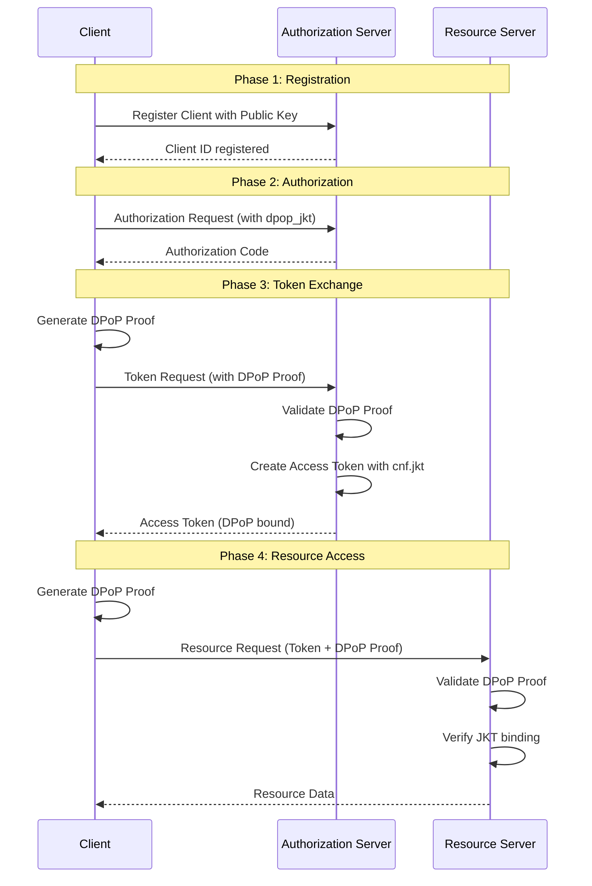
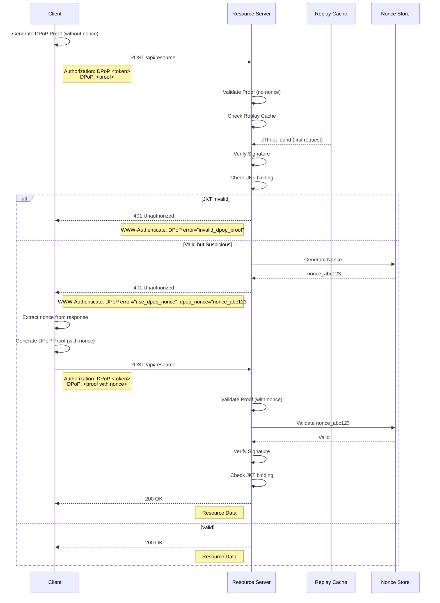
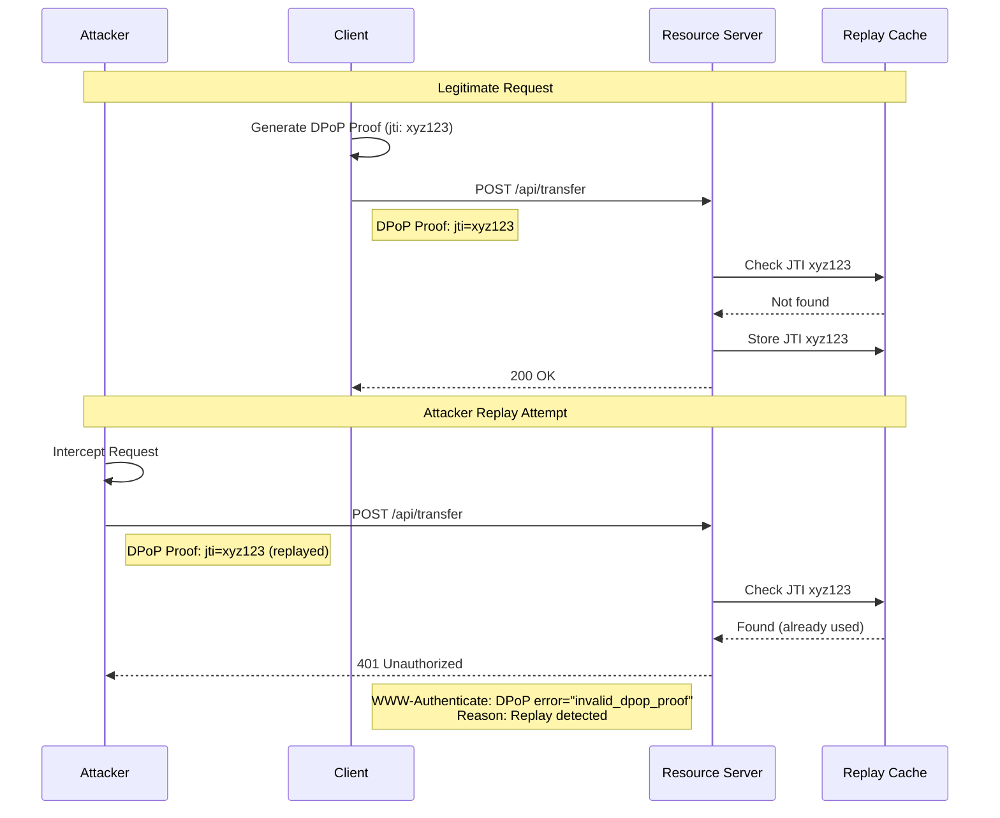
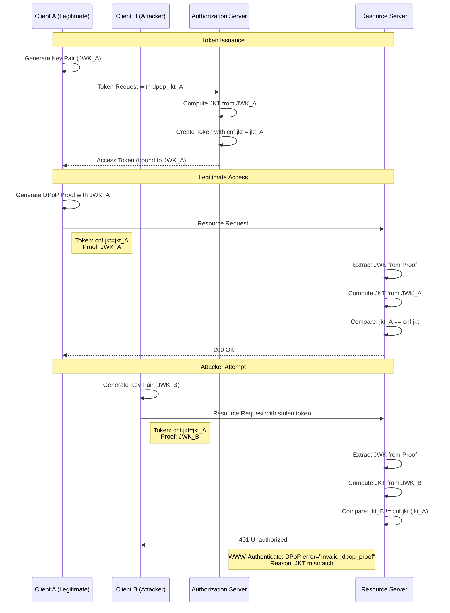
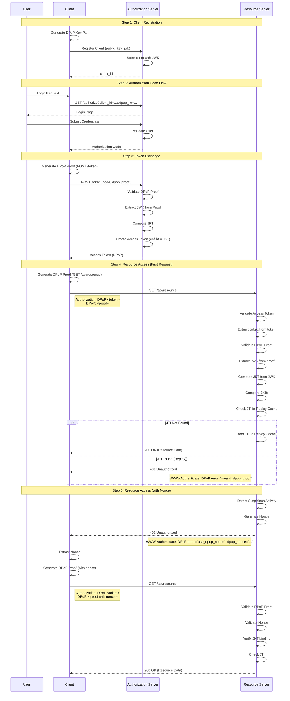

# Phan Tich Chieu Sau ve DPoP - RFC 9449

## Tai Lieu

Tai lieu cung cap phan tich chieu sau ve giao thuc DPoP (Demonstrating Proof-of-Possession) theo RFC 9449. Tai lieu giai thich chi tiet cac nguyen ly cot loi, co che toan hoc, va cach ràng buoc chặt che access token voi public key cua client de ngan chan danh cap token.

---

## 1. Nguyen Ly Cot Loi & Toan Hoc

### 1.1. Co Che So Huong (Proof-of-Possession)

DPoP (Demonstrating Proof-of-Possession) la mot chuc bao mat cua OAuth 2.0 de ràng buoc token voi mot khoa cong khai (public key) cua client, thay vì chỉ dựa vào việc sở hữu token như Bearer Token truyền thống. Cơ chế này được thiết kế để ngăn chặn các cuộc tấn công đánh cắp token, đặc biệt là trong môi trường không tin cậy như trình duyệt web.

Trong mô hình Bearer Token truyền thống, bất kỳ ai có token đều có thể sử dụng nó để truy cập tài nguyên. Điều này tạo ra rủi ro lớn nếu token bị lộ thông qua XSS (Cross-Site Scripting) hoặc các kênh khác. DPoP giải quyết vấn đề này bằng cách yêu cầu client phải chứng minh rằng họ sở hữu private key tương ứng với public key đã được đăng ký với Authorization Server.

### 1.2. Cau Truc DPoP Proof JWT

DPoP Proof là một JWT (JSON Web Token) đặc biệt được client tạo và gửi cùng với mỗi request. Cấu trúc của DPoP Proof JWT bao gồm:

#### Header
```json
{
  "typ": "dpop+jwt",
  "alg": "ES256",
  "jwk": {
    "kty": "EC",
    "crv": "P-256",
    "x": "...",
    "y": "..."
  }
}
```

Các trường quan trọng trong header:
- `typ`: Luôn là "dpop+jwt" để định nghĩa loại JWT
- `alg`: Thuật toán ký (ES256, ES384, ES512, RS256, RS384, RS512, PS256, PS384, PS512)
- `jwk`: JSON Web Key chứa public key của client

#### Payload
```json
{
  "htu": "https://api.example.com/resource",
  "htm": "POST",
  "jti": "unique-identifier",
  "iat": 1640995200,
  "dpop_nonce": "server-provided-nonce"
}
```

Các trường bắt buộc trong payload:
- `htu` (HTTP URI): URL đầy đủ của request
- `htm` (HTTP Method): Phương thức HTTP (GET, POST, PUT, DELETE, etc.)
- `jti` (JWT ID): Định danh duy nhất cho proof, được dùng để ngăn chặn replay attack
- `iat` (Issued At): Thời gian tạo proof (Unix timestamp)
- `dpop_nonce` (tùy chọn): Nonce được server cung cấp để tăng cường bảo mật

### 1.3. JWK Thumbprint va Hashing

JWK Thumbprint là một định danh duy nhất được tạo từ public key, được sử dụng để ràng buộc access token với public key của client. Theo RFC 7638, JWK Thumbprint được tính toán như sau:

1. Tạo một JSON object chỉ chứa các trường bắt buộc của JWK theo thứ tự bảng chữ cái
2. Canonicalize JSON (loại bỏ khoảng trắng, sắp xếp trường)
3. Tính SHA-256 hash của chuỗi JSON đã canonicalize
4. Mã hóa kết quả bằng Base64 URL-safe

Ví dụ tính toán JWK Thumbprint:

```javascript
// JWK gốc
{
  "kty": "EC",
  "crv": "P-256",
  "x": "WKn-ZIGevcwGIyyrzFoZNBdaq9_TsqzGl96oc0CWuis",
  "y": "y77t-RvAHRKTsSGdIYUfweuOvwrvDD-Q3Hv5J0fSKbE"
}

// Canonicalized JSON
{"crv":"P-256","kty":"EC","x":"WKn-ZIGevcwGIyyrzFoZNBdaq9_TsqzGl96oc0CWuis","y":"y77t-RvAHRKTsSGdIYUfweuOvwrvDD-Q3Hv5J0fSKbE"}

// SHA-256 hash
SHA256(canonicalized_json) = 0x8f... (32 bytes)

// Base64 URL-safe encoding
jkt = "jkt_abc123..."
```

### 1.4. Rang Buoc Access Token voi Public Key

Access Token trong DPoP được ràng buộc với public key của client thông qua:

1. **JWK Thumbprint (jkt)**: Authorization Server thêm claim `cnf` (confirmation) vào access token chứa JWK Thumbprint:
   ```json
   {
     "sub": "user123",
     "aud": "api.example.com",
     "exp": 1640998800,
     "cnf": {
       "jkt": "jkt_abc123..."
     }
   }
   ```

2. **Xác thực tại Resource Server**: Khi nhận request, Resource Server:
   - Xác thực DPoP Proof JWT
   - Trích xuất JWK từ header của DPoP Proof
   - Tính toán JWK Thumbprint từ JWK này
   - So sánh với `cnf.jkt` trong access token
   - Nếu khớp, chứng minh client sở hữu private key đúng

Quy trình ràng buộc này đảm bảo rằng:
- Chỉ client có private key tương ứng mới sử dụng được token
- Token bị đánh cắp sẽ vô dụng nếu không có private key
- Mỗi request phải có DPoP Proof mới với jti duy nhất

### 1.5. Thuat Toan Ky va Xac Thuc

DPoP hỗ trợ nhiều thuật toán ký số:

| Thuật toán | Loại Key | Độ dài key | Mô tả |
|------------|-----------|------------|--------|
| ES256 | ECDSA | P-256 (256-bit) | Elliptic Curve, khuyến nghị |
| ES384 | ECDSA | P-384 (384-bit) | Elliptic Curve, bảo mật cao hơn |
| ES512 | ECDSA | P-521 (521-bit) | Elliptic Curve, bảo mật rất cao |
| RS256 | RSA | 2048-bit | RSA với SHA-256 |
| RS384 | RSA | 3072-bit | RSA với SHA-384 |
| RS512 | RSA | 4096-bit | RSA với SHA-512 |
| PS256 | RSA-PSS | 2048-bit | RSA-PSS với SHA-256 |
| PS384 | RSA-PSS | 3072-bit | RSA-PSS với SHA-384 |
| PS512 | RSA-PSS | 4096-bit | RSA-PSS với SHA-512 |

Quy trình xác thực DPoP Proof:

1. **Kiểm tra header**: Xác thực `typ` là "dpop+jwt" và `alg` được hỗ trợ
2. **Kiểm tra payload**: Xác thực các trường bắt buộc (`htu`, `htm`, `jti`, `iat`)
3. **Xác thực chữ ký**: Sử dụng JWK từ header để xác thực chữ ký
4. **Kiểm tra thời gian**: Đảm bảo `iat` không quá cũ (thường < 30-60 giây)
5. **Kiểm tra replay**: Đảm bảo `jti` chưa được sử dụng trước đó
6. **Kiểm tra nonce**: Nếu server yêu cầu, xác thực `dpop_nonce` hợp lệ
7. **Kiểm tra ràng buộc**: So sánh JWK Thumbprint với `cnf.jkt` trong access token

---

## 2. Phan Tich Bao Mat

### 2.1. So Sanh DPoP va Bearer Token Truyen Thong

#### Bearer Token Truyền thống

```
Client --[Access Token]--> Resource Server
```

**Đặc điểm:**
- Token là "bearer" - bất kỳ ai có token đều có thể sử dụng
- Không cần chứng minh quyền sở hữu
- Rủi ro cao nếu token bị lộ

**Các cuộc tấn công phổ biến:**
1. **XSS (Cross-Site Scripting)**: Attacker inject script để lấy token từ localStorage/sessionStorage
2. **Token Injection**: Attacker inject token vào request của họ
3. **Replay Attack**: Attacker tái sử dụng token đã bị chặn
4. **Man-in-the-Middle**: Attacker chặn và sử dụng token

#### DPoP

```
Client --[Access Token + DPoP Proof]--> Resource Server
```

**Đặc điểm:**
- Token được ràng buộc với public key của client
- Mỗi request phải có DPoP Proof mới
- Proof được ký bằng private key, chứng minh quyền sở hữu

**Bảo mật được cải thiện:**
1. **Ngăn chặn XSS**: Token bị đánh cắp không thể sử dụng nếu không có private key
2. **Ngăn chặn Token Injection**: Không thể inject token vào request khác
3. **Ngăn chặn Replay Attack**: Mỗi proof có jti duy nhất, server từ chối proof đã sử dụng
4. **Ngăn chặn MITM**: Chữ ký bảo toàn tính toàn vẹn của proof

### 2.2. Ngan Chan Replay Attack

Replay attack xảy ra khi attacker tái sử dụng request hợp lệ để thực hiện hành động trái phép. DPoP ngăn chặn replay attack qua cơ chế sau:

#### Cơ chế JTI (JWT ID)

Mỗi DPoP Proof có `jti` duy nhất:
```json
{
  "jti": "uuid-v4-random-string"
}
```

#### Replay Cache tại Server

Resource Server duy trì một cache (Redis, in-memory, database) để lưu trữ các jti đã sử dụng:

```
Replay Cache Structure:
{
  "jti_1": { "expires_at": 1640995260 },
  "jti_2": { "expires_at": 1640995265 },
  ...
}
```

#### Quy trình kiểm tra replay:

1. Client tạo DPoP Proof với jti mới
2. Resource Server nhận request và trích xuất jti
3. Server kiểm tra replay cache:
   - Nếu jti tồn tại và chưa hết hạn -> Từ chối (replay detected)
   - Nếu jti không tồn tại -> Chấp nhận và thêm vào cache
4. Cache tự động xóa các jti hết hạn (dựa trên `iat` + TTL)

#### Ví dụ kịch bản replay:

```
Attacker chặn request hợp lệ:
Request 1: POST /api/transfer
  Access Token: eyJhbGciOiJIUzI1NiIs...
  DPoP Proof: eyJhbGciOiJFUzI1NiIsInR5cCI6ImRwb3Arand...
  jti: "abc123"
  Body: { "to": "attacker", "amount": 1000 }

Attacker cố gắng replay:
Request 2: POST /api/transfer
  Access Token: eyJhbGciOiJIUzI1NiIs...
  DPoP Proof: eyJhbGciOiJFUzI1NiIsInR5cCI6ImRwb3Arand...
  jti: "abc123"
  Body: { "to": "attacker", "amount": 1000 }

Server kiểm tra:
- jti "abc123" đã tồn tại trong cache
- Từ chối request với HTTP 401
- Gửi header: WWW-Authenticate: DPoP error="use_dpop_nonce"
```

### 2.3. Ngan Chan Token Injection

Token injection xảy ra khi attacker cố gắng sử dụng token hợp lệ trong context khác. DPoP ngăn chặn qua cơ chế ràng buộc:

#### Ràng buộc JWK Thumbprint

Access Token chứa `cnf.jkt`:
```json
{
  "sub": "user123",
  "cnf": {
    "jkt": "jkt_original_client"
  }
}
```

#### Quy trình kiểm tra:

1. Client A tạo DPoP Proof với JWK_A
2. Resource Server tính jkt từ JWK_A
3. Server so sánh với `cnf.jkt` trong access token
4. Nếu khớp -> Chấp nhận
5. Nếu không khớp -> Từ chối

#### Ví dụ kịch bản injection:

```
Client A (legitimate):
- Public Key: JWK_A
- JWK Thumbprint: jkt_A
- Access Token: { "cnf": { "jkt": "jkt_A" } }

Attacker cố gắng sử dụng token:
- Public Key: JWK_B
- JWK Thumbprint: jkt_B
- Request với Access Token của Client A

Server kiểm tra:
- jkt từ DPoP Proof (jkt_B) != cnf.jkt trong token (jkt_A)
- Từ chối request với HTTP 401
- Gửi header: WWW-Authenticate: DPoP error="invalid_dpop_proof"
```

### 2.4. Vai Tro Cua dpop_nonce

`dpop_nonce` là một cơ chế bảo mật bổ sung được server cung cấp để ngăn chặn các cuộc tấn công tiên tiến:

#### Khi nào server gửi nonce?

Server gửi nonce trong các trường hợp:
1. Khi phát hiện request可疑 (suspicious)
2. Khi muốn tăng cường bảo mật cho các endpoint nhạy cảm
3. Khi phát hiện pattern attack

#### Cách hoạt động:

```
Client Request 1:
POST /api/sensitive
DPoP Proof: { "jti": "xyz", ... }

Server Response 1:
HTTP 401 Unauthorized
WWW-Authenticate: DPoP error="use_dpop_nonce", dpop_nonce="server-nonce-123"

Client Request 2:
POST /api/sensitive
DPoP Proof: { 
  "jti": "abc", 
  "dpop_nonce": "server-nonce-123",
  ...
}

Server kiểm tra:
- dpop_nonce hợp lệ
- Chấp nhận request
```

#### Lợi ích của dpop_nonce:

1. **Ngăn chặn pre-computation attacks**: Attacker không thể pre-compute DPoP Proof
2. **Ngăn chặn timing attacks**: Attacker không thể đo thời gian response
3. **Tăng độ phức tạp cho attacker**: Phải lấy nonce trước mỗi request
4. **Server-side control**: Server có thể kích hoạt nonce khi cần

#### Triển khai nonce:

```csharp
// Server-side nonce generation
public string GenerateNonce()
{
    var nonceBytes = new byte[32];
    using (var rng = RandomNumberGenerator.Create())
    {
        rng.GetBytes(nonceBytes);
    }
    return Base64UrlEncode(nonceBytes);
}

// Nonce validation
public bool ValidateNonce(string nonce)
{
    // Check if nonce exists and not expired
    return _nonceCache.TryGetValue(nonce, out var expiry) && 
           expiry > DateTime.UtcNow;
}
```

### 2.5. Phan Tich Cuoc Tan Cong Va Phòng Ngừa

| Cuộc tấn công | Bearer Token | DPoP | Giải pháp DPoP |
|--------------|--------------|------|----------------|
| XSS Token Theft | Vulnerable | Protected | Token không thể sử dụng nếu không có private key |
| Token Injection | Vulnerable | Protected | Ràng buộc JKT ngăn chặn sử dụng ở context khác |
| Replay Attack | Vulnerable | Protected | JTI + Replay Cache |
| MITM | Vulnerable | Protected | Chữ ký bảo toàn tính toàn vẹn |
| CSRF | Vulnerable (nếu token trong cookie) | Protected | DPoP Proof không thể được trình duyệt tự động gửi |
| Pre-computation | Vulnerable | Protected | dpop_nonce ngăn chặn pre-computation |

---

## 3. Kien Truc Thanh Phan

### 3.1. Client

#### Vai trò và trách nhiệm

Client chịu trách nhiệm:
1. **Tạo và quản lý cặp khóa**: Generate public/private key pair cho DPoP
2. **Tạo DPoP Proof**: Tạo proof JWT cho mỗi request
3. **Xử lý nonce**: Nhận và sử dụng nonce từ server
4. **Lưu trữ khóa an toàn**: Bảo vệ private key khỏi truy cập trái phép

#### Các thay đổi cần thiết

##### 1. Tạo cặp khóa DPoP

```csharp
public class DpopKeyGenerator
{
    public (string publicKeyJwk, string privateKeyPem) GenerateKeyPair()
    {
        using var ecdsa = ECDsa.Create(ECCurve.NamedCurves.nistP256);
        
        // Export private key
        var privateKeyBytes = ecdsa.ExportPkcs8PrivateKey();
        var privateKeyPem = ConvertToPem(privateKeyBytes, "PRIVATE KEY");
        
        // Export public key as JWK
        var parameters = ecdsa.ExportParameters(false);
        var jwk = new
        {
            kty = "EC",
            crv = "P-256",
            x = Base64UrlEncode(parameters.Q.X),
            y = Base64UrlEncode(parameters.Q.Y)
        };
        var publicKeyJwk = JsonSerializer.Serialize(jwk);
        
        return (publicKeyJwk, privateKeyPem);
    }
}
```

##### 2. Tạo DPoP Proof

```csharp
public class DpopProofGenerator
{
    public string CreateProof(
        string httpMethod,
        string requestUri,
        string accessToken,
        string privateKeyPem,
        string? nonce = null)
    {
        var jwk = GetJwkFromPrivateKey(privateKeyPem);
        var jti = Guid.NewGuid().ToString();
        var iat = DateTimeOffset.UtcNow.ToUnixTimeSeconds();
        
        var header = new
        {
            typ = "dpop+jwt",
            alg = "ES256",
            jwk = jwk
        };
        
        var payload = new
        {
            htu = requestUri,
            htm = httpMethod,
            jti = jti,
            iat = iat,
            dpop_nonce = nonce
        };
        
        var encodedHeader = Base64UrlEncode(JsonSerializer.Serialize(header));
        var encodedPayload = Base64UrlEncode(JsonSerializer.Serialize(payload));
        var signingInput = $"{encodedHeader}.{encodedPayload}";
        
        var signature = Sign(signingInput, privateKeyPem);
        
        return $"{signingInput}.{Base64UrlEncode(signature)}";
    }
}
```

##### 3. Gửi request với DPoP Proof

```csharp
public class DpopHttpClient
{
    private readonly DpopProofGenerator _proofGenerator;
    private readonly string _privateKeyPem;
    private string? _lastNonce;
    
    public async Task<HttpResponseMessage> SendRequestAsync(
        HttpMethod method,
        string uri,
        string accessToken,
        HttpContent? content = null)
    {
        var proof = _proofGenerator.CreateProof(
            method.Method,
            uri,
            accessToken,
            _privateKeyPem,
            _lastNonce);
        
        var request = new HttpRequestMessage(method, uri);
        request.Headers.Authorization = 
            new AuthenticationHeaderValue("DPoP", accessToken);
        request.Headers.Add("DPoP", proof);
        if (content != null)
        {
            request.Content = content;
        }
        
        var response = await _httpClient.SendAsync(request);
        
        // Handle nonce if required
        if (response.StatusCode == HttpStatusCode.Unauthorized)
        {
            var authenticateHeader = response.Headers.WwwAuthenticate.FirstOrDefault();
            if (authenticateHeader != null && 
                authenticateHeader.Parameter.Contains("use_dpop_nonce"))
            {
                _lastNonce = ExtractNonce(authenticateHeader.Parameter);
                // Retry with nonce
                return await SendRequestAsync(method, uri, accessToken, content);
            }
        }
        
        return response;
    }
}
```

##### 4. Token Request với DPoP

```csharp
public class DpopTokenClient
{
    public async Task<TokenResponse> GetTokenAsync(
        string tokenEndpoint,
        string clientId,
        string code,
        string redirectUri,
        string codeVerifier,
        string publicKeyJwk)
    {
        var parameters = new Dictionary<string, string>
        {
            ["grant_type"] = "authorization_code",
            ["code"] = code,
            ["redirect_uri"] = redirectUri,
            ["code_verifier"] = codeVerifier,
            ["client_id"] = clientId,
            ["dpop_jkt"] = ComputeJwkThumbprint(publicKeyJwk)
        };
        
        var proof = _proofGenerator.CreateProof(
            "POST",
            tokenEndpoint,
            null,
            _privateKeyPem);
        
        var request = new HttpRequestMessage(HttpMethod.Post, tokenEndpoint);
        request.Headers.Add("DPoP", proof);
        request.Content = new FormUrlEncodedContent(parameters);
        
        var response = await _httpClient.SendAsync(request);
        response.EnsureSuccessStatusCode();
        
        return await response.Content.ReadFromJsonAsync<TokenResponse>();
    }
}
```

### 3.2. Authorization Server (AS)

#### Vai trò và trách nhiệm

Authorization Server chịu trách nhiệm:
1. **Xác thực DPoP Proof**: Xác thực proof trong token request
2. **Ràng buộc token với JKT**: Thêm `cnf.jkt` vào access token
3. **Cung cấp nonce**: Gửi nonce khi cần thiết
4. **Lưu trữ JKT**: Lưu trữ JWK Thumbprint của client

#### Các thay đổi cần thiết

##### 1. Xác thực DPoP Proof

```csharp
public class DpopProofValidator
{
    public async Task<DpopProofValidationResult> ValidateProofAsync(
        string proof,
        HttpRequest request)
    {
        try
        {
            var parts = proof.Split('.');
            if (parts.Length != 3)
            {
                return DpopProofValidationResult.Invalid("Invalid JWT format");
            }
            
            var headerJson = Base64UrlDecode(parts[0]);
            var payloadJson = Base64UrlDecode(parts[1]);
            
            var header = JsonSerializer.Deserialize<DpopHeader>(headerJson);
            var payload = JsonSerializer.Deserialize<DpopPayload>(payloadJson);
            
            // Validate header
            if (header?.Typ != "dpop+jwt")
            {
                return DpopProofValidationResult.Invalid("Invalid typ");
            }
            
            if (!SupportedAlgorithms.Contains(header?.Alg))
            {
                return DpopProofValidationResult.Invalid("Unsupported algorithm");
            }
            
            // Validate payload
            if (payload?.Htu != request.Path)
            {
                return DpopProofValidationResult.Invalid("HTU mismatch");
            }
            
            if (payload?.Htm != request.Method)
            {
                return DpopProofValidationResult.Invalid("HTM mismatch");
            }
            
            var now = DateTimeOffset.UtcNow.ToUnixTimeSeconds();
            if (payload?.Iat < now - MaxProofAge)
            {
                return DpopProofValidationResult.Invalid("Proof too old");
            }
            
            // Check replay
            if (await _replayCache.ExistsAsync(payload?.Jti))
            {
                return DpopProofValidationResult.Invalid("Replay detected");
            }
            
            // Validate nonce if required
            if (_requireNonce && string.IsNullOrEmpty(payload?.DpopNonce))
            {
                return DpopProofValidationResult.Invalid("Nonce required");
            }
            
            if (!string.IsNullOrEmpty(payload?.DpopNonce) && 
                !await _nonceValidator.IsValidAsync(payload.DpopNonce))
            {
                return DpopProofValidationResult.Invalid("Invalid nonce");
            }
            
            // Verify signature
            var isValid = await VerifySignatureAsync(
                parts[0],
                parts[1],
                parts[2],
                header.Jwk);
            
            if (!isValid)
            {
                return DpopProofValidationResult.Invalid("Invalid signature");
            }
            
            // Add to replay cache
            await _replayCache.AddAsync(payload.Jti, payload.Iat + ProofTtl);
            
            return DpopProofValidationResult.Valid(header.Jwk);
        }
        catch (Exception ex)
        {
            return DpopProofValidationResult.Invalid(ex.Message);
        }
    }
}
```

##### 2. Tạo Access Token với JKT

```csharp
public class DpopTokenGenerator
{
    public string CreateAccessToken(
        TokenRequest request,
        JsonWebKey clientJwk)
    {
        var jkt = ComputeJwkThumbprint(clientJwk);
        
        var claims = new List<Claim>
        {
            new Claim("sub", request.Subject),
            new Claim("aud", request.Audience),
            new Claim("exp", DateTimeOffset.UtcNow.AddHours(1).ToUnixTimeSeconds().ToString()),
            new Claim("iat", DateTimeOffset.UtcNow.ToUnixTimeSeconds().ToString()),
            new Claim("jti", Guid.NewGuid().ToString()),
            new Claim("scope", string.Join(" ", request.Scopes)),
            new Claim("cnf", JsonSerializer.Serialize(new { jkt }))
        };
        
        var token = _jwtSecurityTokenHandler.CreateToken(
            new SecurityTokenDescriptor
            {
                Subject = new ClaimsIdentity(claims),
                SigningCredentials = _signingCredentials,
                Issuer = _issuer
            });
        
        return _jwtSecurityTokenHandler.WriteToken(token);
    }
    
    private string ComputeJwkThumbprint(JsonWebKey jwk)
    {
        // Create canonical JWK
        var canonicalJwk = new Dictionary<string, string>
        {
            ["crv"] = jwk.Crv,
            ["kty"] = jwk.Kty,
            ["x"] = jwk.X,
            ["y"] = jwk.Y
        };
        
        var canonicalJson = JsonSerializer.Serialize(
            canonicalJwk,
            new JsonSerializerOptions
            {
                PropertyNamingPolicy = JsonNamingPolicy.CamelCase
            });
        
        var hash = SHA256.HashData(Encoding.UTF8.GetBytes(canonicalJson));
        return Base64UrlEncode(hash);
    }
}
```

##### 3. Xử lý Token Request

```csharp
public class TokenEndpoint
{
    [HttpPost("connect/token")]
    public async Task<IActionResult> Token([FromForm] TokenRequest request)
    {
        // Validate DPoP proof
        var proof = HttpContext.Request.Headers["DPoP"].FirstOrDefault();
        if (string.IsNullOrEmpty(proof))
        {
            return Unauthorized(new { error = "missing_dpop_proof" });
        }
        
        var validationResult = await _dpopValidator.ValidateProofAsync(
            proof,
            HttpContext.Request);
        
        if (!validationResult.IsValid)
        {
            var nonce = _nonceGenerator.Generate();
            HttpContext.Response.Headers.Append(
                "WWW-Authenticate",
                $"DPoP error=\"{validationResult.Error}\", dpop_nonce=\"{nonce}\"");
            return Unauthorized(new { error = validationResult.Error });
        }
        
        // Validate token request
        var tokenResult = await _tokenValidator.ValidateAsync(request);
        if (!tokenResult.IsValid)
        {
            return BadRequest(new { error = tokenResult.Error });
        }
        
        // Create access token with JKT
        var accessToken = _dpopTokenGenerator.CreateAccessToken(
            tokenResult.TokenRequest,
            validationResult.ClientJwk);
        
        var refreshToken = _refreshTokenGenerator.Generate();
        
        return Ok(new TokenResponse
        {
            access_token = accessToken,
            refresh_token = refreshToken,
            token_type = "DPoP",
            expires_in = 3600
        });
    }
}
```

### 3.3. Resource Server (RS)

#### Vai trò và trách nhiệm

Resource Server chịu trách nhiệm:
1. **Xác thực DPoP Proof**: Xác thực proof trong mỗi request
2. **Xác thực Access Token**: Xác thực token và kiểm tra `cnf.jkt`
3. **Kiểm tra ràng buộc**: So sánh JKT trong proof với JKT trong token
4. **Quản lý Replay Cache**: Lưu trữ và kiểm tra JTI
5. **Cung cấp nonce**: Gửi nonce khi cần thiết

#### Các thay đổi cần thiết

##### 1. Middleware xác thực DPoP

```csharp
public class DpopAuthenticationMiddleware
{
    private readonly RequestDelegate _next;
    private readonly IDpopProofValidator _proofValidator;
    private readonly IReplayCache _replayCache;
    private readonly INonceGenerator _nonceGenerator;
    
    public async Task InvokeAsync(HttpContext context)
    {
        var authorization = context.Request.Headers["Authorization"].FirstOrDefault();
        var dpopProof = context.Request.Headers["DPoP"].FirstOrDefault();
        
        if (string.IsNullOrEmpty(authorization) || 
            !authorization.StartsWith("DPoP "))
        {
            context.Response.StatusCode = 401;
            await context.Response.WriteAsJsonAsync(new { error = "invalid_token" });
            return;
        }
        
        if (string.IsNullOrEmpty(dpopProof))
        {
            var nonce = _nonceGenerator.Generate();
            context.Response.Headers.Append(
                "WWW-Authenticate",
                $"DPoP error=\"missing_dpop_proof\", dpop_nonce=\"{nonce}\"");
            context.Response.StatusCode = 401;
            await context.Response.WriteAsJsonAsync(new { error = "missing_dpop_proof" });
            return;
        }
        
        var accessToken = authorization.Substring("DPoP ".Length);
        
        // Validate access token
        var tokenValidation = await _tokenValidator.ValidateAsync(accessToken);
        if (!tokenValidation.IsValid)
        {
            context.Response.StatusCode = 401;
            await context.Response.WriteAsJsonAsync(new { error = "invalid_token" });
            return;
        }
        
        // Validate DPoP proof
        var proofValidation = await _proofValidator.ValidateProofAsync(
            dpopProof,
            context.Request);
        
        if (!proofValidation.IsValid)
        {
            var nonce = _nonceGenerator.Generate();
            context.Response.Headers.Append(
                "WWW-Authenticate",
                $"DPoP error=\"{proofValidation.Error}\", dpop_nonce=\"{nonce}\"");
            context.Response.StatusCode = 401;
            await context.Response.WriteAsJsonAsync(new { error = proofValidation.Error });
            return;
        }
        
        // Check JKT binding
        var tokenJkt = tokenValidation.Token.GetClaim("cnf", "jkt");
        var proofJkt = ComputeJwkThumbprint(proofValidation.ClientJwk);
        
        if (tokenJkt != proofJkt)
        {
            var nonce = _nonceGenerator.Generate();
            context.Response.Headers.Append(
                "WWW-Authenticate",
                $"DPoP error=\"invalid_dpop_proof\", dpop_nonce=\"{nonce}\"");
            context.Response.StatusCode = 401;
            await context.Response.WriteAsJsonAsync(new { error = "invalid_dpop_proof" });
            return;
        }
        
        // Add user context
        context.User = tokenValidation.Principal;
        context.Items["DpopJwk"] = proofValidation.ClientJwk;
        
        await _next(context);
    }
}
```

##### 2. Replay Cache implementation

```csharp
public interface IReplayCache
{
    Task<bool> ExistsAsync(string jti);
    Task AddAsync(string jti, long expiresAt);
    Task CleanupAsync();
}

public class RedisReplayCache : IReplayCache
{
    private readonly IConnectionMultiplexer _redis;
    private readonly IDatabase _db;
    
    public RedisReplayCache(IConnectionMultiplexer redis)
    {
        _redis = redis;
        _db = redis.GetDatabase();
    }
    
    public async Task<bool> ExistsAsync(string jti)
    {
        return await _db.KeyExistsAsync($"dpop:jti:{jti}");
    }
    
    public async Task AddAsync(string jti, long expiresAt)
    {
        var ttl = expiresAt - DateTimeOffset.UtcNow.ToUnixTimeSeconds();
        await _db.StringSetAsync(
            $"dpop:jti:{jti}",
            "1",
            TimeSpan.FromSeconds(ttl));
    }
    
    public async Task CleanupAsync()
    {
        // Redis handles TTL automatically
        await Task.CompletedTask;
    }
}
```

##### 3. Nonce management

```csharp
public interface INonceGenerator
{
    string Generate();
}

public interface INonceValidator
{
    Task<bool> IsValidAsync(string nonce);
}

public class SecureNonceGenerator : INonceGenerator
{
    public string Generate()
    {
        var nonceBytes = new byte[32];
        using (var rng = RandomNumberGenerator.Create())
        {
            rng.GetBytes(nonceBytes);
        }
        return Base64UrlEncode(nonceBytes);
    }
}

public class RedisNonceValidator : INonceValidator
{
    private readonly IConnectionMultiplexer _redis;
    private readonly IDatabase _db;
    
    public async Task<bool> IsValidAsync(string nonce)
    {
        var exists = await _db.KeyExistsAsync($"dpop:nonce:{nonce}");
        if (exists)
        {
            await _db.KeyDeleteAsync($"dpop:nonce:{nonce}");
            return true;
        }
        return false;
    }
}
```

##### 4. Configuration

```csharp
public class DpopOptions
{
    public TimeSpan MaxProofAge { get; set; } = TimeSpan.FromSeconds(30);
    public TimeSpan ProofTtl { get; set; } = TimeSpan.FromMinutes(5);
    public bool RequireNonce { get; set; } = false;
    public string[] SupportedAlgorithms { get; set; } = 
        new[] { "ES256", "ES384", "ES512", "RS256", "RS384", "RS512" };
}

public static class DpopServiceExtensions
{
    public static IServiceCollection AddDpop(
        this IServiceCollection services,
        Action<DpopOptions> configureOptions)
    {
        var options = new DpopOptions();
        configureOptions(options);
        services.AddSingleton(options);
        
        services.AddSingleton<IDpopProofValidator, DpopProofValidator>();
        services.AddSingleton<IReplayCache, RedisReplayCache>();
        services.AddSingleton<INonceGenerator, SecureNonceGenerator>();
        services.AddSingleton<INonceValidator, RedisNonceValidator>();
        
        return services;
    }
}
```

---

## 4. Truc Quan Hoa Luong Hoat Dong

### 4.1. Luong Tong Quan



### 4.2. Luong Chi Tiet voi Nonce



### 4.3. Luong Replay Attack Prevention



### 4.4. Luong Token Binding Verification



### 4.5. Luong Full DPoP Flow



---

## 5. Ket Luan

DPoP (Demonstrating Proof-of-Possession) theo RFC 9449 cung cấp một giải pháp bảo mật mạnh mẽ để ngăn chặn các cuộc tấn công đánh cắp token trong hệ thống OAuth 2.0. Các điểm chính:

### 5.1. Lợi Ich Chinh

1. **Ràng buộc token với public key**: Token không thể sử dụng nếu không có private key tương ứng
2. **Ngăn chặn replay attack**: Mỗi request có JTI duy nhất, server từ chối request đã sử dụng
3. **Ngăn chặn token injection**: Token chỉ hoạt động với client có JKT khớp
4. **Tăng cường bảo mật với nonce**: Server có thể yêu cầu nonce để ngăn chặn các cuộc tấn công tiên tiến

### 5.2. Cai Dat Kien Truc

- **Client**: Tạo cặp khóa, tạo DPoP Proof, xử lý nonce
- **Authorization Server**: Xác thực proof, tạo token với cnf.jkt
- **Resource Server**: Xác thực proof, kiểm tra JKT binding, quản lý replay cache

### 5.3. Thach Thuc

1. **Quản lý khóa**: Client phải bảo vệ private key an toàn
2. **Replay cache**: Server cần triển khai cache hiệu quả (Redis, in-memory)
3. **Nonce management**: Server cần quản lý nonce và TTL
4. **Tương thích ngược**: DPoP yêu cầu thay đổi cả client và server

### 5.4. Khuyen Nghic

1. Sử dụng ES256 hoặc ES384 cho hiệu suất và bảo mật tốt
2. Triển khai replay cache với TTL phù hợp (5-10 phút)
3. Kích hoạt nonce cho các endpoint nhạy cảm
4. Giám sát và ghi log các request DPoP để phát hiện tấn công
5. Triển khai gradual rollout để đảm bảo tương thích

---

## Tai Lieu Tham Khao

- RFC 9449: OAuth 2.0 Demonstrating Proof-of-Possession at the Application Layer (DPoP)
- RFC 7519: JSON Web Token (JWT)
- RFC 7515: JSON Web Signature (JWS)
- RFC 7517: JSON Web Key (JWK)
- RFC 7638: JSON Web Key (JWK) Thumbprint
- OAuth 2.0 Security Best Current Practice (RFC 6819)
- OAuth 2.0 for Browser-Based Apps (RFC 6749)
