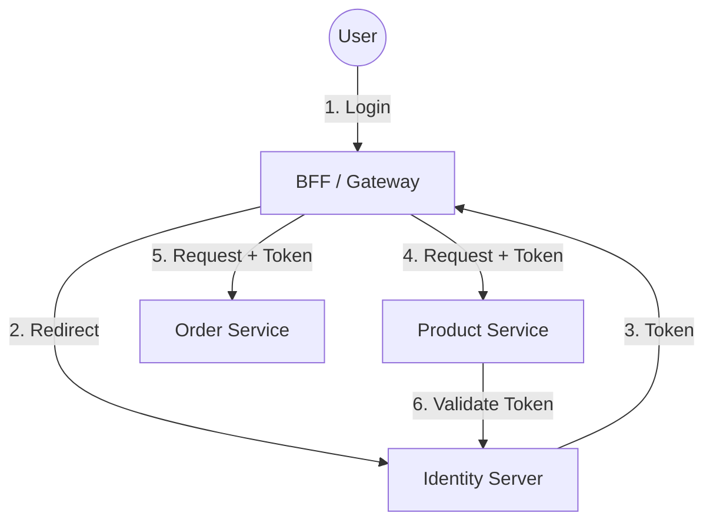

# Principal Level Patterns: Enterprise Identity Architecture

Tài liệu này dành cho Architects/Principal Engineers, tập trung vào thiết kế hệ thống, bảo mật cấp cao và tích hợp quy mô lớn (Enterprise Scale).

## 1. BFF (Backend for Frontend) Pattern

Đây là pattern quan trọng nhất để nâng cao bảo mật cho SPA (React) trong môi trường Enterprise/Banking/Fintech.

### Vấn đề của mô hình truyền thống (Token in Browser)
- **XSS Vulnerability**: Nếu Hacker chạy được script độc hại trên browser (qua lỗ hổng UI, npm package độc hại), họ có thể đọc được Access Token từ `localStorage`/`sessionStorage` và mạo danh user.
- **Browser Constraints**: LocalStorage không chia sẻ được giữa các sud-domains dễ dàng như Cookie.

### Giải pháp: Token-less Frontend
Frontend **KHÔNG BAO GIỜ** nhìn thấy Access Token.
1. Frontend login -> Redirect về BFF (Backend Proxy).
2. BFF thực hiện trao đổi Code lấy Token.
3. BFF lưu Token (In-memory cache hoặc Distributed Cache như Redis).
4. BFF set một `HttpOnly, Secure, SameSite` Cookie cho Frontend. Cookie này chỉ là Session ID trỏ tới Token đang nằm ở Server.
5. Khi Frontend gọi API, nó gọi qua BFF (với Cookie).
6. BFF validate Cookie -> Lấy Token từ Cache -> Attach vào Header -> Gọi Downstream API.

### Implementation với .NET YARP (Yet Another Reverse Proxy)
Microsoft cung cấp YARP để build BFF dễ dàng.

```csharp
// Program.cs của BFF Project
var builder = WebApplication.CreateBuilder(args);

// Add Authentication & Cookie
builder.Services.AddAuthentication(options =>
{
    options.DefaultScheme = CookieAuthenticationDefaults.AuthenticationScheme;
    options.DefaultChallengeScheme = "oidc";
})
.AddCookie(options =>
{
    options.Cookie.HttpOnly = true;
    options.Cookie.SameSite = SameSiteMode.Strict;
})
.AddOpenIdConnect("oidc", options =>
{
    options.Authority = "https://idp.example.com";
    options.ClientId = "bff-client";
    options.ClientSecret = "secret"; // BFF giữ secret an toàn, SPA thì không
    options.ResponseType = "code";
    options.SaveTokens = true; // Lưu token vào cookie session (được mã hóa)
});

// Setup YARP để forward request + attach token
builder.Services.AddReverseProxy()
    .LoadFromConfig(builder.Configuration.GetSection("ReverseProxy"))
    .AddTransforms(builderContext =>
    {
        // Custom transform để lấy Access Token từ session user và gắn vào header
        builderContext.AddRequestTransform(async transformContext =>
        {
            var accessToken = await transformContext.HttpContext.GetTokenAsync("access_token");
            if (accessToken != null)
            {
                transformContext.ProxyRequest.Headers.Authorization = new AuthenticationHeaderValue("Bearer", accessToken);
            }
        });
    });
```

## 2. Centralized Identity Management

Trong hệ thống Microservices, không để từng service tự quản lý User User/Pass. Bắt buộc dùng **Centralized Identity Provider (IdP)**.

- **Internal Users**: Dùng Active Directory (ADFS) / Azure Entra ID.
- **External Users (Customers)**: Dùng Azure B2C, AWS Cognito, hoặc Auth0.
- **Custom Needs**: Build IdP riêng bằng **Duende IdentityServer** (nếu cần tùy biến sâu flow login, multitenancy phức tạp).

**Kiến trúc:**


## 3. Token Revocation & Global Logout

Làm sao để "Kick" user ra khỏi hệ thống ngay lập tức khi phát hiện nghi vấn?
- JWT là stateless, không thể thu hồi (revoke) trừ khi hết hạn.
- **Giải pháp**:
    1. **Short-lived Access Token**: Set thời hạn Access Token cực ngắn (5-10 phút).
    2. **Reference Tokens**: Thay vì dùng JWT (Value Token), dùng Reference Token (chỉ là chuỗi ID ngẫu nhiên). API mỗi lần nhận request phải gọi về IdP để validate (Introspection). Chậm hơn nhưng an toàn tuyệt đối, revoke được ngay lập tức.
    3. **Back-channel Logout**: Khi user logout ở IdP, IdP bắn một request ngầm tới tất cả Client/Apps đã đăng nhập để báo hiệu xóa session.

## 4. Migration Strategy

Khi chuyển từ Monolith (Session-based) sang Microservices (OAuth 2.0):
1. **Phase 1**: Giữ nguyên Monolith làm Auth Provider, issue JWT cho services mới.
2. **Phase 2**: Tách module User/Auth ra thành service riêng (dùng IdentityServer), sync data với DB cũ.
3. **Phase 3**: Switch Client sang dùng IdP mới hoàn toàn.
