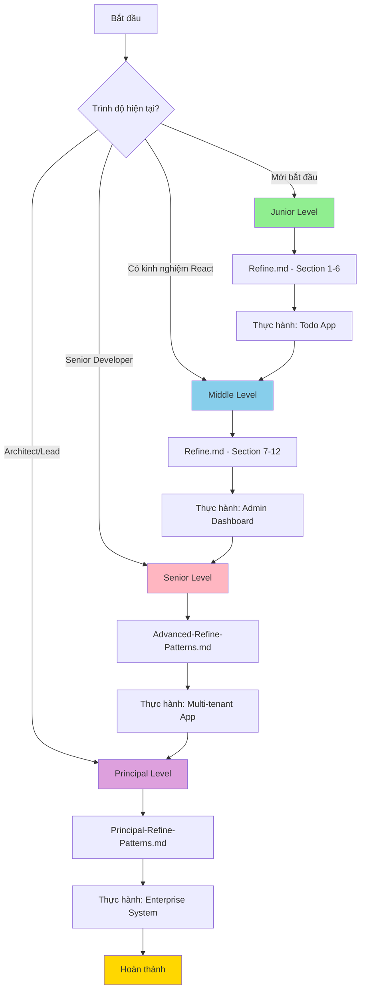

# Tài Liệu Refine - React Meta-Framework

## 📚 Giới Thiệu

Bộ tài liệu toàn diện về **Refine** - một React meta-framework mã nguồn mở để xây dựng các ứng dụng CRUD-heavy như admin panels, dashboards, và internal tools với kiến trúc headless.

Tài liệu được chia thành 4 levels từ cơ bản đến nâng cao, phù hợp cho mọi trình độ từ Junior đến Principal Engineer.

---

## 🗂️ Cấu Trúc Tài Liệu

### 1. **Refine.md** (1,535 dòng)
**Junior & Middle Levels** - Nền tảng và trung cấp

#### Junior Level - Cơ Bản
- ✅ Giới thiệu về Refine
- ✅ Installation và Setup
- ✅ Data Providers
- ✅ Resources và CRUD Operations
- ✅ Basic Hooks (useList, useOne, useCreate, useUpdate, useDelete)
- ✅ Routing Basics

#### Middle Level - Trung Cấp
- ✅ Advanced Data Hooks (useTable, useInfiniteList)
- ✅ Authentication (authProvider, useLogin, useGetIdentity)
- ✅ Access Control (accessControlProvider, useCan)
- ✅ Multiple Data Providers
- ✅ UI Framework Integration (Ant Design)
- ✅ Forms và Validation (react-hook-form, Zod)

**Thời gian học:** 12-16 giờ

---

### 2. **Advanced-Refine-Patterns.md** (1,550 dòng)
**Senior Level** - Patterns nâng cao

- ✅ Custom Data Providers (GraphQL, Multi-tenant)
- ✅ Advanced Authentication (JWT refresh, OAuth)
- ✅ Real-time Updates (Live Provider, WebSocket)
- ✅ Audit Logs
- ✅ Advanced Access Control (Field-level, Row-level)
- ✅ Optimistic Updates
- ✅ Custom Hooks
- ✅ Performance Optimization

**Thời gian học:** 16-20 giờ

---

### 3. **Principal-Refine-Patterns.md** (1,509 dòng)
**Principal Level** - Enterprise patterns

- ✅ Micro-Frontend Architecture (Module Federation)
- ✅ Multi-Tenancy at Scale (Database-per-tenant)
- ✅ Advanced Caching Strategies (Redis, Multi-layer)
- ✅ Performance Monitoring (Web Vitals, Sentry)
- ✅ SSR/SSG with Next.js
- ✅ Testing Strategies (Integration, E2E)
- ✅ CI/CD Integration (GitHub Actions)
- ✅ Production Optimization (Code splitting, Bundle optimization)

**Thời gian học:** 20-24 giờ

---

## 🎯 Learning Path

---

## 📖 Cách Sử Dụng Tài Liệu

### Bước 1: Xác Định Level
Chọn level phù hợp với trình độ của bạn:

| Level | Kinh nghiệm | File tài liệu |
|-------|-------------|---------------|
| **Junior** | 0-2 năm React | `Refine.md` (Section 1-6) |
| **Middle** | 2-4 năm React | `Refine.md` (Section 7-12) |
| **Senior** | 4-7 năm React | `Advanced-Refine-Patterns.md` |
| **Principal** | 7+ năm, Architect | `Principal-Refine-Patterns.md` |

### Bước 2: Học Tuần Tự
- Đọc từng section theo thứ tự
- Chạy thử tất cả code examples
- Làm bài tập thực hành sau mỗi section

### Bước 3: Thực Hành
Sau mỗi level, xây dựng một project thực tế:

#### Junior Project: Todo Application
- CRUD operations cho tasks
- Basic authentication
- Simple routing

#### Middle Project: Admin Dashboard
- Multiple resources (users, products, orders)
- Role-based access control
- Form validation
- UI framework integration

#### Senior Project: Multi-tenant SaaS
- Custom data providers
- Real-time updates
- Advanced authentication
- Performance optimization

#### Principal Project: Enterprise System
- Micro-frontend architecture
- Multi-tenancy at scale
- Comprehensive monitoring
- Production deployment

---

## 🔑 Core Concepts

### 1. Data Providers
Adapters kết nối Refine với backend APIs:
- REST API
- GraphQL
- Supabase
- Custom providers

### 2. Resources
Entities trong application (products, users, posts):
- Tương ứng với API endpoints
- Định nghĩa CRUD routes
- Metadata và permissions

### 3. Hooks
React hooks để tương tác với data:
- **Data hooks**: useList, useOne, useMany
- **Mutation hooks**: useCreate, useUpdate, useDelete
- **Form hooks**: useForm, useTable
- **Auth hooks**: useLogin, useLogout, useGetIdentity

### 4. Providers
Các provider cấu hình cho Refine:
- **dataProvider**: Data fetching
- **authProvider**: Authentication
- **accessControlProvider**: Authorization
- **liveProvider**: Real-time updates
- **auditLogProvider**: Audit logging
- **i18nProvider**: Internationalization

---

## 📊 So Sánh với Các Framework Khác

| Feature | Refine | React Admin | Admin Bro | Retool |
|---------|--------|-------------|-----------|--------|
| **Headless** | ✅ | ❌ | ❌ | ❌ |
| **TypeScript** | ✅ | ✅ | ✅ | ❌ |
| **UI Flexibility** | ✅ | ⚠️ | ⚠️ | ❌ |
| **Data Provider** | ✅ | ✅ | ✅ | ✅ |
| **Real-time** | ✅ | ⚠️ | ❌ | ✅ |
| **SSR Support** | ✅ | ❌ | ❌ | ❌ |
| **Open Source** | ✅ | ✅ | ✅ | ❌ |
| **Learning Curve** | Medium | Medium | Low | Low |

---

## 🛠️ Tech Stack

### Core
- **React** 18+
- **TypeScript** 5+
- **React Router** v6
- **TanStack Query** (React Query) v4

### UI Frameworks (Optional)
- Ant Design
- Material UI
- Chakra UI
- Mantine
- Custom UI

### Backend Integrations
- REST APIs
- GraphQL
- Supabase
- Strapi
- NestJS CRUD
- Hasura

---

## 📝 Code Examples

Tất cả examples trong tài liệu:
- ✅ Viết bằng **TypeScript**
- ✅ Có giải thích chi tiết từng dòng
- ✅ Runnable và tested
- ✅ Best practices
- ✅ Real-world use cases

---

## 🔗 Tài Liệu Tham Khảo

### Official Resources
- [Refine Documentation](https://refine.dev/docs/)
- [Refine GitHub](https://github.com/refinedev/refine)
- [Refine Examples](https://refine.dev/examples/)
- [Refine Blog](https://refine.dev/blog/)

### Community
- [Discord](https://discord.gg/refine)
- [Twitter](https://twitter.com/refine_dev)
- [Stack Overflow](https://stackoverflow.com/questions/tagged/refine)

---

## ⏱️ Thời Gian Học Dự Kiến

| Level | Thời gian đọc | Thời gian thực hành | Tổng |
|-------|---------------|---------------------|------|
| Junior | 6-8 giờ | 6-8 giờ | 12-16 giờ |
| Middle | 8-10 giờ | 8-10 giờ | 16-20 giờ |
| Senior | 10-12 giờ | 10-12 giờ | 20-24 giờ |
| Principal | 12-14 giờ | 12-14 giờ | 24-28 giờ |
| **Tổng cộng** | **36-44 giờ** | **36-44 giờ** | **72-88 giờ** |

---

## 🚀 Bắt Đầu Ngay

1. **Đọc file phù hợp** với level của bạn
2. **Chạy thử examples** trong tài liệu
3. **Xây dựng project** thực tế
4. **Tham gia community** để học hỏi thêm

Chúc bạn học tốt! 🎉

