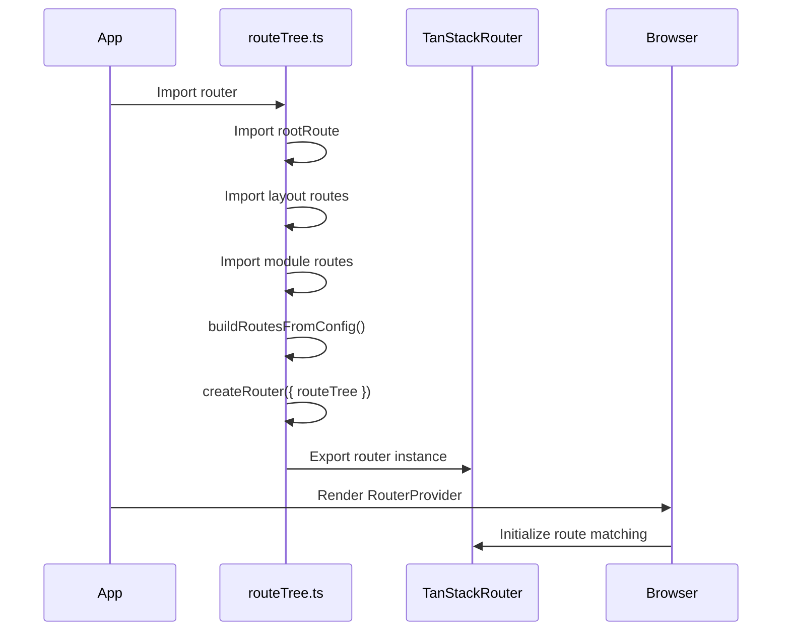
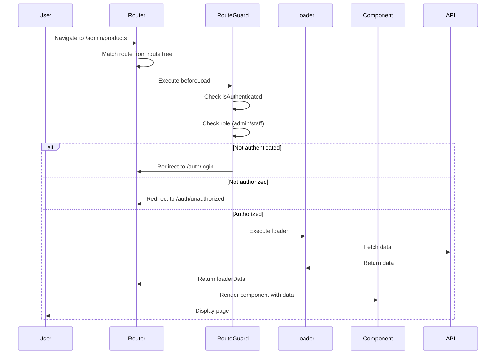
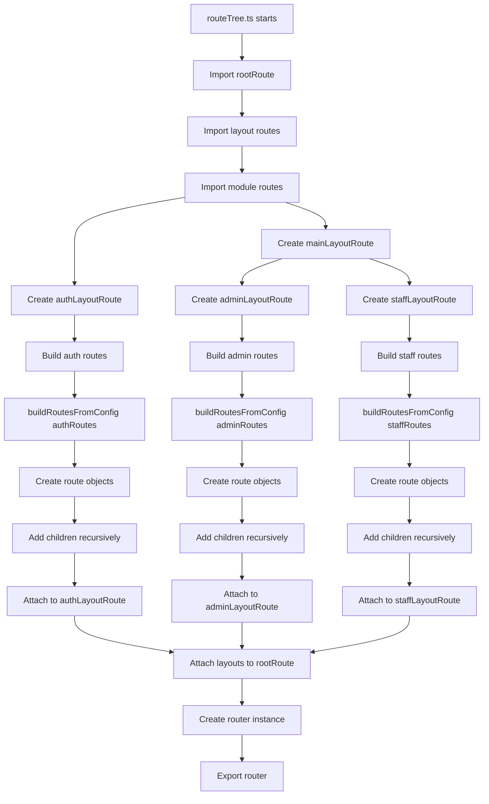
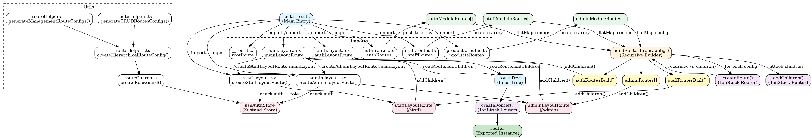
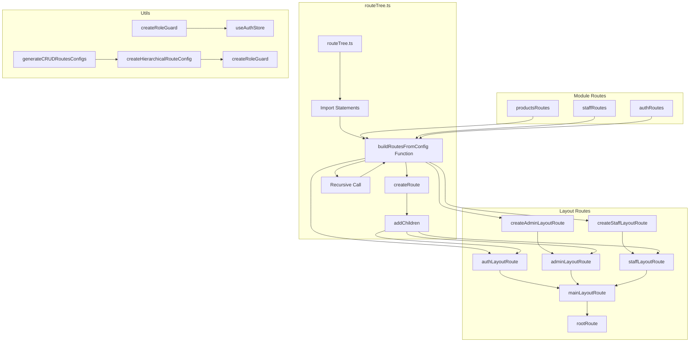
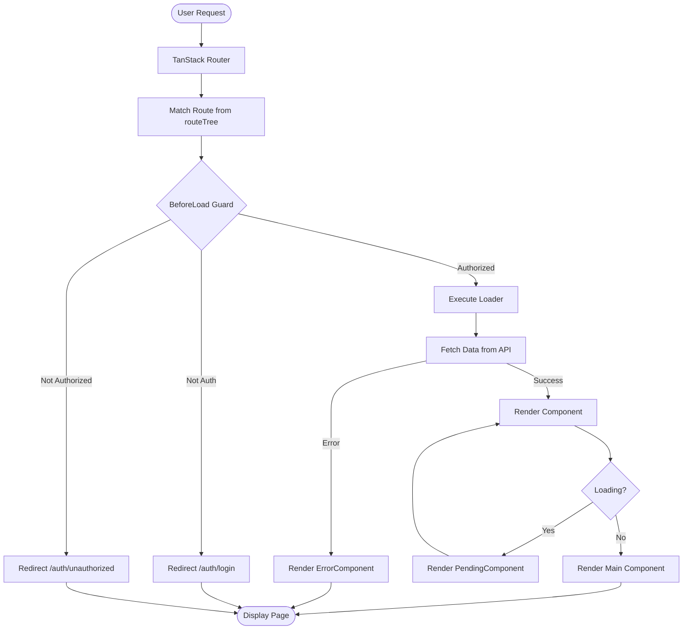
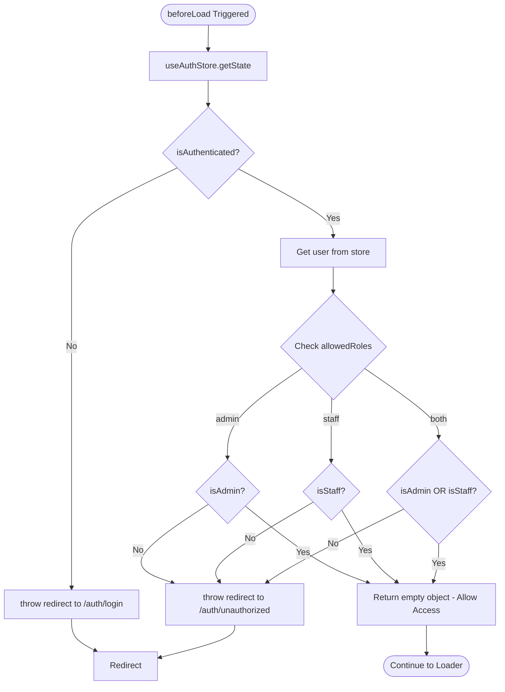

# Kiến Trúc Routing - Tài Liệu Nội Bộ

## Mục Lục

1. [Tổng Quan](#tổng-quan)
2. [Kiến Trúc Tổng Thể](#kiến-trúc-tổng-thể)
3. [Các Khái Niệm Cốt Lõi](#các-khái-niệm-cốt-lõi)
4. [Luồng Xử Lý Routing](#luồng-xử-lý-routing)
5. [Call Graph & Control Flow](#call-graph--control-flow)
6. [Hướng Dẫn Tạo Module Mới](#hướng-dẫn-tạo-module-mới)
7. [Best Practices](#best-practices)

---

## Tổng Quan

Dự án sử dụng **TanStack Router** với mô hình **Code-Based Routing** kết hợp **Feature-Sliced Design (FSD)**. Khác với file-based routing truyền thống, hệ thống routing được định nghĩa thông qua các **Module Routes** và được xây dựng động bằng hàm đệ quy `buildRoutesFromConfig`.

### Đặc Điểm Chính

- ✅ **Type-safe routing** với TypeScript
- ✅ **Module-based organization** - mỗi domain có module route riêng
- ✅ **Hierarchical route structure** - hỗ trợ nested routes
- ✅ **Role-based access control** - tích hợp guard cho admin/staff
- ✅ **Layout separation** - tách biệt auth layout và main layout (có sidebar)
- ✅ **Proxy Route Pattern** - routes chỉ là lớp "đấu dây", UI logic nằm trong FSD layers

---

## Kiến Trúc Tổng Thể

### Cấu Trúc Thư Mục

```
frontend/src/app/routes/
├── __root.tsx                    # Root route (entry point)
├── routeTree.ts                  # File chính xây dựng route tree
├── type/
│   └── types.ts                  # Type definitions (ModuleRoutes, HierarchicalModuleRouteConfig)
├── utils/
│   ├── routeGuards.ts           # Authentication & authorization guards
│   └── routeHelpers.ts          # Helper functions (generateCRUDRoutesConfigs, etc.)
├── layout/
│   ├── auth.layout.tsx          # Auth layout (không có sidebar)
│   ├── main.layout.tsx          # Main layout (có sidebar)
│   ├── admin.layout.tsx         # Admin layout (con của main)
│   └── staff.layout.tsx        # Staff layout (con của main)
└── modules/
    ├── auth.routes.ts           # Auth module routes
    ├── staff.routes.ts          # Staff module routes
    └── management/
        ├── products.routes.ts   # Products module routes
        ├── users.routes.ts      # Users module routes
        └── ...                  # Các module khác
```

### Cây Route Hierarchy

```
rootRoute (/)
├── authLayoutRoute (/auth)
│   └── authRoutes
│       ├── /auth/login
│       ├── /auth/register
│       ├── /auth/forgot-password
│       ├── /auth/reset-password
│       ├── /auth/profile
│       └── /auth/unauthorized
│
└── mainLayoutRoute (/)
    ├── adminLayoutRoute (/admin)
    │   └── adminModuleRoutes
    │       ├── /admin/products
    │       ├── /admin/products/create
    │       ├── /admin/products/$id
    │       ├── /admin/products/$id/edit
    │       ├── /admin/users
    │       ├── /admin/categories
    │       └── ... (các module khác)
    │
    └── staffLayoutRoute (/staff)
        └── staffModuleRoutes
            ├── /staff/order
            └── /staff/qr-scanner
```

---

## Các Khái Niệm Cốt Lõi

### 1. ModuleRoutes

**Định nghĩa**: Interface đại diện cho một module routing hoàn chỉnh.

```typescript
interface ModuleRoutes<TConfigs> {
  moduleName: string;      // Tên module (để debug/logging)
  basePath: string;         // Base path của module (ví dụ: '/admin', '/staff')
  routes: TConfigs;         // Mảng các route configs
}
```

**Vai trò**:
- Nhóm các routes theo domain/feature
- Cung cấp metadata về module (tên, base path)
- Cho phép tái sử dụng và tổ chức code tốt hơn

**Ví dụ**:
```typescript
export const staffRoutes: ModuleRoutes<any> = {
  moduleName: 'staff',
  basePath: '/staff',
  routes: [
    {
      path: '/staff',
      children: [
        { path: 'order', component: StaffOrderPage },
        { path: 'qr-scanner', component: QRScannerPage },
      ],
    },
  ],
};
```

### 2. HierarchicalModuleRouteConfig

**Định nghĩa**: Cấu hình route có thể có children (nested routes).

```typescript
type HierarchicalModuleRouteConfig = ModuleRouteConfig & {
  children?: HierarchicalModuleRouteConfig[];
};
```

**Các thuộc tính quan trọng**:
- `path`: Đường dẫn route (tương đối hoặc tuyệt đối)
- `component`: React component để render
- `loader`: Function fetch data trước khi render
- `beforeLoad`: Guard function (authentication/authorization)
- `searchSchema`: Zod schema để validate search params
- `pendingComponent`: Component hiển thị khi đang load
- `errorComponent`: Component hiển thị khi có lỗi
- `meta`: Metadata (title, description, requiresAuth)
- `children`: Mảng các route con (nested)

**Ví dụ**:
```typescript
{
  path: '/admin',
  children: [
    {
      path: 'products',
      component: ProductsListPage,
      loader: productsListLoader,
      beforeLoad: createRoleGuard(['admin']),
      children: [
        {
          path: '$id',
          component: ProductDetailPage,
          loader: productDetailLoader,
        },
      ],
    },
  ],
}
```

### 3. Layout Routes

**Định nghĩa**: Routes đóng vai trò là container/layout cho các routes con.

#### authLayoutRoute
- **Path**: `/auth`
- **Layout**: `AuthLayout` (không có sidebar)
- **Mục đích**: Chứa các routes liên quan đến authentication

#### mainLayoutRoute
- **Path**: `/`
- **Layout**: `MainLayout` (có sidebar)
- **Guard**: `requireAuth` - yêu cầu đăng nhập
- **Mục đích**: Layout chính cho các trang sau khi đăng nhập

#### adminLayoutRoute
- **Path**: `/admin`
- **Parent**: `mainLayoutRoute`
- **Guard**: Kiểm tra authentication (không kiểm tra role ở layout level)
- **Mục đích**: Nhóm các routes dành cho admin

#### staffLayoutRoute
- **Path**: `/staff`
- **Parent**: `mainLayoutRoute`
- **Guard**: Kiểm tra authentication + role === 1 (staff)
- **Mục đích**: Nhóm các routes dành cho staff

**Pattern tạo layout route**:
```typescript
export function createAdminLayoutRoute(parentRoute: AnyRoute) {
  return createRoute({
    getParentRoute: () => parentRoute,
    path: 'admin',
    component: () => <Outlet />,
    beforeLoad: async () => {
      const { isAuthenticated } = useAuthStore.getState();
      if (!isAuthenticated) {
        throw redirect({ to: '/auth/login' });
      }
    },
  });
}
```

### 4. Route Guards

**Định nghĩa**: Functions kiểm tra quyền truy cập trước khi render route.

#### createRoleGuard

```typescript
function createRoleGuard(allowedRoles: AllowedRoles[]): GuardFunction
```

**Roles được hỗ trợ**:
- `'admin'`: Chỉ admin (role === 0)
- `'staff'`: Chỉ staff (role === 1)
- `'both'`: Cả admin và staff

**Luồng xử lý**:
1. Kiểm tra `isAuthenticated` → redirect `/auth/login` nếu chưa đăng nhập
2. Kiểm tra role → redirect `/auth/unauthorized` nếu không có quyền
3. Return `{}` nếu pass

**Ví dụ sử dụng**:
```typescript
beforeLoad: createRoleGuard(['admin'])        // Chỉ admin
beforeLoad: createRoleGuard(['staff'])        // Chỉ staff
beforeLoad: createRoleGuard(['admin', 'staff']) // Cả hai
```

#### Helper Functions

- `requireAdmin(ctx)`: Alias cho `createRoleGuard(['admin'])`
- `requireStaff(ctx)`: Alias cho `createRoleGuard(['staff'])`
- `requireAuth(ctx)`: Alias cho `createRoleGuard(['both'])`

### 5. buildRoutesFromConfig

**Định nghĩa**: Hàm đệ quy chuyển đổi `HierarchicalModuleRouteConfig[]` thành `AnyRoute[]` của TanStack Router.

**Signature**:
```typescript
function buildRoutesFromConfig(
  configs: HierarchicalModuleRouteConfig[],
  parentRoute: AnyRoute,
): AnyRoute[]
```

**Luồng xử lý**:
1. Map qua từng config
2. Tạo `createRoute` với các thuộc tính từ config
3. Nếu config có `children`, gọi đệ quy để build children
4. Gắn children vào route cha bằng `addChildren`
5. Return mảng routes đã tạo

**Điểm quan trọng**:
- Hàm này là **core** của hệ thống routing
- Cho phép định nghĩa routes theo cấu trúc phân cấp (hierarchical)
- Tự động xử lý loader, search schema, guards, components

### 6. Route Helpers

#### generateCRUDRoutesConfigs

**Mục đích**: Tạo tự động 4 routes CRUD (List, Create, Detail, Edit) từ một definition.

**Input**: `CrudModuleDefinition`
```typescript
{
  entityName: string;
  basePath: string;
  components: { list, detail, create, edit };
  loaders: { list, detail };
  searchSchemas: { list };
  allowedRoles?: AllowedRoles[];
}
```

**Output**: `HierarchicalModuleRouteConfig[]` với 4 routes:
- `basePath` → List page
- `basePath/create` → Create page
- `basePath/$id` → Detail page
- `basePath/$id/edit` → Edit page

#### generateManagementRouteConfigs

**Mục đích**: Tạo config cho một trang quản lý đơn lẻ (không có CRUD con).

**Input**: `ManagementRouteDefinition`
```typescript
{
  entityName: string;
  path: string;
  component: RouteComponent;
  loader: LoaderFunction;
  searchSchema: ZodSchema;
  allowedRoles?: AllowedRoles[];
}
```

**Output**: `HierarchicalModuleRouteConfig[]` với 1 route

---

## Luồng Xử Lý Routing

### 1. Khởi Tạo Router (App Startup)



### 2. Navigation Flow (User Navigates)



### 3. Route Tree Construction Flow



---

## Call Graph & Control Flow

### Call Graph - Route Tree Construction

> **Hình ảnh Call Graph chi tiết**: Xem file [routing-call-graph.png](./routing-call-graph.png) hoặc file nguồn [routing-call-graph.dot](./routing-call-graph.dot) để chỉnh sửa.





### Control Flow - Request Handling



### Control Flow - Route Guard Execution



### Control Flow - buildRoutesFromConfig Recursion

```mermaid
flowchart TD
    Start([buildRoutesFromConfig called]) --> Input[Input: configs[], parentRoute]
    Input --> Map[Map over configs]
    
    Map --> CreateRoute[createRoute with config]
    CreateRoute --> SetProps[Set: path, component, loader, beforeLoad, etc.]
    
    SetProps --> CheckChildren{Has children?}
    
    CheckChildren -->|Yes| Recursive[Call buildRoutesFromConfig children, newRoute]
    Recursive --> CreateChildRoutes[Create child routes]
    CreateChildRoutes --> AddChildren[newRoute.addChildren childRoutes]
    AddChildren --> Return[Return newRoute]
    
    CheckChildren -->|No| Return
    
    Return --> NextConfig{More configs?}
    NextConfig -->|Yes| Map
    NextConfig -->|No| ReturnArray[Return Array of Routes]
    
    ReturnArray --> End([Routes Built])
```

---

## Hướng Dẫn Tạo Module Mới

### Bước 1: Tạo Module Route File

**Vị trí**: `frontend/src/app/routes/modules/[module-name].routes.ts`

**Template cơ bản**:
```typescript
import type { ModuleRoutes } from '../type/types';
import { YourPageComponent } from '../../../features/your-feature/pages/YourPage';
import { PendingComponent } from '../../../components/feedback/PendingComponent';
import { ErrorComponent } from '../../../components/feedback/ErrorComponent';
import { createRoleGuard } from '../utils/routeGuards';

export const yourModuleRoutes: ModuleRoutes<any> = {
  moduleName: 'your-module',
  basePath: '/admin', // hoặc '/staff' tùy module
  routes: [
    {
      path: '/admin', // Route cha
      children: [
        {
          path: 'your-path',
          component: YourPageComponent,
          pendingComponent: PendingComponent,
          errorComponent: ErrorComponent,
          beforeLoad: createRoleGuard(['admin']), // hoặc ['staff'], ['admin', 'staff']
          meta: {
            title: 'Tiêu đề trang',
            description: 'Mô tả trang',
            requiresAuth: true,
          },
        },
      ],
    },
  ],
};
```

### Bước 2: Đăng Ký Module trong routeTree.ts

**Thêm import**:
```typescript
import { yourModuleRoutes } from './modules/your-module.routes';
```

**Thêm vào mảng module tương ứng**:
```typescript
// Nếu là admin module
const adminModuleRoutes: ModuleRoutes<any>[] = [
  productsRoutes,
  usersRoutes,
  // ... các module khác
  yourModuleRoutes, // ← Thêm vào đây
];

// Nếu là staff module
const staffModuleRoutes: ModuleRoutes<any>[] = [
  staffRoutes,
  yourModuleRoutes, // ← Thêm vào đây
];
```

**Lưu ý**: Routes sẽ tự động được build và attach vào layout tương ứng nhờ logic đã có sẵn trong `routeTree.ts`.

### Bước 3: Tạo Page Component (FSD Layer)

**Vị trí**: `frontend/src/features/your-feature/pages/YourPage.tsx`

**Template**:
```typescript
export const YourPage = () => {
  // Component logic ở đây
  return <div>Your Page Content</div>;
};
```

### Bước 4: (Tùy chọn) Thêm Loader

Nếu route cần fetch data trước khi render:

```typescript
{
  path: 'your-path',
  component: YourPageComponent,
  loader: async ({ context, params }) => {
    // Fetch data using context.queryClient
    const data = await context.queryClient.fetchQuery({
      queryKey: ['your-key'],
      queryFn: () => fetchYourData(),
    });
    return data;
  },
  // ... các thuộc tính khác
}
```

### Bước 5: (Tùy chọn) Thêm Search Schema

Nếu route có search params (pagination, filter, etc.):

```typescript
import { baseSearchSchema } from '../type/types';
import { z } from 'zod';

const yourSearchSchema = baseSearchSchema.extend({
  filter: z.string().optional(),
});

{
  path: 'your-path',
  component: YourPageComponent,
  searchSchema: yourSearchSchema,
  loader: async ({ context, search }) => {
    // search đã được validate theo schema
    const { page, pageSize, filter } = search;
    // ...
  },
  // ...
}
```

---

## Best Practices

### 1. Tổ Chức Module Routes

✅ **DO**:
- Nhóm routes theo domain/feature
- Đặt tên module rõ ràng (`productsRoutes`, `staffRoutes`)
- Sử dụng `basePath` nhất quán với layout (`/admin`, `/staff`)

❌ **DON'T**:
- Trộn lẫn routes của nhiều domain trong một module
- Đặt tên module mơ hồ (`routes1`, `moduleA`)

### 2. Route Guards

✅ **DO**:
- Sử dụng `createRoleGuard` cho tất cả routes cần authorization
- Kiểm tra authentication ở layout level (mainLayoutRoute)
- Kiểm tra role ở route level (trong `beforeLoad`)

❌ **DON'T**:
- Bỏ qua guard cho routes nhạy cảm
- Kiểm tra role ở nhiều nơi (duplicate logic)

### 3. Loader & Data Fetching

✅ **DO**:
- Sử dụng `context.queryClient` trong loader
- Return data từ loader để component có thể access
- Sử dụng `queryOptions` để share query config giữa loader và component

❌ **DON'T**:
- Fetch data trong component thay vì loader (trừ khi cần client-side only)
- Duplicate fetch logic giữa loader và component

### 4. Error Handling

✅ **DO**:
- Luôn cung cấp `errorComponent` cho routes
- Sử dụng `PendingComponent` cho loading state
- Handle errors gracefully trong loader

❌ **DON'T**:
- Bỏ qua error handling
- Hiển thị error trực tiếp trong component (nên dùng errorComponent)

### 5. Type Safety

✅ **DO**:
- Sử dụng TypeScript types từ `types.ts`
- Type loader data, params, search params
- Sử dụng Zod schemas cho search params validation

❌ **DON'T**:
- Sử dụng `any` khi có thể type được
- Bỏ qua type definitions

### 6. Code Organization

✅ **DO**:
- Giữ `routeTree.ts` tập trung vào việc build route tree
- Đặt logic business trong FSD layers (features, pages, entities)
- Sử dụng helper functions (`generateCRUDRoutesConfigs`, etc.)

❌ **DON'T**:
- Đặt business logic trong route files
- Làm `routeTree.ts` quá phức tạp (nên tách logic nếu cần)

---

## Tóm Tắt

### Kiến Trúc Routing của Dự Án

1. **Code-Based Routing**: Routes được định nghĩa bằng TypeScript configs, không phải file structure
2. **Module-Based Organization**: Mỗi domain có module route riêng
3. **Hierarchical Structure**: Hỗ trợ nested routes thông qua `children`
4. **Layout Separation**: Tách biệt auth layout và main layout
5. **Role-Based Access**: Tích hợp guards cho admin/staff
6. **Proxy Route Pattern**: Routes chỉ là lớp "đấu dây", UI logic trong FSD layers

### Các File Quan Trọng

- `routeTree.ts`: File chính xây dựng route tree
- `types.ts`: Type definitions
- `routeGuards.ts`: Authentication/authorization guards
- `routeHelpers.ts`: Helper functions để generate routes
- `modules/*.routes.ts`: Module route definitions
- `layout/*.layout.tsx`: Layout route definitions

### Quy Trình Thêm Module Mới

1. Tạo file module route (`modules/[name].routes.ts`)
2. Đăng ký trong `routeTree.ts` (thêm vào `adminModuleRoutes` hoặc `staffModuleRoutes`)
3. Tạo page component trong FSD layer
4. (Tùy chọn) Thêm loader, search schema, guards

---

**Tài liệu này được cập nhật lần cuối**: [Ngày hiện tại]  
**Phiên bản**: 1.0.0  
**Tác giả**: Development Team

