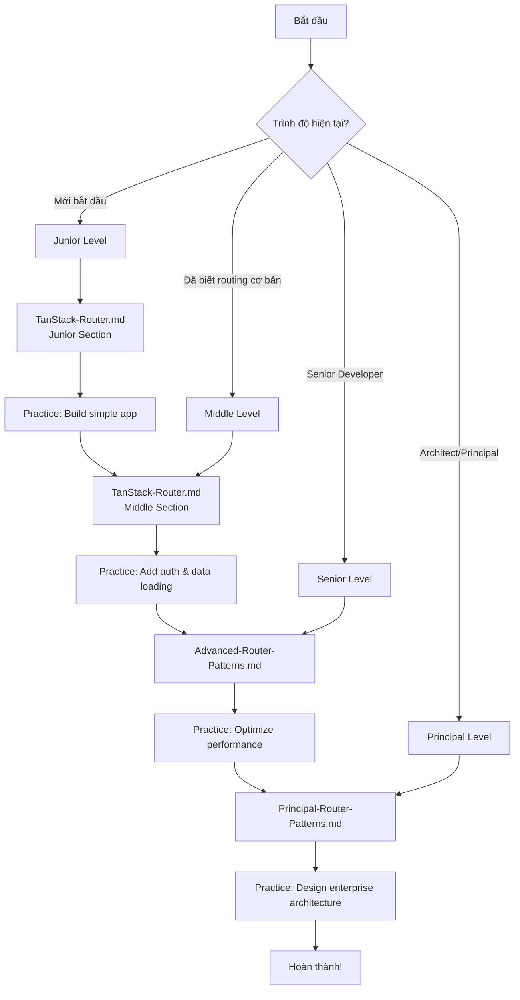

# TanStack Router Documentation

Tài liệu toàn diện về **TanStack Router** - Type-safe routing library cho React.

## 📚 Cấu Trúc Tài Liệu

Tài liệu được chia thành 4 levels theo trình độ:

### 1. **TanStack-Router.md** (Junior & Middle Levels)
**Dành cho:** Developers mới bắt đầu với TanStack Router

**Nội dung:**
- ✅ **Junior Level:**
  - Giới thiệu về TanStack Router
  - So sánh với React Router
  - Installation và setup cơ bản
  - Route definition (code-based & file-based)
  - Navigation và Link component
  - Route parameters và query params
  - Basic layouts
  - **7 code examples** với giải thích chi tiết

- ✅ **Middle Level:**
  - Nested routes và route hierarchy
  - Route loaders và data fetching
  - Route guards và authentication
  - Search params validation với Zod
  - Route context và data sharing
  - Error boundaries và error handling
  - Code splitting và lazy loading
  - **7 complex examples** với best practices

**Thời gian học:** 8-12 giờ

---

### 2. **Advanced-Router-Patterns.md** (Senior Level)
**Dành cho:** Senior developers cần patterns nâng cao

**Nội dung:**
- ✅ Advanced route patterns (parallel routes, catch-all, route masking)
- ✅ Route preloading strategies (intelligent preloading, viewport-based)
- ✅ Custom route matching
- ✅ Route transitions và animations (Framer Motion, View Transitions API)
- ✅ State management integration (Zustand, Redux)
- ✅ Performance optimization (caching, memoization, bundle optimization)
- ✅ Testing routing logic (unit tests, integration tests, E2E tests)
- **7 advanced examples** với architecture patterns

**Thời gian học:** 6-8 giờ

---

### 3. **Principal-Router-Patterns.md** (Principal Level)
**Dành cho:** Principal/Staff engineers và architects

**Nội dung:**
- ✅ Large-scale routing architecture (modular organization, route registry)
- ✅ File-based routing systems (auto-generation, route tree generation)
- ✅ SSR/SSG với TanStack Router (Express SSR, static generation, streaming)
- ✅ Route-based code splitting strategies
- ✅ Micro-frontends routing patterns (Module Federation, cross-app navigation)
- ✅ Route analytics và monitoring (performance tracking, user journey, error tracking)
- ✅ Migration strategies từ React Router
- ✅ Performance tuning ở quy mô lớn
- **8 enterprise-level examples**

**Thời gian học:** 8-10 giờ

---

## 🎯 Learning Path



---

## 🚀 Quick Start

### Bước 1: Chọn Level Phù Hợp

**Junior Developer:**
- Chưa biết TanStack Router
- Mới làm quen với React routing
- → Bắt đầu với `TanStack-Router.md` (Junior section)

**Middle Developer:**
- Đã biết React Router hoặc routing cơ bản
- Cần học data loading và authentication
- → Bắt đầu với `TanStack-Router.md` (Middle section)

**Senior Developer:**
- Đã thành thạo routing cơ bản
- Cần optimize performance và testing
- → Bắt đầu với `Advanced-Router-Patterns.md`

**Principal/Staff Engineer:**
- Cần thiết kế architecture cho large-scale apps
- Quan tâm đến SSR/SSG, micro-frontends
- → Bắt đầu với `Principal-Router-Patterns.md`

### Bước 2: Học Theo Thứ Tự

1. **Đọc lý thuyết** - Hiểu concepts và patterns
2. **Chạy examples** - Copy code và test locally
3. **Thực hành** - Build features tương tự
4. **Review best practices** - Học từ common pitfalls
5. **Lặp lại** - Practice makes perfect!

### Bước 3: Thực Hành

**Junior Level Projects:**
- Blog với routing cơ bản
- Product catalog với filters
- Simple authentication flow

**Middle Level Projects:**
- E-commerce với nested routes
- Dashboard với data loading
- Multi-step form với route guards

**Senior Level Projects:**
- Optimized SPA với code splitting
- App với complex state management
- Comprehensive test suite

**Principal Level Projects:**
- SSR/SSG application
- Micro-frontends architecture
- Migration từ React Router

---

## 📖 Cách Sử Dụng Tài Liệu

### Đọc Code Examples

Mỗi example trong tài liệu có cấu trúc:

```typescript
// Example 1: Mô tả ngắn gọn
import { createFileRoute } from '@tanstack/react-router'

export const Route = createFileRoute('/products')({
  component: ProductsPage,
})

function ProductsPage() {
  return <div>Products</div>
}
```

**Sau mỗi example:**
- ✅ Giải thích chi tiết từng dòng code
- ✅ Use cases thực tế
- ✅ Common mistakes cần tránh
- ✅ Performance implications

### Symbols và Conventions

- ✅ **GOOD** - Best practice, nên làm theo
- ❌ **BAD** - Anti-pattern, tránh làm
- ⚠️ **WARNING** - Cần chú ý, có thể gây issues
- 💡 **TIP** - Mẹo hữu ích
- 🔥 **PERFORMANCE** - Liên quan đến performance

---

## 🎓 Skill Levels Summary

### Junior Level
**Mục tiêu:** Hiểu cơ bản về routing và navigation

**Key Concepts:**
- Route definition
- Navigation với Link
- Route parameters
- Basic layouts

**Thời gian:** 4-6 giờ

---

### Middle Level
**Mục tiêu:** Xây dựng production-ready routing

**Key Concepts:**
- Nested routes
- Data loading với loaders
- Authentication guards
- Search params validation
- Error handling

**Thời gian:** 6-8 giờ

---

### Senior Level
**Mục tiêu:** Optimize và test routing logic

**Key Concepts:**
- Advanced patterns
- Performance optimization
- State management integration
- Comprehensive testing

**Thời gian:** 6-8 giờ

---

### Principal Level
**Mục tiêu:** Design enterprise-scale routing architecture

**Key Concepts:**
- Large-scale architecture
- SSR/SSG
- Micro-frontends
- Migration strategies
- Production monitoring

**Thời gian:** 8-10 giờ

---

## 🔗 External Resources

### Official Documentation
- [TanStack Router Docs](https://tanstack.com/router/latest)
- [TanStack Router GitHub](https://github.com/tanstack/router)
- [API Reference](https://tanstack.com/router/latest/docs/framework/react/api)

### Video Tutorials
- [TanStack Router Introduction](https://www.youtube.com/watch?v=qOwnQJOClrw)
- [File-Based Routing](https://www.youtube.com/watch?v=2QqMvNWlzHo)

### Community
- [TanStack Discord](https://discord.com/invite/tanstack)
- [GitHub Discussions](https://github.com/TanStack/router/discussions)
- [Twitter](https://twitter.com/tannerlinsley)

### Related Libraries
- [TanStack Query](https://tanstack.com/query/latest) - Data fetching
- [Zod](https://zod.dev/) - Schema validation
- [Zustand](https://zustand-demo.pmnd.rs/) - State management

---

## 📊 Tổng Quan Nội Dung

| File | Lines | Examples | Topics | Level |
|------|-------|----------|--------|-------|
| TanStack-Router.md | 1,379 | 14 | 13 | Junior & Middle |
| Advanced-Router-Patterns.md | 1,033 | 7 | 7 | Senior |
| Principal-Router-Patterns.md | 1,505 | 8 | 8 | Principal |
| **TOTAL** | **3,917** | **29** | **28** | **All Levels** |

---

## ✨ Highlights

### Comprehensive Coverage
- **3,917 dòng** tài liệu chi tiết
- **29 code examples** thực tế
- **28 topics** từ cơ bản đến nâng cao
- **100% TypeScript** examples

### Quality Content
- ✅ Giải thích chi tiết từng dòng code
- ✅ Real-world use cases
- ✅ Common pitfalls và solutions
- ✅ Best practices cho mỗi level
- ✅ Performance implications
- ✅ Testing strategies

### Structured Learning
- 📝 4 skill levels rõ ràng
- 🎯 Learning path với Mermaid diagram
- 📚 Progressive complexity
- 🔗 External resources

---

## 🤝 Contributing

Nếu bạn tìm thấy lỗi hoặc muốn đóng góp:
1. Tạo issue mô tả vấn đề
2. Submit pull request với fixes
3. Đề xuất topics mới

---

## 📝 License

Tài liệu này được tạo cho mục đích học tập và tham khảo.

---

**Chúc bạn học tốt! 🚀**

Bắt đầu từ file phù hợp với level của bạn và thực hành thường xuyên để thành thạo TanStack Router!

