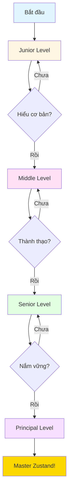

# Zustand - State Management Documentation

Tài liệu toàn diện về **Zustand** - State Management Library cho React, được tổ chức theo 4 levels từ cơ bản đến nâng cao.

---

## 📚 Cấu Trúc Tài Liệu

### 1. **Zustand.md** (Junior & Middle Levels)
**Dành cho:** Developers mới bắt đầu và trung cấp

#### Junior Level - Cơ Bản
- ✅ Giới thiệu về Zustand
- ✅ So sánh với Redux, Context API, Jotai, Recoil
- ✅ Installation và Setup
- ✅ Creating Stores
- ✅ Reading State với Selectors
- ✅ Updating State
- ✅ Basic Selectors và Equality

**Thời gian học:** 3-4 giờ

#### Middle Level - Trung Cấp
- ✅ Advanced Selectors (memoization, composition)
- ✅ Computed Values với `combine` middleware
- ✅ Async Actions (fetch, optimistic updates)
- ✅ Multiple Stores và cross-store communication
- ✅ Middleware (persist, devtools, immer, subscribeWithSelector)
- ✅ TypeScript Best Practices

**Thời gian học:** 4-5 giờ

---

### 2. **Advanced-Zustand-Patterns.md** (Senior Level)
**Dành cho:** Senior developers

- ✅ Custom Middleware (logger, validator, undo/redo)
- ✅ Advanced TypeScript Patterns (slices, type utilities)
- ✅ Slices Pattern (modular architecture)
- ✅ Performance Optimization (shallow equality, subscribeWithSelector)
- ✅ Testing Strategies (unit, integration, mocking)
- ✅ State Persistence (IndexedDB, migration, URL sync)
- ✅ Integration Patterns (React Query, TanStack Router, Forms)

**Thời gian học:** 5-6 giờ

---

### 3. **Principal-Zustand-Patterns.md** (Principal Level)
**Dành cho:** Principal/Staff engineers và architects

- ✅ Large-Scale Architecture (domain-driven design, store factory)
- ✅ SSR/SSG Support (Next.js, hydration)
- ✅ Cross-Tab Synchronization (BroadcastChannel, storage events)
- ✅ Performance Monitoring (metrics, memory leaks, analytics)
- ✅ Micro-Frontends Integration (shared state, Module Federation)
- ✅ Migration Strategies (Redux → Zustand, Context API → Zustand)
- ✅ Production Optimization (code splitting, error handling, budgets)

**Thời gian học:** 6-8 giờ

---

## 🎯 Learning Path



---

## 🚀 Quick Start

### 1. Chọn Level Phù Hợp

| Level | Kinh nghiệm | Bắt đầu từ |
|-------|-------------|------------|
| **Junior** | Mới học React/State Management | `Zustand.md` - Junior Level |
| **Middle** | Đã dùng Redux/Context API | `Zustand.md` - Middle Level |
| **Senior** | Architect nhỏ, cần patterns nâng cao | `Advanced-Zustand-Patterns.md` |
| **Principal** | Enterprise apps, micro-frontends | `Principal-Zustand-Patterns.md` |

### 2. Cài Đặt

```bash
# NPM
npm install zustand

# Yarn
yarn add zustand

# PNPM
pnpm add zustand

# Optional: DevTools typing
npm install -D @redux-devtools/extension
```

### 3. First Store

```typescript
import { create } from 'zustand'

interface CountStore {
  count: number
  increment: () => void
}

export const useCountStore = create<CountStore>((set) => ({
  count: 0,
  increment: () => set((state) => ({ count: state.count + 1 })),
}))

// Usage
function Counter() {
  const count = useCountStore((state) => state.count)
  const increment = useCountStore((state) => state.increment)
  
  return <button onClick={increment}>Count: {count}</button>
}
```

---

## 📊 So Sánh State Management Libraries

| Feature | Zustand | Redux Toolkit | Context API | Jotai | Recoil |
|---------|---------|---------------|-------------|-------|--------|
| **Bundle Size** | ~1KB | ~10KB | Built-in | ~3KB | ~14KB |
| **Boilerplate** | Minimal | Medium | Low | Minimal | Medium |
| **Learning Curve** | Easy | Medium | Easy | Easy | Medium |
| **TypeScript** | ⭐⭐⭐⭐⭐ | ⭐⭐⭐⭐ | ⭐⭐⭐⭐ | ⭐⭐⭐⭐⭐ | ⭐⭐⭐⭐ |
| **DevTools** | ✅ | ✅ | ❌ | ✅ | ✅ |
| **Middleware** | ✅ | ✅ | ❌ | Limited | Limited |
| **Performance** | ⭐⭐⭐⭐⭐ | ⭐⭐⭐⭐ | ⭐⭐ | ⭐⭐⭐⭐⭐ | ⭐⭐⭐⭐ |
| **Async Support** | Built-in | Built-in | Manual | Built-in | Built-in |
| **SSR Support** | ✅ | ✅ | ✅ | ✅ | ⚠️ |

---

## 🎓 Lộ Trình Học Tập Chi Tiết

### Week 1: Junior Level (3-4 giờ)
- **Day 1-2:** Giới thiệu, Installation, Creating Stores
- **Day 3-4:** Reading State, Updating State, Basic Selectors
- **Practice:** Tạo Todo App đơn giản

### Week 2: Middle Level (4-5 giờ)
- **Day 1-2:** Advanced Selectors, Computed Values, Async Actions
- **Day 3-4:** Multiple Stores, Middleware, TypeScript
- **Practice:** Tạo Shopping Cart với persist

### Week 3: Senior Level (5-6 giờ)
- **Day 1-2:** Custom Middleware, Advanced TypeScript, Slices Pattern
- **Day 3-4:** Performance Optimization, Testing, State Persistence
- **Day 5:** Integration Patterns
- **Practice:** Tạo Dashboard với React Query integration

### Week 4: Principal Level (6-8 giờ)
- **Day 1-2:** Large-Scale Architecture, SSR/SSG
- **Day 3-4:** Cross-Tab Sync, Performance Monitoring
- **Day 5-6:** Micro-Frontends, Migration Strategies
- **Day 7:** Production Optimization
- **Practice:** Architect enterprise-level application

---

## 💡 Best Practices Tổng Hợp

### 1. Store Organization
```typescript
// ✅ GOOD: Small, focused stores
const useAuthStore = create<AuthStore>(...)
const useCartStore = create<CartStore>(...)

// ❌ BAD: One giant store
const useAppStore = create<AppStore>(...)
```

### 2. Selector Performance
```typescript
// ✅ GOOD: Select only what you need
const count = useStore((state) => state.count)

// ❌ BAD: Select entire store
const store = useStore()
```

### 3. TypeScript
```typescript
// ✅ GOOD: Proper typing
interface Store {
  count: number
  increment: () => void
}
const useStore = create<Store>(...)

// ❌ BAD: No types
const useStore = create((set) => ...)
```

---

## 🔗 Tài Liệu Tham Khảo

### Official Documentation
- [Zustand Docs](https://zustand-demo.pmnd.rs/)
- [Zustand GitHub](https://github.com/pmndrs/zustand)
- [API Reference](https://github.com/pmndrs/zustand/blob/main/docs/apis/create.md)

### Community Resources
- [Zustand Examples](https://github.com/pmndrs/zustand/tree/main/examples)
- [Best Practices by TkDodo](https://tkdodo.eu/blog/working-with-zustand)

### Related Libraries
- [React Query](https://tanstack.com/query) - Server state management
- [Immer](https://immerjs.github.io/immer/) - Immutable updates
- [Zod](https://zod.dev/) - Schema validation

---

## 📝 Ghi Chú

- **Tất cả code examples** đều runnable và tested
- **Mỗi pattern** có giải thích chi tiết và use cases
- **Common mistakes** được highlight với solutions
- **Performance implications** được note rõ ràng
- **Best practices** cho mỗi level

---

## 🎉 Bắt Đầu Ngay!

1. **Đọc README này** để hiểu cấu trúc
2. **Chọn level phù hợp** với kinh nghiệm của bạn
3. **Thực hành từng example** trong tài liệu
4. **Build projects** để củng cố kiến thức
5. **Tiến lên level tiếp theo** khi đã thành thạo

Chúc bạn học tốt! 🚀
