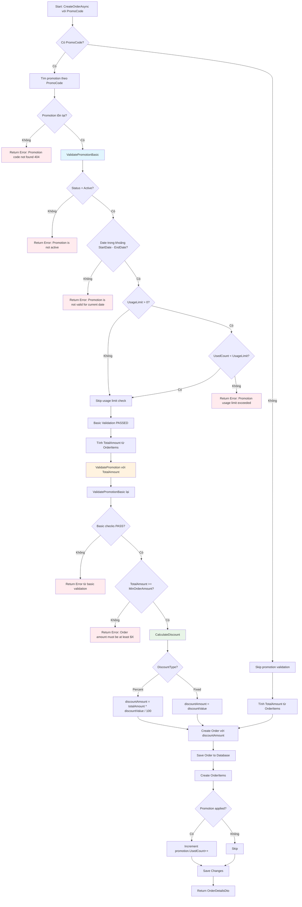
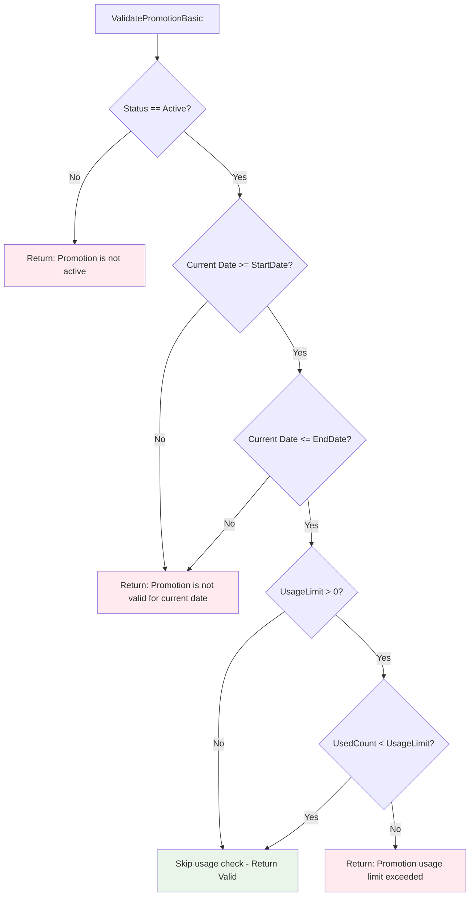
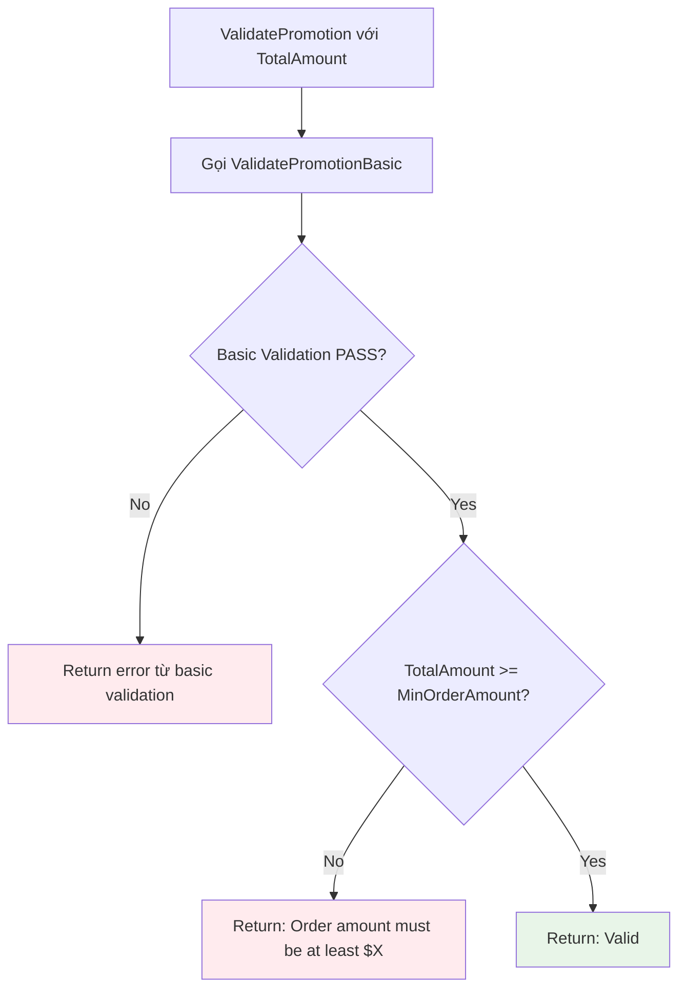
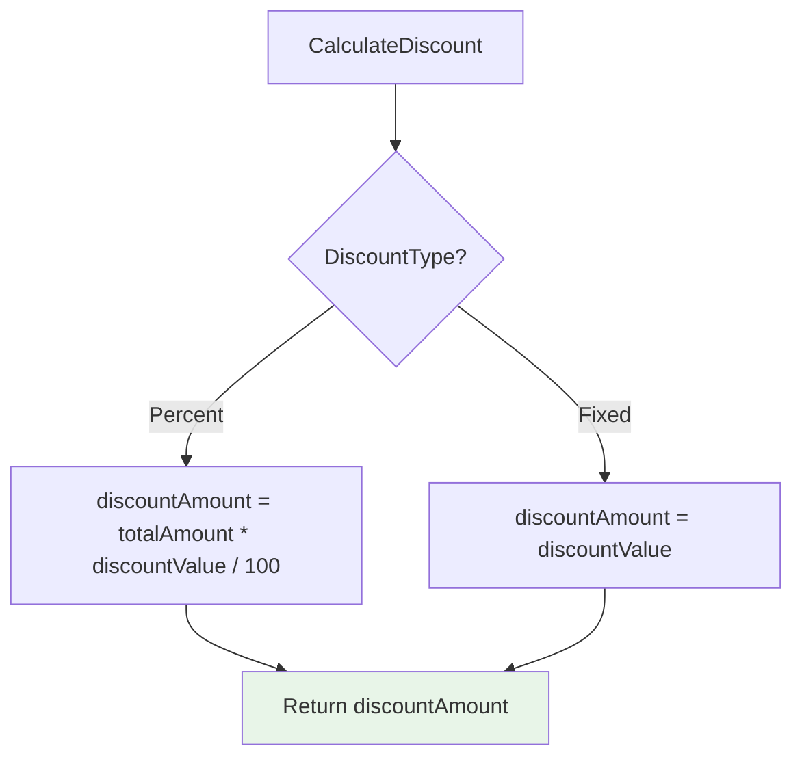
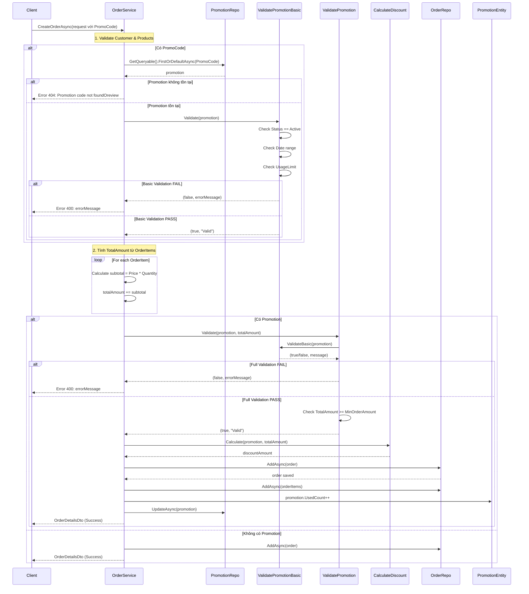

# Luồng Validate Promotion khi tạo đơn hàng với mã giảm giá

## Tổng quan

Tài liệu này mô tả chi tiết luồng validation promotion khi tạo một đơn hàng mới với mã giảm giá trong hệ thống RetailStoreManagement.

## Luồng tổng thể



## Chi tiết các bước validation

### Bước 1: ValidatePromotionBasic (Không cần TotalAmount)



### Bước 2: ValidatePromotion (Cần TotalAmount)



### Bước 3: CalculateDiscount



## Sequence Diagram



## Các điều kiện validation

### ValidatePromotionBasic
1. **Status Check**: `promotion.Status == PromotionStatus.Active`
2. **Date Range Check**: 
   - `DateTime.UtcNow >= promotion.StartDate.ToDateTime(TimeOnly.MinValue)`
   - `DateTime.UtcNow <= promotion.EndDate.ToDateTime(TimeOnly.MaxValue)`
3. **Usage Limit Check**: 
   - Nếu `UsageLimit > 0`: `UsedCount < UsageLimit`
   - Nếu `UsageLimit == 0`: Không giới hạn, skip check

### ValidatePromotion (Full)
1. Tất cả điều kiện của ValidatePromotionBasic
2. **MinOrderAmount Check**: `totalAmount >= promotion.MinOrderAmount`

## Các trường hợp lỗi

| Lỗi | Điều kiện | HTTP Status | Message |
|-----|-----------|-------------|---------|
| Promotion code not found | PromoCode không tồn tại trong DB | 404 | "Promotion code not found" |
| Promotion is not active | Status != Active | 400 | "Promotion is not active" |
| Promotion is not valid for current date | Date ngoài khoảng StartDate - EndDate | 400 | "Promotion is not valid for current date" |
| Promotion usage limit exceeded | UsedCount >= UsageLimit | 400 | "Promotion usage limit exceeded" |
| Order amount too low | TotalAmount < MinOrderAmount | 400 | "Order amount must be at least {MinOrderAmount:C}" |

## Ví dụ thực tế

### Ví dụ 1: Promotion hợp lệ
```
Input:
- PromoCode: "SUMMER2024"
- OrderItems: [{ProductId: 1, Quantity: 2}, {ProductId: 2, Quantity: 1}]
- Product Prices: [100000, 50000]
- TotalAmount: 250000
- Promotion: {Status: Active, MinOrderAmount: 100000, UsageLimit: 100, UsedCount: 50}

Flow:
1. ✅ ValidatePromotionBasic: PASS (Active, Date OK, Usage OK)
2. ✅ Tính TotalAmount: 250000
3. ✅ ValidatePromotion: PASS (250000 >= 100000)
4. ✅ CalculateDiscount: discountAmount = ...
5. ✅ Create Order với discount
```

### Ví dụ 2: Promotion không hợp lệ - MinOrderAmount quá cao
```
Input:
- PromoCode: "VIP2024"
- OrderItems: [{ProductId: 1, Quantity: 1}]
- Product Price: 100000
- TotalAmount: 100000
- Promotion: {Status: Active, MinOrderAmount: 1990000, ...}

Flow:
1. ✅ ValidatePromotionBasic: PASS
2. ✅ Tính TotalAmount: 100000
3. ❌ ValidatePromotion: FAIL (100000 < 1990000)
4. ❌ Return Error: "Order amount must be at least $1,990,000.00"
```

## Code Reference

### ValidatePromotionBasic
```csharp
private (bool isValid, string message) ValidatePromotionBasic(PromotionEntity promotion)
{
    if (promotion.Status != PromotionStatus.Active)
        return (false, "Promotion is not active");

    var now = DateTime.UtcNow;
    var startDate = promotion.StartDate.ToDateTime(TimeOnly.MinValue);
    var endDate = promotion.EndDate.ToDateTime(TimeOnly.MaxValue);

    if (now < startDate || now > endDate)
        return (false, "Promotion is not valid for current date");

    if (promotion.UsageLimit > 0 && promotion.UsedCount >= promotion.UsageLimit)
        return (false, "Promotion usage limit exceeded");

    return (true, "Valid");
}
```

### ValidatePromotion
```csharp
private (bool isValid, string message) ValidatePromotion(PromotionEntity promotion, decimal orderTotal)
{
    // Validate basic conditions first
    var basicValidation = ValidatePromotionBasic(promotion);
    if (!basicValidation.isValid)
        return basicValidation;

    // Validate minOrderAmount
    if (orderTotal < promotion.MinOrderAmount)
        return (false, $"Order amount must be at least {promotion.MinOrderAmount:C}");

    return (true, "Valid");
}
```

## Tối ưu hóa

1. **Validation 2 bước**: 
   - Bước 1 (Basic): Validate sớm để tránh tính toán không cần thiết
   - Bước 2 (Full): Validate sau khi có TotalAmount để check MinOrderAmount

2. **Early Return**: Trả về lỗi ngay khi phát hiện điều kiện không hợp lệ

3. **Reuse Logic**: ValidatePromotion gọi lại ValidatePromotionBasic để tránh duplicate code

## Notes

- **Currency Format**: `{MinOrderAmount:C}` format theo culture hiện tại (VND hoặc USD)
- **Date Comparison**: Sử dụng `DateTime.UtcNow` để so sánh với `DateOnly.ToDateTime()`
- **Usage Limit**: Nếu `UsageLimit == 0` nghĩa là không giới hạn, skip check
- **Discount Calculation**: Chỉ tính discount sau khi validation PASS hoàn toàn

