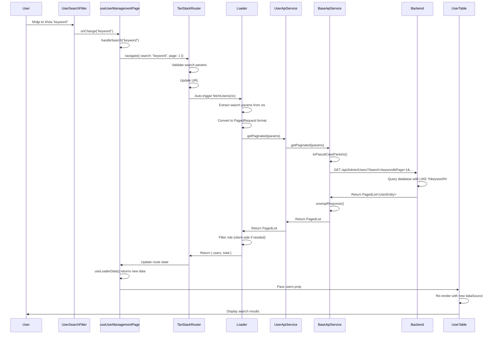
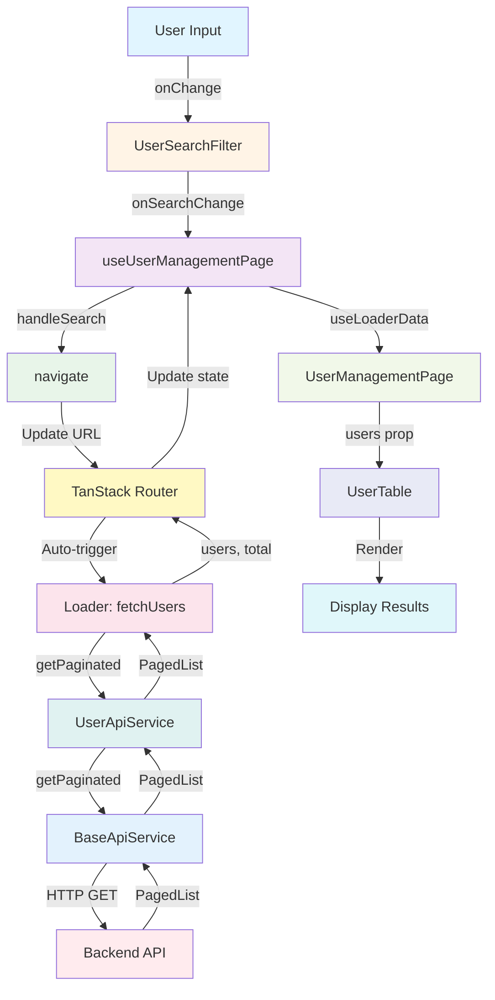
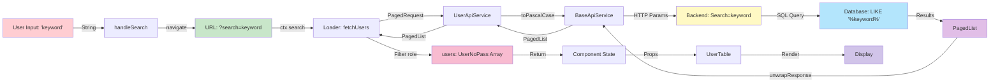

# Tài Liệu Chi Tiết: Luồng Xử Lý Search trong User Management

> **Tài liệu này**: Mô tả chi tiết luồng hoạt động của tính năng tìm kiếm (search) trong User Management Page
> 
> **Ngày tạo**: 2024
> 
> **Phiên bản**: 1.0
> 
> **Liên quan**: TanStack Router, TanStack Loader, API Pagination, Server-side Search

---

## MỤC LỤC

1. [Tổng Quan](#1-tổng-quan)
2. [Kiến Trúc Tổng Thể](#2-kiến-trúc-tổng-thể)
3. [Luồng Xử Lý Chi Tiết](#3-luồng-xử-lý-chi-tiết)
4. [Các Component Tham Gia](#4-các-component-tham-gia)
5. [Data Flow](#5-data-flow)
6. [Sơ Đồ Luồng Hoạt Động](#6-sơ-đồ-luồng-hoạt-động)
7. [Điểm Quan Trọng và Best Practices](#7-điểm-quan-trọng-và-best-practices)
8. [Tối Ưu Hóa và Cải Tiến](#8-tối-ưu-hóa-và-cải-tiến)

---

## 1. TỔNG QUAN

### 1.1. Mục Đích

Tài liệu này mô tả chi tiết cách hệ thống xử lý tìm kiếm người dùng theo tên hoặc username, từ khi người dùng nhập từ khóa đến khi kết quả được hiển thị trong bảng.

### 1.2. Đặc Điểm Chính

- **Server-side Search**: Tìm kiếm được xử lý ở backend, không phải client-side filtering
- **URL-driven**: Search params được lưu trong URL, cho phép bookmark và share
- **Tự động Reload**: TanStack Router tự động gọi lại loader khi URL thay đổi
- **Real-time Update**: Bảng tự động cập nhật khi có kết quả mới

### 1.3. Công Nghệ Sử Dụng

- **TanStack Router**: Quản lý routing và search params
- **TanStack Loader**: Tự động gọi API khi route params thay đổi
- **Ant Design**: UI components (Input.Search, Table)
- **Axios**: HTTP client cho API calls
- **TypeScript**: Type safety cho toàn bộ luồng

---

## 2. KIẾN TRÚC TỔNG THỂ

### 2.1. Component Hierarchy

```
UserManagementPage
├── UserSearchFilter (Input.Search)
├── UserTable (Ant Design Table)
└── UserModals
```

### 2.2. Data Flow Direction

```
User Input → URL Params → Loader → API Call → Backend → Response → Component State → Table Render
```

### 2.3. Key Files

| File | Vai Trò |
|------|---------|
| `UserSearchFilter.tsx` | Component nhận input từ user |
| `useUserManagementPage.ts` | Hook quản lý state và handlers |
| `users.definition.ts` | Route definition với loader |
| `UserApiService.ts` | API service layer |
| `BaseApiService.ts` | Base class cho API calls |
| `UserTable.tsx` | Component hiển thị bảng |

---

## 3. LUỒNG XỬ LÝ CHI TIẾT

### 3.1. Bước 1: User Nhập Từ Khóa

**File**: `UserSearchFilter.tsx`

```typescript
<Input.Search
    placeholder="Tìm theo tên hoặc username..."
    value={searchText}
    onChange={(e) => onSearchChange(e.target.value)}
    allowClear
/>
```

**Mô tả**:
- User nhập từ khóa vào `Input.Search` component
- Mỗi thay đổi (onChange) trigger callback `onSearchChange`
- `onSearchChange` được truyền từ `UserManagementPage` → `handleSearch` từ hook

**Đặc điểm**:
- Real-time input: Mỗi ký tự nhập đều trigger onChange
- `allowClear`: Cho phép xóa nhanh bằng nút X
- Controlled component: Value được quản lý bởi parent component

---

### 3.2. Bước 2: Cập Nhật URL Search Params

**File**: `useUserManagementPage.ts`

```typescript
const handleSearch = (value: string) => {
    navigate({
        search: (prev: UserSearch) => ({
            ...prev,
            search: value || undefined,
            page: 1,  // Reset về trang đầu khi search mới
        }),
    })
}
```

**Mô tả**:
- `handleSearch` nhận giá trị từ `Input.Search`
- Sử dụng `navigate` từ TanStack Router để cập nhật URL
- Giữ nguyên các search params khác (role, sortField, sortOrder)
- Reset `page` về 1 khi có search mới

**URL Format**:
```
/admin/users?search=keyword&page=1&pageSize=10&sortField=createdAt&sortOrder=descend
```

**Lợi ích**:
- URL có thể bookmark và share
- Browser back/forward hoạt động đúng
- Search params persistent qua page refresh

---

### 3.3. Bước 3: TanStack Router Phát Hiện Thay Đổi

**Cơ chế tự động của TanStack Router**:

1. Router monitor URL changes
2. Khi search params thay đổi, router tự động:
   - Validate search params theo `searchSchema`
   - Trigger route loader với context mới
   - Update route state

**File**: `users.definition.ts`

```typescript
const userSearchSchema = baseSearchSchema.extend({
  role: z.number().optional(),
  sortField: z.string().catch('createdAt'),
  sortOrder: z.enum(['ascend', 'descend']).catch('descend'),
});

export const userAdminDefinition: ManagementRouteDefinition<
  UserLoaderData,
  UserSearch,
  { apiClient: never }
> = {
  searchSchema: userSearchSchema,
  loader: (ctx) => fetchUsers(ctx),
};
```

**Validation**:
- Zod schema validate search params
- Type-safe với TypeScript
- Default values nếu params không có

---

### 3.4. Bước 4: Loader Gọi API với Search Params

**File**: `users.definition.ts`

```typescript
async function fetchUsers(ctx: LoaderContext<...>): Promise<UserLoaderData> {
  const search = ctx.search;
  
  // Convert sang PagedRequest format
  const params: PagedRequest = {
    page: search.page || 1,
    pageSize: search.pageSize || 10,
    search: search.search,  // Từ khóa tìm kiếm
    sortBy: search.sortField === 'createdAt' ? 'CreatedAt' :
            search.sortField === 'username' ? 'Username' :
            search.sortField === 'fullName' ? 'FullName' : 'Id',
    sortDesc: search.sortOrder === 'descend',
  };

  // Gọi API
  const pagedList = await userApiService.getPaginated(params);
  
  // Filter role ở client-side (nếu cần)
  let users: UserNoPass[] = pagedList.items || [];
  if (search.role !== undefined) {
    users = users.filter((user: UserNoPass) => user.role === search.role);
  }

  return { users, total: pagedList.totalCount || users.length };
}
```

**Mô tả**:
- Loader nhận `ctx.search` từ router context
- Convert search params từ camelCase (frontend) sang PascalCase (backend)
- Gọi `userApiService.getPaginated()` với params đã convert
- Filter role ở client-side (backend chưa hỗ trợ role filter)
- Trả về `{ users, total }` cho component

**Param Conversion**:
- `search.search` → `Search` (backend)
- `sortField` → `SortBy` (mapping: createdAt → CreatedAt, username → Username, etc.)
- `sortOrder` → `SortDesc` (descend → true, ascend → false)

---

### 3.5. Bước 5: API Service Gọi Backend

**File**: `BaseApiService.ts`

```typescript
async getPaginated(params?: PagedRequest): Promise<PagedList<TData>> {
  const pascalParams = params ? toPascalCaseParams(params) : undefined;
  const response = await this.axios.get<ApiResponse<PagedList<TData>>>(
    this.endpoint,
    { params: pascalParams }
  );
  return unwrapResponse(response);
}
```

**Mô tả**:
- `BaseApiService.getPaginated()` convert params sang PascalCase
- Gửi GET request với query params
- Unwrap `ApiResponse` wrapper để lấy `PagedList` trực tiếp

**HTTP Request Example**:
```
GET /api/Admin/Users?Page=1&PageSize=10&Search=keyword&SortBy=CreatedAt&SortDesc=true
```

**Response Format**:
```typescript
{
  isError: false,
  data: {
    page: 1,
    pageSize: 10,
    totalCount: 25,
    totalPages: 3,
    hasPrevious: false,
    hasNext: true,
    items: [
      { id: 1, username: "user1", fullName: "User One", ... },
      { id: 2, username: "user2", fullName: "User Two", ... },
      ...
    ]
  }
}
```

---

### 3.6. Bước 6: Backend Xử Lý Search

**Backend Logic** (không nằm trong frontend codebase):

1. Nhận query params: `Page`, `PageSize`, `Search`, `SortBy`, `SortDesc`
2. Parse và validate params
3. Query database với:
   - WHERE clause: `(FullName LIKE '%keyword%' OR Username LIKE '%keyword%')`
   - ORDER BY: `SortBy ASC/DESC`
   - Pagination: `OFFSET` và `LIMIT`
4. Trả về `PagedList<UserEntity>`

**Search Logic**:
- Search trong cả `FullName` và `Username`
- Case-insensitive (thường được xử lý ở database level)
- Partial match (LIKE '%keyword%')

---

### 3.7. Bước 7: Loader Xử Lý Response

**File**: `users.definition.ts`

```typescript
const pagedList = await userApiService.getPaginated(params);

// Backend đã trả về UserNoPass (không có password)
let users: UserNoPass[] = pagedList.items || [];

// Filter theo role ở client-side
if (search.role !== undefined) {
  users = users.filter((user: UserNoPass) => user.role === search.role);
}

return {
  users,
  total: pagedList.totalCount || users.length,
};
```

**Mô tả**:
- Nhận `PagedList` từ API response
- Filter role ở client-side (nếu có)
- Return data cho component

**Lý do filter role ở client-side**:
- Backend chưa hỗ trợ role filter trong query params
- Có thể implement sau khi backend hỗ trợ

---

### 3.8. Bước 8: Component Nhận Dữ Liệu Mới

**File**: `useUserManagementPage.ts`

```typescript
const routeApi = getRouteApi(ENDPOINTS.ADMIN.USERS)
const { users: usersData, total: totalUsers } = routeApi.useLoaderData() || { users: [], total: 0 }
```

**Mô tả**:
- `routeApi.useLoaderData()` hook tự động subscribe vào loader data
- Khi loader trả về data mới, hook tự động re-render component
- Component nhận `users` và `total` mới

**React Re-render Flow**:
1. Loader trả về data mới
2. TanStack Router update route state
3. `useLoaderData()` hook detect change
4. Component re-render với data mới
5. Child components nhận props mới

---

### 3.9. Bước 9: Bảng Hiển Thị Dữ Liệu Mới

**File**: `UserTable.tsx`

```typescript
<Table
    dataSource={users}
    columns={columns}
    rowKey="id"
    pagination={{ ... }}
/>
```

**Mô tả**:
- `UserTable` nhận `users` từ props
- Ant Design Table tự động re-render khi `dataSource` thay đổi
- Hiển thị kết quả search đã được filter từ backend

**Table Features**:
- Pagination: Hiển thị số trang, cho phép chuyển trang
- Sorting: Có thể sort theo các cột (nếu implement)
- Row selection: Có thể select rows (nếu implement)

---

## 4. CÁC COMPONENT THAM GIA

### 4.1. UserSearchFilter.tsx

**Vai trò**: Component nhận input từ user

**Props**:
- `searchText: string` - Giá trị hiện tại của search input
- `onSearchChange: (value: string) => void` - Callback khi user nhập

**Features**:
- `Input.Search` với icon search
- `allowClear` để xóa nhanh
- Controlled component

---

### 4.2. useUserManagementPage.ts

**Vai trò**: Custom hook quản lý state và handlers

**State**:
- Modal states (isModalVisible, isDeleteModalVisible, etc.)
- Search/Filter states (đọc từ URL)

**Handlers**:
- `handleSearch`: Cập nhật URL search params
- `handleRoleFilter`: Cập nhật role filter
- `handleSort`: Cập nhật sort params

**Data**:
- `users`: Từ `routeApi.useLoaderData()`
- `searchText`, `roleFilter`, etc.: Từ `routeApi.useSearch()`

---

### 4.3. users.definition.ts

**Vai trò**: Route definition với loader

**Components**:
- `userSearchSchema`: Zod schema validate search params
- `fetchUsers`: Loader function gọi API
- `userAdminDefinition`: Route definition object

**Loader Function**:
- Nhận `ctx` với search params
- Convert params sang backend format
- Gọi API service
- Filter và transform data
- Return data cho component

---

### 4.4. UserApiService.ts

**Vai trò**: API service layer cho Users

**Methods**:
- `getPaginated(params)`: Lấy danh sách với pagination và search
- `getStaffUsers(params)`: Lấy danh sách staff users
- `checkUsernameExists(username)`: Kiểm tra username tồn tại

**Inheritance**:
- Extends `BaseApiService`
- Kế thừa CRUD methods từ base class

---

### 4.5. BaseApiService.ts

**Vai trò**: Base class cho tất cả API services

**Methods**:
- `getPaginated(params)`: Generic pagination method
- `toPascalCaseParams()`: Convert camelCase → PascalCase
- `unwrapResponse()`: Unwrap ApiResponse wrapper

**Features**:
- Type-safe với generics
- Automatic param conversion
- Error handling

---

## 5. DATA FLOW

### 5.1. Data Flow Diagram

```
┌─────────────────┐
│  User Input     │
│  "keyword"      │
└────────┬────────┘
         │
         ▼
┌─────────────────┐
│ UserSearchFilter│
│ onChange event  │
└────────┬────────┘
         │
         ▼
┌─────────────────┐
│ handleSearch()  │
│ navigate()      │
└────────┬────────┘
         │
         ▼
┌─────────────────┐
│  URL Updated    │
│ ?search=keyword │
└────────┬────────┘
         │
         ▼
┌─────────────────┐
│ TanStack Router │
│ Auto-trigger    │
│ loader()        │
└────────┬────────┘
         │
         ▼
┌─────────────────┐
│ fetchUsers()    │
│ Loader function │
└────────┬────────┘
         │
         ▼
┌─────────────────┐
│ UserApiService  │
│ getPaginated()  │
└────────┬────────┘
         │
         ▼
┌─────────────────┐
│ BaseApiService  │
│ toPascalCase()  │
└────────┬────────┘
         │
         ▼
┌─────────────────┐
│  HTTP Request   │
│ GET /api/...    │
└────────┬────────┘
         │
         ▼
┌─────────────────┐
│    Backend      │
│ Search in DB    │
└────────┬────────┘
         │
         ▼
┌─────────────────┐
│  PagedList      │
│ Response        │
└────────┬────────┘
         │
         ▼
┌─────────────────┐
│ Loader return   │
│ { users, total }│
└────────┬────────┘
         │
         ▼
┌─────────────────┐
│ useLoaderData() │
│ Hook update     │
└────────┬────────┘
         │
         ▼
┌─────────────────┐
│ Component       │
│ Re-render       │
└────────┬────────┘
         │
         ▼
┌─────────────────┐
│  UserTable      │
│ Display results │
└─────────────────┘
```

### 5.2. State Management

**URL State** (Single Source of Truth):
- Search params được lưu trong URL
- TanStack Router quản lý state
- Persistent qua page refresh

**Component State**:
- Modal states: Local state trong hook
- Form state: Ant Design Form instance
- UI state: Derived từ URL params

**Data State**:
- `users`: Từ loader data
- `total`: Từ loader data
- Auto-update khi loader trả về data mới

---

## 6. SƠ ĐỒ LUỒNG HOẠT ĐỘNG

### 6.1. Sequence Diagram (Mermaid)



### 6.2. Component Interaction Diagram



### 6.3. Data Transformation Flow



---

## 7. ĐIỂM QUAN TRỌNG VÀ BEST PRACTICES

### 7.1. Server-side Search

**Lý do**:
- Hiệu quả với dữ liệu lớn
- Giảm tải client-side
- Tận dụng database indexing

**Implementation**:
- Search params được gửi lên backend
- Backend xử lý search trong database
- Chỉ trả về kết quả đã filter

---

### 7.2. URL-driven State

**Lợi ích**:
- Bookmark được
- Share được
- Browser back/forward hoạt động
- Persistent qua refresh

**Implementation**:
- Tất cả search params lưu trong URL
- TanStack Router quản lý state
- Single source of truth

---

### 7.3. Automatic Reload

**Cơ chế**:
- TanStack Router tự động detect URL changes
- Tự động trigger loader
- Component tự động re-render

**Lợi ích**:
- Không cần manual refetch
- Đồng bộ giữa URL và data
- Giảm boilerplate code

---

### 7.4. Type Safety

**Implementation**:
- Zod schema validate search params
- TypeScript types cho toàn bộ flow
- Type-safe API calls

**Lợi ích**:
- Catch errors tại compile time
- IntelliSense support
- Refactoring an toàn

---

### 7.5. Param Conversion

**CamelCase → PascalCase**:
- Frontend: camelCase (JavaScript convention)
- Backend: PascalCase (C# convention)
- Automatic conversion trong `BaseApiService`

**Mapping**:
- `sortField` → `SortBy` (với mapping: createdAt → CreatedAt)
- `sortOrder` → `SortDesc` (descend → true)
- `page` → `Page`
- `pageSize` → `PageSize`

---

## 8. TỐI ƯU HÓA VÀ CẢI TIẾN

### 8.1. Debouncing Search

**Vấn đề hiện tại**:
- Mỗi ký tự nhập đều trigger API call
- Có thể gây quá tải server

**Giải pháp đề xuất**:
```typescript
const debouncedSearch = useDebouncedCallback(
  (value: string) => {
    handleSearch(value);
  },
  500 // 500ms delay
);

// Trong UserSearchFilter
<Input.Search
  onChange={(e) => debouncedSearch(e.target.value)}
/>
```

**Lợi ích**:
- Giảm số lượng API calls
- Cải thiện performance
- Better UX (không lag khi typing)

---

### 8.2. Loading State

**Hiện tại**:
- Chưa có loading indicator khi search

**Đề xuất**:
```typescript
const { isLoading } = routeApi.useLoaderData();
// Hiển thị spinner trong UserTable khi isLoading = true
```

---

### 8.3. Error Handling

**Hiện tại**:
- Loader catch error và return empty array

**Cải thiện**:
- Hiển thị error message cho user
- Retry mechanism
- Fallback UI

---

### 8.4. Caching và Stale Time

**Đề xuất**:
- Sử dụng TanStack Query cache
- Configure staleTime cho search results
- Prefetch next page

---

### 8.5. Backend Role Filter

**Hiện tại**:
- Role filter xử lý ở client-side

**Cải thiện**:
- Implement role filter ở backend
- Gửi role param trong query string
- Giảm data transfer

---

## KẾT LUẬN

Luồng xử lý search trong User Management Page được thiết kế với các nguyên tắc:

1. **Server-side Processing**: Search được xử lý ở backend để tối ưu performance
2. **URL-driven State**: Search params lưu trong URL để persistent và shareable
3. **Automatic Synchronization**: TanStack Router tự động sync giữa URL và data
4. **Type Safety**: Toàn bộ flow được type-safe với TypeScript và Zod
5. **Separation of Concerns**: Mỗi layer có trách nhiệm rõ ràng

Luồng này đảm bảo:
- ✅ Data luôn đồng bộ với URL
- ✅ Tự động cập nhật khi search params thay đổi
- ✅ Type-safe và maintainable
- ✅ Scalable cho dữ liệu lớn
- ✅ User-friendly với URL bookmark/share

---

**Tài liệu liên quan**:
- [TanStack Router Documentation](./TanStack%20Router/TanStack-Router.md)
- [TanStack Loader Guide](./TanStack%20Loader/TanStack-Router-Loader.md)
- [API Pagination Guide](./api/PAGINATION_IMPLEMENTATION_GUIDE.md)
- [Backend API Reference](./api/BACKEND_API_REFERENCE.md)

