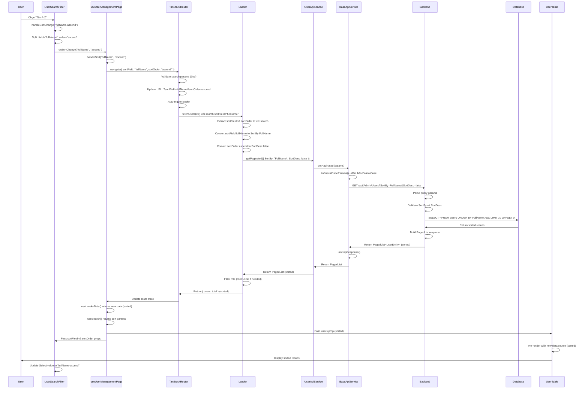
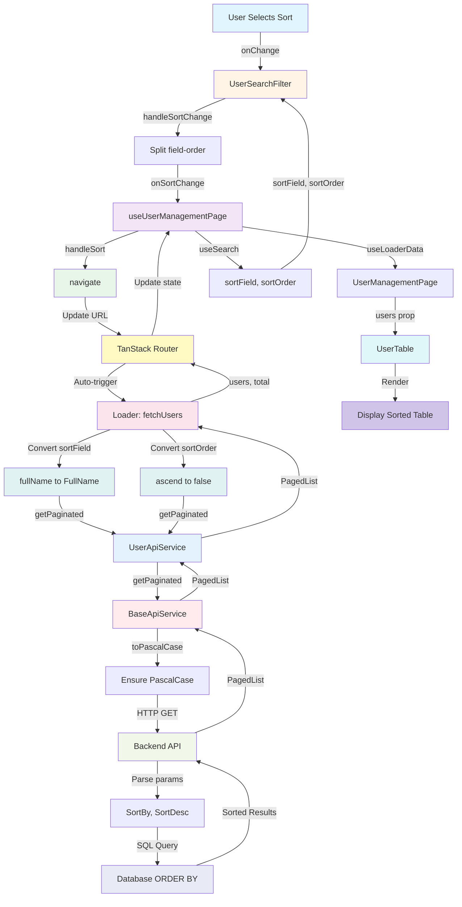
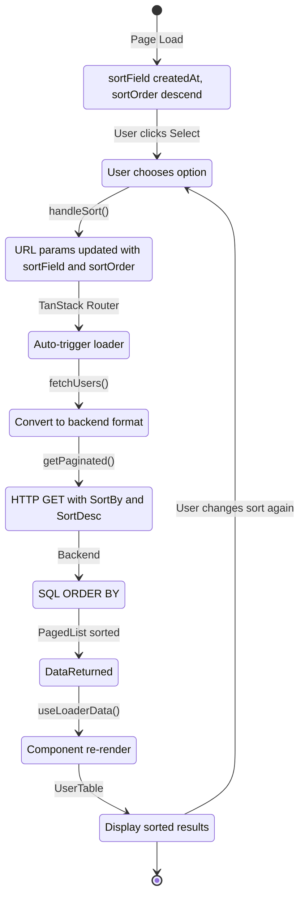

# Tài Liệu Chi Tiết: Luồng Xử Lý SortField trong User Management

> **Tài liệu này**: Mô tả chi tiết luồng hoạt động của tính năng sắp xếp (sorting) theo field trong User Management Page
> 
> **Ngày tạo**: 2024
> 
> **Phiên bản**: 1.0
> 
> **Liên quan**: TanStack Router, TanStack Loader, API Pagination, Backend Sorting

---

## MỤC LỤC

1. [Tổng Quan](#1-tổng-quan)
2. [Kiến Trúc Tổng Thể](#2-kiến-trúc-tổng-thể)
3. [Luồng Xử Lý Chi Tiết](#3-luồng-xử-lý-chi-tiết)
4. [Mapping và Conversion](#4-mapping-và-conversion)
5. [Các Component Tham Gia](#5-các-component-tham-gia)
6. [Data Flow](#6-data-flow)
7. [Sơ Đồ Luồng Hoạt Động](#7-sơ-đồ-luồng-hoạt-động)
8. [Điểm Quan Trọng và Best Practices](#8-điểm-quan-trọng-và-best-practices)
9. [Tối Ưu Hóa và Cải Tiến](#9-tối-ưu-hóa-và-cải-tiến)

---

## 1. TỔNG QUAN

### 1.1. Mục Đích

Tài liệu này mô tả chi tiết cách hệ thống xử lý sắp xếp (sorting) danh sách người dùng theo các field khác nhau (tên, username, ngày tạo), từ khi người dùng chọn option sắp xếp đến khi kết quả được hiển thị theo thứ tự mới.

### 1.2. Đặc Điểm Chính

- **Server-side Sorting**: Sắp xếp được xử lý ở backend (database level), không phải client-side
- **URL-driven**: Sort params được lưu trong URL, cho phép bookmark và share
- **Tự động Reload**: TanStack Router tự động gọi lại loader khi sort params thay đổi
- **Type-safe Mapping**: Chuyển đổi type-safe giữa frontend (camelCase) và backend (PascalCase)
- **Multiple Sort Options**: Hỗ trợ sắp xếp theo nhiều field (createdAt, fullName, username)

### 1.3. Công Nghệ Sử Dụng

- **TanStack Router**: Quản lý routing và search params (bao gồm sort params)
- **TanStack Loader**: Tự động gọi API khi route params thay đổi
- **Ant Design**: UI components (Select dropdown cho sort options)
- **Zod**: Schema validation cho sort params
- **TypeScript**: Type safety cho toàn bộ luồng

---

## 2. KIẾN TRÚC TỔNG THỂ

### 2.1. Component Hierarchy

```
UserManagementPage
├── UserSearchFilter
│   └── Select (Sort Options)
├── UserTable (Hiển thị kết quả đã sort)
└── useUserManagementPage (Hook quản lý state)
```

### 2.2. Data Flow Direction

```
User Selection → URL Params → Loader → API Call → Backend → SQL ORDER BY → Response → Component State → Table Render
```

### 2.3. Key Files

| File | Vai Trò |
|------|---------|
| `UserSearchFilter.tsx` | Component Select dropdown cho sort options |
| `useUserManagementPage.ts` | Hook quản lý state và handlers cho sorting |
| `users.definition.ts` | Route definition với loader, convert sortField |
| `UserApiService.ts` | API service layer |
| `BaseApiService.ts` | Base class cho API calls, param conversion |

---

## 3. LUỒNG XỬ LÝ CHI TIẾT

### 3.1. Bước 1: User Chọn Sort Option

**File**: `UserSearchFilter.tsx`

```typescript
<Select
    value={`${sortField}-${sortOrder}`}
    onChange={handleSortChange}
    style={{ width: '100%', marginTop: '8px' }}
>
    <Select.Option value="createdAt-descend">Mới nhất</Select.Option>
    <Select.Option value="createdAt-ascend">Cũ nhất</Select.Option>
    <Select.Option value="fullName-ascend">Tên A-Z</Select.Option>
    <Select.Option value="fullName-descend">Tên Z-A</Select.Option>
    <Select.Option value="username-ascend">Username A-Z</Select.Option>
    <Select.Option value="username-descend">Username Z-A</Select.Option>
</Select>
```

**Mô tả**:
- User chọn một option trong Select dropdown (ví dụ: "Tên A-Z")
- Mỗi option có value format: `"field-order"` (ví dụ: `"fullName-ascend"`)
- `onChange` trigger callback `handleSortChange` với value đã chọn

**Options Available**:
- **Mới nhất**: `createdAt-descend` - Sắp xếp theo ngày tạo, mới nhất trước
- **Cũ nhất**: `createdAt-ascend` - Sắp xếp theo ngày tạo, cũ nhất trước
- **Tên A-Z**: `fullName-ascend` - Sắp xếp theo tên, A đến Z
- **Tên Z-A**: `fullName-descend` - Sắp xếp theo tên, Z đến A
- **Username A-Z**: `username-ascend` - Sắp xếp theo username, A đến Z
- **Username Z-A**: `username-descend` - Sắp xếp theo username, Z đến A

**Đặc điểm**:
- Controlled component: Value được quản lý bởi parent component
- Format: `"${sortField}-${sortOrder}"` để combine field và order
- Display text: Tiếng Việt dễ hiểu cho user

---

### 3.2. Bước 2: Parse Value và Trigger Callback

**File**: `UserSearchFilter.tsx`

```typescript
const handleSortChange = (value: string) => {
    const [field, order] = value.split('-')
    onSortChange(field, order as 'ascend' | 'descend')
}
```

**Mô tả**:
- `handleSortChange` nhận value từ Select (ví dụ: `"fullName-ascend"`)
- Split value bằng `-` để tách thành `field` và `order`
- Gọi `onSortChange(field, order)` → `handleSort` từ `useUserManagementPage` hook

**Example**:
- Input: `"fullName-ascend"`
- After split: `field = "fullName"`, `order = "ascend"`
- Callback: `onSortChange("fullName", "ascend")`

**Type Safety**:
- `order` được cast thành `'ascend' | 'descend'` type
- Đảm bảo chỉ có 2 giá trị hợp lệ

---

### 3.3. Bước 3: Cập Nhật URL Search Params

**File**: `useUserManagementPage.ts`

```typescript
const handleSort = (field: string, order: 'ascend' | 'descend') => {
    navigate({
        search: (prev: UserSearch) => ({
            ...prev,
            sortField: field,
            sortOrder: order,
        }),
    })
}
```

**Mô tả**:
- `handleSort` nhận `field` và `order` từ `UserSearchFilter`
- Sử dụng `navigate` từ TanStack Router để cập nhật URL
- Giữ nguyên các search params khác (search, role, page, pageSize)
- Chỉ cập nhật `sortField` và `sortOrder`

**URL Format**:
```
/admin/users?sortField=fullName&sortOrder=ascend&page=1&pageSize=10&search=keyword
```

**Lợi ích**:
- URL có thể bookmark và share với sort option
- Browser back/forward hoạt động đúng
- Sort params persistent qua page refresh
- Có thể combine với search và filter khác

---

### 3.4. Bước 4: TanStack Router Phát Hiện Thay Đổi

**Cơ chế tự động của TanStack Router**:

1. Router monitor URL changes
2. Khi search params (bao gồm sort params) thay đổi, router tự động:
   - Validate search params theo `searchSchema`
   - Trigger route loader với context mới
   - Update route state

**File**: `users.definition.ts`

```typescript
const userSearchSchema = baseSearchSchema.extend({
  role: z.number().optional(),
  sortField: z.string().catch('createdAt'), // ✅ Default: 'createdAt'
  sortOrder: z.enum(['ascend', 'descend']).catch('descend'), // ✅ Default: 'descend'
});
```

**Validation**:
- Zod schema validate `sortField` và `sortOrder`
- `sortField`: String với default `'createdAt'`
- `sortOrder`: Enum `'ascend' | 'descend'` với default `'descend'`
- Type-safe với TypeScript

**Default Values**:
- Nếu `sortField` không có trong URL → default `'createdAt'`
- Nếu `sortOrder` không có trong URL → default `'descend'`
- Đảm bảo luôn có giá trị hợp lệ

---

### 3.5. Bước 5: Loader Đọc và Convert Sort Params

**File**: `users.definition.ts`

```typescript
async function fetchUsers(ctx: LoaderContext<...>): Promise<UserLoaderData> {
  const search = ctx.search;
  
  // Convert search params sang PagedRequest format
  const params: PagedRequest = {
    page: search.page || 1,
    pageSize: search.pageSize || 10,
    search: search.search,
    // Convert sortField sang SortBy format của backend
    sortBy: search.sortField === 'createdAt' ? 'CreatedAt' :
            search.sortField === 'username' ? 'Username' :
            search.sortField === 'fullName' ? 'FullName' : 'Id',
    sortDesc: search.sortOrder === 'descend',
  };

  // Gọi API
  const pagedList = await userApiService.getPaginated(params);
  // ...
}
```

**Mô tả**:
- Loader nhận `ctx.search` từ router context
- Đọc `search.sortField` và `search.sortOrder` từ URL params
- Convert `sortField` từ camelCase (frontend) sang PascalCase (backend):
  - `'createdAt'` → `'CreatedAt'`
  - `'username'` → `'Username'`
  - `'fullName'` → `'FullName'`
  - Default → `'Id'`
- Convert `sortOrder` từ string sang boolean:
  - `'descend'` → `sortDesc: true`
  - `'ascend'` → `sortDesc: false`

**Mapping Logic**:
```typescript
// sortField mapping
sortBy: search.sortField === 'createdAt' ? 'CreatedAt' :
        search.sortField === 'username' ? 'Username' :
        search.sortField === 'fullName' ? 'FullName' : 'Id'

// sortOrder mapping
sortDesc: search.sortOrder === 'descend'
```

**Lý do conversion**:
- Frontend convention: camelCase (JavaScript/TypeScript)
- Backend convention: PascalCase (C#)
- Cần convert để match với backend API contract

---

### 3.6. Bước 6: API Service Gọi Backend

**File**: `BaseApiService.ts`

```typescript
async getPaginated(params?: PagedRequest): Promise<PagedList<TData>> {
  const pascalParams = params ? toPascalCaseParams(params) : undefined;
  const response = await this.axios.get<ApiResponse<PagedList<TData>>>(
    this.endpoint,
    { params: pascalParams }
  );
  return unwrapResponse(response);
}
```

**Mô tả**:
- `BaseApiService.getPaginated()` nhận `PagedRequest` với `sortBy` và `sortDesc`
- `toPascalCaseParams()` đảm bảo tất cả params đều là PascalCase
- Gửi GET request với query params

**HTTP Request Example**:
```
GET /api/Admin/Users?Page=1&PageSize=10&Search=keyword&SortBy=FullName&SortDesc=false
```

**Query Params**:
- `SortBy`: Field để sort (CreatedAt, Username, FullName, Id)
- `SortDesc`: Boolean (true = DESC, false = ASC)

**Response Format**:
```typescript
{
  isError: false,
  data: {
    page: 1,
    pageSize: 10,
    totalCount: 25,
    totalPages: 3,
    hasPrevious: false,
    hasNext: true,
    items: [
      // Users đã được sort theo FullName ASC
      { id: 1, username: "alice", fullName: "Alice Smith", ... },
      { id: 2, username: "bob", fullName: "Bob Johnson", ... },
      { id: 3, username: "charlie", fullName: "Charlie Brown", ... },
      ...
    ]
  }
}
```

---

### 3.7. Bước 7: Backend Xử Lý Sorting

**Backend Logic** (không nằm trong frontend codebase):

1. Nhận query params: `SortBy`, `SortDesc`
2. Parse và validate params
3. Query database với ORDER BY clause:
   - `SortBy = "FullName"`, `SortDesc = false` → `ORDER BY FullName ASC`
   - `SortBy = "CreatedAt"`, `SortDesc = true` → `ORDER BY CreatedAt DESC`
4. Trả về `PagedList<UserEntity>` đã được sort

**SQL Query Example**:
```sql
-- SortBy = "FullName", SortDesc = false
SELECT * FROM Users 
WHERE (FullName LIKE '%keyword%' OR Username LIKE '%keyword%')
ORDER BY FullName ASC
LIMIT 10 OFFSET 0

-- SortBy = "CreatedAt", SortDesc = true
SELECT * FROM Users 
WHERE (FullName LIKE '%keyword%' OR Username LIKE '%keyword%')
ORDER BY CreatedAt DESC
LIMIT 10 OFFSET 0
```

**Database Indexing**:
- Backend có thể sử dụng database indexes để optimize sorting
- Indexes trên các field thường được sort (FullName, CreatedAt, Username)
- Đảm bảo performance tốt ngay cả với dữ liệu lớn

---

### 3.8. Bước 8: Loader Xử Lý Response

**File**: `users.definition.ts`

```typescript
const pagedList = await userApiService.getPaginated(params);

// Backend đã trả về UserNoPass (không có password) và đã được sort
let users: UserNoPass[] = pagedList.items || [];

// Filter theo role ở client-side (nếu cần)
if (search.role !== undefined) {
  users = users.filter((user: UserNoPass) => user.role === search.role);
}

return {
  users,  // Users đã được sort từ backend
  total: pagedList.totalCount || users.length,
};
```

**Mô tả**:
- Nhận `PagedList` từ API response (đã được sort từ backend)
- Filter role ở client-side (nếu có)
- Return data cho component

**Lưu ý**:
- Users đã được sort từ backend, không cần sort lại ở client
- Chỉ filter role ở client-side (backend chưa hỗ trợ role filter)

---

### 3.9. Bước 9: Component Nhận Dữ Liệu Mới

**File**: `useUserManagementPage.ts`

```typescript
const routeApi = getRouteApi(ENDPOINTS.ADMIN.USERS)
const { users: usersData, total: totalUsers } = routeApi.useLoaderData() || { users: [], total: 0 }
const search = routeApi.useSearch()

// Đọc sortField và sortOrder từ URL để hiển thị trong Select
const sortField = (search as UserSearch | undefined)?.sortField || 'createdAt'
const sortOrder = (search as UserSearch | undefined)?.sortOrder || 'descend'
```

**Mô tả**:
- `routeApi.useLoaderData()` hook tự động subscribe vào loader data
- Khi loader trả về data mới (đã sort), hook tự động re-render component
- Component nhận `users` (đã sort) và `total`
- `routeApi.useSearch()` đọc sort params từ URL để hiển thị trong Select

**React Re-render Flow**:
1. Loader trả về data mới (đã sort)
2. TanStack Router update route state
3. `useLoaderData()` hook detect change
4. Component re-render với data mới
5. `useSearch()` hook trả về sort params mới
6. Child components nhận props mới

---

### 3.10. Bước 10: Bảng Hiển Thị Dữ Liệu Đã Sort

**File**: `UserTable.tsx`

```typescript
<Table
    dataSource={users}  // Users đã được sort từ backend
    columns={columns}
    rowKey="id"
    pagination={{ ... }}
/>
```

**Mô tả**:
- `UserTable` nhận `users` từ props (đã được sort từ backend)
- Ant Design Table tự động re-render khi `dataSource` thay đổi
- Hiển thị kết quả đã được sort theo thứ tự từ backend

**Table Features**:
- Pagination: Hiển thị số trang, cho phép chuyển trang
- Data order: Giữ nguyên thứ tự từ backend (đã sort)
- Row rendering: Render từng row theo thứ tự trong array

---

## 4. MAPPING VÀ CONVERSION

### 4.1. SortField Mapping

| Frontend (camelCase) | Backend (PascalCase) | Mô Tả | SQL Column |
|---------------------|---------------------|-------|------------|
| `'createdAt'` | `'CreatedAt'` | Sắp xếp theo ngày tạo | `CreatedAt` |
| `'username'` | `'Username'` | Sắp xếp theo username | `Username` |
| `'fullName'` | `'FullName'` | Sắp xếp theo tên đầy đủ | `FullName` |
| `'id'` (default) | `'Id'` | Sắp xếp theo ID | `Id` |

**Code Mapping**:
```typescript
sortBy: search.sortField === 'createdAt' ? 'CreatedAt' :
        search.sortField === 'username' ? 'Username' :
        search.sortField === 'fullName' ? 'FullName' : 'Id'
```

---

### 4.2. SortOrder Mapping

| Frontend (sortOrder) | Backend (sortDesc) | SQL Direction | Mô Tả |
|---------------------|-------------------|---------------|-------|
| `'ascend'` | `false` | `ASC` | Tăng dần (A-Z, 0-9, cũ-mới) |
| `'descend'` | `true` | `DESC` | Giảm dần (Z-A, 9-0, mới-cũ) |

**Code Mapping**:
```typescript
sortDesc: search.sortOrder === 'descend'
```

**SQL Examples**:
- `sortDesc: false` → `ORDER BY FullName ASC` → A, B, C, ...
- `sortDesc: true` → `ORDER BY FullName DESC` → Z, Y, X, ...

---

### 4.3. Complete Conversion Example

**Frontend URL**:
```
/admin/users?sortField=fullName&sortOrder=ascend&page=1&pageSize=10
```

**After Loader Conversion**:
```typescript
{
  page: 1,
  pageSize: 10,
  search: undefined,
  sortBy: "FullName",    // fullName → FullName
  sortDesc: false        // ascend → false
}
```

**Backend API Call**:
```
GET /api/Admin/Users?Page=1&PageSize=10&SortBy=FullName&SortDesc=false
```

**Backend SQL Query**:
```sql
SELECT * FROM Users 
ORDER BY FullName ASC
LIMIT 10 OFFSET 0
```

---

## 5. CÁC COMPONENT THAM GIA

### 5.1. UserSearchFilter.tsx

**Vai trò**: Component Select dropdown cho sort options

**Props**:
- `sortField: string` - Field hiện tại để sort
- `sortOrder: 'ascend' | 'descend'` - Order hiện tại
- `onSortChange: (field: string, order: 'ascend' | 'descend') => void` - Callback khi user chọn

**Features**:
- Select dropdown với 6 options
- Value format: `"field-order"`
- Display text: Tiếng Việt dễ hiểu
- Controlled component

---

### 5.2. useUserManagementPage.ts

**Vai trò**: Custom hook quản lý state và handlers

**State**:
- `sortField`, `sortOrder`: Đọc từ URL qua `routeApi.useSearch()`

**Handlers**:
- `handleSort`: Cập nhật URL search params với sortField và sortOrder mới

**Data**:
- `users`: Từ `routeApi.useLoaderData()` (đã được sort từ backend)

---

### 5.3. users.definition.ts

**Vai trò**: Route definition với loader, convert sortField

**Components**:
- `userSearchSchema`: Zod schema validate sort params
- `fetchUsers`: Loader function convert và gọi API

**Loader Function**:
- Đọc `sortField` và `sortOrder` từ URL
- Convert sang backend format (PascalCase, boolean)
- Gọi API service
- Return data đã sort

---

### 5.4. UserApiService.ts & BaseApiService.ts

**Vai trò**: API service layer

**Methods**:
- `getPaginated(params)`: Gửi sort params lên backend
- `toPascalCaseParams()`: Convert params sang PascalCase

**Features**:
- Type-safe với generics
- Automatic param conversion
- Error handling

---

## 6. DATA FLOW

### 6.1. Data Flow Diagram

```
┌─────────────────┐
│  User Selection │
│  "Tên A-Z"      │
└────────┬────────┘
         │
         ▼
┌─────────────────┐
│ UserSearchFilter│
│ handleSortChange│
│ Split: field,   │
│ order           │
└────────┬────────┘
         │
         ▼
┌─────────────────┐
│ handleSort()    │
│ navigate()      │
└────────┬────────┘
         │
         ▼
┌─────────────────┐
│  URL Updated    │
│ ?sortField=     │
│ fullName&       │
│ sortOrder=ascend│
└────────┬────────┘
         │
         ▼
┌─────────────────┐
│ TanStack Router │
│ Auto-trigger    │
│ loader()        │
└────────┬────────┘
         │
         ▼
┌─────────────────┐
│ fetchUsers()    │
│ Convert:        │
│ fullName→FullName│
│ ascend→false    │
└────────┬────────┘
         │
         ▼
┌─────────────────┐
│ UserApiService  │
│ getPaginated()  │
└────────┬────────┘
         │
         ▼
┌─────────────────┐
│ BaseApiService  │
│ toPascalCase()  │
└────────┬────────┘
         │
         ▼
┌─────────────────┐
│  HTTP Request   │
│ GET /api/...    │
│ SortBy=FullName │
│ SortDesc=false  │
└────────┬────────┘
         │
         ▼
┌─────────────────┐
│    Backend      │
│ ORDER BY        │
│ FullName ASC    │
└────────┬────────┘
         │
         ▼
┌─────────────────┐
│  PagedList      │
│ (Sorted)        │
└────────┬────────┘
         │
         ▼
┌─────────────────┐
│ Loader return   │
│ { users, total }│
└────────┬────────┘
         │
         ▼
┌─────────────────┐
│ useLoaderData() │
│ Hook update     │
└────────┬────────┘
         │
         ▼
┌─────────────────┐
│ Component       │
│ Re-render       │
└────────┬────────┘
         │
         ▼
┌─────────────────┐
│  UserTable      │
│ Display sorted  │
│ results         │
└─────────────────┘
```

---

## 7. SƠ ĐỒ LUỒNG HOẠT ĐỘNG

### 7.1. Sequence Diagram (Mermaid)



### 7.2. Component Interaction Diagram



### 7.3. Data Transformation Flow

```mermaid
graph LR
    A[User: 'Tên A-Z'] -->|Select| B[Value: 'fullName-ascend']
    B -->|Split| C[field: 'fullName', order: 'ascend']
    C -->|navigate| D[URL: sortField=fullName, sortOrder=ascend]
    D -->|ctx.search| E[Loader: fetchUsers]
    E -->|Convert| F[SortBy: 'FullName', SortDesc: false]
    F -->|PagedRequest| G[UserApiService]
    G -->|toPascalCase| H[BaseApiService]
    H -->|HTTP Params| I[Backend: SortBy=FullName, SortDesc=false]
    I -->|SQL| J[Database: ORDER BY FullName ASC]
    J -->|Results| K[PagedList: Sorted Users]
    K -->|unwrapResponse| H
    H -->|PagedList| G
    G -->|PagedList| E
    E -->|Return| L[users: UserNoPass Array Sorted]
    L -->|useLoaderData| M[Component State]
    M -->|Props| N[UserTable]
    N -->|Render| O[Display: A-Z Order]
    
    style A fill:#ffcdd2
    style D fill:#c8e6c9
    style F fill:#fff9c4
    style I fill:#b3e5fc
    style J fill:#e1bee7
    style K fill:#f8bbd0
    style L fill:#d1c4e9
    style O fill:#c5e1a5
```



### 7.4. State Management Flow



---

## 8. ĐIỂM QUAN TRỌNG VÀ BEST PRACTICES

### 8.1. Server-side Sorting

**Lý do**:
- Hiệu quả với dữ liệu lớn (database indexes)
- Giảm tải client-side
- Tận dụng database optimization

**Implementation**:
- Sort params được gửi lên backend
- Backend xử lý sorting trong database
- Chỉ trả về kết quả đã sort

---

### 8.2. URL-driven State

**Lợi ích**:
- Bookmark được với sort option
- Share được URL với sort
- Browser back/forward hoạt động
- Persistent qua refresh

**Implementation**:
- Sort params lưu trong URL
- TanStack Router quản lý state
- Single source of truth

---

### 8.3. Type-safe Mapping

**Implementation**:
- Zod schema validate sort params
- TypeScript types cho toàn bộ flow
- Explicit mapping trong loader

**Lợi ích**:
- Catch errors tại compile time
- IntelliSense support
- Refactoring an toàn

---

### 8.4. Convention Conversion

**CamelCase → PascalCase**:
- Frontend: camelCase (JavaScript convention)
- Backend: PascalCase (C# convention)
- Automatic conversion trong loader và BaseApiService

**Mapping Table**:
- `sortField` → `SortBy` (với explicit mapping)
- `sortOrder` → `SortDesc` (string → boolean)

---

### 8.5. Default Values

**Implementation**:
- Zod schema có `.catch()` để set defaults
- Loader có fallback values

**Defaults**:
- `sortField`: `'createdAt'` (nếu không có trong URL)
- `sortOrder`: `'descend'` (nếu không có trong URL)

**Lợi ích**:
- Luôn có giá trị hợp lệ
- Predictable behavior
- No undefined errors

---

## 9. TỐI ƯU HÓA VÀ CẢI TIẾN

### 9.1. Database Indexing

**Hiện tại**:
- Backend có thể sử dụng indexes

**Cải thiện**:
- Đảm bảo indexes trên các field thường được sort:
  - `FullName` index
  - `Username` index
  - `CreatedAt` index
- Monitor query performance

---

### 9.2. Multiple Sort Fields

**Hiện tại**:
- Chỉ sort theo 1 field

**Cải thiện**:
- Hỗ trợ sort theo nhiều field (secondary sort)
- Ví dụ: Sort by FullName, then by CreatedAt
- Backend cần hỗ trợ: `SortBy=FullName,CreatedAt`

---

### 9.3. Sort Indicator trong Table

**Hiện tại**:
- Không có visual indicator trong table header

**Cải thiện**:
- Hiển thị arrow (↑↓) trong table header
- Click vào header để sort
- Sync với Select dropdown

---

### 9.4. Sort Presets

**Hiện tại**:
- 6 options cố định

**Cải thiện**:
- Cho phép user tạo sort presets
- Lưu presets trong localStorage hoặc user preferences
- Quick access to favorite sorts

---

### 9.5. Client-side Sort Fallback

**Hiện tại**:
- Tất cả sorting ở server-side

**Cải thiện**:
- Fallback client-side sort nếu API fails
- Useful cho offline mode hoặc error recovery

---

## KẾT LUẬN

Luồng xử lý `sortField` trong User Management Page được thiết kế với các nguyên tắc:

1. **Server-side Processing**: Sorting được xử lý ở backend để tối ưu performance
2. **URL-driven State**: Sort params lưu trong URL để persistent và shareable
3. **Automatic Synchronization**: TanStack Router tự động sync giữa URL và data
4. **Type-safe Mapping**: Explicit mapping giữa frontend và backend conventions
5. **Default Values**: Luôn có giá trị hợp lệ với fallback defaults

Luồng này đảm bảo:
- ✅ Data luôn đồng bộ với URL
- ✅ Tự động cập nhật khi sort params thay đổi
- ✅ Type-safe và maintainable
- ✅ Scalable cho dữ liệu lớn
- ✅ User-friendly với URL bookmark/share
- ✅ Efficient với database-level sorting

---

**Tài liệu liên quan**:
- [Search Flow Documentation](./SEARCH_FLOW_DOCUMENTATION.md)
- [TanStack Router Documentation](../TanStack%20Router/TanStack-Router.md)
- [TanStack Loader Guide](../TanStack%20Loader/TanStack-Router-Loader.md)
- [API Pagination Guide](./PAGINATION_IMPLEMENTATION_GUIDE.md)
- [Backend API Reference](./BACKEND_API_REFERENCE.md)

