# Tài Liệu Phân Tích Kiến Trúc Hệ Thống
## RetailStoreManagement Backend

> **Mục đích**: Document dùng để team review về kiến trúc mới của hệ thống  
> **Phiên bản**: 1.0  
> **Ngày tạo**: 29/12/2024

---

## 1. Tổng Quan Kiến Trúc

### 1.1. Clean Architecture + CQRS Pattern

Hệ thống được xây dựng theo mô hình **Clean Architecture** kết hợp với **CQRS (Command Query Responsibility Segregation)** pattern, đảm bảo tính module hóa, dễ bảo trì và mở rộng.

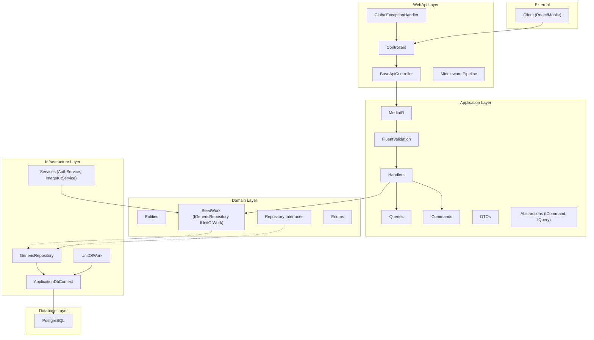
```mermaid
flowchart TB
    subgraph External["External"]
        Client["Client (React/Mobile)"]
    end

    subgraph WebApi["WebApi Layer"]
        Controllers["Controllers"]
        BaseApiController["BaseApiController"]
        GlobalExceptionHandler["GlobalExceptionHandler"]
        Middleware["Middleware Pipeline"]
    end

    subgraph Application["Application Layer"]
        MediatR["MediatR"]
        Commands["Commands"]
        Queries["Queries"]
        Handlers["Handlers"]
        Validators["FluentValidation"]
        DTOs["DTOs"]
        Abstractions["Abstractions (ICommand, IQuery)"]
    end

    subgraph Domain["Domain Layer"]
        Entities["Entities"]
        SeedWork["SeedWork (IGenericRepository, IUnitOfWork)"]
        Repositories["Repository Interfaces"]
        Enums["Enums"]
    end

    subgraph Infrastructure["Infrastructure Layer"]
        GenericRepository["GenericRepository<T>"]
        UnitOfWork["UnitOfWork"]
        DbContext["ApplicationDbContext"]
        Services["Services (AuthService, ImageKitService)"]
    end

    subgraph Database["Database Layer"]
        PostgreSQL["PostgreSQL"]
    end

    Client --> Controllers
    Controllers --> BaseApiController
    BaseApiController --> MediatR
    MediatR --> Validators
    Validators --> Handlers
    Handlers --> Commands
    Handlers --> Queries
    Handlers --> SeedWork
    SeedWork -.-> GenericRepository
    Repositories -.-> GenericRepository
    GenericRepository --> DbContext
    UnitOfWork --> DbContext
    DbContext --> PostgreSQL
    Services --> SeedWork
    GlobalExceptionHandler --> Controllers
```

### 1.2. Dependency Flow

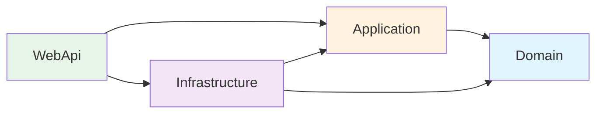
```mermaid
flowchart LR
    WebApi --> Application
    WebApi --> Infrastructure
    Application --> Domain
    Infrastructure --> Domain
    Infrastructure --> Application

    style Domain fill:#e1f5fe
    style Application fill:#fff3e0
    style Infrastructure fill:#f3e5f5
    style WebApi fill:#e8f5e9
```

> [!IMPORTANT]
> **Dependency Rule**: Các layer bên trong (Domain) không được phụ thuộc vào các layer bên ngoài. Domain là core của hệ thống và hoàn toàn độc lập.

### 1.3. Cấu Trúc Thư Mục

```
RetailStoreManagement/
├── src/
│   ├── Domain/                     # Business logic thuần túy
│   │   ├── Entities/               # Domain entities
│   │   ├── Enums/                  # Business enums
│   │   ├── Repositories/           # Repository interfaces
│   │   └── SeedWork/               # Base interfaces
│   ├── Application/                # Use cases & business rules
│   │   ├── Abstractions/           # CQRS interfaces
│   │   ├── Common/                 # Shared components
│   │   ├── Features/               # Feature modules
│   │   └── Profiles/               # AutoMapper profiles
│   ├── Infrastructure/             # External concerns
│   │   ├── Database/               # EF Core DbContext
│   │   ├── Repositories/           # Repository implementations
│   │   ├── SeedWork/               # Base implementations
│   │   └── Services/               # External services
│   └── WebApi/                     # Presentation layer
│       ├── Abstractions/           # Base controllers
│       ├── Controllers/            # API endpoints
│       ├── Infrastructure/         # Exception handling
│       └── Models/                 # API models
└── docs/                           # Documentation
```

---

## 2. Domain Layer

### 2.1. Call Graph

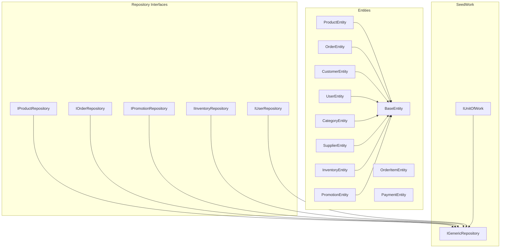
```mermaid
flowchart TD
    subgraph Entities["Entities"]
        BaseEntity["BaseEntity<TKey>"]
        ProductEntity["ProductEntity"]
        OrderEntity["OrderEntity"]
        OrderItemEntity["OrderItemEntity"]
        CustomerEntity["CustomerEntity"]
        UserEntity["UserEntity"]
        CategoryEntity["CategoryEntity"]
        SupplierEntity["SupplierEntity"]
        InventoryEntity["InventoryEntity"]
        PromotionEntity["PromotionEntity"]
        PaymentEntity["PaymentEntity"]
    end

    subgraph SeedWork["SeedWork"]
        IGenericRepository["IGenericRepository<T>"]
        IUnitOfWork["IUnitOfWork"]
    end

    subgraph RepositoryInterfaces["Repository Interfaces"]
        IProductRepository["IProductRepository"]
        IOrderRepository["IOrderRepository"]
        IPromotionRepository["IPromotionRepository"]
        IInventoryRepository["IInventoryRepository"]
        IUserRepository["IUserRepository"]
    end

    ProductEntity --> BaseEntity
    OrderEntity --> BaseEntity
    CustomerEntity --> BaseEntity
    UserEntity --> BaseEntity
    CategoryEntity --> BaseEntity
    SupplierEntity --> BaseEntity
    InventoryEntity --> BaseEntity
    PromotionEntity --> BaseEntity

    IProductRepository --> IGenericRepository
    IOrderRepository --> IGenericRepository
    IPromotionRepository --> IGenericRepository
    IInventoryRepository --> IGenericRepository
    IUserRepository --> IGenericRepository

    IUnitOfWork --> IGenericRepository
```

### 2.2. Phân Tích Chi Tiết

#### 2.2.1. BaseEntity<TKey>

**File**: [BaseEntity.cs](file:///media/nguyen-thanh-hung/Code3/TapHoaNho/shiny-carnival/RetailStoreManagement/src/Domain/Entities/BaseEntity.cs)

```csharp
public abstract class BaseEntity<TKey>
{
    [Key]
    [DatabaseGenerated(DatabaseGeneratedOption.Identity)]
    public virtual TKey Id { get; set; } = default!;

    public DateTime CreatedAt { get; set; } = DateTime.UtcNow;
    public DateTime? UpdatedAt { get; set; }
    public DateTime? DeletedAt { get; set; }
    
    // Soft delete flag
    public bool IsDeleted => DeletedAt.HasValue;
}
```

| Property | Mô tả |
|----------|-------|
| `Id` | Primary key với auto-generated identity |
| `CreatedAt` | Thời gian tạo record |
| `UpdatedAt` | Thời gian cập nhật |
| `DeletedAt` | Thời gian xóa (soft delete) |
| `IsDeleted` | Computed property xác định trạng thái xóa |

#### 2.2.2. IGenericRepository<T>

**File**: [IGenericRepository.cs](file:///media/nguyen-thanh-hung/Code3/TapHoaNho/shiny-carnival/RetailStoreManagement/src/Domain/SeedWork/IGenericRepository.cs)

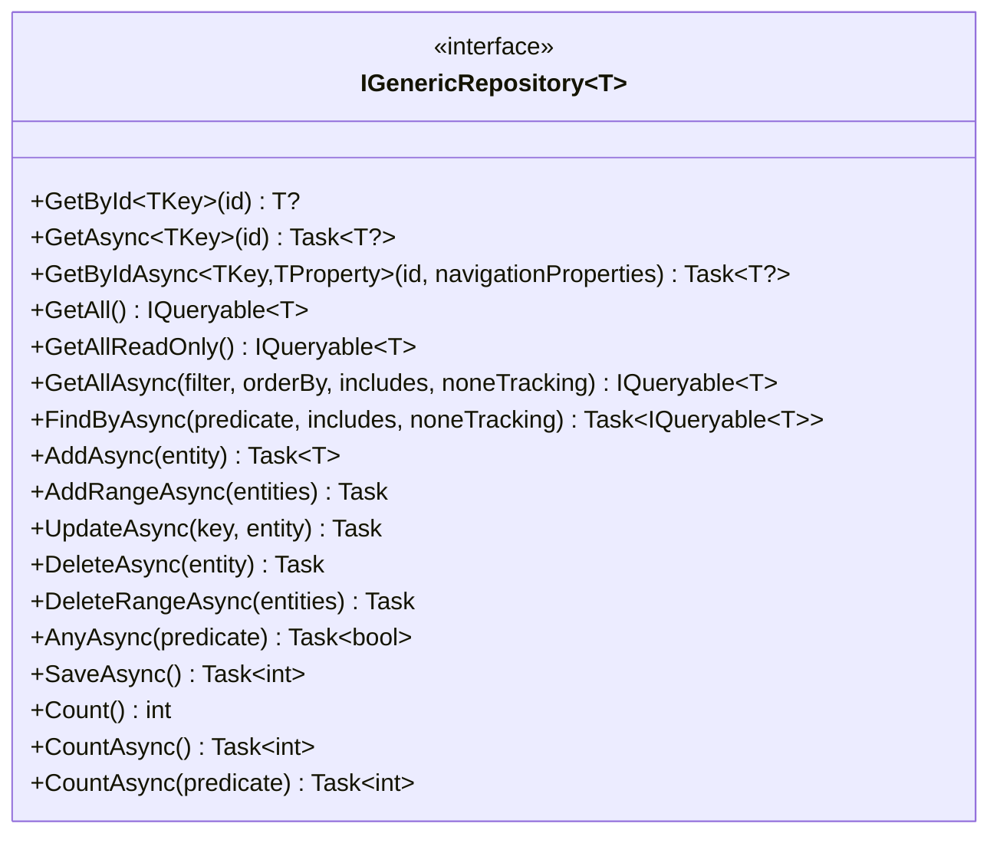
```mermaid
classDiagram
    class IGenericRepository~T~ {
        <<interface>>
        +GetById~TKey~(id) T?
        +GetAsync~TKey~(id) Task~T?~
        +GetByIdAsync~TKey,TProperty~(id, navigationProperties) Task~T?~
        +GetAll() IQueryable~T~
        +GetAllReadOnly() IQueryable~T~
        +GetAllAsync(filter, orderBy, includes, noneTracking) IQueryable~T~
        +FindByAsync(predicate, includes, noneTracking) Task~IQueryable~T~~
        +AddAsync(entity) Task~T~
        +AddRangeAsync(entities) Task
        +UpdateAsync(key, entity) Task
        +DeleteAsync(entity) Task
        +DeleteRangeAsync(entities) Task
        +AnyAsync(predicate) Task~bool~
        +SaveAsync() Task~int~
        +Count() int
        +CountAsync() Task~int~
        +CountAsync(predicate) Task~int~
    }
```

**Phân nhóm Methods:**

| Nhóm | Methods | Mô tả |
|------|---------|-------|
| **Query** | `GetById`, `GetAsync`, `GetByIdAsync`, `GetAll`, `GetAllReadOnly`, `GetAllAsync`, `FindByAsync` | Đọc dữ liệu |
| **Command** | `AddAsync`, `AddRangeAsync`, `UpdateAsync`, `DeleteAsync`, `DeleteRangeAsync` | Ghi dữ liệu |
| **Utility** | `AnyAsync`, `SaveAsync`, `Count`, `CountAsync` | Tiện ích |

#### 2.2.3. IUnitOfWork

**File**: [IUnitOfWork.cs](file:///media/nguyen-thanh-hung/Code3/TapHoaNho/shiny-carnival/RetailStoreManagement/src/Domain/SeedWork/IUnitOfWork.cs)

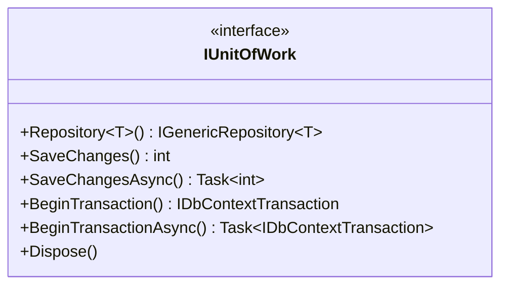
```mermaid
classDiagram
    class IUnitOfWork {
        <<interface>>
        +Repository~T~() IGenericRepository~T~
        +SaveChanges() int
        +SaveChangesAsync() Task~int~
        +BeginTransaction() IDbContextTransaction
        +BeginTransactionAsync() Task~IDbContextTransaction~
        +Dispose()
    }
```

> [!NOTE]
> **Unit of Work Pattern**: Quản lý tất cả repositories và transactions trong một scope duy nhất, đảm bảo consistency khi thao tác với nhiều entities.

#### 2.2.4. Specialized Repository Interfaces

**File**: [IRepositories.cs](file:///media/nguyen-thanh-hung/Code3/TapHoaNho/shiny-carnival/RetailStoreManagement/src/Domain/Repositories/IRepositories.cs)

| Interface | Extends | Specialized Methods |
|-----------|---------|---------------------|
| `IProductRepository` | `IGenericRepository<ProductEntity>` | `GetByCategoryAsync`, `GetBySupplierAsync`, `GetLowStockProductsAsync`, `SearchAsync` |
| `IOrderRepository` | `IGenericRepository<OrderEntity>` | `GetOrderWithDetailsAsync`, `GetByCustomerAsync`, `GetByDateRangeAsync`, `GetTotalRevenueAsync` |
| `IPromotionRepository` | `IGenericRepository<PromotionEntity>` | `GetActivePromotionsAsync`, `GetByCodeAsync`, `IsValidAsync` |
| `IInventoryRepository` | `IGenericRepository<InventoryEntity>` | `GetByProductIdAsync`, `GetLowStockAsync`, `UpdateQuantityAsync` |
| `IUserRepository` | `IGenericRepository<UserEntity>` | `GetByUsernameAsync`, `ExistsUsernameAsync` |

#### 2.2.5. Entity Relationships

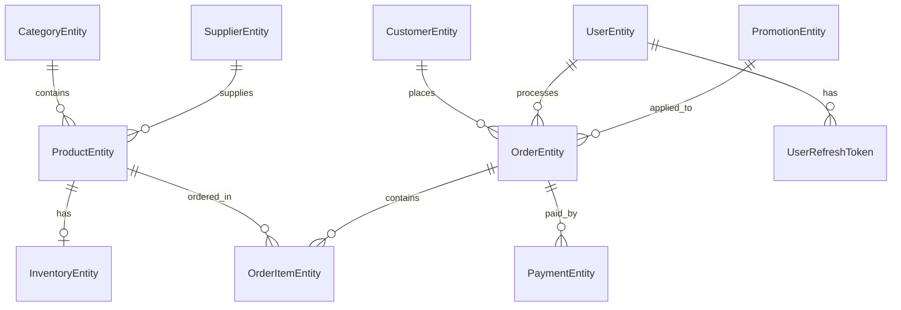
```mermaid
erDiagram
    CategoryEntity ||--o{ ProductEntity : contains
    SupplierEntity ||--o{ ProductEntity : supplies
    ProductEntity ||--o| InventoryEntity : has
    ProductEntity ||--o{ OrderItemEntity : ordered_in

    CustomerEntity ||--o{ OrderEntity : places
    UserEntity ||--o{ OrderEntity : processes
    PromotionEntity ||--o{ OrderEntity : applied_to
    OrderEntity ||--o{ OrderItemEntity : contains
    OrderEntity ||--o{ PaymentEntity : paid_by

    UserEntity ||--o{ UserRefreshToken : has
```

---

## 3. Application Layer

### 3.1. Call Graph

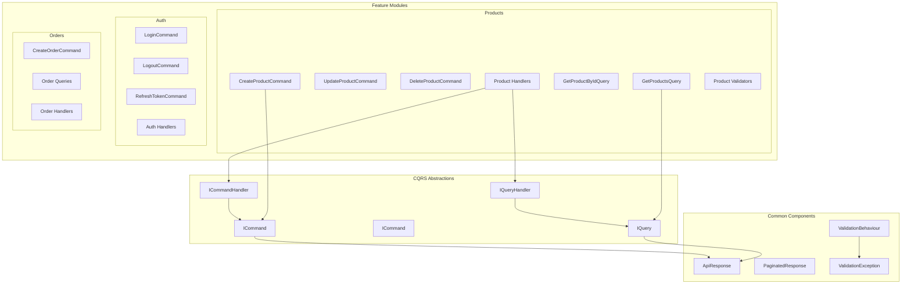
```mermaid
flowchart TD
    subgraph Abstractions["CQRS Abstractions"]
        ICommand["ICommand<TResponse>"]
        ICommandVoid["ICommand"]
        IQuery["IQuery<TResponse>"]
        ICommandHandler["ICommandHandler<TCommand, TResponse>"]
        IQueryHandler["IQueryHandler<TQuery, TResponse>"]
    end

    subgraph Common["Common Components"]
        ApiResponse["ApiResponse<T>"]
        PaginatedResponse["PaginatedResponse<T>"]
        ValidationBehaviour["ValidationBehaviour<TRequest, TResponse>"]
        ValidationException["ValidationException"]
    end

    subgraph Features["Feature Modules"]
        subgraph ProductsModule["Products"]
            CreateProductCommand["CreateProductCommand"]
            UpdateProductCommand["UpdateProductCommand"]
            DeleteProductCommand["DeleteProductCommand"]
            GetProductsQuery["GetProductsQuery"]
            GetProductByIdQuery["GetProductByIdQuery"]
            ProductHandlers["Product Handlers"]
            ProductValidators["Product Validators"]
        end

        subgraph AuthModule["Auth"]
            LoginCommand["LoginCommand"]
            LogoutCommand["LogoutCommand"]
            RefreshTokenCommand["RefreshTokenCommand"]
            AuthHandlers["Auth Handlers"]
        end

        subgraph OrdersModule["Orders"]
            CreateOrderCommand["CreateOrderCommand"]
            OrderQueries["Order Queries"]
            OrderHandlers["Order Handlers"]
        end
    end

    ICommand --> ApiResponse
    IQuery --> ApiResponse
    ICommandHandler --> ICommand
    IQueryHandler --> IQuery
    
    CreateProductCommand --> ICommand
    GetProductsQuery --> IQuery
    ProductHandlers --> ICommandHandler
    ProductHandlers --> IQueryHandler
    
    ValidationBehaviour --> ValidationException
```

### 3.2. Phân Tích Chi Tiết

#### 3.2.1. CQRS Abstractions

**File**: [ICommand.cs](file:///media/nguyen-thanh-hung/Code3/TapHoaNho/shiny-carnival/RetailStoreManagement/src/Application/Abstractions/Messaging/ICommand.cs), [IQuery.cs](file:///media/nguyen-thanh-hung/Code3/TapHoaNho/shiny-carnival/RetailStoreManagement/src/Application/Abstractions/Messaging/IQuery.cs)

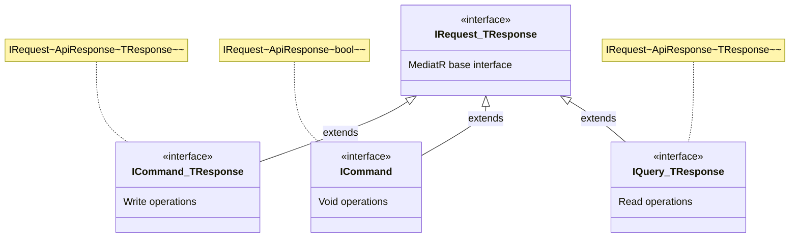
```mermaid
classDiagram
    class IRequest_TResponse {
        <<interface>>
        MediatR base interface
    }
    
    class ICommand_TResponse {
        <<interface>>
        Write operations
    }
    
    class ICommand {
        <<interface>>
        Void operations
    }
    
    class IQuery_TResponse {
        <<interface>>
        Read operations
    }
    
    IRequest_TResponse <|-- ICommand_TResponse : extends
    IRequest_TResponse <|-- ICommand : extends
    IRequest_TResponse <|-- IQuery_TResponse : extends

    note for ICommand_TResponse "IRequest~ApiResponse~TResponse~~"
    note for ICommand "IRequest~ApiResponse~bool~~"
    note for IQuery_TResponse "IRequest~ApiResponse~TResponse~~"
```

| Interface | Mục đích | Return Type |
|-----------|----------|-------------|
| `ICommand<TResponse>` | Thao tác ghi với dữ liệu trả về | `ApiResponse<TResponse>` |
| `ICommand` | Thao tác ghi không cần dữ liệu | `ApiResponse<bool>` |
| `IQuery<TResponse>` | Thao tác đọc | `ApiResponse<TResponse>` |

#### 3.2.2. ApiResponse<T>

**File**: [ApiResponse.cs](file:///media/nguyen-thanh-hung/Code3/TapHoaNho/shiny-carnival/RetailStoreManagement/src/Application/Common/Models/ApiResponse.cs)

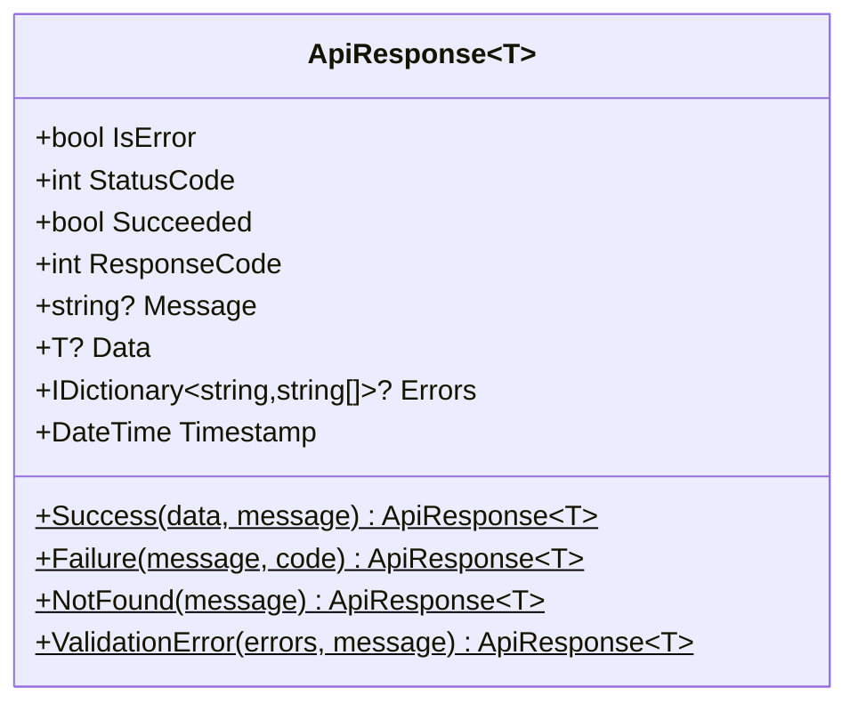
```mermaid
classDiagram
    class ApiResponse~T~ {
        +bool IsError
        +int StatusCode
        +bool Succeeded
        +int ResponseCode
        +string? Message
        +T? Data
        +IDictionary~string,string[]~? Errors
        +DateTime Timestamp
        +Success(data, message) ApiResponse~T~$
        +Failure(message, code) ApiResponse~T~$
        +NotFound(message) ApiResponse~T~$
        +ValidationError(errors, message) ApiResponse~T~$
    }
```

> [!TIP]
> **Standardized Response**: Tất cả API endpoints đều trả về `ApiResponse<T>` đảm bảo format response nhất quán cho client.

#### 3.2.3. ValidationBehaviour

**File**: [ValidationBehaviour.cs](file:///media/nguyen-thanh-hung/Code3/TapHoaNho/shiny-carnival/RetailStoreManagement/src/Application/Common/Behaviours/ValidationBehaviour.cs)

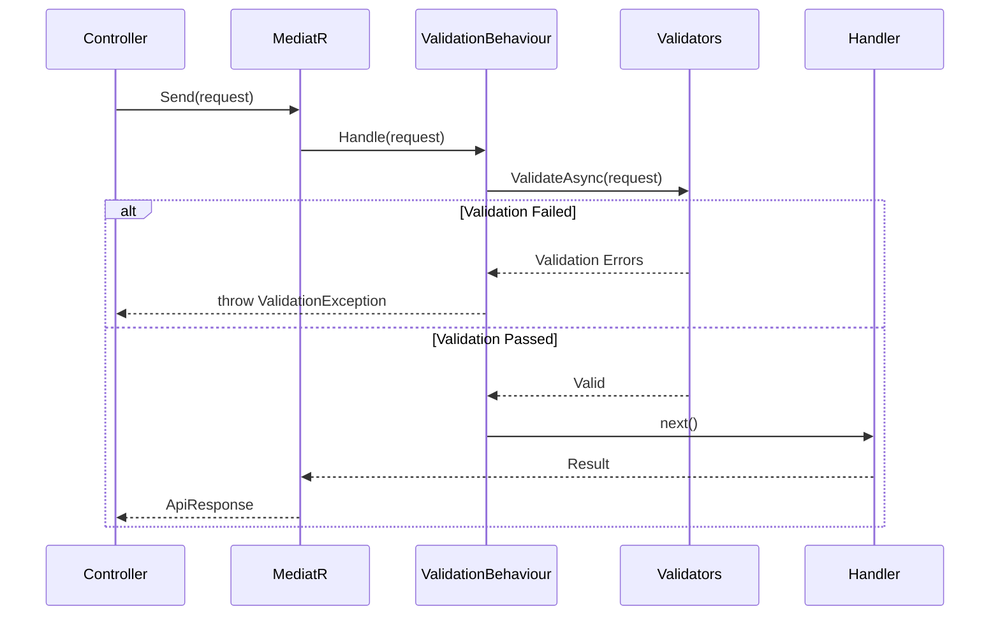
```mermaid
sequenceDiagram
    participant Controller
    participant MediatR
    participant ValidationBehaviour
    participant Validators
    participant Handler

    Controller->>MediatR: Send(request)
    MediatR->>ValidationBehaviour: Handle(request)
    ValidationBehaviour->>Validators: ValidateAsync(request)
    
    alt Validation Failed
        Validators-->>ValidationBehaviour: Validation Errors
        ValidationBehaviour-->>Controller: throw ValidationException
    else Validation Passed
        Validators-->>ValidationBehaviour: Valid
        ValidationBehaviour->>Handler: next()
        Handler-->>MediatR: Result
        MediatR-->>Controller: ApiResponse
    end
```

#### 3.2.4. Feature Module Structure

Mỗi Feature module tuân theo cấu trúc chuẩn:

```
Features/
└── [FeatureName]/
    ├── Commands/        # Command objects (Create, Update, Delete)
    ├── Queries/         # Query objects (Get, List)
    ├── Handlers/        # Command & Query handlers
    ├── Dtos/            # Data Transfer Objects
    ├── Validators/      # FluentValidation validators
    └── Services/        # Feature-specific service interfaces
```

**Ví dụ: Products Feature**

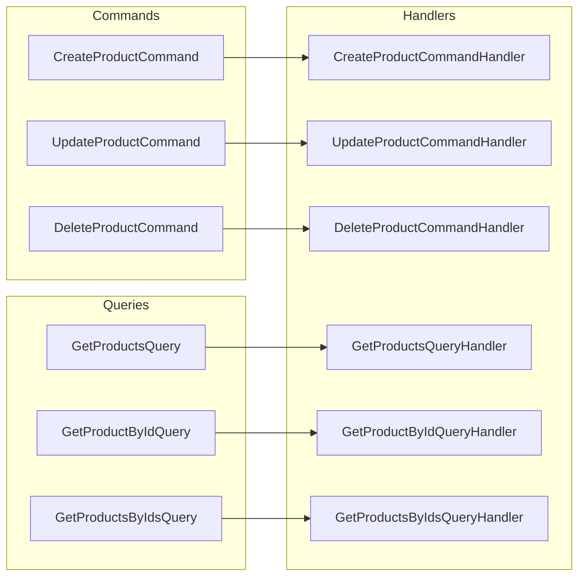
```mermaid
flowchart LR
    subgraph Commands
        CreateProductCommand
        UpdateProductCommand
        DeleteProductCommand
    end
    
    subgraph Queries
        GetProductsQuery
        GetProductByIdQuery
        GetProductsByIdsQuery
    end
    
    subgraph Handlers
        CreateProductCommandHandler
        UpdateProductCommandHandler
        DeleteProductCommandHandler
        GetProductsQueryHandler
        GetProductByIdQueryHandler
        GetProductsByIdsQueryHandler
    end
    
    CreateProductCommand --> CreateProductCommandHandler
    UpdateProductCommand --> UpdateProductCommandHandler
    DeleteProductCommand --> DeleteProductCommandHandler
    GetProductsQuery --> GetProductsQueryHandler
    GetProductByIdQuery --> GetProductByIdQueryHandler
    GetProductsByIdsQuery --> GetProductsByIdsQueryHandler
```

#### 3.2.5. Handler Pattern

**Ví dụ Command Handler**: [CreateProductCommandHandler.cs](file:///media/nguyen-thanh-hung/Code3/TapHoaNho/shiny-carnival/RetailStoreManagement/src/Application/Features/Products/Handlers/CreateProductCommandHandler.cs)

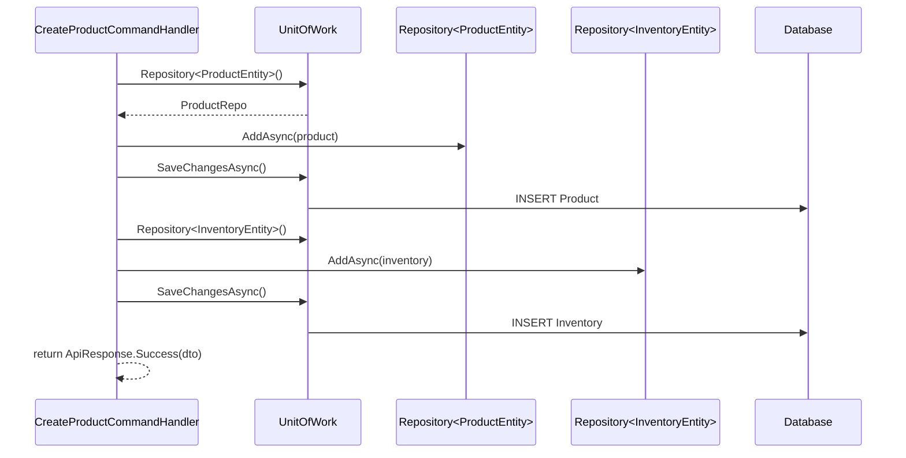
```mermaid
sequenceDiagram
    participant Handler as CreateProductCommandHandler
    participant UnitOfWork
    participant ProductRepo as Repository<ProductEntity>
    participant InventoryRepo as Repository<InventoryEntity>
    participant DB as Database

    Handler->>UnitOfWork: Repository<ProductEntity>()
    UnitOfWork-->>Handler: ProductRepo
    Handler->>ProductRepo: AddAsync(product)
    Handler->>UnitOfWork: SaveChangesAsync()
    UnitOfWork->>DB: INSERT Product
    
    Handler->>UnitOfWork: Repository<InventoryEntity>()
    Handler->>InventoryRepo: AddAsync(inventory)
    Handler->>UnitOfWork: SaveChangesAsync()
    UnitOfWork->>DB: INSERT Inventory
    
    Handler-->>Handler: return ApiResponse.Success(dto)
```

**Ví dụ Query Handler**: [GetProductsQueryHandler.cs](file:///media/nguyen-thanh-hung/Code3/TapHoaNho/shiny-carnival/RetailStoreManagement/src/Application/Features/Products/Handlers/GetProductsQueryHandler.cs)

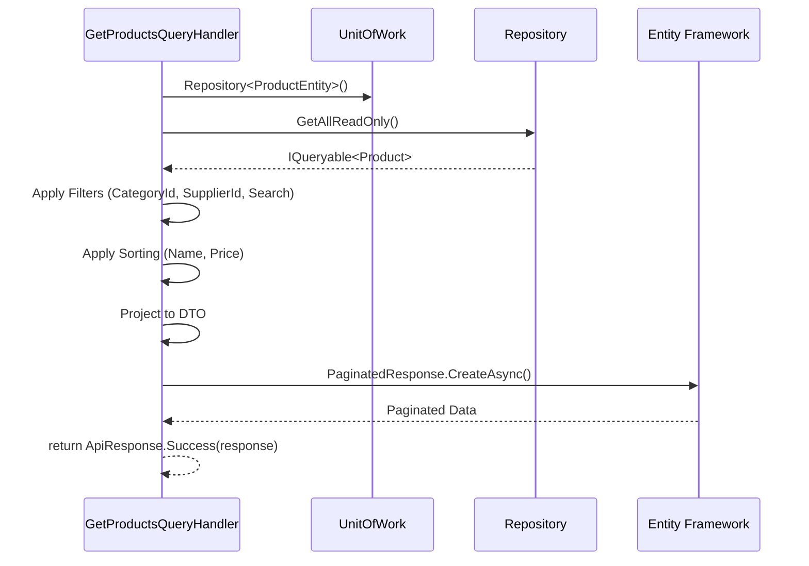
```mermaid
sequenceDiagram
    participant Handler as GetProductsQueryHandler
    participant UnitOfWork
    participant Repository
    participant EF as Entity Framework

    Handler->>UnitOfWork: Repository<ProductEntity>()
    Handler->>Repository: GetAllReadOnly()
    Repository-->>Handler: IQueryable<Product>
    
    Handler->>Handler: Apply Filters (CategoryId, SupplierId, Search)
    Handler->>Handler: Apply Sorting (Name, Price)
    Handler->>Handler: Project to DTO
    
    Handler->>EF: PaginatedResponse.CreateAsync()
    EF-->>Handler: Paginated Data
    
    Handler-->>Handler: return ApiResponse.Success(response)
```

#### 3.2.6. Feature Modules Overview

| Module | Commands | Queries | Handlers | Mô tả |
|--------|----------|---------|----------|-------|
| **Auth** | Login, Logout, RefreshToken, SetupAdmin | - | 4 | Xác thực người dùng |
| **Products** | Create, Update, Delete | GetAll, GetById, GetByIds | 6 | Quản lý sản phẩm |
| **Categories** | Create, Update, Delete | GetAll, GetById | 5 | Quản lý danh mục |
| **Orders** | Create, Update, Cancel, Complete, UpdateStatus | GetAll, GetById, GetByCustomer, GetByDate | 10 | Quản lý đơn hàng |
| **Customers** | Create, Update, Delete | GetAll, GetById | 5 | Quản lý khách hàng |
| **Suppliers** | Create, Update, Delete | GetAll, GetById | 5 | Quản lý nhà cung cấp |
| **Inventory** | Update, Adjust | GetAll, GetByProduct | 4 | Quản lý kho |
| **Promotions** | Create, Update, Delete, Activate | GetAll, GetActive, GetByCode | 6 | Quản lý khuyến mãi |
| **Users** | Create, Update, Delete | GetAll, GetById | 5 | Quản lý người dùng |
| **Reports** | - | Revenue, TopProducts, CustomerStats | 3 | Báo cáo thống kê |
| **ImageKit** | Upload, Delete | - | 2 | Quản lý hình ảnh |

---

## 4. Infrastructure Layer

### 4.1. Call Graph

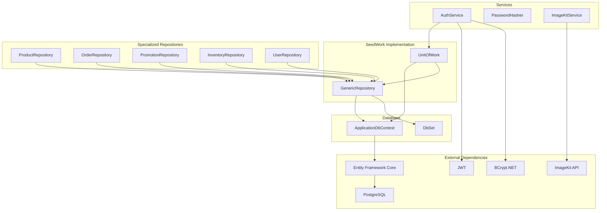
```mermaid
flowchart TD
    subgraph SeedWork["SeedWork Implementation"]
        GenericRepository["GenericRepository<T>"]
        UnitOfWork["UnitOfWork"]
    end

    subgraph Database["Database"]
        ApplicationDbContext["ApplicationDbContext"]
        DbSet["DbSet<T>"]
    end

    subgraph Repositories["Specialized Repositories"]
        ProductRepository["ProductRepository"]
        OrderRepository["OrderRepository"]
        PromotionRepository["PromotionRepository"]
        InventoryRepository["InventoryRepository"]
        UserRepository["UserRepository"]
    end

    subgraph Services["Services"]
        AuthService["AuthService"]
        PasswordHasher["PasswordHasher"]
        ImageKitService["ImageKitService"]
    end

    subgraph External["External Dependencies"]
        EFCore["Entity Framework Core"]
        PostgreSQL["PostgreSQL"]
        BCrypt["BCrypt.NET"]
        JWT["JWT"]
        ImageKitAPI["ImageKit API"]
    end

    GenericRepository --> ApplicationDbContext
    GenericRepository --> DbSet
    UnitOfWork --> ApplicationDbContext
    UnitOfWork --> GenericRepository
    
    ProductRepository --> GenericRepository
    OrderRepository --> GenericRepository
    PromotionRepository --> GenericRepository
    InventoryRepository --> GenericRepository
    UserRepository --> GenericRepository
    
    ApplicationDbContext --> EFCore
    EFCore --> PostgreSQL
    
    AuthService --> UnitOfWork
    AuthService --> JWT
    AuthService --> BCrypt
    
    ImageKitService --> ImageKitAPI
```

### 4.2. Phân Tích Chi Tiết

#### 4.2.1. GenericRepository<T>

**File**: [GenericRepository.cs](file:///media/nguyen-thanh-hung/Code3/TapHoaNho/shiny-carnival/RetailStoreManagement/src/Infrastructure/SeedWork/GenericRepository.cs)

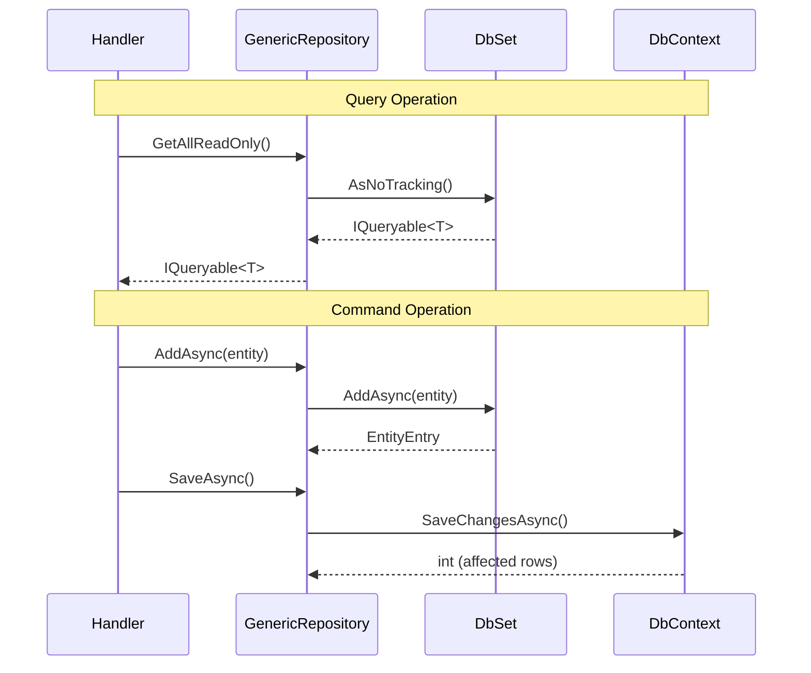
```mermaid
sequenceDiagram
    participant Handler
    participant GenericRepository
    participant DbSet
    participant DbContext

    Note over Handler,DbContext: Query Operation
    Handler->>GenericRepository: GetAllReadOnly()
    GenericRepository->>DbSet: AsNoTracking()
    DbSet-->>GenericRepository: IQueryable<T>
    GenericRepository-->>Handler: IQueryable<T>

    Note over Handler,DbContext: Command Operation
    Handler->>GenericRepository: AddAsync(entity)
    GenericRepository->>DbSet: AddAsync(entity)
    DbSet-->>GenericRepository: EntityEntry
    
    Handler->>GenericRepository: SaveAsync()
    GenericRepository->>DbContext: SaveChangesAsync()
    DbContext-->>GenericRepository: int (affected rows)
```

**Key Implementation Details:**

| Method | Implementation | Performance Note |
|--------|----------------|------------------|
| `GetAllReadOnly()` | `DbSet.AsNoTracking()` | Optimal cho read-only queries |
| `GetAll()` | `DbSet` (with tracking) | Dùng khi cần update entity |
| `GetByIdAsync()` | `DbSet.Include().FirstOrDefaultAsync()` | Eager loading navigation properties |
| `UpdateAsync()` | `Entry.CurrentValues.SetValues()` | Partial update without full entity load |

#### 4.2.2. UnitOfWork

**File**: [UnitOfWork.cs](file:///media/nguyen-thanh-hung/Code3/TapHoaNho/shiny-carnival/RetailStoreManagement/src/Infrastructure/SeedWork/UnitOfWork.cs)

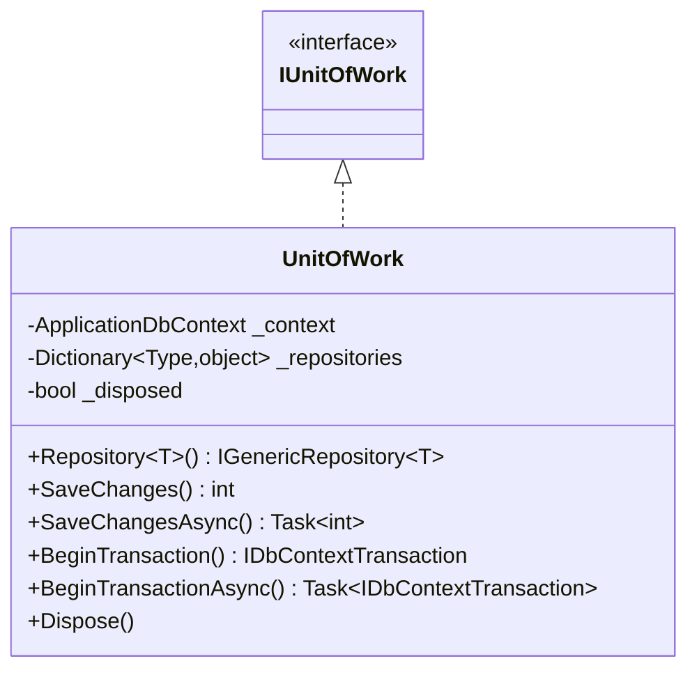
```mermaid
classDiagram
    class UnitOfWork {
        -ApplicationDbContext _context
        -Dictionary~Type,object~ _repositories
        -bool _disposed
        +Repository~T~() IGenericRepository~T~
        +SaveChanges() int
        +SaveChangesAsync() Task~int~
        +BeginTransaction() IDbContextTransaction
        +BeginTransactionAsync() Task~IDbContextTransaction~
        +Dispose()
    }
    
    class IUnitOfWork {
        <<interface>>
    }
    
    IUnitOfWork <|.. UnitOfWork
```

> [!NOTE]
> **Repository Caching**: UnitOfWork cache các repository instances trong `_repositories` dictionary để tránh tạo multiple instances cho cùng một entity type.

#### 4.2.3. ApplicationDbContext

**File**: [ApplicationDbContext.cs](file:///media/nguyen-thanh-hung/Code3/TapHoaNho/shiny-carnival/RetailStoreManagement/src/Infrastructure/Database/ApplicationDbContext.cs)

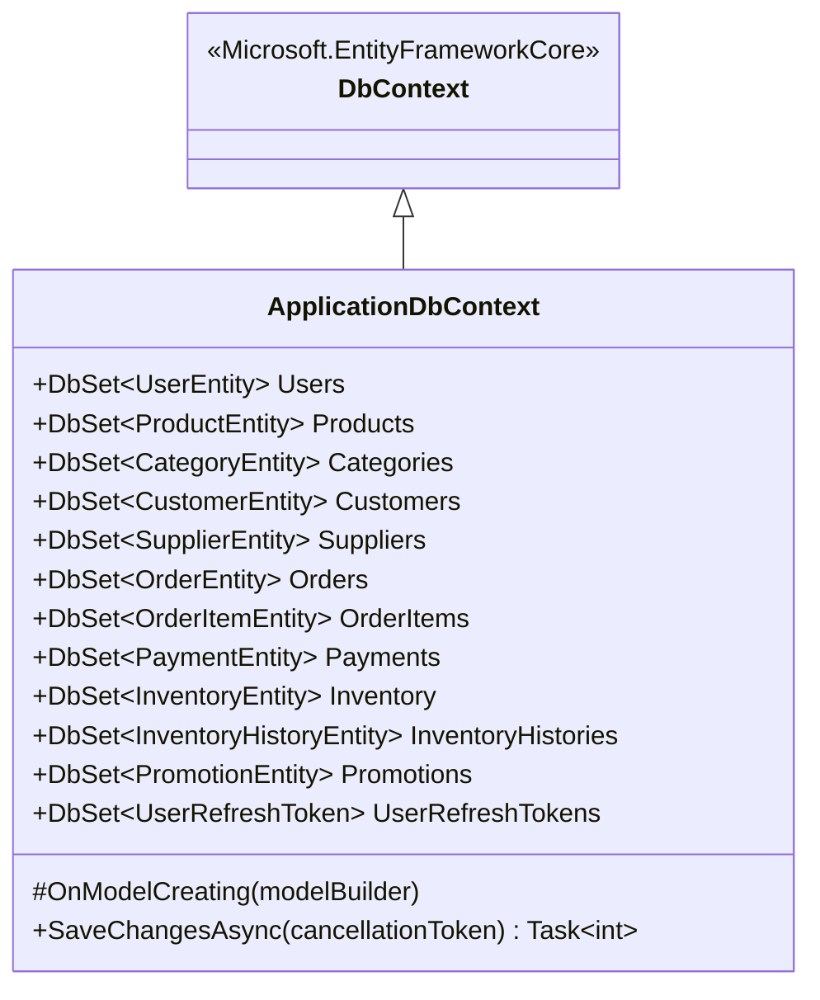
```mermaid
classDiagram
    class ApplicationDbContext {
        +DbSet~UserEntity~ Users
        +DbSet~ProductEntity~ Products
        +DbSet~CategoryEntity~ Categories
        +DbSet~CustomerEntity~ Customers
        +DbSet~SupplierEntity~ Suppliers
        +DbSet~OrderEntity~ Orders
        +DbSet~OrderItemEntity~ OrderItems
        +DbSet~PaymentEntity~ Payments
        +DbSet~InventoryEntity~ Inventory
        +DbSet~InventoryHistoryEntity~ InventoryHistories
        +DbSet~PromotionEntity~ Promotions
        +DbSet~UserRefreshToken~ UserRefreshTokens
        #OnModelCreating(modelBuilder)
        +SaveChangesAsync(cancellationToken) Task~int~
    }
    
    class DbContext {
        <<Microsoft.EntityFrameworkCore>>
    }
    
    DbContext <|-- ApplicationDbContext
```

**Auto Audit Fields:**

```csharp
public override Task<int> SaveChangesAsync(CancellationToken cancellationToken = default)
{
    foreach (var entry in ChangeTracker.Entries<BaseEntity<int>>())
    {
        switch (entry.State)
        {
            case EntityState.Added:
                entry.Entity.CreatedAt = DateTime.UtcNow;
                break;
            case EntityState.Modified:
                entry.Entity.UpdatedAt = DateTime.UtcNow;
                break;
        }
    }
    return base.SaveChangesAsync(cancellationToken);
}
```

#### 4.2.4. AuthService

**File**: [AuthService.cs](file:///media/nguyen-thanh-hung/Code3/TapHoaNho/shiny-carnival/RetailStoreManagement/src/Infrastructure/Services/AuthService.cs)

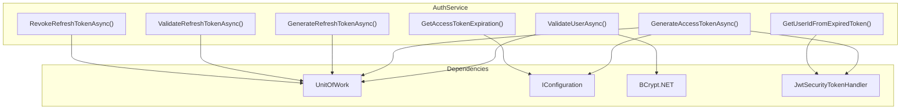
```mermaid
flowchart TD
    subgraph AuthService
        ValidateUser["ValidateUserAsync()"]
        GenerateAccess["GenerateAccessTokenAsync()"]
        GenerateRefresh["GenerateRefreshTokenAsync()"]
        ValidateRefresh["ValidateRefreshTokenAsync()"]
        RevokeRefresh["RevokeRefreshTokenAsync()"]
        GetExpiration["GetAccessTokenExpiration()"]
        GetUserIdFromToken["GetUserIdFromExpiredToken()"]
    end

    subgraph Dependencies
        UnitOfWork
        Configuration["IConfiguration"]
        BCrypt["BCrypt.NET"]
        JWT["JwtSecurityTokenHandler"]
    end

    ValidateUser --> UnitOfWork
    ValidateUser --> BCrypt
    GenerateAccess --> UnitOfWork
    GenerateAccess --> JWT
    GenerateAccess --> Configuration
    GenerateRefresh --> UnitOfWork
    ValidateRefresh --> UnitOfWork
    RevokeRefresh --> UnitOfWork
    GetExpiration --> Configuration
    GetUserIdFromToken --> JWT
```

**JWT Token Structure:**

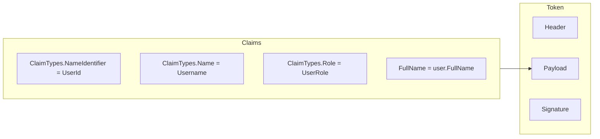
```mermaid
flowchart LR
    subgraph Claims
        NameIdentifier["ClaimTypes.NameIdentifier = UserId"]
        Name["ClaimTypes.Name = Username"]
        Role["ClaimTypes.Role = UserRole"]
        FullName["FullName = user.FullName"]
    end
    
    subgraph Token
        Header["Header"]
        Payload["Payload"]
        Signature["Signature"]
    end
    
    Claims --> Payload
```

#### 4.2.5. Dependency Injection

**File**: [DependencyInjection.cs](file:///media/nguyen-thanh-hung/Code3/TapHoaNho/shiny-carnival/RetailStoreManagement/src/Infrastructure/DependencyInjection.cs)

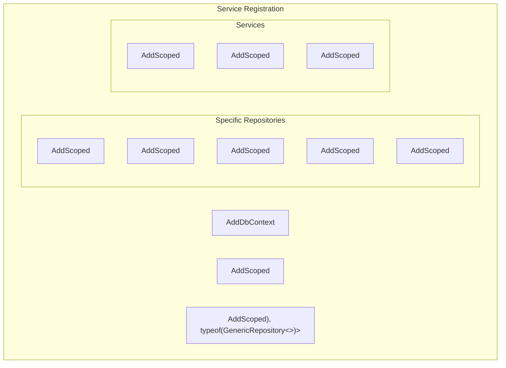
```mermaid
flowchart TD
    subgraph Registration["Service Registration"]
        DbContext["AddDbContext<ApplicationDbContext>"]
        UoW["AddScoped<IUnitOfWork, UnitOfWork>"]
        GenRepo["AddScoped<typeof(IGenericRepository<>), typeof(GenericRepository<>)>"]
        
        subgraph SpecificRepos["Specific Repositories"]
            ProductRepo["AddScoped<IProductRepository, ProductRepository>"]
            OrderRepo["AddScoped<IOrderRepository, OrderRepository>"]
            PromotionRepo["AddScoped<IPromotionRepository, PromotionRepository>"]
            InventoryRepo["AddScoped<IInventoryRepository, InventoryRepository>"]
            UserRepo["AddScoped<IUserRepository, UserRepository>"]
        end
        
        subgraph Services
            Auth["AddScoped<IAuthService, AuthService>"]
            Hasher["AddScoped<IPasswordHasher, PasswordHasher>"]
            ImageKit["AddScoped<IImageKitService, ImageKitService>"]
        end
    end
```

---

## 5. WebApi Layer

### 5.1. Call Graph

```mermaid
flowchart TD
    subgraph Request["HTTP Request"]
        Client["Client"]
    end

    subgraph Middleware["Middleware Pipeline"]
        CORS["CORS Middleware"]
        ExceptionHandler["Exception Handler"]
        Authentication["JWT Authentication"]
        Authorization["Authorization"]
    end

    subgraph Controllers["Controllers"]
        BaseApiController["BaseApiController"]
        AuthController["AuthController"]
        
        subgraph AdminControllers["Admin Controllers"]
            ProductsController["ProductsController"]
            CategoriesController["CategoriesController"]
            OrdersController["OrdersController"]
            CustomersController["CustomersController"]
            SuppliersController["SuppliersController"]
            InventoryController["InventoryController"]
            PromotionsController["PromotionsController"]
            UsersController["UsersController"]
            ReportsController["ReportsController"]
            ImageKitController["ImageKitController"]
        end
        
        subgraph PublicControllers["Public Controllers"]
            PublicProducts["PublicProductsController"]
            PublicCategories["PublicCategoriesController"]
        end
    end

    subgraph Infrastructure["Infrastructure"]
        GlobalExceptionHandler["GlobalExceptionHandler"]
    end

    Client --> CORS
    CORS --> ExceptionHandler
    ExceptionHandler --> Authentication
    Authentication --> Authorization
    Authorization --> Controllers
    
    Controllers --> BaseApiController
    BaseApiController --> MediatR["MediatR"]
    
    GlobalExceptionHandler --> ExceptionHandler

    AuthController --> BaseApiController
    ProductsController --> BaseApiController
    OrdersController --> BaseApiController
```

### 5.2. Phân Tích Chi Tiết

#### 5.2.1. BaseApiController

**File**: [BaseApiController.cs](file:///media/nguyen-thanh-hung/Code3/TapHoaNho/shiny-carnival/RetailStoreManagement/src/WebApi/Abstractions/BaseApiController.cs)

```csharp
[Route("api/[controller]")]
[ApiController]
public abstract class BaseApiController(IMediator mediator) : ControllerBase
{
    protected readonly IMediator Mediator = mediator;
}
```

> [!NOTE]
> **Primary Constructor**: Sử dụng C# 12 primary constructor pattern để inject `IMediator`.

#### 5.2.2. Controller Pattern

```mermaid
sequenceDiagram
    participant Client
    participant Controller
    participant Mediator
    participant Handler
    participant UnitOfWork

    Client->>Controller: HTTP Request
    Controller->>Controller: Map to Command/Query
    Controller->>Mediator: Send(command)
    Mediator->>Handler: Handle(command)
    Handler->>UnitOfWork: Repository operations
    UnitOfWork-->>Handler: Result
    Handler-->>Mediator: ApiResponse
    Mediator-->>Controller: ApiResponse
    Controller-->>Client: HTTP Response
```

**Ví dụ ProductsController**: [ProductsController.cs](file:///media/nguyen-thanh-hung/Code3/TapHoaNho/shiny-carnival/RetailStoreManagement/src/WebApi/Controllers/Admin/ProductsController.cs)

| Endpoint | Method | Command/Query | Response |
|----------|--------|---------------|----------|
| `GET /api/admin/products` | GetProducts | `GetProductsQuery` | `PaginatedResponse<ProductDto>` |
| `GET /api/admin/products/{id}` | GetProductById | `GetProductByIdQuery` | `ProductDto` |
| `POST /api/admin/products` | CreateProduct | `CreateProductCommand` | `ProductDto` |
| `PUT /api/admin/products/{id}` | UpdateProduct | `UpdateProductCommand` | `bool` |
| `DELETE /api/admin/products/{id}` | DeleteProduct | `DeleteProductCommand` | `bool` |
| `POST /api/admin/products/by-ids` | GetProductsByIds | `GetProductsByIdsQuery` | `List<ProductDto>` |

#### 5.2.3. GlobalExceptionHandler

**File**: [GlobalExceptionHandler.cs](file:///media/nguyen-thanh-hung/Code3/TapHoaNho/shiny-carnival/RetailStoreManagement/src/WebApi/Infrastructure/GlobalExceptionHandler.cs)

```mermaid
flowchart TD
    Exception["Exception Thrown"]
    
    Exception --> Switch{Exception Type?}
    
    Switch -->|ValidationException| Validation["400 Bad Request
    Dữ liệu không hợp lệ"]
    
    Switch -->|NotFoundException| NotFound["404 Not Found"]
    
    Switch -->|BadRequestException| BadRequest["400 Bad Request"]
    
    Switch -->|UnauthorizedAccessException| Unauthorized["401 Unauthorized
    Không có quyền truy cập"]
    
    Switch -->|Other| InternalError["500 Internal Server Error
    Đã xảy ra lỗi"]
    
    Validation --> Response["ApiResponse<object>"]
    NotFound --> Response
    BadRequest --> Response
    Unauthorized --> Response
    InternalError --> Response
```

#### 5.2.4. AuthController Flow

**File**: [AuthController.cs](file:///media/nguyen-thanh-hung/Code3/TapHoaNho/shiny-carnival/RetailStoreManagement/src/WebApi/Controllers/AuthController.cs)

```mermaid
sequenceDiagram
    participant Client
    participant AuthController
    participant Mediator
    participant LoginHandler
    participant AuthService
    participant Cookie

    Client->>AuthController: POST /api/auth/login
    AuthController->>Mediator: Send(LoginCommand)
    Mediator->>LoginHandler: Handle(command)
    LoginHandler->>AuthService: ValidateUserAsync()
    LoginHandler->>AuthService: GenerateAccessTokenAsync()
    LoginHandler->>AuthService: GenerateRefreshTokenAsync()
    AuthService-->>LoginHandler: Tokens
    LoginHandler-->>AuthController: LoginResponse
    
    AuthController->>Cookie: SetTokenCookies(accessToken, refreshToken)
    AuthController-->>Client: ApiResponse<LegacyLoginResponse> + Set-Cookie
```

**Cookie Settings:**

| Cookie | HttpOnly | Secure | SameSite | Expiry |
|--------|----------|--------|----------|--------|
| `accessToken` | ✓ | Production only | Lax | Token expiry |
| `refreshToken` | ✓ | Production only | Lax | 7 days |

#### 5.2.5. Program.cs Configuration

**File**: [Program.cs](file:///media/nguyen-thanh-hung/Code3/TapHoaNho/shiny-carnival/RetailStoreManagement/src/WebApi/Program.cs)

```mermaid
flowchart TD
    subgraph Configuration
        CORS["CORS Configuration"]
        DI["Clean Architecture DI"]
        Exception["Exception Handler"]
        Controllers["Controllers + JSON Options"]
        JWT["JWT Authentication"]
        Swagger["Swagger Configuration"]
    end

    subgraph Pipeline["Middleware Pipeline (Order)"]
        step1["1. Swagger (Dev only)"]
        step2["2. UseCors"]
        step3["3. UseExceptionHandler"]
        step4["4. UseAuthentication"]
        step5["5. UseAuthorization"]
        step6["6. MapControllers"]
    end

    Configuration --> Pipeline
    step1 --> step2 --> step3 --> step4 --> step5 --> step6
```

---

## 6. Data Flow Tổng Hợp

### 6.1. Request Flow (End-to-End)

```mermaid
sequenceDiagram
    participant Client
    participant Middleware
    participant Controller
    participant MediatR
    participant ValidationBehaviour
    participant Handler
    participant UnitOfWork
    participant Repository
    participant Database

    Client->>Middleware: HTTP Request
    
    Note over Middleware: CORS → ExceptionHandler → Auth → AuthZ
    
    Middleware->>Controller: Authorized Request
    Controller->>MediatR: Send(Command/Query)
    
    MediatR->>ValidationBehaviour: Pipeline
    
    alt Validation Failed
        ValidationBehaviour-->>MediatR: ValidationException
        MediatR-->>Controller: Exception
        Controller-->>Middleware: Exception
        Middleware-->>Client: 400 Bad Request
    else Validation Passed
        ValidationBehaviour->>Handler: next()
        Handler->>UnitOfWork: Repository<TEntity>()
        UnitOfWork->>Repository: CRUD Operations
        Repository->>Database: SQL Query
        Database-->>Repository: Data
        Repository-->>UnitOfWork: Result
        UnitOfWork-->>Handler: Result
        Handler-->>MediatR: ApiResponse
        MediatR-->>Controller: ApiResponse
        Controller-->>Middleware: HTTP Response
        Middleware-->>Client: JSON Response
    end
```

### 6.2. CQRS Flow Comparison

```mermaid
flowchart LR
    subgraph Command["Command Flow (Write)"]
        direction TB
        C1["Controller"] --> C2["MediatR"]
        C2 --> C3["Validator"]
        C3 --> C4["CommandHandler"]
        C4 --> C5["UnitOfWork.Repository()"]
        C5 --> C6["AddAsync/UpdateAsync/DeleteAsync"]
        C6 --> C7["SaveChangesAsync"]
        C7 --> C8["Database Write"]
    end
    
    subgraph Query["Query Flow (Read)"]
        direction TB
        Q1["Controller"] --> Q2["MediatR"]
        Q2 --> Q3["QueryHandler"]
        Q3 --> Q4["UnitOfWork.Repository()"]
        Q4 --> Q5["GetAllReadOnly()"]
        Q5 --> Q6["AsNoTracking Query"]
        Q6 --> Q7["Database Read"]
    end
```

---

## 7. Design Patterns Summary

| Pattern | Vị Trí | Mục Đích |
|---------|--------|----------|
| **Clean Architecture** | Toàn bộ solution | Separation of concerns, testability |
| **CQRS** | Application Layer | Tách biệt read/write operations |
| **Repository** | Domain/Infrastructure | Abstraction over data access |
| **Unit of Work** | Domain/Infrastructure | Transaction management |
| **Mediator (MediatR)** | Application Layer | Decoupling handlers from controllers |
| **Pipeline Behavior** | Application Layer | Cross-cutting concerns (validation) |
| **Factory Pattern** | UnitOfWork.Repository<T>() | Repository creation |
| **Dependency Injection** | Toàn bộ layers | Inversion of Control |

---

## 8. Kết Luận

### 8.1. Điểm Mạnh

- **Separation of Concerns**: Mỗi layer có trách nhiệm rõ ràng
- **Testability**: Dễ dàng mock dependencies nhờ DI
- **Scalability**: CQRS cho phép scale read/write độc lập
- **Maintainability**: Feature-based organization trong Application layer
- **Consistency**: Standardized response format với `ApiResponse<T>`

### 8.2. Lưu Ý Khi Phát Triển

> [!WARNING]
> - Tuân thủ Dependency Rule: Domain không phụ thuộc vào các layer khác
> - Mỗi Command/Query cần có Handler tương ứng
> - Sử dụng Validators cho tất cả Commands
> - Sử dụng `GetAllReadOnly()` cho read-only queries để tối ưu performance
> - Gọi `SaveChangesAsync()` sau khi hoàn tất các operations trong một transaction

---

> **Document Version**: 1.0  
> **Last Updated**: 29/12/2024  
> **Author**: AI Assistant
