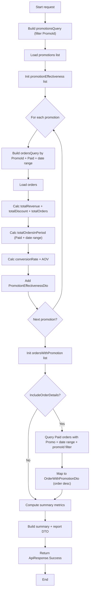

# Tài Liệu Hướng Dẫn Implementation - Báo Cáo Khuyến Mãi và Dự Báo Tồn Kho

## Mục Lục

1. [Tổng Quan Kiến Trúc Backend](#1-tổng-quan-kiến-trúc-backend)
2. [Phân Tích Kiến Trúc Hiện Tại](#2-phân-tích-kiến-trúc-hiện-tại)
3. [Implementation Báo Cáo Khuyến Mãi](#3-implementation-báo-cáo-khuyến-mãi)
4. [Implementation Dự Báo Tồn Kho](#4-implementation-dự-báo-tồn-kho)
5. [Code Examples Chi Tiết](#5-code-examples-chi-tiết)
6. [Testing và Validation](#6-testing-và-validation)

---

## 1. Tổng Quan Kiến Trúc Backend

### 1.1. Kiến Trúc Tổng Thể

Hệ thống RetailStoreManagement được xây dựng theo mô hình **Layered Architecture** với các lớp chính:

```
┌─────────────────────────────────────┐
│      Controllers Layer              │  ← API Endpoints
├─────────────────────────────────────┤
│      Services Layer                 │  ← Business Logic
├─────────────────────────────────────┤
│      Repositories Layer             │  ← Data Access
├─────────────────────────────────────┤
│      Entities Layer                 │  ← Domain Models
├─────────────────────────────────────┤
│      Data Layer (DbContext)         │  ← Database Context
└─────────────────────────────────────┘
```

### 1.2. Các Thành Phần Chính

#### 1.2.1. Controllers
- **Vị trí**: `Controllers/Admin/`
- **Chức năng**: Xử lý HTTP requests, routing, authorization
- **Pattern**: RESTful API với attribute routing
- **Ví dụ**: `ReportsController`, `PromotionsController`

#### 1.2.2. Services
- **Vị trí**: `Services/`
- **Chức năng**: Chứa business logic, xử lý nghiệp vụ
- **Pattern**: Service pattern với dependency injection
- **Ví dụ**: `ReportService`, `PromotionService`

#### 1.2.3. Repositories
- **Vị trí**: `Repositories/`
- **Chức năng**: Truy cập dữ liệu, thao tác với database
- **Pattern**: Repository pattern với Unit of Work
- **Ví dụ**: `Repository<TEntity, TKey>`, `UnitOfWork`

#### 1.2.4. Entities
- **Vị trí**: `Entities/`
- **Chức năng**: Domain models, mapping với database tables
- **Pattern**: Entity Framework Core Code First
- **Ví dụ**: `PromotionEntity`, `OrderEntity`

### 1.3. Dependency Injection

Hệ thống sử dụng **Dependency Injection** được cấu hình trong `Program.cs`:

```csharp
// Register services
builder.Services.AddScoped<IReportService, ReportService>();
builder.Services.AddScoped<IPromotionService, PromotionService>();
builder.Services.AddScoped<IUnitOfWork, UnitOfWork>();
```

---

## 2. Phân Tích Kiến Trúc Hiện Tại

### 2.1. Cấu Trúc Report Service Hiện Tại

#### 2.1.1. Interface IReportService

```12:12:RetailStoreManagement/Interfaces/Services/IReportService.cs
public interface IReportService
```

**Các phương thức hiện có:**
- `GetRevenueReportAsync`: Báo cáo doanh thu
- `GetSalesReportAsync`: Báo cáo bán hàng
- `GetTopProductsAsync`: Top sản phẩm bán chạy
- `GetTopCustomersAsync`: Top khách hàng

#### 2.1.2. ReportService Implementation

```12:206:RetailStoreManagement/Services/ReportService.cs
public class ReportService : IReportService
{
    private readonly IUnitOfWork _unitOfWork;
    private readonly IMapper _mapper;

    public ReportService(IUnitOfWork unitOfWork, IMapper mapper)
    {
        _unitOfWork = unitOfWork;
        _mapper = mapper;
    }
    // ... existing methods
}
```

**Đặc điểm:**
- Sử dụng `IUnitOfWork` để truy cập repositories
- Sử dụng `AutoMapper` để map entities sang DTOs
- Trả về `ApiResponse<T>` để chuẩn hóa response format
- Sử dụng LINQ với Entity Framework Core để query dữ liệu

### 2.2. Cấu Trúc Database Schema

#### 2.2.1. Bảng Promotions

```97:116:RetailStoreManagement/docs/db/schema.md
## Table: `promotions`
- **Columns:**
    - `promo_id`: integer (NOT NULL, primary key)
    - `promo_code`: character varying (NOT NULL, UNIQUE)
    - `description`: character varying
    - `discount_type`: character varying (NOT NULL)
    - `discount_value`: numeric (NOT NULL)
    - `start_date`: date (NOT NULL)
    - `end_date`: date (NOT NULL)
    - `min_order_amount`: numeric (DEFAULT 0)
    - `usage_limit`: integer (DEFAULT 0)
    - `used_count`: integer (DEFAULT 0)
    - `status`: character varying (DEFAULT 'active')
```

#### 2.2.2. Bảng Orders

```47:65:RetailStoreManagement/docs/db/schema.md
## Table: `orders`
- **Columns:**
    - `order_id`: integer (NOT NULL, primary key)
    - `customer_id`: integer (foreign key - references `customers.customer_id`)
    - `user_id`: integer (foreign key - references `users.user_id`)
    - `promo_id`: integer (foreign key - references `promotions.promo_id`)
    - `order_date`: timestamp without time zone (DEFAULT CURRENT_TIMESTAMP)
    - `status`: character varying (DEFAULT 'pending')
    - `total_amount`: numeric
    - `discount_amount`: numeric (DEFAULT 0)
```

#### 2.2.3. Bảng Inventory

```22:32:RetailStoreManagement/docs/db/schema.md
## Table: `inventory`
- **Columns:**
    - `inventory_id`: integer (NOT NULL, primary key)
    - `product_id`: integer (NOT NULL, foreign key - references `products.product_id`)
    - `quantity`: integer (DEFAULT 0)
    - `updated_at`: timestamp without time zone (DEFAULT CURRENT_TIMESTAMP)
```

### 2.3. Cấu Trúc Controllers

#### 2.3.1. ReportsController

```8:47:RetailStoreManagement/Controllers/Admin/ReportsController.cs
[ApiController]
[Route("api/admin/reports")]
[Authorize(Roles = "Admin")]
public class ReportsController : ControllerBase
{
    private readonly IReportService _reportService;

    public ReportsController(IReportService reportService)
    {
        _reportService = reportService;
    }
    // ... existing endpoints
}
```

**Đặc điểm:**
- Route: `api/admin/reports`
- Authorization: Chỉ Admin mới có quyền truy cập
- Sử dụng dependency injection để inject `IReportService`

---

## 3. Implementation Báo Cáo Khuyến Mãi

### 3.1. Yêu Cầu Chức Năng

#### 3.1.1. Endpoint: `GET /api/admin/reports/promotion`

**Các chức năng cần implement:**

1. **Báo cáo hiệu quả từng mã giảm giá:**
   - Số lần sử dụng (used_count)
   - Tổng doanh thu mang lại
   - Tỉ lệ chuyển đổi

2. **Báo cáo đơn hàng có sử dụng khuyến mãi:**
   - Đơn hàng dùng mã nào
   - Giảm bao nhiêu tiền

### 3.2. Thiết Kế DTOs

#### 3.2.1. PromotionReportRequest.cs

```csharp
using System.ComponentModel.DataAnnotations;

namespace RetailStoreManagement.Models.Report;

public class PromotionReportRequest
{
    public DateTime? StartDate { get; set; }
    public DateTime? EndDate { get; set; }
    public int? PromoId { get; set; } // Filter theo mã khuyến mãi cụ thể
    public bool IncludeOrderDetails { get; set; } = false; // Có bao gồm chi tiết đơn hàng không
}
```

#### 3.2.2. PromotionEffectivenessDto.cs

```csharp
namespace RetailStoreManagement.Models.Report;

public class PromotionEffectivenessDto
{
    public int PromoId { get; set; }
    public string PromoCode { get; set; } = string.Empty;
    public string Description { get; set; } = string.Empty;
    public string DiscountType { get; set; } = string.Empty;
    public decimal DiscountValue { get; set; }
    public DateOnly StartDate { get; set; }
    public DateOnly EndDate { get; set; }
    public PromotionStatus Status { get; set; }
    
    // Metrics
    public int UsedCount { get; set; }
    public int UsageLimit { get; set; }
    public decimal TotalRevenue { get; set; } // Tổng doanh thu từ các đơn hàng sử dụng mã này
    public decimal TotalDiscountAmount { get; set; } // Tổng số tiền giảm giá
    public decimal ConversionRate { get; set; } // Tỉ lệ chuyển đổi (%)
    public int TotalOrders { get; set; } // Tổng số đơn hàng sử dụng mã này
    public decimal AverageOrderValue { get; set; } // Giá trị đơn hàng trung bình
}
```

#### 3.2.3. OrderWithPromotionDto.cs

```csharp
namespace RetailStoreManagement.Models.Report;

public class OrderWithPromotionDto
{
    public int OrderId { get; set; }
    public DateTime OrderDate { get; set; }
    public string OrderStatus { get; set; } = string.Empty;
    public decimal TotalAmount { get; set; }
    public decimal DiscountAmount { get; set; }
    public decimal FinalAmount { get; set; } // TotalAmount - DiscountAmount
    
    // Promotion Info
    public int? PromoId { get; set; }
    public string PromoCode { get; set; } = string.Empty;
    public string DiscountType { get; set; } = string.Empty;
    public decimal DiscountValue { get; set; }
    
    // Customer Info
    public int? CustomerId { get; set; }
    public string? CustomerName { get; set; }
}
```

#### 3.2.4. PromotionReportDto.cs

```csharp
namespace RetailStoreManagement.Models.Report;

public class PromotionReportDto
{
    public List<PromotionEffectivenessDto> PromotionEffectiveness { get; set; } = new();
    public List<OrderWithPromotionDto> OrdersWithPromotion { get; set; } = new();
    public PromotionReportSummaryDto Summary { get; set; } = new();
}

public class PromotionReportSummaryDto
{
    public int TotalPromotions { get; set; }
    public int ActivePromotions { get; set; }
    public int TotalOrdersWithPromotion { get; set; }
    public decimal TotalRevenueFromPromotions { get; set; }
    public decimal TotalDiscountGiven { get; set; }
    public decimal AverageDiscountRate { get; set; } // Tỉ lệ giảm giá trung bình
}
```

### 3.3. Cập Nhật Interface IReportService

```csharp
using RetailStoreManagement.Common;
using RetailStoreManagement.Models.Report;

namespace RetailStoreManagement.Interfaces.Services;

public interface IReportService
{
    // Existing methods...
    Task<ApiResponse<RevenueReportDto>> GetRevenueReportAsync(RevenueReportRequest request);
    Task<ApiResponse<SalesReportDto>> GetSalesReportAsync(SalesReportRequest request);
    Task<ApiResponse<PagedList<TopProductDto>>> GetTopProductsAsync(TopProductsSearchRequest request);
    Task<ApiResponse<PagedList<TopCustomerDto>>> GetTopCustomersAsync(TopCustomersSearchRequest request);
    
    // New method for Promotion Reports
    Task<ApiResponse<PromotionReportDto>> GetPromotionReportAsync(PromotionReportRequest request);
}
```

### 3.4. Implementation ReportService

#### 3.4.1. Method GetPromotionReportAsync

```csharp
public async Task<ApiResponse<PromotionReportDto>> GetPromotionReportAsync(PromotionReportRequest request)
{
    try
    {
        // 1. Lấy danh sách promotions với filter
        var promotionsQuery = _unitOfWork.Promotions.GetQueryable();
        
        if (request.PromoId.HasValue)
        {
            promotionsQuery = promotionsQuery.Where(p => p.Id == request.PromoId.Value);
        }

        var promotions = await promotionsQuery.ToListAsync();

        // 2. Tính toán hiệu quả từng mã khuyến mãi
        var promotionEffectiveness = new List<PromotionEffectivenessDto>();

        foreach (var promotion in promotions)
        {
            var ordersQuery = _unitOfWork.Orders.GetQueryable()
                .Where(o => o.PromoId == promotion.Id && 
                           o.Status == OrderStatus.Paid);

            // Apply date filter if provided
            if (request.StartDate.HasValue)
            {
                ordersQuery = ordersQuery.Where(o => o.OrderDate >= request.StartDate.Value);
            }
            if (request.EndDate.HasValue)
            {
                ordersQuery = ordersQuery.Where(o => o.OrderDate <= request.EndDate.Value);
            }

            var orders = await ordersQuery.ToListAsync();

            var totalRevenue = orders.Sum(o => o.TotalAmount - o.DiscountAmount);
            var totalDiscount = orders.Sum(o => o.DiscountAmount);
            var totalOrders = orders.Count;

            // Tính tỉ lệ chuyển đổi
            // Conversion Rate = (Số đơn hàng sử dụng mã / Tổng số đơn hàng trong kỳ) * 100
            var allOrdersInPeriod = _unitOfWork.Orders.GetQueryable()
                .Where(o => o.Status == OrderStatus.Paid);
            
            if (request.StartDate.HasValue)
            {
                allOrdersInPeriod = allOrdersInPeriod.Where(o => o.OrderDate >= request.StartDate.Value);
            }
            if (request.EndDate.HasValue)
            {
                allOrdersInPeriod = allOrdersInPeriod.Where(o => o.OrderDate <= request.EndDate.Value);
            }
            
            var totalOrdersInPeriod = await allOrdersInPeriod.CountAsync();
            var conversionRate = totalOrdersInPeriod > 0 
                ? (decimal)totalOrders / totalOrdersInPeriod * 100 
                : 0;

            var averageOrderValue = totalOrders > 0 ? totalRevenue / totalOrders : 0;

            promotionEffectiveness.Add(new PromotionEffectivenessDto
            {
                PromoId = promotion.Id,
                PromoCode = promotion.PromoCode,
                Description = promotion.Description ?? string.Empty,
                DiscountType = promotion.DiscountType.ToString(),
                DiscountValue = promotion.DiscountValue,
                StartDate = promotion.StartDate,
                EndDate = promotion.EndDate,
                Status = promotion.Status,
                UsedCount = promotion.UsedCount,
                UsageLimit = promotion.UsageLimit,
                TotalRevenue = totalRevenue,
                TotalDiscountAmount = totalDiscount,
                ConversionRate = conversionRate,
                TotalOrders = totalOrders,
                AverageOrderValue = averageOrderValue
            });
        }

        // 3. Lấy danh sách đơn hàng có sử dụng khuyến mãi (nếu yêu cầu)
        var ordersWithPromotion = new List<OrderWithPromotionDto>();
        
        if (request.IncludeOrderDetails)
        {
            var ordersQuery = _unitOfWork.Orders.GetQueryable()
                .Include(o => o.Promotion)
                .Include(o => o.Customer)
                .Where(o => o.PromoId != null && o.Status == OrderStatus.Paid);

            if (request.StartDate.HasValue)
            {
                ordersQuery = ordersQuery.Where(o => o.OrderDate >= request.StartDate.Value);
            }
            if (request.EndDate.HasValue)
            {
                ordersQuery = ordersQuery.Where(o => o.OrderDate <= request.EndDate.Value);
            }
            if (request.PromoId.HasValue)
            {
                ordersQuery = ordersQuery.Where(o => o.PromoId == request.PromoId.Value);
            }

            ordersWithPromotion = await ordersQuery
                .OrderByDescending(o => o.OrderDate)
                .Select(o => new OrderWithPromotionDto
                {
                    OrderId = o.Id,
                    OrderDate = o.OrderDate,
                    OrderStatus = o.Status.ToString(),
                    TotalAmount = o.TotalAmount,
                    DiscountAmount = o.DiscountAmount,
                    FinalAmount = o.TotalAmount - o.DiscountAmount,
                    PromoId = o.PromoId,
                    PromoCode = o.Promotion != null ? o.Promotion.PromoCode : string.Empty,
                    DiscountType = o.Promotion != null ? o.Promotion.DiscountType.ToString() : string.Empty,
                    DiscountValue = o.Promotion != null ? o.Promotion.DiscountValue : 0,
                    CustomerId = o.CustomerId,
                    CustomerName = o.Customer != null ? o.Customer.Name : null
                })
                .ToListAsync();
        }

        // 4. Tính toán summary
        var activePromotions = promotions.Count(p => p.Status == PromotionStatus.Active);
        var totalOrdersWithPromotion = promotionEffectiveness.Sum(p => p.TotalOrders);
        var totalRevenueFromPromotions = promotionEffectiveness.Sum(p => p.TotalRevenue);
        var totalDiscountGiven = promotionEffectiveness.Sum(p => p.TotalDiscountAmount);
        
        var averageDiscountRate = totalRevenueFromPromotions > 0 
            ? (totalDiscountGiven / totalRevenueFromPromotions) * 100 
            : 0;

        var summary = new PromotionReportSummaryDto
        {
            TotalPromotions = promotions.Count,
            ActivePromotions = activePromotions,
            TotalOrdersWithPromotion = totalOrdersWithPromotion,
            TotalRevenueFromPromotions = totalRevenueFromPromotions,
            TotalDiscountGiven = totalDiscountGiven,
            AverageDiscountRate = averageDiscountRate
        };

        // 5. Tạo response
        var report = new PromotionReportDto
        {
            PromotionEffectiveness = promotionEffectiveness.OrderByDescending(p => p.TotalRevenue).ToList(),
            OrdersWithPromotion = ordersWithPromotion,
            Summary = summary
        };

        return ApiResponse<PromotionReportDto>.Success(report);
    }
    catch (Exception ex)
    {
        return ApiResponse<PromotionReportDto>.Error(ex.Message);
    }
}
```

**Mermaid control flow**



### 3.5. Cập Nhật ReportsController

```csharp
[HttpGet("promotion")]
public async Task<IActionResult> GetPromotionReport([FromQuery] PromotionReportRequest request)
{
    var result = await _reportService.GetPromotionReportAsync(request);
    return StatusCode(result.StatusCode, result);
}
```

---

## 4. Implementation Dự Báo Tồn Kho

### 4.1. Yêu Cầu Chức Năng

**Dự báo tồn kho:**
- Từ số lượng bán trung bình tháng → đề xuất nhập hàng
- Tính toán số lượng cần nhập dựa trên:
  - Số lượng bán trung bình trong tháng
  - Thời gian giao hàng dự kiến
  - Mức tồn kho an toàn
  - Số lượng tồn kho hiện tại

### 4.2. Thiết Kế DTOs

#### 4.2.1. InventoryForecastRequest.cs

```csharp
using System.ComponentModel.DataAnnotations;

namespace RetailStoreManagement.Models.Report;

public class InventoryForecastRequest
{
    public int? ProductId { get; set; } // Filter theo sản phẩm cụ thể
    public int? CategoryId { get; set; } // Filter theo danh mục
    public int LookbackMonths { get; set; } = 3; // Số tháng để tính trung bình (mặc định 3 tháng)
    public int LeadTimeDays { get; set; } = 7; // Thời gian giao hàng dự kiến (ngày)
    public decimal SafetyStockMultiplier { get; set; } = 1.5m; // Hệ số an toàn (1.5 = 50% buffer)
}
```

#### 4.2.2. InventoryForecastDto.cs

```csharp
namespace RetailStoreManagement.Models.Report;

public class InventoryForecastDto
{
    public int ProductId { get; set; }
    public string ProductName { get; set; } = string.Empty;
    public string CategoryName { get; set; } = string.Empty;
    public string SupplierName { get; set; } = string.Empty;
    
    // Current Inventory
    public int CurrentQuantity { get; set; }
    
    // Sales Statistics
    public decimal AverageMonthlySales { get; set; } // Số lượng bán trung bình/tháng
    public decimal AverageDailySales { get; set; } // Số lượng bán trung bình/ngày
    public int TotalSoldInPeriod { get; set; } // Tổng số lượng đã bán trong kỳ
    public int MonthsAnalyzed { get; set; } // Số tháng đã phân tích
    
    // Forecast
    public int ForecastedDaysRemaining { get; set; } // Số ngày còn lại dự kiến
    public int RecommendedOrderQuantity { get; set; } // Số lượng đề xuất nhập hàng
    public decimal EstimatedCost { get; set; } // Chi phí ước tính (nếu có giá nhập)
    
    // Alerts
    public string StockStatus { get; set; } = string.Empty; // "sufficient", "low", "critical", "out_of_stock"
    public bool NeedsReorder { get; set; } // Có cần nhập hàng không
    public string Recommendation { get; set; } = string.Empty; // Khuyến nghị
}
```

#### 4.2.3. InventoryForecastReportDto.cs

```csharp
namespace RetailStoreManagement.Models.Report;

public class InventoryForecastReportDto
{
    public List<InventoryForecastDto> Forecasts { get; set; } = new();
    public InventoryForecastSummaryDto Summary { get; set; } = new();
}

public class InventoryForecastSummaryDto
{
    public int TotalProducts { get; set; }
    public int ProductsNeedingReorder { get; set; }
    public int LowStockProducts { get; set; }
    public int CriticalStockProducts { get; set; }
    public int OutOfStockProducts { get; set; }
    public decimal TotalEstimatedCost { get; set; }
    public int TotalRecommendedQuantity { get; set; }
}
```

### 4.3. Cập Nhật Interface IReportService

```csharp
public interface IReportService
{
    // Existing methods...
    
    // New method for Inventory Forecast
    Task<ApiResponse<InventoryForecastReportDto>> GetInventoryForecastAsync(InventoryForecastRequest request);
}
```

### 4.4. Implementation GetInventoryForecastAsync

```csharp
public async Task<ApiResponse<InventoryForecastReportDto>> GetInventoryForecastAsync(InventoryForecastRequest request)
{
    try
    {
        // 1. Tính toán ngày bắt đầu và kết thúc cho lookback period
        var endDate = DateTime.UtcNow;
        var startDate = endDate.AddMonths(-request.LookbackMonths);

        // 2. Lấy danh sách sản phẩm với filter
        var productsQuery = _unitOfWork.Products.GetQueryable()
            .Include(p => p.Category)
            .Include(p => p.Supplier)
            .Include(p => p.Inventory);

        if (request.ProductId.HasValue)
        {
            productsQuery = productsQuery.Where(p => p.Id == request.ProductId.Value);
        }
        if (request.CategoryId.HasValue)
        {
            productsQuery = productsQuery.Where(p => p.CategoryId == request.CategoryId.Value);
        }

        var products = await productsQuery.ToListAsync();

        // 3. Tính toán forecast cho từng sản phẩm
        var forecasts = new List<InventoryForecastDto>();

        foreach (var product in products)
        {
            // Lấy số lượng tồn kho hiện tại
            var currentQuantity = product.Inventory?.Quantity ?? 0;

            // Tính số lượng đã bán trong kỳ
            var soldItems = await _unitOfWork.OrderItems.GetQueryable()
                .Include(oi => oi.Order)
                .Where(oi => oi.ProductId == product.Id &&
                            oi.Order.Status == OrderStatus.Paid &&
                            oi.Order.OrderDate >= startDate &&
                            oi.Order.OrderDate <= endDate)
                .SumAsync(oi => (int?)oi.Quantity) ?? 0;

            // Tính số lượng bán trung bình/tháng
            var averageMonthlySales = request.LookbackMonths > 0 
                ? (decimal)soldItems / request.LookbackMonths 
                : 0;

            // Tính số lượng bán trung bình/ngày
            var daysInPeriod = (endDate - startDate).Days;
            var averageDailySales = daysInPeriod > 0 
                ? (decimal)soldItems / daysInPeriod 
                : 0;

            // Tính số ngày còn lại dự kiến
            var forecastedDaysRemaining = averageDailySales > 0 
                ? (int)(currentQuantity / averageDailySales) 
                : int.MaxValue;

            // Tính số lượng đề xuất nhập hàng
            // Công thức: (Số lượng bán trung bình/ngày * (Thời gian giao hàng + Buffer)) - Số lượng hiện tại
            var daysToCover = request.LeadTimeDays + (int)(request.LeadTimeDays * (request.SafetyStockMultiplier - 1));
            var requiredQuantity = (int)Math.Ceiling(averageDailySales * daysToCover);
            var recommendedOrderQuantity = Math.Max(0, requiredQuantity - currentQuantity);

            // Xác định trạng thái tồn kho
            var stockStatus = DetermineStockStatus(currentQuantity, averageDailySales, request.LeadTimeDays);
            var needsReorder = recommendedOrderQuantity > 0 || currentQuantity == 0;

            // Tính chi phí ước tính (nếu có giá nhập, ở đây dùng giá bán làm ước tính)
            var estimatedCost = recommendedOrderQuantity * product.Price;

            // Tạo recommendation message
            var recommendation = GenerateRecommendation(
                stockStatus, 
                currentQuantity, 
                recommendedOrderQuantity, 
                forecastedDaysRemaining
            );

            forecasts.Add(new InventoryForecastDto
            {
                ProductId = product.Id,
                ProductName = product.ProductName,
                CategoryName = product.Category.CategoryName,
                SupplierName = product.Supplier.Name,
                CurrentQuantity = currentQuantity,
                AverageMonthlySales = averageMonthlySales,
                AverageDailySales = averageDailySales,
                TotalSoldInPeriod = soldItems,
                MonthsAnalyzed = request.LookbackMonths,
                ForecastedDaysRemaining = forecastedDaysRemaining,
                RecommendedOrderQuantity = recommendedOrderQuantity,
                EstimatedCost = estimatedCost,
                StockStatus = stockStatus,
                NeedsReorder = needsReorder,
                Recommendation = recommendation
            });
        }

        // 4. Tính toán summary
        var productsNeedingReorder = forecasts.Count(f => f.NeedsReorder);
        var lowStockProducts = forecasts.Count(f => f.StockStatus == "low");
        var criticalStockProducts = forecasts.Count(f => f.StockStatus == "critical");
        var outOfStockProducts = forecasts.Count(f => f.StockStatus == "out_of_stock");
        var totalEstimatedCost = forecasts.Sum(f => f.EstimatedCost);
        var totalRecommendedQuantity = forecasts.Sum(f => f.RecommendedOrderQuantity);

        var summary = new InventoryForecastSummaryDto
        {
            TotalProducts = forecasts.Count,
            ProductsNeedingReorder = productsNeedingReorder,
            LowStockProducts = lowStockProducts,
            CriticalStockProducts = criticalStockProducts,
            OutOfStockProducts = outOfStockProducts,
            TotalEstimatedCost = totalEstimatedCost,
            TotalRecommendedQuantity = totalRecommendedQuantity
        };

        // 5. Tạo response
        var report = new InventoryForecastReportDto
        {
            Forecasts = forecasts.OrderByDescending(f => f.NeedsReorder)
                                .ThenBy(f => f.ForecastedDaysRemaining)
                                .ToList(),
            Summary = summary
        };

        return ApiResponse<InventoryForecastReportDto>.Success(report);
    }
    catch (Exception ex)
    {
        return ApiResponse<InventoryForecastReportDto>.Error(ex.Message);
    }
}

// Helper methods
private string DetermineStockStatus(int currentQuantity, decimal averageDailySales, int leadTimeDays)
{
    if (currentQuantity == 0)
        return "out_of_stock";
    
    var daysRemaining = averageDailySales > 0 ? (int)(currentQuantity / averageDailySales) : int.MaxValue;
    
    if (daysRemaining <= leadTimeDays)
        return "critical";
    
    if (daysRemaining <= leadTimeDays * 2)
        return "low";
    
    return "sufficient";
}

private string GenerateRecommendation(string stockStatus, int currentQuantity, int recommendedQuantity, int daysRemaining)
{
    return stockStatus switch
    {
        "out_of_stock" => $"Hết hàng. Cần nhập ngay {recommendedQuantity} sản phẩm.",
        "critical" => $"Tồn kho nguy hiểm (còn {daysRemaining} ngày). Cần nhập ngay {recommendedQuantity} sản phẩm.",
        "low" => $"Tồn kho thấp (còn {daysRemaining} ngày). Nên nhập {recommendedQuantity} sản phẩm trong {daysRemaining - 7} ngày tới.",
        _ => $"Tồn kho đủ dùng (còn {daysRemaining} ngày). Không cần nhập hàng ngay."
    };
}
```

**Mermaid control flow (GetInventoryForecastAsync)**

```mermaid
flowchart TD
    A["Start request"] --> B["Set endDate = now, startDate = now - lookbackMonths"]
    B --> C["Build productsQuery (filters: productId, categoryId) + include Category, Supplier, Inventory"]
    C --> D["Load products list"]
    D --> E{"For each product"}
    E --> F["currentQuantity = inventory quantity (default 0)"]
    F --> G["soldItems = sum OrderItems.qty where Paid + date range"]
    G --> H["avgMonthly = soldItems / lookbackMonths"]
    H --> I["avgDaily = soldItems / daysInPeriod"]
    I --> J["forecastedDaysRemaining = currentQuantity / avgDaily"]
    J --> K["daysToCover = leadTimeDays + buffer; required = avgDaily * daysToCover"]
    K --> L["recommendedOrderQuantity = max(0, required - currentQuantity)"]
    L --> M["stockStatus = DetermineStockStatus(...)"]
    M --> N["needsReorder = recommendedOrderQuantity > 0 or out_of_stock"]
    N --> O["estimatedCost = recommendedOrderQuantity * price"]
    O --> P["recommendation = GenerateRecommendation(...)"]
    P --> Q["Add InventoryForecastDto"]
    Q --> R{"Next product?"}
    R --> E
    R --> S["Compute summary (counts, totals, cost)"]
    S --> T["Sort forecasts, build report DTO"]
    T --> U["Return ApiResponse.Success"]
    U --> V["End"]
```



### 4.5. Cập Nhật ReportsController

```csharp
[HttpGet("inventory-forecast")]
public async Task<IActionResult> GetInventoryForecast([FromQuery] InventoryForecastRequest request)
{
    var result = await _reportService.GetInventoryForecastAsync(request);
    return StatusCode(result.StatusCode, result);
}
```

---

## 5. Code Examples Chi Tiết

### 5.1. File Structure

Sau khi implement, cấu trúc file sẽ như sau:

```
RetailStoreManagement/
├── Models/
│   └── Report/
│       ├── PromotionReportRequest.cs (NEW)
│       ├── PromotionEffectivenessDto.cs (NEW)
│       ├── OrderWithPromotionDto.cs (NEW)
│       ├── PromotionReportDto.cs (NEW)
│       ├── InventoryForecastRequest.cs (NEW)
│       ├── InventoryForecastDto.cs (NEW)
│       └── InventoryForecastReportDto.cs (NEW)
├── Services/
│   └── ReportService.cs (UPDATED)
├── Interfaces/
│   └── Services/
│       └── IReportService.cs (UPDATED)
└── Controllers/
    └── Admin/
        └── ReportsController.cs (UPDATED)
```

### 5.2. Complete Code Files

#### 5.2.1. Models/Report/PromotionReportRequest.cs

```csharp
using System.ComponentModel.DataAnnotations;

namespace RetailStoreManagement.Models.Report;

public class PromotionReportRequest
{
    public DateTime? StartDate { get; set; }
    public DateTime? EndDate { get; set; }
    public int? PromoId { get; set; }
    public bool IncludeOrderDetails { get; set; } = false;
}
```

#### 5.2.2. Models/Report/PromotionEffectivenessDto.cs

```csharp
using RetailStoreManagement.Enums;

namespace RetailStoreManagement.Models.Report;

public class PromotionEffectivenessDto
{
    public int PromoId { get; set; }
    public string PromoCode { get; set; } = string.Empty;
    public string Description { get; set; } = string.Empty;
    public string DiscountType { get; set; } = string.Empty;
    public decimal DiscountValue { get; set; }
    public DateOnly StartDate { get; set; }
    public DateOnly EndDate { get; set; }
    public PromotionStatus Status { get; set; }
    public int UsedCount { get; set; }
    public int UsageLimit { get; set; }
    public decimal TotalRevenue { get; set; }
    public decimal TotalDiscountAmount { get; set; }
    public decimal ConversionRate { get; set; }
    public int TotalOrders { get; set; }
    public decimal AverageOrderValue { get; set; }
}
```

#### 5.2.3. Models/Report/OrderWithPromotionDto.cs

```csharp
namespace RetailStoreManagement.Models.Report;

public class OrderWithPromotionDto
{
    public int OrderId { get; set; }
    public DateTime OrderDate { get; set; }
    public string OrderStatus { get; set; } = string.Empty;
    public decimal TotalAmount { get; set; }
    public decimal DiscountAmount { get; set; }
    public decimal FinalAmount { get; set; }
    public int? PromoId { get; set; }
    public string PromoCode { get; set; } = string.Empty;
    public string DiscountType { get; set; } = string.Empty;
    public decimal DiscountValue { get; set; }
    public int? CustomerId { get; set; }
    public string? CustomerName { get; set; }
}
```

#### 5.2.4. Models/Report/PromotionReportDto.cs

```csharp
namespace RetailStoreManagement.Models.Report;

public class PromotionReportDto
{
    public List<PromotionEffectivenessDto> PromotionEffectiveness { get; set; } = new();
    public List<OrderWithPromotionDto> OrdersWithPromotion { get; set; } = new();
    public PromotionReportSummaryDto Summary { get; set; } = new();
}

public class PromotionReportSummaryDto
{
    public int TotalPromotions { get; set; }
    public int ActivePromotions { get; set; }
    public int TotalOrdersWithPromotion { get; set; }
    public decimal TotalRevenueFromPromotions { get; set; }
    public decimal TotalDiscountGiven { get; set; }
    public decimal AverageDiscountRate { get; set; }
}
```

#### 5.2.5. Models/Report/InventoryForecastRequest.cs

```csharp
using System.ComponentModel.DataAnnotations;

namespace RetailStoreManagement.Models.Report;

public class InventoryForecastRequest
{
    public int? ProductId { get; set; }
    public int? CategoryId { get; set; }
    
    [Range(1, 12, ErrorMessage = "LookbackMonths must be between 1 and 12")]
    public int LookbackMonths { get; set; } = 3;
    
    [Range(1, 90, ErrorMessage = "LeadTimeDays must be between 1 and 90")]
    public int LeadTimeDays { get; set; } = 7;
    
    [Range(1.0, 3.0, ErrorMessage = "SafetyStockMultiplier must be between 1.0 and 3.0")]
    public decimal SafetyStockMultiplier { get; set; } = 1.5m;
}
```

#### 5.2.6. Models/Report/InventoryForecastDto.cs

```csharp
namespace RetailStoreManagement.Models.Report;

public class InventoryForecastDto
{
    public int ProductId { get; set; }
    public string ProductName { get; set; } = string.Empty;
    public string CategoryName { get; set; } = string.Empty;
    public string SupplierName { get; set; } = string.Empty;
    public int CurrentQuantity { get; set; }
    public decimal AverageMonthlySales { get; set; }
    public decimal AverageDailySales { get; set; }
    public int TotalSoldInPeriod { get; set; }
    public int MonthsAnalyzed { get; set; }
    public int ForecastedDaysRemaining { get; set; }
    public int RecommendedOrderQuantity { get; set; }
    public decimal EstimatedCost { get; set; }
    public string StockStatus { get; set; } = string.Empty;
    public bool NeedsReorder { get; set; }
    public string Recommendation { get; set; } = string.Empty;
}
```

#### 5.2.7. Models/Report/InventoryForecastReportDto.cs

```csharp
namespace RetailStoreManagement.Models.Report;

public class InventoryForecastReportDto
{
    public List<InventoryForecastDto> Forecasts { get; set; } = new();
    public InventoryForecastSummaryDto Summary { get; set; } = new();
}

public class InventoryForecastSummaryDto
{
    public int TotalProducts { get; set; }
    public int ProductsNeedingReorder { get; set; }
    public int LowStockProducts { get; set; }
    public int CriticalStockProducts { get; set; }
    public int OutOfStockProducts { get; set; }
    public decimal TotalEstimatedCost { get; set; }
    public int TotalRecommendedQuantity { get; set; }
}
```

### 5.3. API Usage Examples

#### 5.3.1. Promotion Report - Get All Promotions

```http
GET /api/admin/reports/promotion
Authorization: Bearer {token}
```

**Response:**
```json
{
  "isError": false,
  "message": null,
  "data": {
    "promotionEffectiveness": [
      {
        "promoId": 1,
        "promoCode": "SUMMER2024",
        "description": "Giảm giá mùa hè",
        "discountType": "Percent",
        "discountValue": 10,
        "startDate": "2024-06-01",
        "endDate": "2024-08-31",
        "status": "Active",
        "usedCount": 45,
        "usageLimit": 100,
        "totalRevenue": 5000000,
        "totalDiscountAmount": 500000,
        "conversionRate": 15.5,
        "totalOrders": 45,
        "averageOrderValue": 111111.11
      }
    ],
    "ordersWithPromotion": [],
    "summary": {
      "totalPromotions": 5,
      "activePromotions": 3,
      "totalOrdersWithPromotion": 120,
      "totalRevenueFromPromotions": 15000000,
      "totalDiscountGiven": 1500000,
      "averageDiscountRate": 10.0
    }
  },
  "timestamp": "2024-01-15T10:30:00Z",
  "statusCode": 200
}
```

#### 5.3.2. Promotion Report - With Order Details

```http
GET /api/admin/reports/promotion?includeOrderDetails=true&startDate=2024-01-01&endDate=2024-01-31
Authorization: Bearer {token}
```

#### 5.3.3. Promotion Report - Specific Promotion

```http
GET /api/admin/reports/promotion?promoId=1&includeOrderDetails=true
Authorization: Bearer {token}
```

#### 5.3.4. Inventory Forecast - All Products

```http
GET /api/admin/reports/inventory-forecast?lookbackMonths=3&leadTimeDays=7&safetyStockMultiplier=1.5
Authorization: Bearer {token}
```

**Response:**
```json
{
  "isError": false,
  "message": null,
  "data": {
    "forecasts": [
      {
        "productId": 1,
        "productName": "Sản phẩm A",
        "categoryName": "Điện tử",
        "supplierName": "Nhà cung cấp X",
        "currentQuantity": 50,
        "averageMonthlySales": 100,
        "averageDailySales": 3.33,
        "totalSoldInPeriod": 300,
        "monthsAnalyzed": 3,
        "forecastedDaysRemaining": 15,
        "recommendedOrderQuantity": 75,
        "estimatedCost": 7500000,
        "stockStatus": "low",
        "needsReorder": true,
        "recommendation": "Tồn kho thấp (còn 15 ngày). Nên nhập 75 sản phẩm trong 8 ngày tới."
      }
    ],
    "summary": {
      "totalProducts": 50,
      "productsNeedingReorder": 15,
      "lowStockProducts": 10,
      "criticalStockProducts": 3,
      "outOfStockProducts": 2,
      "totalEstimatedCost": 50000000,
      "totalRecommendedQuantity": 500
    }
  },
  "timestamp": "2024-01-15T10:30:00Z",
  "statusCode": 200
}
```

#### 5.3.5. Inventory Forecast - By Category

```http
GET /api/admin/reports/inventory-forecast?categoryId=1&lookbackMonths=6
Authorization: Bearer {token}
```

#### 5.3.6. Inventory Forecast - Specific Product

```http
GET /api/admin/reports/inventory-forecast?productId=1
Authorization: Bearer {token}
```

---

## 6. Testing và Validation

### 6.1. Unit Tests

#### 6.1.1. Test Promotion Report Service

```csharp
using Xunit;
using Moq;
using RetailStoreManagement.Services;
using RetailStoreManagement.Interfaces;
using RetailStoreManagement.Models.Report;
using RetailStoreManagement.Entities;
using RetailStoreManagement.Enums;

public class ReportServiceTests
{
    [Fact]
    public async Task GetPromotionReportAsync_ShouldReturnSuccess_WhenValidRequest()
    {
        // Arrange
        var mockUnitOfWork = new Mock<IUnitOfWork>();
        var mockPromotionsRepo = new Mock<IRepository<PromotionEntity, int>>();
        var mockOrdersRepo = new Mock<IRepository<OrderEntity, int>>();
        
        // Setup test data
        var promotions = new List<PromotionEntity>
        {
            new PromotionEntity
            {
                Id = 1,
                PromoCode = "TEST001",
                DiscountType = DiscountType.Percent,
                DiscountValue = 10,
                UsedCount = 5,
                Status = PromotionStatus.Active
            }
        };
        
        var orders = new List<OrderEntity>
        {
            new OrderEntity
            {
                Id = 1,
                PromoId = 1,
                Status = OrderStatus.Paid,
                TotalAmount = 100000,
                DiscountAmount = 10000,
                OrderDate = DateTime.UtcNow
            }
        };
        
        // Setup mocks
        mockPromotionsRepo.Setup(r => r.GetQueryable())
            .Returns(promotions.AsQueryable());
        mockOrdersRepo.Setup(r => r.GetQueryable())
            .Returns(orders.AsQueryable());
        
        mockUnitOfWork.Setup(u => u.Promotions).Returns(mockPromotionsRepo.Object);
        mockUnitOfWork.Setup(u => u.Orders).Returns(mockOrdersRepo.Object);
        
        var mapper = new Mock<IMapper>();
        var service = new ReportService(mockUnitOfWork.Object, mapper.Object);
        
        var request = new PromotionReportRequest
        {
            IncludeOrderDetails = true
        };
        
        // Act
        var result = await service.GetPromotionReportAsync(request);
        
        // Assert
        Assert.False(result.IsError);
        Assert.NotNull(result.Data);
        Assert.True(result.Data.PromotionEffectiveness.Count > 0);
    }
}
```

### 6.2. Integration Tests

#### 6.2.1. Test Promotion Report Endpoint

```csharp
using Microsoft.AspNetCore.Mvc.Testing;
using System.Net.Http.Json;
using RetailStoreManagement.Models.Report;

public class ReportsControllerIntegrationTests : IClassFixture<WebApplicationFactory<Program>>
{
    private readonly HttpClient _client;
    
    public ReportsControllerIntegrationTests(WebApplicationFactory<Program> factory)
    {
        _client = factory.CreateClient();
        // Setup authentication token
    }
    
    [Fact]
    public async Task GetPromotionReport_ShouldReturn200_WhenAuthorized()
    {
        // Arrange
        var request = new PromotionReportRequest
        {
            StartDate = DateTime.UtcNow.AddMonths(-1),
            EndDate = DateTime.UtcNow,
            IncludeOrderDetails = true
        };
        
        // Act
        var response = await _client.GetAsync("/api/admin/reports/promotion?" +
            $"startDate={request.StartDate:yyyy-MM-dd}&" +
            $"endDate={request.EndDate:yyyy-MM-dd}&" +
            $"includeOrderDetails={request.IncludeOrderDetails}");
        
        // Assert
        response.EnsureSuccessStatusCode();
        var result = await response.Content.ReadFromJsonAsync<ApiResponse<PromotionReportDto>>();
        Assert.NotNull(result);
        Assert.False(result.IsError);
    }
}
```

### 6.3. Performance Considerations

#### 6.3.1. Optimization Tips

1. **Indexing**: Đảm bảo các cột sau có index:
   - `orders.promo_id`
   - `orders.order_date`
   - `orders.status`
   - `order_items.product_id`
   - `order_items.order_id`

2. **Pagination**: Có thể thêm pagination cho danh sách đơn hàng trong promotion report nếu số lượng lớn.

3. **Caching**: Có thể cache kết quả report trong một khoảng thời gian ngắn (ví dụ: 5 phút) để giảm tải database.

---

## 7. Tổng Kết

### 7.1. Các Endpoint Đã Implement

1. **GET /api/admin/reports/promotion**
   - Báo cáo hiệu quả khuyến mãi
   - Báo cáo đơn hàng có sử dụng khuyến mãi

2. **GET /api/admin/reports/inventory-forecast**
   - Dự báo tồn kho
   - Đề xuất nhập hàng

### 7.2. Các Tính Năng Chính

- ✅ Báo cáo hiệu quả từng mã giảm giá
- ✅ Tính toán tỉ lệ chuyển đổi
- ✅ Báo cáo đơn hàng có sử dụng khuyến mãi
- ✅ Dự báo tồn kho dựa trên số lượng bán trung bình
- ✅ Đề xuất số lượng nhập hàng
- ✅ Cảnh báo tồn kho thấp/nguy hiểm

### 7.3. Next Steps

1. Thêm pagination cho danh sách đơn hàng trong promotion report
2. Thêm export Excel/PDF cho các báo cáo
3. Thêm email notification khi tồn kho thấp
4. Thêm dashboard với charts và graphs
5. Thêm scheduled reports (báo cáo định kỳ)

---

**Tài liệu được tạo vào:** {{ Ngày tạo }}
**Phiên bản:** 1.0
**Tác giả:** AI Assistant

